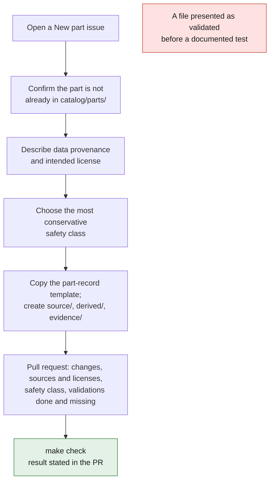

# Contributing



## Before you start

1. Open a "New part" issue.
2. Confirm that the part does not already exist in `catalog/parts/`.
3. Describe the provenance of the data and the intended license.
4. Choose the most conservative safety class.

## Adding a part

```bash
cp catalog/templates/part-record.json catalog/parts/993-xxx-0001.json
mkdir -p parts/993-xxx-0001/{source,derived,evidence}
make check
```

Rules:

- The directory name must match `part_id` in lowercase.
- Editable sources go in `source/`.
- STEP, 3MF or STL exports go in `derived/`.
- Reports, measurements and authorized photographs go in `evidence/`.
- No file may be presented as validated before a documented test.
- Do not add a large binary without prior discussion in the issue.

## Pull request

The PR must state:

- what is added or changed;
- sources and licenses;
- the safety class;
- the validations actually performed;
- the validations still missing;
- the result of `make check`.

Keeping a conservative status is better than an unverified claim.

## Rights in contributions

The repository is not open source: it is under the custom
[porscheparts Proprietary License](LICENSE), all rights reserved by Maxime
Grenu. Contributions can be accepted only if their author agrees in writing that
the copyright holder may use, modify and publish them under that license. Open
an issue before starting work, so that this is settled first.

