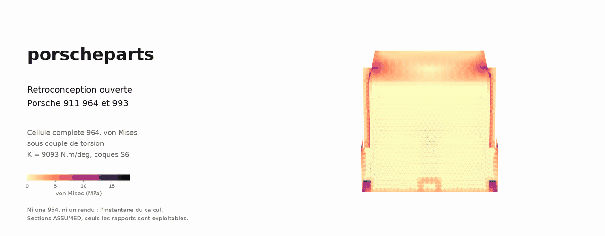
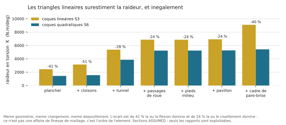

<div align="center">



**Rétroconception ouverte pour Porsche 911 964 et 993**
*Données sourcées, calculs réfutables, aucune pièce fabriquée.*

[](https://github.com/cluster2600/porscheparts/actions/workflows/validate.yml)
[](LICENSE)
[](https://www.python.org/)
[](SAFETY.md)

</div>

---

Ce dépôt ne publie pas une bibliothèque de fichiers à imprimer. Il publie des
**données sourcées** et des **calculs réfutables** : chaque affirmation de
compatibilité, de masse ou de raideur est reliée à une mesure, à une source
vérifiable ou à un calcul qu'on peut rejouer — et **retirée quand elle ne tient
plus**. Le dépôt en compte plusieurs, listées ici même, plus bas.

> [!IMPORTANT]
> **La phase active ne fabrique rien.** Aucune pièce n'est déclarée imprimable
> ni validée. Les 31 fiches sont au statut `concept`, dont 17 en
> `prohibited_pending_engineering`. Lire [SAFETY.md](SAFETY.md).

| | |
|---|---|
| **383** fiches de sources qualifiées | **31** fiches de pièces, dont 17 interdites en l'état |
| **23** dossiers de conception 993 en fabrication additive | **9** jumeaux numériques, aucun au niveau `F2_interface` |
| **3 000** cas CalculiX sur la caisse 964 | **2 194** tests exécutés par `make check` |

### Sommaire

1. [Calcul de structure sur la caisse 964](#1-calcul-de-structure-sur-la-caisse-964)
2. [Pièces 993 en fabrication additive](#2-pièces-993-en-fabrication-additive)
3. [Carrosserie et habitacle](#3-carrosserie-et-habitacle)
4. [Le catalogue et son contrat de données](#4-le-catalogue-et-son-contrat-de-données)
5. [Les règles](#les-règles) · [Ce que le dépôt a retiré](#ce-que-le-dépôt-a-retiré-de-ses-propres-résultats) · [Ce qu'il ne prétend pas](#ce-que-le-projet-ne-prétend-pas)
6. [Démarrage rapide](#démarrage-rapide) · [Organisation](#organisation) · [État](#état)

---

## 1. Calcul de structure sur la caisse 964

Le chantier principal. Un modèle coque de plancher, de caisson et de cellule
complète, en éléments finis, sert à répondre à des questions **relatives** :
entre changer de matériau et fermer la caisse, lequel rapporte le plus ? Que
vaut un élément de superstructure au kilo ? Où passe l'effort en torsion ?


**Résultats qui tiennent** — voir [`twins/964-chassis/fea/`](twins/964-chassis/fea/) :

- le **longeron** porte la torsion, pas le plancher, ce qui converge avec la
  planche 50-013 du manuel qui y place l'acier haute résistance ;
- **fermer un anneau ne fait pas qu'ajouter de la raideur, cela change le
  mécanisme qui la porte** — flexion sur le plancher nu, cisaillement sur la
  cellule fermée ;
- du plancher nu à la cellule fermée, **K × 3,77 pour une masse × 2,3** ;
- pavillon et cadre de baie ensemble valent **1,63 fois** la somme de leurs
  apports séparés : le pavillon ne travaille qu'une fois l'anneau fermé.


Un **corpus de 3 000 cas** CalculiX, en coques quadratiques, est constitué pour
entraîner plus tard un substitut de conception, avec son lot de validation gelé
avant qu'aucun modèle n'existe. Chaîne et état :
[docs/MONOCOQUE_964_993_CHAINE_CALCUL.md](docs/MONOCOQUE_964_993_CHAINE_CALCUL.md).

Le [programme monocoque](docs/MONOCOQUE_964_993_PROGRAMME.md) définit ce qu'il
faudrait établir pour concurrencer une offre existante sur le seul axe où elle
est nue : la donnée publiée. Il **contredit le périmètre écrit** de
[ROADMAP.md](ROADMAP.md), et le dit.

## 2. Pièces 993 en fabrication additive

La ligne la plus fournie du dépôt : **23 dossiers de conception** `993_*_F0` et
`_F1`, et **31 fiches de pièces**, du guide de ressort de phare à la roue de
turbine K16 en Inconel 718, en passant par la bielle Ti-6Al-4V, la roue de
compresseur en AlSi10Mg et le collecteur d'échappement en IN625.

Chaque dossier part de cotes **publiées par un fournisseur**, sépare ce qui est
sourcé de ce qui est supposé, et dit ce qu'il ne contient pas. Rien n'est
libéré : les 31 fiches sont **toutes au statut `concept`**. Le pipeline
[impression métal et Omniverse](docs/AM_VALIDATION_PIPELINE.md) est obligatoire
avant toute fabrication.

Le tableau ci-dessous est engendré depuis `catalog/parts/` à chaque `make check`.
La colonne « statut » est celle de la fiche, pas une intention : une pièce
**interdite en l'état** le reste tant qu'aucune revue d'ingénierie ne l'a levée.

<!-- pieces:debut - engendre par scripts/render_parts_table.py -->

**Moteur, admission et refroidissement**

| pièce | matière candidate | procédé | statut |
|---|---|---|---|
| [Berceau moteur Turbo (Motortraeger)](catalog/parts/993-eng-carrier-0001.json) | nuance inconnue | CNC | **critique pour la sécurité** |
| [Bielle 993/993 Turbo](catalog/parts/993-eng-connecting-rod-ti64-f0-0001.json) | Ti-6Al-4V Grade 5 LPBF de criblage | LPBF | **interdit en l'état** |
| [Turbine de refroidissement moteur](catalog/parts/993-eng-cooling-impeller-alsi10mg-f0-0001.json) | EOS Aluminium AlSi10Mg T6 de comparaison | à décider | **interdit en l'état** |
| [Collecteur d'échappement trois-en-un 993 Turbo](catalog/parts/993-eng-exhaust-manifold-in625-f0-0001.json) | EOS NickelAlloy IN625 / UNS N06625 de c… | à décider | **interdit en l'état** |
| [Soupapes d'echappement 993 - proxies F1](catalog/parts/993-eng-exhaust-valve-f1-0001.json) | INCONEL 751 / UNS N07751 candidate | CNC | **interdit en l'état** |
| [Carter fixe de ventilateur moteur](catalog/parts/993-eng-fan-housing-alsi10mg-f0-0001.json) | EOS Aluminium AlSi10Mg T6 de comparaison | à décider | **interdit en l'état** |
| [Soupape d'admission 993 - proxy F1 et variant…](catalog/parts/993-eng-intake-valve-f1-0001.json) | Ti-6Al-4V Grade 5 | DMLS | **interdit en l'état** |
| [Soupape d'admission 993 creuse Ti64](catalog/parts/993-eng-intake-valve-ti64-hollow-f0-0001.json) | Ti-6Al-4V Grade 5 LPBF de criblage | LPBF | **interdit en l'état** |
| [Support d'intercooler 993 Turbo/GT2](catalog/parts/993-eng-intercooler-bracket-ti-f0-0001.json) | Ti-6Al-4V Grade 5 de criblage | CNC | fonctionnel |
| [End-tank d'intercooler 993 Turbo](catalog/parts/993-eng-intercooler-end-tank-alsi10mg-f0-0001.json) | EOS Aluminium AlSi10Mg de criblage | LPBF | **interdit en l'état** |
| [Roue de compresseur K16](catalog/parts/993-eng-k16-compressor-wheel-al2139-f1-0001.json) | EOS Aluminium Al2139 AM, M290 60 µm, ét… | LPBF | **interdit en l'état** |
| [Roue de compresseur K16 993](catalog/parts/993-eng-k16-compressor-wheel-alsi10mg-f0-0001.json) | EOS AlSi10Mg de criblage | LPBF | **interdit en l'état** |
| [Roue de turbine K16](catalog/parts/993-eng-k16-turbine-wheel-in718-f0-0001.json) | EOS NickelAlloy IN718 API, M290 40 µm… | à décider | **interdit en l'état** |
| [Console de filtre à huile moteur à galeries i…](catalog/parts/993-eng-oil-filter-console-alsi10mg-f0-0001.json) | EOS Aluminium AlSi10Mg T6 de comparaison | à décider | **interdit en l'état** |
| [Piston M64/60 à galerie de refroidissement](catalog/parts/993-eng-piston-cp1-gallery-f0-0001.json) | Constellium Aheadd CP1, route Velo3D Sa… | LPBF | **interdit en l'état** |
| [Collecteur d'admission trois conduits 993](catalog/parts/993-eng-three-runner-intake-alsi10mg-f0-0001.json) | AlSi10Mg générique de criblage | à décider | fonctionnel |
| [Couvercle thermique gauche de turbo 993](catalog/parts/993-eng-turbo-heat-shield-in625-f0-0001.json) | EOS NickelAlloy IN625 / UNS N06625 de c… | à décider | fonctionnel |
| [Conduite de retour d'huile turbo](catalog/parts/993-eng-turbo-oil-return-line-in625-f0-0001.json) | EOS NickelAlloy IN625 / UNS N06625 de c… | à décider | **interdit en l'état** |
| [Couvre-culasse supérieur avec tours COP](catalog/parts/993-eng-upper-valve-cover-alsi10mg-f0-0001.json) | EOS Aluminium AlSi10Mg T6 de comparaison | à décider | **interdit en l'état** |

**Turbocompresseur**

| pièce | matière candidate | procédé | statut |
|---|---|---|---|
| [Paire de turbocompresseurs K16 de 993 Turbo](catalog/parts/993-turbocharger-k16-pair-0001.json) | non determine | à décider | **interdit en l'état** |

**Échappement**

| pièce | matière candidate | procédé | statut |
|---|---|---|---|
| [Embout d'échappement ovale 993](catalog/parts/993-exh-oval-tip-in625-f0-0001.json) | EOS NickelAlloy IN625 / UNS N06625 de c… | à décider | fonctionnel |

**Carrosserie**

| pièce | matière candidate | procédé | statut |
|---|---|---|---|
| [Support d'impact avant 993](catalog/parts/993-body-front-impact-support-alsi10mg-f0-0001.json) | AlSi10Mg générique de criblage | à décider | **interdit en l'état** |
| [Capot avant](catalog/parts/993-body-front-lid-0001.json) | fibre et resine a determiner | à décider | fonctionnel |

**Habitacle**

| pièce | matière candidate | procédé | statut |
|---|---|---|---|
| [Habillage de planche de bord](catalog/parts/993-int-dashboard-trim-0001.json) | fibre et resine a determiner | à décider | fonctionnel |
| [Levier intérieur d'ouverture de porte 993](catalog/parts/993-int-door-opener-lever-f0-0001.json) | AlSi10Mg de criblage | LPBF | fonctionnel |
| [Poignee de tirage de porte interieure](catalog/parts/993-int-door-pull-0001.json) | a_determiner_apres_essai_de_charge | à décider | fonctionnel |
| [Cache de glissiere de siege](catalog/parts/993-int-seat-rail-cover-0001.json) | a_determiner_apres_essai_de_montage | FFF | non critique |
| [Cache d'emplacement d'interrupteur](catalog/parts/993-int-switch-blank-0001.json) | a_determiner_apres_essai_de_montage | FFF | non critique |
| [Bague aluminium de finition de commutateur](catalog/parts/993-int-switch-trim-ring-f1-0001.json) | original inconnu | à décider | non critique |

**Éclairage**

| pièce | matière candidate | procédé | statut |
|---|---|---|---|
| [Crochet de réparation du ressort de lampe](catalog/parts/993-elec-headlamp-spring-hook-f0-0001.json) | EOS Aluminium AlSi10Mg / AlSi10Mg_FlexM… | LPBF | fonctionnel |

**Roues**

| pièce | matière candidate | procédé | statut |
|---|---|---|---|
| [Cache-moyeu 993](catalog/parts/993-whl-center-cap-alsi10mg-f0-0001.json) | AlSi10Mg de criblage | à décider | fonctionnel |

*31 fiches, dont 17 interdites en l'état et aucune libérée. Les dossiers de conception correspondants sont dans [`docs/993/`](docs/993/). Tableau engendré par `scripts/render_parts_table.py`, vérifié par `make check`.*

<!-- pieces:fin -->

## 3. Carrosserie et habitacle

Les panneaux **boulonnés** — ailes, capots, becquet, portes — sont un objectif
légitime ; la structure autoportante ne l'est pas. Le catalogue d'usine trace la
frontière en numéros de pièce :
[docs/research/993-964-panneaux-carbone.md](docs/research/993-964-panneaux-carbone.md).

Mais ces panneaux se commandent déjà chez plusieurs préparateurs. La pièce
retenue est donc celle que personne ne vend : l'**habillage de planche de bord**,
`993-INT-DASHBOARD-TRIM-0001`, restreint aux véhicules **sans airbag passager**
— sur les autres, il porte le volet de déploiement, donc une pièce de retenue des
occupants. Son [plan de mesure](parts/993-int-dashboard-trim-0001/evidence/measurement-plan.md)
commence par une porte d'entrée qui peut arrêter le projet.

Trois pilotes d'habitacle plus simples restent en attente d'une séance de mesure
physique : [docs/MEASUREMENT_CAMPAIGN.md](docs/MEASUREMENT_CAMPAIGN.md).

## 4. Le catalogue et son contrat de données

**383 fiches de sources** qualifiées par provenance, droits et niveau de preuve ;
31 fiches de pièces, 9 jumeaux, 4 composants, 2 assemblages. Tout est validé par
un schéma JSON et par la suite de tests :

```bash
make check
```

Une fiche enregistre séparément l'accès technique, la méthode de lecture et le
droit de réutilisation. Une page accessible n'est pas redistribuable ; une page
lue dans un navigateur n'est ni un téléchargement autorisé ni une validation de
précision.

---

## Les règles

| règle | ce qu'elle impose |
|---|---|
| **Source avant STL** | FreeCAD, OpenSCAD, build123d ou STEP restent les formats maîtres |
| **Preuve avant publication** | toute affirmation de compatibilité ou de précision est reliée à une mesure ou à une source |
| **Numérique avant prototype** | la phase active ne fabrique rien |
| **Interface avant apparence** | une zone mesurée permettant un contrôle de jeu vaut mieux qu'un scan complet sans précision connue |
| **Sécurité explicite** | en cas de doute, la pièce est abaissée à `prohibited_pending_engineering` — voir [SAFETY.md](SAFETY.md) |
| **Pas de moissonnage de vendeurs** | un site fermé aux robots n'est pas interrogé — voir [la décision 0003](docs/decisions/0003-no-vendor-harvesting.md) |
| **Outils accessibles** | chaîne locale gratuite et open source |

## Ce que le dépôt a retiré de ses propres résultats

C'est la partie la plus utile de son historique, et elle est publique.



Ci-dessus, la correction la plus lourde : l'échelle des architectures avait été
publiée en éléments linéaires. Les quatre figures de cette page se régénèrent
avec `twins/964-chassis/fea/figures.py`, la bannière animée avec
`twins/964-chassis/fea/hero.py` — les deux graphiques depuis des valeurs figées
dans `figures-data.json` qui portent chacune l'origine de son calcul, les vues du
modèle et la bannière depuis un instantané de maillage et de résultat conservé
dans `figures-mesh/`. Aucune n'est un rendu : ce sont les données du calcul.

| affirmation retirée | ce qui l'a défaite |
|---|---|
| « la structure travaille en cisaillement de membrane » | un essai découplant `E` et `G` : le plancher nu travaille en flexion quasi pure |
| « la raideur suit l'épaisseur exactement linéairement » | l'exposant vaut 1,00 en éléments linéaires et **1,10** en quadratiques : l'exactitude était celle de l'élément |
| « le cadre de pare-brise a le meilleur rendement au kilo » | en coques quadratiques, c'est le tunnel central |
| une traverse comptée dans la masse du modèle | un contrôle de connexité : elle n'était rattachée à rien |
| onze cas de calcul perdus, lus comme un système quasi singulier | un défaut du partitionneur du solveur, dont le message partait sur `stderr` |

Trois calculs faux de cette campagne venaient d'un **partage de ressource** —
fichiers de travail laissés en place, maillage commun à deux campagnes, machine
partagée. Aucun n'avait laissé de trace dans une sortie d'erreur.

## Ce que le projet ne prétend pas

- **Aucune valeur absolue de raideur n'est une raideur de 964.** Les sections du
  modèle sont `ASSUMED`, le maillage n'est pas convergé ; seuls les rapports et
  les classements sont exploitables.
- **Aucune pièce n'est déclarée imprimable ni validée.** Les 31 fiches sont au
  statut `concept`, dont 17 en `prohibited_pending_engineering`. Aucun jumeau
  n'atteint le niveau `F2_interface`.
- **Aucune mesure physique n'est encore enregistrée.** Les trois fiches de
  `catalog/measurements/` sont des relevés du manuel d'atelier, pas des mesures
  instrumentées : le dépôt n'a accès ni à une 993, ni à une pièce déposée, ni à
  un instrument.
- **Un rendu n'est pas une preuve.** Ni Omniverse, ni une image, ni une photo ne
  démontrent un comportement physique.

## Ce qui est archivé

Le dossier de **culasse 917** — 891 fichiers, itérations F1 à F50 — est retiré
comme produit et conservé comme régression numérique, avec le scan de culasse
935. Il n'a pas été déplacé dans un dossier d'archive, et
[ARCHIVE.md](ARCHIVE.md) explique pourquoi : il porte 2 014 empreintes SHA-256
que le déplacement invaliderait. Une preuve vaut mieux qu'un rangement.

Y sont listés ce qu'on peut encore en faire — rejouer les calculs, réutiliser les
cas d'essai — et ce qu'on ne peut pas : une pièce.

---

## Démarrage rapide

Prérequis : Python 3.11 ou plus récent et `make`.

```bash
make check
cp catalog/templates/part-record.json catalog/parts/993-xxx-0001.json
```

Compléter la fiche, ajouter les fichiers CAO autorisés dans `parts/<part_id>/`,
relancer `make check`. Détail des conventions : [CONTRIBUTING.md](CONTRIBUTING.md).

## Organisation

```text
catalog/            fiches : sources, pièces, mesures, jumeaux, composants
  schemas/            contrat de données du catalogue
  templates/          modèles de fiche, mesure et demande de fabrication
parts/              géométries, plans de mesure et livrables par pièce
components/         géométries des composants ; assemblies/ leurs preuves
twins/964-chassis/  jumeau de châssis 964 : datums, CAO, calculs, corpus
twins/993-*/        zones fonctionnelles 993
docs/               plans, critères qualité, chaîne logicielle
  993/                les 23 dossiers de conception des pièces 993
  decisions/          décisions d'architecture numérotées
  reports/            comptes rendus datés d'exécution et d'audit
  research/           recherche de sources par sujet
  media/              schémas et projets vidéo
simulation/         cas de calcul du circuit de suralimentation
archive/917/docs/   les 112 dossiers écrits de la culasse 917
outils/benchmarks/  cas de vérification de solveur
scripts/  tests/    contrôles automatiques et garde-fous
containers/ deploy/ images de calcul reproductibles et déploiement
```

## État

Phase 0 terminée. Phase 1 au-delà de son seuil quantitatif, la qualification
croisée et les mesures directes restant ouvertes. Phase 2 menée en mode
numérique, l'impression volontairement suspendue. Détail et critères de sortie :
[ROADMAP.md](ROADMAP.md) · [docs/PROJECT_CHARTER.md](docs/PROJECT_CHARTER.md) ·
[docs/DIGITAL_TWIN.md](docs/DIGITAL_TWIN.md) ·
[docs/QUALITY_GATES.md](docs/QUALITY_GATES.md).

Le premier sous-ensemble moteur composé, le
[carter-turbine de refroidissement F0](docs/993/993_ENGINE_COOLING_FAN_SYSTEM_F0.md),
convertit en OpenUSD mais échoue son test de jeu sur une collision BRep
explicite : il reste un jumeau de recherche non fabricable.



Ce schéma représente les relations logiques sourcées, pas la position réelle des
composants dans la voiture.

---

## Avertissement

Ce dépôt fournit des données de recherche et de fabrication sans garantie.
L'impression, le montage et l'utilisation sur route restent sous la
responsabilité de la personne qui fabrique et installe la pièce. Lire
[SAFETY.md](SAFETY.md) avant toute fabrication.

Porsche et 911 sont des marques de leurs détenteurs respectifs. Ce projet est
indépendant et non affilié à Porsche AG.

## Licence

Les contributions originales du dépôt sont sous licence MIT sauf indication
contraire dans la fiche d'une pièce. Les sources et modèles tiers conservent leur
propre licence. Voir [LICENSES.md](LICENSES.md).
