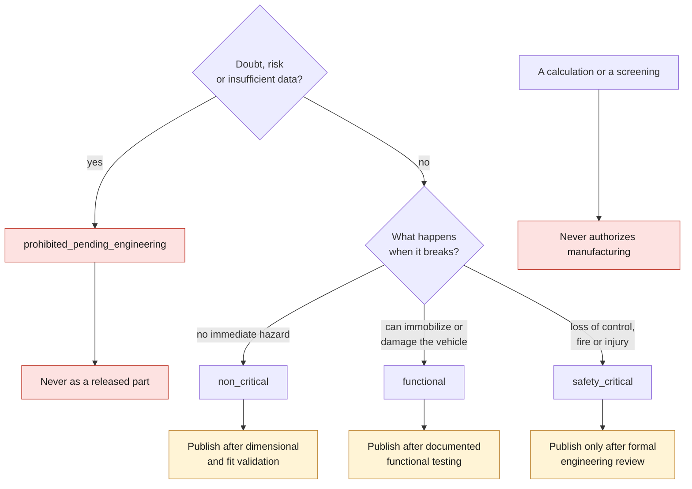
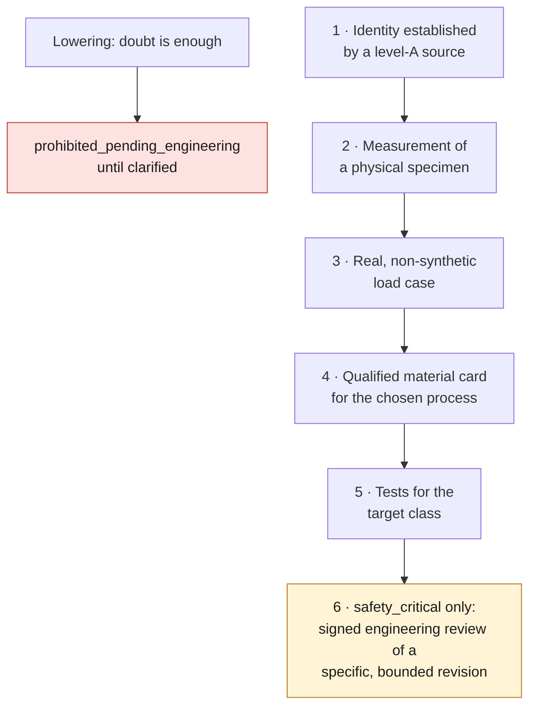

# Part safety policy

This document decides **what the repository is allowed to publish**, and under
what conditions. It overrides the technical interest of a part, the quality of a
calculation and the urge to manufacture.

One sentence sums it up: **a calculation never authorizes manufacturing.**

## 1. Classes

| Class | Definition | Publication allowed |
|---|---|---|
| `non_critical` | Trim, or a part whose failure creates no immediate hazard | After dimensional and fit validation |
| `functional` | Loaded part whose failure can immobilize or damage the vehicle | After documented functional testing |
| `safety_critical` | Failure could cause loss of control, fire or injury | Only after formal engineering review |
| `prohibited_pending_engineering` | Risk, or insufficient data | Never as a released part |

These four values are the ones in the record schema. They are not paraphrased.

The same classes as a decision, read with the failure-mode rule below and the
downgrading rule of section 5:

### Presumed-critical domains

The following are presumed critical: braking, steering, suspension, wheels,
occupant restraint, fuel system, lifting points, main powertrain mounts and
highly loaded internal engine components.

"Presumed" means the burden of proof is reversed: it is not up to the document
to demonstrate the hazard, it is up to the record to demonstrate that the part
is harmless. The same list is applied automatically by
`scripts/select_candidates.py` and by the titanium screenings; it must stay
identical on both sides.

### Failure mode overrides domain

A part can belong to no domain on the list and still be `safety_critical`
because of its failure mode. **Fire is the most common and most overlooked
case**: a turbocharger oil line is neither a brake nor a steering component, but
its failure drops oil onto a turbine housing far above the autoignition point.
It is critical, and no refinement of the design takes it out of that class — see
[`docs/993/993_CIRCUIT_HUILE_TURBO_202-16.md`](docs/993/993_CIRCUIT_HUILE_TURBO_202-16.md).

So the question to ask is not "which group does the part belong to", but
**"what happens when it breaks"**.

## 2. A fit validation does not prove safety

A part that fits its location can still fail through fatigue, creep,
temperature, vibration, corrosion, incorrect tightening or a manufacturing
defect. Catalog statuses must never be inferred from a photograph alone.

Likewise, **a digital screening is not evidence**. The repository produces
geometric, thermal and route screenings; they serve to rule out, not to
authorize. A report whose gates were all green would still release no part:
only the signed engineering review does that, at the end of the
[additive manufacturing pipeline](docs/AM_VALIDATION_PIPELINE.md), whose eleven
stages must all be `passed`.

## 3. Minimum requirements for metal

- Traceable material and lot
- Process and parameters qualified by the manufacturer
- Documented orientation and supports
- Documented heat treatment
- HIP justified for critical cyclic loading
- Functional surfaces machined where necessary
- Appropriate dimensional inspection and non-destructive testing
- Prevention of galling and galvanic corrosion
- Load plan, calculations and tests kept as evidence

To which this repository adds two checks it has learned to make explicitly,
because they are easy to miss.

### Service temperature against the alloy ceiling

An alloy has a ceiling, and a part has a temperature. Both must be written down
and compared. Ti-6Al-4V is creep-limited around 400 °C; a part declared at
427 °C does not pass, even if everything else about the route is flawless. This
comparison is a gate in stage 04 and must stay closed until the actual
temperature is measured.

**A synthetic temperature is not a temperature.** When a screening fixes a value
so that it can compute, that must be stated, and the decision that depends on it
stays suspended pending a measurement.

### Disassembly is part of the part's life

A part that is removed during maintenance undergoes repeated tightening.
Titanium galls, against itself as well as against steel, without a surface
treatment. A fitting removed at every oil change, a rethreaded thread, an
untreated sliding contact: these are grounds for rejection, not finishing
details.

## 4. Process and material are two questions

A part can be an excellent candidate for additive manufacturing and a poor
candidate for titanium. The two judgments are independent and must be rendered
separately.

The turbo oil circuit is the example: eleven parts to consolidate, internal
passages, a small series — and a rejection of titanium on galling, independently
of the fire risk. Conversely, an axisymmetric trim ring has no reason to be
sintered, whatever its material.

Choosing a part because it is the least risky **is not choosing it**. The
repository did this once and corrected it: see
[`docs/decisions/0005-alsi10mg-nest-pas-un-choix.md`](docs/decisions/0005-alsi10mg-nest-pas-un-choix.md).
Selection is made on function, against a written grid, and the result must stay
falsifiable line by line.

## 5. Downgrading and upgrading

**Lowering** a class requires no evidence: doubt is enough, and it is always
enough. When in doubt, the part drops to `prohibited_pending_engineering` until
clarified.

**Raising** a class requires, in this order: the part's identity established by
a level-A source, the measurement of a physical specimen, a real, non-synthetic
load case, a qualified material card for the chosen process, the tests
corresponding to the target class, and — for `safety_critical` — a signed
engineering review covering a specific, explicitly bounded revision.

None of these steps can be inferred from another. A class change is justified in
the record, not in a commit message.

## 6. What the repository will not do

- publish a `prohibited_pending_engineering` part as released, however good its
  dossier;
- present a screening as an authorization;
- infer an original material from a reseller's claim;
- replace a missing measurement with a convenient assumption;
- manufacture, or have manufactured, a load-bearing structural part or a
  passive safety part — see the out-of-scope section of [ROADMAP.md](ROADMAP.md).

## 7. Reporting

Open an issue with the `[SAFETY]` prefix, without publishing personal data or
proprietary documents. When in doubt, the part's status must be lowered to
`prohibited_pending_engineering` until clarified.
