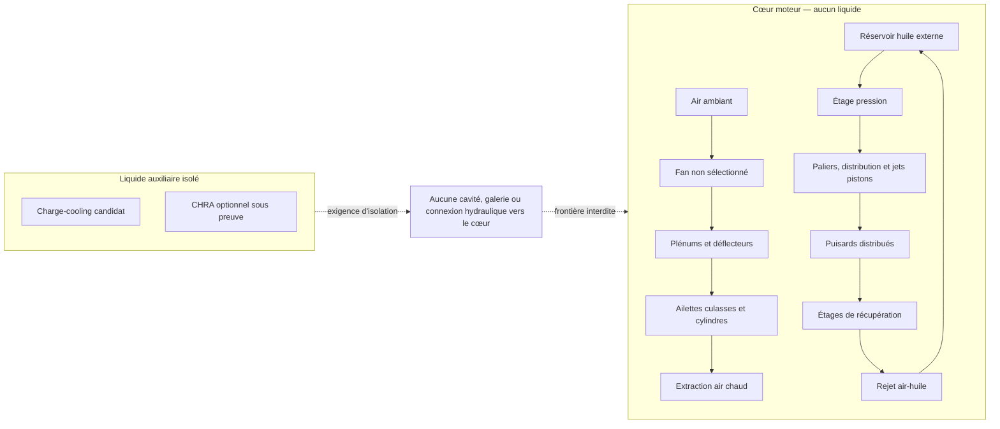

# F34a — décision cœur air/huile et gestion électronique 2026

## Décision et frontière de preuve

F34a enregistre la décision stable
`F34A-AIR-OIL-CORE-2026-CONTROLS` pour le flat-12 moderne. Le
[contrat machine-readable](../twins/reference-917-engine/air-oil-core-controls-f34a.json)
sélectionne un **cœur moteur strictement refroidi par air forcé et huile**.
Aucune chemise, cavité, galerie ou boucle de liquide de refroidissement n'est
autorisée dans le carter, les cylindres ou les culasses.

Cette décision remplace pour F34a la sélection antérieure de culasses à boucle
liquide de F33, sans modifier ni supprimer les artefacts F33/F34. Ceux-ci restent
des hypothèses historiques sans transfert de validation. F34a ne démontre ni
capacité thermique, ni sécurité, ni puissance, ni compatibilité RUF ou Porsche
993.

| Zone | Décision F34a | État de preuve |
| --- | --- | --- |
| Carter, cylindres, culasses | air forcé + huile uniquement | géométrie et thermique non validées |
| Air moteur | fan, plénums de banc, ailettes et extraction | matériel, débits et carte `null` |
| Huile | carter sec, récupération, désaération, jets de pistons, échangeur air-huile | matériel, plages et cartes `null` |
| Liquide auxiliaire | charge-cooling seulement, plus CHRA optionnel sous preuve séparée | isolé du cœur, non sélectionné |



## Gestion moteur 2026

Les nombres de canaux ci-dessous sont des exigences d'architecture E/S, pas la
preuve qu'un ECU ou un faisceau les supporte.

| Fonction | Exigence | État fail-closed |
| --- | --- | --- |
| ECU | planification déterministe à l'angle vilebrequin | matériel, firmware et budget E/S `null` |
| Injection | électronique séquentielle ; staged-port candidat | 12 canaux minimum, 24 visés ; injecteurs et cartes `null` |
| Allumage | double allumage électronique | 24 canaux ; bobines, plages et cartes `null` |
| DBW | deux actionneurs minimum, un par banc ; pédale et position papillon redondantes, plausibilité indépendante | matériel, carte et seuils `null` |
| Distribution | VVT électronique candidat et levée variable candidate, avec retour de position | actionneurs, plages et cartes `null` |
| Combustion fermée | lambda large bande fermée par zones ; knock fenêtré à l'angle et attribué au cylindre | matériel, plages, cartes et seuils `null` |
| Wastegates | actionnement électronique avec retour de position, ouverture sûre désénergisée et retour à la pression de ressort | matériel, plage, carte et seuils `null` |
| Réseau | CAN-FD pour contrôle, diagnostic et logging synchronisé | matériel et schéma réseau `null` |
| Capteurs et logging | phases de chaque arbre actionné, levée, CHT et EGT par cylindre, lambda, knock, pression différentielle carburant, huile, fan, turbos, actionneurs et boucles auxiliaires | références, plages et étalonnages `null` |
| Interlocks | arrêt d'urgence, perte pression huile, surrégime moteur et turbo, incohérence DBW hors autorité ECU | matériel, logique, seuils et essais `null` |

Le [RUF Tribute](https://www.ruf-automobile.de/en/modelle/ruf-tribute/)
sert uniquement de précédent public pour un moteur moderne refroidi par air avec
calage et levée variables. Il ne fournit ni géométrie, ni matériel, ni
calibration transférables au flat-12.

Les interlocks sont des exigences **hardwired** : l'ECU ne peut pas les
outrepasser. Leur fonction n'est toutefois pas utilisable tant que le matériel,
la logique, les seuils et les essais de déclenchement restent absents.

## Discipline fail-closed

`unresolved_registry` est la seule source pour les sélections de matériel, les
plages, les cartes et les seuils. Chaque entrée conserve simultanément :

- `value: null` ;
- `evidence_ref: null` ;
- `status: blocked_missing_evidence`.

Le validateur refuse une nouvelle clé, un parent modifié, un média liquide dans
le cœur, un troisième consommateur liquide, une cardinalité de canaux modifiée,
une preuve inventée ou un gate ouvert. Tous les gates physiques, banc, véhicule
et fabrication restent à `false`.

```bash
python3 scripts/validate_917_air_oil_core_controls_f34a.py
python3 tests/test_917_air_oil_core_controls_f34a.py -v
```

La prochaine étape autorisée est la collecte de preuves traçables : géométrie
d'ailettes et de plénums, courbes fan/pompes, réseau d'huile, matériel ECU et
actionneurs, architecture CAN-FD, plages capteurs, cartes VVT/VVL, lambda,
knock, injection, allumage, DBW et boost, seuils de sécurité et protocole
d'essai. Leur existence ne suffira pas à valider 1 600 hp, une compatibilité
RUF, un montage Porsche 993 ou une fabrication.
