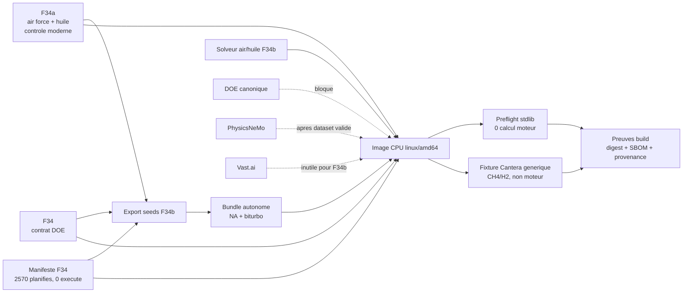
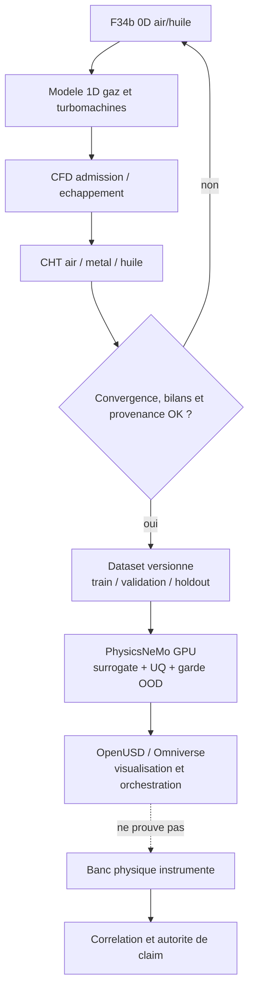

# F34b — runtime CPU air/huile autonome

## Résultat

F34b prépare l'image CPU reproductible du premier solveur compatible avec la
décision F34a : le cœur du flat-12 reste **strictement refroidi par air forcé
et huile de carter sec**. Aucun manteau d'eau, aucune cavité liquide et aucun
circuit de culasse liquide ne sont admis dans le cœur moteur.

Le liquide reste un auxiliaire séparé de la variante biturbo :

- refroidissement de la charge ;
- refroidissement CHRA éventuel, encore non défini et non validé.

La recette vise
`ghcr.io/cluster2600/3dprinting993-air-oil-cycle-f34b`. Sa publication reste
manuelle. Le digest GHCR vérifié est fixé séparément dans le verrou de
publication afin qu'aucun tag mutable ne devienne une autorité implicite.

## Ce qui est embarqué

L'image `linux/amd64` contient seulement sept entrées publiques :

1. le verrou de quatre roues Python avec hashes ;
2. le smoke test du conteneur ;
3. le solveur air/huile F34b ;
4. la décision d'architecture et de contrôle F34a ;
5. le contrat DOE F34 ;
6. le bundle autonome de deux seeds F34b ;
7. le manifeste F34 des 2 570 cas planifiés et non exécutés.

Le bundle de seeds est généré depuis les parents vérifiés puis suivi en JSON
canonique. Il conserve leurs SHA-256 et l'ascendance de dimensionnement
inverse, mais permet au runtime de ne charger ni contrat F33 à culasses
liquides, ni solveur F33.



## Gestion moteur moderne conservée dans le contrat

F34b transporte les exigences de contrôle, sans prétendre les simuler ni les
valider :

- injection électronique séquentielle, 12 voies minimales et 24 visées ;
- double allumage électronique, deux bougies par cylindre et 24 voies ;
- deux actionneurs d'accélérateur électronique au minimum, un par banc ;
- lambda large bande en boucle fermée ;
- contrôle de cliquetis attribué par cylindre et fenêtre angulaire, candidat ;
- calage et levée variables, candidats ;
- wastegates électroniques à retour mécanique sûr sur défaut ;
- acquisition EGT et température de culasse par cylindre, pression
  différentielle de carburant, vitesse turbo et interverrouillages ;
- réseau CAN-FD.

Le matériel ECU, les injecteurs, bobines, actionneurs, cartographies, plages et
seuils restent inconnus. Les réponses de ces contrôles ne sont pas modélisées
dans le niveau 0D.

## Modes et frontière de preuve

Le conteneur par défaut n'exécute que :

1. un préflight en bibliothèque standard qui vérifie les hashes, les schémas,
   l'absence de liquide dans le cœur et la fermeture de tous les gates ;
2. une fixture Cantera générique CH4/H2, sans seed moteur, géométrie Porsche,
   calibration ou cible de puissance.

Le solveur embarque aussi un mode `synthetic-smoke`. Il déplace matériellement
les régimes des seeds vers deux valeurs de régression versionnées, vérifie leur
absence parmi les 2 570 hashes du manifeste, puis seulement charge Cantera. Ces
deux fixtures ne produisent pas un dataset DOE et ne rendent aucune seed
éligible à l'entraînement. Le workflow les exécute séparément sur le digest
candidat pour tester le vrai chemin Cantera du solveur ; le `CMD` de l'image et
le smoke de build restent limités au préflight et à la fixture générique.

F34b ne prouve donc pas :

- une puissance de 1 600 mechanical hp ;
- un bilan thermique physique ;
- un débit réel de ventilateur, pompe ou échangeur ;
- un matching turbo, une combustion ou une limite de cliquetis ;
- le fonctionnement de l'EFI, de l'allumage ou des sécurités ;
- une corrélation banc, une endurance ou une intégration dans une 993 ;
- une exécution PhysicsNeMo, Omniverse ou Vast.ai ;
- une aptitude à l'impression 3D ou une autorisation de fabrication.

Tous les gates physiques et de fabrication restent à `false`.

## Commandes locales

```bash
make 917-air-oil-seeds-f34b-check
make 917-air-oil-cycle-f34b-preflight
make 917-air-oil-cycle-f34b-test
make 917-air-oil-cycle-f34b-image-test
make 917-air-oil-cycle-f34b-image
make 917-air-oil-cycle-f34b-smoke
```

Le smoke impose l'identité `9133:9133`, un réseau désactivé, une racine en
lecture seule, un `/tmp` dédié, aucune capability et `no-new-privileges`.

## Publication et verrou immuable

Le workflow manuel
`.github/workflows/air-oil-cycle-f34b-image.yml` doit :

1. refuser toute source autre que la branche `main` fusionnée ;
2. construire uniquement `linux/amd64` ;
3. publier un tag explicitement provisoire
   `candidate-<commit>-<run>-<tentative>` ;
4. vérifier le digest exact de l'index et du manifeste de plateforme ;
5. vérifier provenance SLSA et SBOM SPDX ;
6. exécuter le smoke durci puis les deux fixtures moteur non canoniques sur le
   digest ;
7. se déconnecter de GHCR, tirer anonymement le même digest et répéter le
   smoke ;
8. promouvoir seulement alors le même digest vers le tag unique
   `verified-<commit>-<run>-<tentative>` ;
9. conserver les preuves en artefact GitHub Actions, y compris en cas d'échec.

Le package GHCR doit être public pour que l'étape anonyme passe. L'échec de
cette étape bloque volontairement la promotion et la création d'un nouveau
verrou immuable. Un tag
`candidate-<commit>-<run>-<tentative>` non validé peut subsister dans GHCR
après un run échoué ; il n'a aucune autorité de release et ne doit jamais être
utilisé par Vast.ai. Les tags incluent l'identité du run et de sa tentative :
un rerun ne déplace donc pas le tag vérifié précédent. Seule la référence
`@sha256:...` fait autorité. Un verrou JSON de publication n'est créé qu'après
lecture des preuves du run et recomputation des digests.

## Publication immuable F34b vérifiée

Le workflow public
[run 33634398619](https://github.com/cluster2600/porscheparts/actions/runs/33634398619)
a construit la révision source
`6a02829cdf6cd968086af63145259091d7f34937`. La seule référence exécutable
autorisée par F34b est l'index public immuable :

```text
ghcr.io/cluster2600/3dprinting993-air-oil-cycle-f34b@sha256:369d51ee12c259e844d01817702d8debedcf400087ab9b289b8e59671d296664
```

Le verrou suivi
[`air-oil-cycle-f34b.lock.json`](../containers/air-oil-cycle-f34b.lock.json)
fixe le run, son job, l'artefact de preuves, l'index OCI, son manifeste
`linux/amd64`, le manifeste d'attestation et les empreintes des quinze entrées
exactes de construction et de contrôle. Il lie aussi la provenance SLSA, le
SBOM SPDX et les dix-neuf fichiers de preuve. Le runtime est CPU et non-root,
sous l'identité `9133:9133`. Le pull sans authentification du digest exact puis
le smoke renforcé, hors réseau, ont réussi ; les smokes authentifié et anonyme
sont identiques octet par octet.

Le manifeste DOE contient **2 570 cas planifiés et aucun cas canonique
exécuté**. Aucun des deux seeds source n'a été exécuté. Les deux seuls passages
du chemin Cantera moteur sont des fixtures synthétiques, déplacées hors de la
grille canonique et explicitement non canoniques. Elles vérifient le runtime et
ne constituent ni un dataset, ni une calibration, ni une preuve moteur.

Ce verrou ouvre seulement les gates logiciels de publication immuable, de
smoke `linux/amd64` hors ligne, d'accès anonyme exact, de métadonnées de chaîne
d'approvisionnement et des deux fixtures de régression non canoniques. Il ne
prouve pas 1 600 ch, un bilan thermique ou mécanique, une corrélation banc, une
aptitude à la fabrication ou à l'impression, un entraînement PhysicsNeMo, une
exécution Omniverse, ni un déploiement Vast.ai. Tous les gates physiques,
moteur et fabrication restent fermés. La provenance et le SBOM ne sont pas une
signature cryptographique, et aucun audit sémantique exhaustif des licences de
contenu n'est revendiqué.

## Suite F35

Après publication de F34b, la prochaine étape n'est pas l'entraînement d'un
réseau neuronal. Elle consiste à exécuter progressivement des cas classiques
et à constituer un dataset attesté :



Une image GPU séparée ne sera créée qu'après `dataset_ready=true`. Elle pourra
embarquer PhysicsNeMo et les modèles retenus ; F34b reste volontairement une
petite image CPU sans appel API ni poids téléchargé au démarrage.
