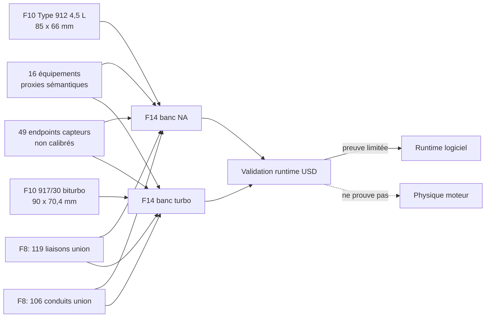
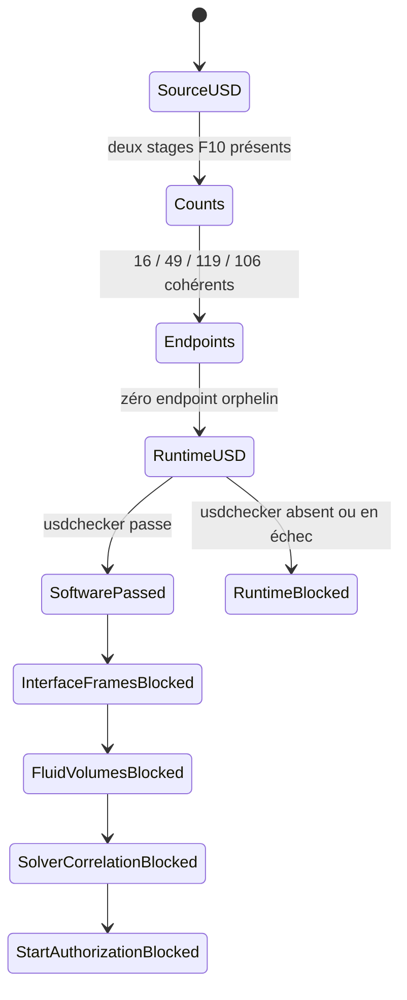

# Squelette exécutable du banc moteur 917 — F14

## Résultat visé

F14 remplace le banc visuel générique par deux compositions USD explicites :

- Type 912 atmosphérique, construit au-dessus du stage F10 de 4,5 L et 66 mm de course ;
- 917/30 biturbo, construit au-dessus du stage F10 de 5,374 L et 70,4 mm de course.

Chaque sortie est un overlay USDA ASCII. Elle matérialise l'inventaire du banc,
les endpoints d'instrumentation et les graphes de connectivité. Elle n'ajoute
aucun joint moteur, corps rigide, collision, articulation PhysX ou volume CFD.
La cinématique F10 héritée reste une animation visuelle pilotée par le temps.



## Écart F4 corrigé

Le contrat F4 déclarait 16 équipements, tandis que son générateur en créait
réellement 11. F14 conserve les 11 types/instances déjà représentés et ajoute
les cinq occurrences absentes comme proxies/endpoints non physiques :

| Équipement absent de la scène F4 | Occurrences F14 | Limite |
|---|---:|---|
| Démarreur | 1 | montage, couple et courant inconnus |
| Alimentation d'air de refroidissement | 1 | courbe ventilateur inconnue |
| Extraction d'échappement | 2 | contre-pression inconnue |
| Extinction incendie | 1 | logique seulement, aucune certification |

Les 49 voies d'instrumentation ne sont plus seulement un nombre stocké dans
les métadonnées : F14 crée 49 prims endpoint, répartis dans les dix familles du
contrat. Leur position physique, leur plage, leur calibration, leur fréquence
d'échantillonnage et leurs seuils restent volontairement non renseignés.

## Comptes de graphes

Les comptes sont recalculés depuis les registres F8, puis comparés aux valeurs
du contrat F14 avant toute écriture d'overlay.

| Graphe | Commun | NA seulement | Turbo seulement | Union | Stage NA | Stage turbo |
|---|---:|---:|---:|---:|---:|---:|
| Liaisons mécaniques | 117 | 0 | 2 | 119 | 117 | 119 |
| Conduits | 68 | 14 | 24 | 106 | 82 | 92 |

Une liaison F14 est une relation entre deux ports de famille. Ce n'est pas un
`UsdPhysicsJoint`. Le pairing exact entre occurrences, les repères, jeux,
frictions, rigidités, amortissements, masses et inerties restent à mesurer.

Un conduit F14 est une arête sémantique entre ports. Ce n'est ni un tube
dimensionné, ni une surface interne, ni un domaine fluide étanche. Aucun
résultat de débit, pression, température ou perte de charge ne peut en être
déduit.

## Machine d'états fail-closed



Le statut `software_runtime_passed_engine_physics_blocked` signifie uniquement
que les overlays s'ouvrent et que leur composition et leurs dépendances USD
sont cohérentes. Il ne valide pas la dynamique du moteur, les contacts, la
lubrification, la combustion, la puissance ou le banc physique.

## Génération locale

Les deux stages et le rapport restent sous `work/`, donc hors Git :

```bash
python3 twins/reference-917-engine/source/build_bench_executable_skeleton_f14.py \
  --output work/917-bench-executable-f14
```

Sorties attendues :

- `work/917-bench-executable-f14/type-912-4-5-na/917-engine-bench-executable-skeleton-f14.usda` ;
- `work/917-bench-executable-f14/917-30-turbo-5374/917-engine-bench-executable-skeleton-f14.usda` ;
- `work/917-bench-executable-f14/state-machine-report.json`.

Si un stage F10 manque, si un compte dérivé diverge ou si un endpoint n'est
pas enregistré, le générateur écrit un rapport `blocked_before_authoring` et
n'autorise aucune conclusion de runtime.

## Critères vérifiables F14

- exactement deux stages, chacun sous-couchant son stage F10 propre ;
- 16 prims équipements, dont les cinq occurrences absentes de F4 ;
- 49 prims endpoints capteurs ;
- 117/119 arêtes mécaniques respectivement pour NA/turbo ;
- 82/92 arêtes de conduits respectivement pour NA/turbo, union 106 ;
- aucun endpoint sémantique orphelin ;
- zéro nouveau schéma physique, joint, articulation, collision ou masse ;
- zéro volume CFD ;
- `usdchecker` vert pour les deux compositions avant le statut runtime passé ;
- `engine_physics_validated`, `fluid_simulation_ready` et
  `fired_run_authorized` restent faux.

## Étape physique suivante

Le prochain gate n'est pas un entraînement PhysicsNeMo. Il faut d'abord
mesurer les repères d'interface et les occurrences réellement appariées,
reconstruire les surfaces internes étanches, caractériser masses, inerties,
jeux, frottements, joints d'étanchéité et conditions aux limites, puis corréler
les solveurs classiques à des essais instrumentés. PhysicsNeMo pourra ensuite
servir de surrogate sur ces résultats validés, jamais de preuve autonome.
