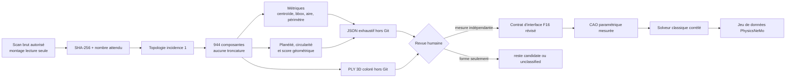

# F18 — revue humaine exhaustive des frontières du scan 917

## Résultat recherché

F18 transforme les **101 809 arêtes ouvertes et 944 composantes de frontière**
observées sur le binaire canonique en un inventaire géométrique complet. Chaque
composante reçoit un identifiant stable, des métriques et une couleur pour être
inspectée en 3D. Cette étape **ne confirme aucune interface** et n'attribue aucun
nom de pièce moteur.

F18 prolonge :

- [F16](917_KINEMATIC_INTERFACE_READINESS_F16.md), qui garde les interfaces et
  articulations inactives tant que leurs mesures ne sont pas établies ;
- [F17](917_SCAN_MESH_CONTAINER_F17.md), qui fournit l'image CPU minimale,
  épinglée et testée pour lire le scan sans l'intégrer à l'image.



## Sorties locales

Le script
`twins/reference-917-engine/source/review_boundary_components_f18.py` écrit :

- `boundary-review-f18.json` : les 944 enregistrements complets, sans limite de
  rang ni troncature ;
- `boundary-components-f18.ply` : un nuage de points 3D binaire coloré limité
  aux sommets de frontière. Il contient aussi `component_rank` et le drapeau
  géométrique `candidate`.

Ces deux fichiers sont des dérivés du scan sous licence. Ils restent dans
`work/917-engine/boundary-review-f18/`, donc **hors Git**, et ne doivent pas être
redistribués. Le dépôt ne reçoit ni scan, ni sommets, ni faces, ni PLY dérivé.

Chaque composante contient au minimum :

- centroïde, boîte englobante et étendue dans les unités d'entrée ;
- nombre d'arêtes et de sommets, extrémités, branchements et boucle fermée ;
- périmètre 3D ;
- aire projetée dans le plan PCA, par lacet pour une boucle simple ou par
  enveloppe convexe comme simple proxy pour les autres formes ;
- normale non orientée, RMS de plan et ratio de planéité ;
- cercle aux moindres carrés, diamètre, RMS, P95 relatif et couverture
  angulaire ;
- score explicable et classe de revue strictement `candidate` ou
  `unclassified` ;
- `semantic_label: null`, `interface_confirmed: false` et
  `human_review_state: pending`.

Le score ne comporte aucun filtre de diamètre, car l'unité du scan n'est pas
encore confirmée. Une forme passe en `candidate` seulement si elle est une
boucle simple d'au moins 12 sommets, avec P95 relatif inférieur ou égal à 0,12,
ratio de planéité inférieur ou égal à 0,05, couverture angulaire supérieure ou
égale à 0,65 et score supérieur ou égal à 0,80. Cela signifie uniquement
« forme à examiner ». Un trou de scan peut obtenir le même score qu'un alésage.

## Test synthétique local

Le test crée un disque à 32 segments et un triangle isolé. Il doit produire
exactement une `candidate`, une `unclassified`, zéro interface confirmée et un
PLY coloré de 35 points :

```bash
python3 twins/reference-917-engine/source/review_boundary_components_f18.py \
  --synthetic-self-test \
  --output /tmp/917-f18-synthetic

python3 -m unittest discover -s tests -p 'test_917_boundary_review_f18.py' -v
```

Le test Python dépend de NumPy et de Trimesh pour son chemin géométrique. Quand
NumPy n'est pas installé sur l'hôte, les contrats statiques restent vérifiés et
le test géométrique est marqué comme dépendant du runtime F17. La commande
Docker ci-dessous fixe le runtime par digest immuable.

## Exécution canonique dans l'image F17

La source brute est montée en lecture seule, tout comme le répertoire des
scripts. Seule la sortie est inscriptible. Aucun accès réseau, GPU ou Vast.ai
n'est nécessaire :

```bash
mkdir -p "$PWD/work/917-engine/boundary-review-f18"

docker run --rm --platform linux/amd64 \
  --network none --read-only \
  --tmpfs /tmp:rw,noexec,nosuid,size=512m \
  --pids-limit 256 --cap-drop ALL \
  --security-opt no-new-privileges \
  --mount type=bind,src="$PWD/raw-scans/917-engine/original",dst=/workspace/input,readonly \
  --mount type=bind,src="$PWD/twins/reference-917-engine/source",dst=/workspace/code,readonly \
  --mount type=bind,src="$PWD/work/917-engine/boundary-review-f18",dst=/workspace/output \
  ghcr.io/cluster2600/3dprinting993-scan-mesh-f17@sha256:b48f23d64ceab9c2e6b7b7474cdd81011d27b8a584f7af6b50b6cc05823c5189 \
  python /workspace/code/review_boundary_components_f18.py \
    --input /workspace/input/917-engine-case-with-cylinders.obj \
    --input-sha256 428c4143d073f8330022f2fecbd1ac1ee7784d4f1565f1160020448dbdffa0ae \
    --expected-boundary-components 944 \
    --output /workspace/output
```

Le SHA-256 et le nombre de composantes sont des gardes de régression sur le
même fichier binaire, pas des preuves d'identité Porsche, d'échelle ou de
précision. Le processus ne peut pas prouver lui-même que le montage d'entrée
était en lecture seule ; cette propriété reste une preuve d'orchestration
Docker. Le PLY peut être ouvert localement dans MeshLab ou CloudCompare pour la
revue humaine et la sélection des rangs à mesurer.

L'exécution canonique dans ce digest a produit 19 `candidate`, 925
`unclassified`, zéro interface confirmée et 944 revues humaines en attente. Le
PLY est identique octet par octet à une seconde exécution locale et le JSON est
identique après retrait du seul horodatage de génération. Les deux fichiers
détaillés restent hors Git. La preuve suivie
[`boundary-review-execution-evidence-f18.json`](../twins/reference-917-engine/boundary-review-execution-evidence-f18.json)
ne conserve que les comptes, empreintes, conditions d'exécution et gates ; elle
n'inclut aucun centroïde, normale ou boîte englobante de composante.

## Procédure de revue

1. Trier le JSON par `candidate_score`, mais conserver les 944 composantes dans
   le périmètre de revue.
2. Ouvrir le PLY avec les couleurs et relever `component_rank` ; comparer
   simultanément au scan original sans exporter la géométrie.
3. Marquer les artefacts de scan, découpes, câbles et limites de capture comme
   observations externes, sans modifier automatiquement F16.
4. Pour une forme potentiellement fonctionnelle, obtenir une seconde mesure
   physique ou une source primaire propre à la variante, avec unité, tolérance,
   repère et incertitude.
5. Seulement après revue, créer une proposition de contrat d'interface séparée.
   Le rapport F18 immuable reste un inventaire géométrique brut.

## Gates maintenus fermés

F18 garde explicitement à `false` l'identité, l'échelle, les unités, les axes,
les interfaces sémantiques, la reconstruction CAO, les solveurs classiques, le
jeu de données et l'entraînement PhysicsNeMo, SimReady/Omniverse, la fabrication
et le démarrage moteur.

Le JSON et le PLY ne prouvent donc ni l'étanchéité, ni un domaine fluide fermé,
ni les jeux, ni les tolérances, ni la tenue thermique, ni la fatigue, ni
l'imprimabilité. Ils rendent seulement la revue manuelle complète et traçable.
