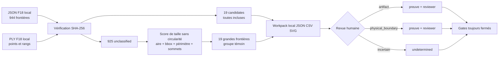
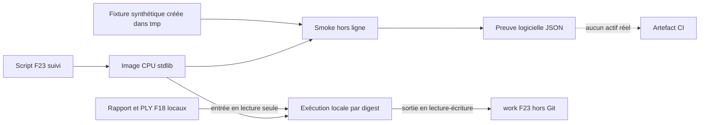

# F23 — workpack local de revue des frontières du scan 917

## But et limite d'autorité

F23 transforme l'inventaire F18 en une file de revue humaine exploitable, sans
copier de géométrie dans Git. Il inclut les **19 candidats circulaires** de F18
et un groupe témoin de **19 grandes frontières non classées**. Ce second groupe
réduit le risque de manquer un port ou une bride uniquement parce que sa
frontière est incomplète ou non circulaire. Il ne prouve pas qu'une frontière
est un port, une bride ou même une limite physique.

Les états de revue sont strictement `artifact`, `physical_boundary` et
`undetermined`. Même `physical_boundary` signifie seulement qu'un humain juge
la limite probablement physique sur la preuve consultée : ce n'est ni une
interface sémantique confirmée, ni une cote, ni une autorisation CAO.



## Sélection déterministe

La cohorte principale contient tous les enregistrements F18 dont
`review_class == candidate`, triés par score F18 puis par rang stable. La
cohorte secondaire exclut la circularité et classe les `unclassified` par la
somme de quatre rangs percentiles :

- aire projetée : 35 % ;
- diagonale de boîte englobante : 30 % ;
- périmètre : 25 % ;
- nombre de sommets : 10 %.

Les 19 premiers forment une cohorte de contrôle de même taille que la cohorte
principale. Cette parité borne la charge de revue et évite de consacrer toute
la capacité aux seules formes circulaires. Elle ne constitue pas un
échantillonnage statistique du moteur ; les 906 autres frontières restent en
attente dans F18.

## Sorties locales et exécution

Le générateur utilise seulement la bibliothèque standard Python. Il vérifie les
deux SHA-256, le contrat JSON F18, tous les gates F18, la disposition binaire du
PLY, les rangs, les drapeaux `candidate` et le nombre de points par composante.
Il écrit dans `work/`, déjà ignoré par Git : toutes ces sorties restent **hors Git**.

- `boundary-review-workpack-f23.json` : indicateurs, décisions, reviewer et
  preuves ;
- `boundary-review-queue-f23.csv` : feuille de saisie initialisée à
  `undetermined` ;
- `boundary-review-atlas-f23.svg` : trois projections normalisées par
  frontière, sans interprétation d'axe ou d'unité.

```bash
python3 twins/reference-917-engine/source/build_boundary_review_workpack_f23.py \
  --report work/917-engine/boundary-review-f18-published/boundary-review-f18.json \
  --report-sha256 8208c2fec6561261904c48bb449a1bd50d679e370ee7b4a19a86d78ba265450e \
  --ply work/917-engine/boundary-review-f18-published/boundary-components-f18.ply \
  --ply-sha256 822e7d8ea54fa69f44658bd0b7b29dfb1fb4e4e15b3f1c73d4f45cedc03e2451 \
  --expected-component-count 944 \
  --expected-candidate-count 19 \
  --secondary-count 19 \
  --output work/917-engine/boundary-review-workpack-f23
```

Le générateur refuse d'écraser un workpack existant, afin de ne pas effacer une
revue. `--overwrite` est volontairement refusé : une nouvelle génération doit
utiliser un nouveau répertoire de sortie après conservation explicite des
décisions précédentes.

## Saisie et validation

Un état décidé (`artifact` ou `physical_boundary`) exige un nom de reviewer, un
horodatage UTC et au moins une preuve typée. Le validateur accepte les preuves
`scan_observation`, `physical_measurement`, `primary_source`, `photograph` et
`other_local_reference` :

```bash
python3 twins/reference-917-engine/source/build_boundary_review_workpack_f23.py \
  --report work/917-engine/boundary-review-f18-published/boundary-review-f18.json \
  --report-sha256 8208c2fec6561261904c48bb449a1bd50d679e370ee7b4a19a86d78ba265450e \
  --ply work/917-engine/boundary-review-f18-published/boundary-components-f18.ply \
  --ply-sha256 822e7d8ea54fa69f44658bd0b7b29dfb1fb4e4e15b3f1c73d4f45cedc03e2451 \
  --expected-component-count 944 \
  --expected-candidate-count 19 \
  --secondary-count 19 \
  --validate-review-file work/917-engine/boundary-review-workpack-f23/boundary-review-workpack-f23.json
```

Cette validation est liée aux deux fichiers source et reconstruit les champs
immuables du workpack. Un JSON de revue isolé, même structurellement valide,
ne peut donc pas substituer des identifiants ou indicateurs de composante.

Les données nominatives du reviewer, références locales, coordonnées dérivées,
JSON, CSV et SVG ne doivent jamais être ajoutés à Git. Le contrat suivi
[`boundary-review-workpack-f23.json`](../twins/reference-917-engine/boundary-review-workpack-f23.json)
ne contient que les empreintes, comptes, règles expurgées et gates fermés.

## Gates maintenus fermés

F23 ne confirme ni l'identité du moteur, ni l'échelle, ni les unités, ni les
axes, ni les interfaces. Il n'autorise pas la reconstruction CAO, le solveur
classique, les jeux de données ou l'entraînement PhysicsNeMo, SimReady dans
Omniverse, la fabrication ou le démarrage moteur. Trois contrôles physiques
indépendants et la revue dimensionnelle restent nécessaires avant toute CAO
mesurée.

## Tests synthétiques

Les tests construisent un rapport F18 et un PLY entièrement synthétiques. Ils
vérifient la sélection, l'atlas, les champs de décision, le refus des empreintes
incorrectes et le caractère fail-closed des gates :

```bash
python3 -m unittest discover -s tests -p 'test_917_boundary_review_workpack_f23.py' -v
```

## Image Docker F23

L'image CPU F23 isole ce générateur du traitement de maillage et de
PhysicsNeMo. Elle repose sur
`python:3.12.14-slim-bookworm` par digest, cible exclusivement `linux/amd64`
et n'installe aucun paquet système ou Python : le script reste limité à la
bibliothèque standard. Son contexte de construction est une liste blanche de
deux fichiers, le générateur et son smoke ; aucun scan, PLY réel, workpack,
dataset, poids de modèle ou secret n'entre dans l'image.



Construction locale de la candidate :

```bash
docker buildx build \
  --platform linux/amd64 \
  --load \
  --file containers/boundary-review-f23.Dockerfile \
  --tag 3dprinting993-boundary-review-f23:local \
  .
```

Le smoke crée son rapport F18 et son PLY dans un répertoire temporaire du
conteneur. Il exécute le vrai générateur deux fois, relit SVG/JSON/CSV, vérifie
les trois sorties byte à byte, les SHA-256, le refus d'écrasement et les gates
fermés. Il s'exécute sans GPU avec le runtime durci :

```bash
docker run --rm --platform linux/amd64 \
  --network none --read-only \
  --tmpfs /tmp:rw,noexec,nosuid,size=64m \
  --pids-limit 64 --cap-drop ALL \
  --security-opt no-new-privileges \
  3dprinting993-boundary-review-f23:local
```

Pour produire le workpack réel, les deux entrées locales sont montées en
lecture seule et seul le répertoire de sortie est inscriptible :

```bash
mkdir -p work/917-engine/boundary-review-workpack-f23

docker run --rm --platform linux/amd64 \
  --network none --read-only \
  --tmpfs /tmp:rw,noexec,nosuid,size=64m \
  --pids-limit 64 --cap-drop ALL \
  --security-opt no-new-privileges \
  --mount type=bind,src="$PWD/work/917-engine/boundary-review-f18-published",dst=/workspace/input,readonly \
  --mount type=bind,src="$PWD/work/917-engine/boundary-review-workpack-f23",dst=/workspace/output \
  --entrypoint python \
  3dprinting993-boundary-review-f23:local \
  /opt/3dprinting993/twins/reference-917-engine/source/build_boundary_review_workpack_f23.py \
  --report /workspace/input/boundary-review-f18.json \
  --report-sha256 8208c2fec6561261904c48bb449a1bd50d679e370ee7b4a19a86d78ba265450e \
  --ply /workspace/input/boundary-components-f18.ply \
  --ply-sha256 822e7d8ea54fa69f44658bd0b7b29dfb1fb4e4e15b3f1c73d4f45cedc03e2451 \
  --expected-component-count 944 \
  --expected-candidate-count 19 \
  --secondary-count 19 \
  --output /workspace/output
```

Le workflow manuel GHCR construit avec des actions épinglées, ajoute une
provenance SLSA et un SBOM SPDX, puis rejoue le smoke avec `--network none` et
`--read-only`. Une publication n'est acceptée qu'après vérification du digest,
du sujet de l'attestation, de la provenance, du SBOM et de l'accès anonyme au
digest exact. Les artefacts CI ne contiennent que ces preuves et le résumé du
smoke synthétique ; jamais les trois sorties locales.

## Publication immuable vérifiée

Le premier workflow de publication est vert :
[run 33580635075](https://github.com/cluster2600/porscheparts/actions/runs/33580635075),
sur la révision `1ae15656080df2a1042db15fdc2dff2881c474a2`. La référence
exécutable est désormais exclusivement le digest immuable :

```text
ghcr.io/cluster2600/3dprinting993-boundary-review-f23@sha256:860fb1c481a8a4b72cf14d9f1d15d65b9adf327cf268ebbcc26da127427126c9
```

Le verrou suivi
[`boundary-review-f23.lock.json`](../containers/boundary-review-f23.lock.json)
relit les empreintes et tailles de l'index OCI, du manifeste `linux/amd64`, de
l'attestation, de la provenance, du SBOM et du smoke. Il enregistre aussi les
métadonnées du run et de l'artefact retournées par l'API GitHub. L'index ne
contient qu'un manifeste `linux/amd64` et son manifeste d'attestation ; l'accès
anonyme au digest exact a réussi.

Deux gates seulement sont vrais : `immutable_public_image_verified` et
`linux_amd64_offline_smoke_verified`. La signature cryptographique, l'exécution
du scan canonique, la revue humaine, l'identité, l'échelle, les interfaces, la
CAO, les solveurs classiques, PhysicsNeMo, Omniverse, la fabrication,
l'impression et le fonctionnement moteur restent explicitement faux. Le
verrou ne contient aucune empreinte du rapport F18, du PLY ou d'un workpack
réel. Une image verte ne prouve pas l'identité du scan, une interface physique,
une simulation ou une pièce fabricable.
