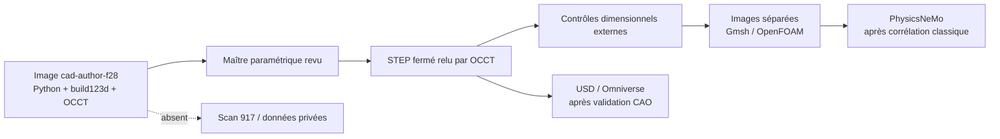
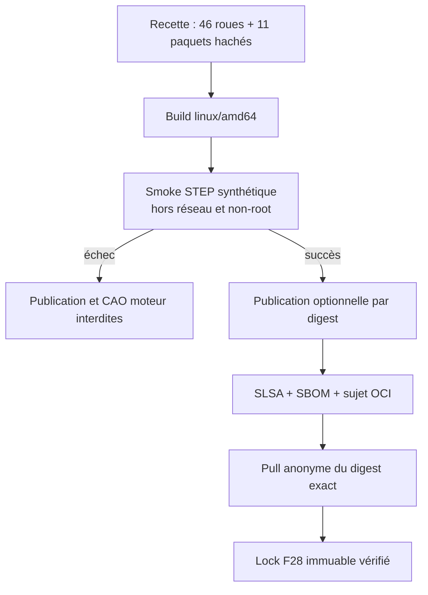

# F28 — image minimale d'auteur CAO build123d/OCCT

L'image `cad-author-f28` fournit un environnement CPU borné pour écrire une
géométrie paramétrique avec **build123d 0.11.1**, l'exporter en STEP et la relire
avec **OCCT 7.9.3**. Elle ne contient aucune géométrie du moteur, aucun scan,
aucun fichier du dossier `work/`, aucun dataset, aucun poids de modèle et aucun
secret.

Cette image est un outil d'auteur CAO. Son smoke synthétique ne prouve ni les
dimensions physiques du moteur 917, ni son assemblage, ni sa tenue mécanique,
ni sa fabrication, ni son fonctionnement.

## Périmètre volontairement étroit

| Présent | Exclu et traité dans une autre image ou étape |
|---|---|
| Python 3.12.14 | FreeCAD et son interface graphique |
| build123d 0.11.1 | OpenSCAD et le tranchage |
| `cadquery-ocp-novtk` 7.9.3.1.1 | Gmsh et le maillage CAE |
| OCCT/STEP, sans VTK | OpenFOAM et les fluides |
| bibliothèques GL/X11 minimales, sans fontes système | PhysicsNeMo et tout entraînement GPU |
| smoke synthétique local | Omniverse, USD et SimReady |

Le conteneur n'embarque donc pas `cadsim.Dockerfile`, qui mélangeait CAO,
maillage, FEA, CFD, tranchage, outils de banc, SSH et interface graphique. La
séparation empêche qu'une simple opération STEP déclenche le téléchargement ou
la publication d'une pile de simulation.



## Dépendances verrouillées

La base est fixée par digest :

```text
python:3.12.14-slim-bookworm@sha256:9c47360a2a0355e2da18516d0b1c2126ec22c195d2185e97347c9d98398c5bef
```

Le frontend Dockerfile est également fixé par digest. Les **46 roues** de la
fermeture réelle `build123d==0.11.1` ont été résolues pour CPython 3.12 sur
`linux/amd64`, puis chacune fixée par version et SHA-256 dans
`containers/cad-author-f28-requirements.txt`. L'installation emploie
`--only-binary=:all:`, `--require-hashes` et `--no-deps`; `pip check` vérifie
ensuite que cette liste ferme bien toutes les dépendances déclarées.

La roue `cadquery-ocp-novtk` reste liée à `libGL.so.1`, `libX11.so.6` et
`libexpat.so.1`. Installer normalement `libgl1` tirerait Mesa, LLVM et environ
216 Mio de fichiers inutiles au round-trip STEP. Un stage court télécharge donc
onze paquets nécessaires, dont `fontconfig-config` sans aucun fichier de fonte
système,
vérifie leur version et leur SHA-256, puis extrait seulement leurs fichiers dans
l'image finale. Le verrou est suivi
dans `containers/cad-author-f28-system-packages.sha256`. Aucun fournisseur GLX
Mesa, VTK, serveur X ou bibliothèque d'interface graphique n'est ajouté.

La roue build123d verrouillée contient elle-même une police de trait CAO,
`ReliefSingleLineCAD-Regular.ttf`. Le smoke exige cette unique police de
dépendance et son SHA-256
`8b30ea7ea8a2b17fb9d5c70b5c7c37e6a9285b4f8aced4fbd646bc591dba59b3`.
Elle n'est ni une fonte système ajoutée par APT ni une preuve de géométrie texte
validée ; aucun test de texte n'entre dans le périmètre F28.

Les notices `copyright` des onze paquets et les licences communes Debian sont
conservées puis auditées par le smoke. Le label OCI reste volontairement
`NOASSERTION` : les notices et le SBOM sont l'autorité, pas une expression de
licence simplifiée.

Le dépôt APT utilisé n'est pas un snapshot horodaté et ne garantit donc pas la
rétention future des versions. Le build reste fail-closed : un paquet retiré ou
un octet `.deb` différent du verrou fait échouer la recette. Il ne faut pas
présenter cette intégrité par hash comme une garantie de disponibilité du
miroir. La provenance du build et le SBOM doivent être conservés avec le digest
publié.

Une version sans hash, une résolution pour une autre architecture ou un échec
de `pip check` arrête le build. Il ne faut pas remplacer ce verrou par un simple
`pip install build123d`.

## Smoke CAO réel mais synthétique

Après la création du compte non-root `cad-author` (`9178:9178`, HOME `/tmp`) et
avec le réseau de build désactivé, le smoke :

1. construit un pavé synthétique de 20 × 12 × 8 mm traversé par un alésage de
   rayon 2 mm ;
2. vérifie sa validité OCCT, sa variété, son unique solide et son unique coque
   fermée ;
3. compare volume et boîte englobante aux valeurs analytiques ;
4. exporte un STEP, le rouvre avec build123d/OCCT et refait tous les contrôles ;
5. répète le calcul dans un second fichier et compare les signatures
   géométriques ;
6. contrôle le cache XDG dédié dans `/tmp`, l'absence de fontes système,
   l'unique police de dépendance build123d allowlistée et les onze notices de
   licences Debian.

Les dimensions de la fixture sont déclarées dans le smoke et ne proviennent
d'aucun véhicule. Le SHA-256 du STEP est enregistré seulement comme diagnostic
d'exécution. Un en-tête STEP peut porter des métadonnées variables : ce hash
n'est pas présenté comme une promesse de build byte-identique.

## Construction et runtime durci

```bash
docker buildx build \
  --platform linux/amd64 \
  --file containers/cad-author-f28.Dockerfile \
  --load \
  --tag 3dprinting993-cad-author-f28:f28-local \
  .

docker run --rm --platform linux/amd64 \
  --network none --read-only \
  --tmpfs /tmp:rw,noexec,nosuid,size=128m \
  --pids-limit 64 --cap-drop ALL --security-opt no-new-privileges \
  3dprinting993-cad-author-f28:f28-local
```

Le conteneur n'expose aucun port, ne demande aucun GPU et ne lance aucun
service. Le système de fichiers racine est en lecture seule au runtime ; seule
la fixture temporaire est écrite dans le `tmpfs` de `/tmp`. Pour un futur
travail CAO, les entrées devront être montées en lecture seule et la sortie
dans un volume privé distinct en lecture-écriture. Aucun scan ne doit être
copié dans l'image.

Le build et les trois exécutions CI capturent `stderr`, l'affichent et exigent
qu'il reste vide. Une régression de cache ezdxf ou de fontconfig bloque donc le
workflow au lieu d'être masquée.

## Workflow GHCR fail-closed

Le workflow manuel `.github/workflows/cad-author-f28-image.yml` a une valeur de
publication par défaut à `false`. En mode publication, il doit :

- construire uniquement `linux/amd64` avec provenance SLSA et SBOM SPDX ;
- fixer Buildx à `v0.36.1` et le driver BuildKit `v0.32.2` par digest, puis
  enregistrer leurs versions dans les preuves ; le binaire Buildx Linux amd64
  est en plus vérifié avec le SHA-256
  `48af8a397ebd60178778bf63611dbcebe5f5e7a9be90eb9147b24b9587455778` ;
- relier l'index OCI à son unique manifeste plateforme et à son manifeste
  d'attestations ;
- vérifier les sujets, la révision source, le frontend et la base immuable ;
- vérifier dans le SBOM build123d 0.11.1 et `cadquery-ocp-novtk` 7.9.3.1.1 ;
- tirer puis exécuter le digest exact avec réseau nul, rootfs en lecture seule,
  toutes les capacités supprimées et `no-new-privileges` ;
- répéter le pull et le smoke avec un `DOCKER_CONFIG` anonyme neuf.

Les budgets ont des métriques séparées : couche OCI compressée maximale
275 000 000 octets, somme des couches OCI compressées 325 000 000 octets,
et somme des flux `layer.tar` non compressés 1 100 000 000 octets. La taille
rapportée par `docker image inspect .Size` est conservée comme diagnostic mais
n'est pas gatée : sa sémantique varie entre le magasin containerd de Docker
Desktop et le backend overlay2 du runner GitHub. La mesure portable lit
`manifest.json`, accepte les blobs OCI gzip dont le flux est un tar valide et
les archives Docker à couche tar non compressée valide, puis vérifie le digest
des blobs OCI. L'unique exception est le blob gzip vide canonique de BuildKit,
allowlisté par digest. Les chemins de couche sont strictement validés ; bzip2,
xz, zstd, gzip non-tar et tout autre encodage échouent. Ces plafonds ne signifient pas
que l'image « fait 250 MB » : le manifeste du registre, le magasin local et
l'archive Docker ne mesurent pas la même représentation.



## Publication immuable F28 vérifiée

Le statut provisoire « aucun digest public F28 et aucun lock d'autorité » n'est
plus applicable. Le workflow public
[`33592654832`](https://github.com/cluster2600/porscheparts/actions/runs/33592654832)
a publié et validé l'index exact :

```text
ghcr.io/cluster2600/3dprinting993-cad-author-f28@sha256:18dbfa559306a31c909480695acf0e89a9bc904c83d280065c1d9d29036fec57
```

Le verrou suivi
[`cad-author-f28.lock.json`](../containers/cad-author-f28.lock.json) fixe le
commit source `4ce40599840c42dd99294d6290de789ec067a217`, le run et son job, l'index OCI,
son unique manifeste `linux/amd64`, le manifeste d'attestation lié à ce sujet,
la provenance SLSA, le SBOM SPDX, les six entrées exactes de recette et les
empreintes de chaque fichier de preuve. Le pull par accès anonyme du digest
exact et le smoke sous l'utilisateur non-root `9178:9178` ont réussi. Les deux
fichiers `stderr` sont vides.

La mesure du registre totalise **250 798 017 octets** de couches compressées,
dont **202 973 458 octets** pour la plus grande. La somme portable des flux
`layer.tar` non compressés est **865 096 192 octets**. Ces trois valeurs restent
sous leurs budgets respectifs ; la taille du magasin Docker local demeure un
diagnostic non gaté.

Les smokes authentifié et anonyme ont produit les mêmes contrôles géométriques
et topologiques. Leurs empreintes STEP diagnostiques diffèrent, ce qui est
normal pour un en-tête STEP pouvant varier et ne constitue pas un échec : le
workflow n'a jamais promis une identité byte-à-byte de cet export synthétique.

Seuls les gates d'image publique immuable et de smoke CAO synthétique hors
ligne sont ouverts ; tous les gates physiques restent fermés. Ce lock ne prouve
pas l'identité ou l'échelle du scan, une
géométrie du moteur, un assemblage, un calcul CAE, une corrélation classique,
PhysicsNeMo, Omniverse, une fabrication, une impression ou un démarrage moteur.
Les attestations et le SBOM ne sont pas une signature cryptographique. Le dépôt
APT n'est toujours pas un snapshot horodaté et l'autorisation `packages: write`
du workflow reste au niveau du job même lorsque la publication est désactivée ;
ces deux limites sont conservées explicitement dans le lock.
