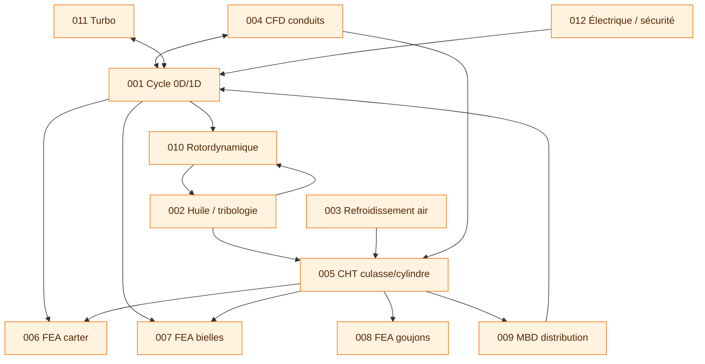

# F13 — cas solveurs classiques du moteur Porsche 917

## Résultat de cette phase

F13 transforme les faits publics actuellement traçables en **définitions de
cas**, pas en résultats. Le registre machine-readable
[`classical-solver-cases-f13.json`](../twins/reference-917-engine/classical-solver-cases-f13.json)
décrit douze études couplées, leurs entrées, unités, candidats sourcés,
inconnues bloquantes et portes de validation. Le validateur
[`validate_classical_solver_cases_f13.py`](../twins/reference-917-engine/source/validate_classical_solver_cases_f13.py)
interdit notamment :

- une valeur publique sans source locale de provenance ;
- une plage qui ne serait pas le min/max exact de points publiés ;
- l'interpolation silencieuse entre variantes historiques ;
- une entrée requise inconnue qui ne bloquerait pas le cas ;
- un seuil numérique de convergence ou d'acceptation non défini par le projet ;
- un résultat déclaré, l'exécution d'un solveur ou un entraînement PhysicsNeMo ;
- l'identification ou la mise à l'échelle du scan depuis sa seule cohérence
  visuelle.

État F13 : **spécification seulement**. Zéro calcul classique est exécuté,
zéro résultat est corrélé, aucune pièce n'est libérée pour fabrication et
`physicsnemo_training_authorized` reste `false`.

## Pourquoi les solveurs classiques passent avant PhysicsNeMo

PhysicsNeMo peut accélérer un champ CFD ou FEA déjà défini et représenté par un
jeu de données qualifié. Il ne peut pas retrouver les galeries internes,
l'alliage, une précharge, une carte turbo ou un plan de joint absents. La chaîne
de preuve est donc :

```mermaid
flowchart LR
    S[Scan brut<br/>identité et échelle non vérifiées]
    M[Métrologie / CT / dessins autorisés]
    C[CAO paramétrique<br/>interfaces et tolérances]
    R[Cas solveurs classiques F13]
    V[Vérification numérique<br/>maillage et convergence]
    B[Corrélation physique<br/>banc instrumenté]
    D[Dataset versionné<br/>splits, UQ et OOD]
    N[Surrogate PhysicsNeMo]
    O[Omniverse<br/>visualisation et orchestration]

    S --> M --> C --> R --> V --> B --> D --> N --> O
    S -. ne suffit pas .-> R
    R -. aucun résultat F13 .-> V

    classDef blocked fill:#fbe9e7,stroke:#c62828,color:#5d1010;
    class R,V,B,D,N blocked;
```



Omniverse reste la couche d'assemblage, de visualisation et d'orchestration. Il
ne remplace pas un solveur validé ni un banc.

## Scénarios séparés

### Baseline prioritaire : 917 5,0 L atmosphérique

Le scénario `SCENARIO-917-5L-NA` est un cas distinct et prioritaire. Les points
publiés par *auto motor und sport* sont conservés comme candidats :

| Quantité | Candidat publié | Usage F13 |
| --- | ---: | --- |
| Cylindrée | 4 999 cm³ | sélection de variante uniquement |
| Alésage | 86,8 mm | contrôle dimensionnel candidat |
| Course | 70,4 mm | contrôle dimensionnel candidat |
| Compression | 10,5:1 | entrée cycle candidate |
| Puissance | 630 PS | future cible de corrélation, pas condition limite |
| Régime de cette puissance | 8 300 tr/min | point documentaire, pas limite mécanique |

Le scan paraît provisoirement plus cohérent avec cette variante. Cette
observation ne confirme cependant **ni l'identité, ni l'échelle, ni la
géométrie interne**. Les trois champs restent explicitement `false` dans le
registre.

La matrice de recherche attribue un niveau B à cette source technique, tandis
que sa fiche `catalog/sources` actuelle porte C. F13 enregistre la divergence et
applique provisoirement le niveau le plus prudent, C. La classification devra
être harmonisée avant toute revue de preuve.

### Branches d'homologation FIA 4,494 et 4,907 L

La fiche d'homologation FIA officielle n° 250 apporte des valeurs primaires que
les sources secondaires précédentes ne donnaient pas. Elles restent strictement
attachées à leur branche :

| Quantité déclarée | 4 494,2 cm³ initial | Extension 1/1E, 4 907,28 cm³ |
| --- | ---: | ---: |
| Nombre de cylindres | 12, champ 131 | 12, héritage explicite de la fiche |
| Alésage × course | 85 × 66 mm | 86 × 70,4 mm |
| Axe de piston → calotte | 43 mm | non publié |
| Ø palier de maneton | 52 mm | non publié |
| Champ FIA art. 159 | 56 mm, libellé ambigu, hors entrée géométrique | non publié |
| Ø soupapes admission / échappement | 47,5 / 40,5 mm | non transféré |
| Vilebrequin | forgé assemblé | forgé monobloc, `912.102.031.00` |
| Masse vilebrequin | 23,75 ± 0,2 kg | non publiée |
| Masse d'une bielle | 0,42 ± 0,02 kg | non publiée |
| Masse piston + axe + segments | 0,46 ± 0,02 kg | non publiée |

La [fiche source](../catalog/sources/src-fia-917-homologation-250.json) enregistre
l'URL officielle, les pages, les droits et le SHA-256 du PDF sans redistribuer
le document. Ces valeurs enrichissent les contrôles de cohérence et les futures
campagnes F16, mais ne fournissent ni largeurs, jeux, coordonnées axiales,
tolérances de fabrication, ni autorité de transfert vers le 4 999 cm³ ou le
5 374 cm³ turbo. En particulier, le champ 159 à 56 mm n'est pas interprété
comme un diamètre de tête de bielle sans plan ou libellé primaire non ambigu.

### 917/30 turbo

Le 917/30 1973, le record 1975 et le claim de qualification à 1 600 hp sont
trois scénarios différents. Les puissances publiées de 1 100 PS, 1 200 PS,
1 230 PS et 1 600 hp ne sont pas fusionnées. Le dernier reste marqué
« reported » et n'est pas une cible de calibration. Les comptes de 12
cylindres sont enregistrés par variante, jamais comme un fait global. Le
compte de deux turbocompresseurs est relié directement à la page Porsche USA.
La configuration 1973 est sans échangeur d'air de suralimentation dans cette
chronologie ; la première utilisation documentée en 1975 forme une branche
séparée dont le nombre d'échangeurs, la géométrie, les cartes et même le compte
de turbocompresseurs restent inconnus. Les mentions historiques de pression de
suralimentation et de délai de réponse ne sont pas propres au record 1975 :
elles restent des faits documentaires et ne sont entrées dans aucun cas
solveur ni scénario 1973/1975/1 600 hp.

## Les douze cas de référence

| ID | Cas | Ce qui doit être acquis avant exécution |
| --- | --- | --- |
| F13-001 | Cycle moteur 0D/1D | carburant, loi de combustion ou pression cylindre, limites gaz, friction, levées et injection |
| F13-002 | Lubrification et tribologie | galeries, cartes des 1 + 6 pompes, huile, jeux, charges paliers, réservoir et désaération |
| F13-003 | Refroidissement par air | courbe pression-débit-rendement-régime, capotage/ailettes, fuites, ambiance, rejets thermiques |
| F13-004 | CFD admission/échappement | conduits internes étanches, sièges, levées, rugosité, limites et banc de débit |
| F13-005 | CHT culasse/cylindre | parois/ailettes, propriétés thermiques, flux combustion, air par cylindre, contacts et huile |
| F13-006 | FEA carter | CAO structurelle, vrai alliage moulé, contacts, précharges, charges paliers/goujons et cycle de vie |
| F13-007 | FEA bielles | entraxe et sections, axe/maneton, nuance/état titane, charges gaz/inertie, fatigue et procédé |
| F13-008 | FEA goujons | filetages/appuis, nuance Dilavar, précharge, interfaces et cycles thermiques |
| F13-009 | MBD distribution | profils de cames, masses/inerties, ressorts, jeux, contacts, phase engrenages et numérotation cylindres |
| F13-010 | Rotordynamique | vilebrequin/sortie/engrenages cotés, paliers, matériaux, inerties et excitations cylindre |
| F13-011 | Turbo | identité Eberspächer, cartes compresseur/turbine, roues/rotor/paliers, bypass, échangeurs et limites gaz |
| F13-012 | Électrique/allumage | netlist, modèles bobines/bougies/distributeurs, avance, alternateur, capteurs et interverrouillages |

Le registre porte les identifiants complets `CASE-917-F13-001` à
`CASE-917-F13-012`.

## Couplages à construire



Tous ces échanges sont `blocked` tant que l'amont n'a pas produit un artefact
versionné, convergé et accepté. Une variable copiée à la main n'est pas une
interface de preuve.

## Valeurs publiques et réserves conservées

F13 reprend les faits allemands déjà catalogués sans les promouvoir en cotes de
fabrication :

- 12 cylindres et angle publié de 180°, avec contradiction « V à 180° » versus
  « flat-12 » ; la cinématique boxer n'est pas prouvée ;
- alésages/courses des variantes 4,494 L, 4,907 L, 4,999 L et 5,374 L ; les enveloppes
  min/max servent à auditer la couverture, jamais à interpoler un moteur ;
- huit paliers principaux et sortie centrale, sans diamètres ni déports ;
- carter en famille magnésium moulé au sable, cylindres revêtus Nikasil, bielles
  en famille titane et goujons Dilavar, sans nuance/état/allowables ;
- 48 goujons, 149,5 mm, tige 9 mm et 65 g pour le moteur Porsche présenté pour
  1970 ; leur application au 917/30 reste non prouvée ;
- carter sec, une pompe de pression, six récupérations et 24 L annoncés, sans
  cartes de pompe ni géométrie de galeries ;
- 3 100 L/s annoncés pour le ventilateur, sans pression, régime, rendement ou
  distribution ; ce n'est qu'un point de sensibilité ;
- deux arbres à cames par rangée, deux soupapes et deux bougies par cylindre,
  sans profils, masses, raideurs ou avance ;
- deux turbos avec bypass ; modèle, dimensions et cartes inconnus ;
- 1,3 bar publié sans savoir s'il s'agit d'une pression absolue ou relative ;
- délai proche d'une seconde décrit historiquement, sans trace instrumentée.

Les diamètres de soupapes FIA 47,5/40,5 mm restent propres au 4,4942 L. Comme
les cas CFD F13 portent sur le 5,0 L et le 917/30 1973, leurs deux diamètres de
soupapes sont des inconnues bloquantes sans `candidate_ref`; la portée FIA ne
peut pas être réétiquetée par celle d'un cas. L'entraxe issu de kfz-tech reste
un contrôle de faible confiance. Aucun de ces éléments ne verrouille la CAO ou
un maillage.

## Les quatre portes de chaque cas

Chaque cas référence un profil contenant obligatoirement :

1. **maillage ou discrétisation** — domaine étanche, qualité, zones de
   raffinement et étude de pas ;
2. **convergence** — conservation, résidus/grandeurs intégrées et indépendance
   maillage/pas ;
3. **corrélation** — mesure physique, calibration, répétabilité et incertitude ;
4. **acceptation** — critères écrits et signés avant calcul, allowables et
   marges approuvés.

Les seuils numériques sont `null` avec un statut `*_required`. C'est une porte
de sécurité : les inventer maintenant donnerait un faux signal de maturité.

## Banc et instrumentation

La publication de Herrmann Motorenentwicklung fournit une architecture de banc
utile, sans séries numériques réutilisables : EGT et température de culasse par
cylindre, arrêt automatique rapide et cartographie du besoin en carburant. F13
les transforme en exigences d'acquisition et de sécurité, pas en données de
corrélation.

Avant une mise en rotation motorisée, il faudra au minimum une analyse de
risques signée, des blindages, une chaîne d'arrêt indépendante, une surveillance
huile/incendie/surrégime et une matrice d'interverrouillages testée par injection
de défaut. F13 n'autorise pas cet essai.

## Transition éventuelle vers PhysicsNeMo

La découverte dans le dépôt officiel PhysicsNeMo confirme plusieurs familles
possibles, à sélectionner plus tard selon la forme des données :

- [DoMINO](https://github.com/NVIDIA/physicsnemo/tree/v2.2.1/physicsnemo/models/domino)
  pour des géométries et champs CFD ;
- [GeoTransolver](https://github.com/NVIDIA/physicsnemo/tree/v2.2.1/physicsnemo/models/geotransolver)
  pour points ou maillages non structurés ;
- [MeshGraphNet](https://github.com/NVIDIA/physicsnemo/tree/v2.2.1/physicsnemo/models/meshgraphnet)
  pour graphes de maillage, notamment transitoires.

Cette liste est un menu de découverte, pas un choix de modèle. L'entraînement
reste interdit tant que les douze cas classiques ne sont pas vérifiés, convergés
et corrélés, puis convertis en dataset avec splits sans fuite, UQ, tests hors
distribution et règle d'abstention.

## Validation locale

Depuis la racine du dépôt :

```bash
python3 twins/reference-917-engine/source/validate_classical_solver_cases_f13.py \
  --project-root . \
  --registry twins/reference-917-engine/classical-solver-cases-f13.json

python3 -m unittest discover -s tests -p 'test_917_classical_solver_cases_f13.py'
```

Ces commandes valident le **contrat F13**, pas la physique du moteur.
