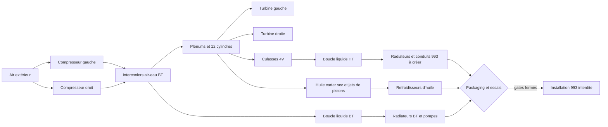
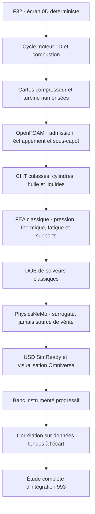

# Flat-12 917-inspired 2026 — cible 1 600 hp et intégration 993 (F32)

> **Statut d'architecture : décision historique remplacée.** Le candidat
> hybride ci-dessous documente la décision F32, mais il n'est plus la référence
> active. F34a sélectionne un cœur moteur strictement air/huile ; les liquides
> auxiliaires restent isolés du cœur et limités au refroidissement de charge et,
> si nécessaire, des CHRA. Voir
> [F34a](917_AIR_OIL_CORE_CONTROLS_F34A.md).

## Décision

La 993 d'origine n'est pas refroidie par liquide : son flat-six est refroidi par
air et par huile. F32 ne réécrit pas ce fait historique. Il définit un nouveau
flat-12 biturbo de 2026, destiné d'abord au banc puis, seulement après
validation, à une coque de 911 type 993.

Le candidat de référence pour l'étude suivante est hybride :

- cylindres conservant ailettes, air forcé, jets d'huile et carter sec ;
- culasses quatre soupapes et paliers de turbos refroidis par un circuit liquide
  haute température dédié ;
- deux échangeurs air-eau sur un circuit basse température séparé ;
- refroidissement d'huile indépendant.

Une variante sans liquide demeure dans le modèle : moteur air/huile et
échangeurs air-air. Avec les hypothèses F32, elle dépasse les limites provisoires
des boucles huile et air d'ailettes. Ce résultat oriente le design ; il ne prouve
pas qu'un circuit hybride fonctionne ni qu'un circuit air/huile est impossible.
La charge des paliers de turbos et leur hot-soak n'est pas encore disponible :
le criblage hybride reste donc incomplet même pour ses propres seuils.

Porsche qualifie officiellement la 993 de dernière 911 refroidie par air. Porsche
explique également que la montée en puissance et l'adoption de quatre soupapes
ont conduit à des culasses refroidies par eau après l'échec thermique d'une
culasse expérimentale quatre soupapes refroidie par air. Ces éléments justifient
le comparatif, sans fournir les charges thermiques de notre moteur :

- [Porsche : la 993, apogée de l'ère refroidie par air](https://newsroom.porsche.com/de/historie/porsche-911-sieben-generationen-teil-4-typ-993-16456.html)
- [Porsche : passage des culasses 4V à l'eau](https://newsroom.porsche.com/de/2024/produkte/porsche-911-carrera-gts-antrieb-technologie-christophorus-411-36731.html)
- [Porsche PET 993, refroidissement air/huile et guidage d'air](https://files.porsche.com/f/332100/db8e7dba1c/kat017-d-911-98-katalog.pdf)

## Point de calcul F32

Le moteur est un concept clean-sheet, pas une réplique historique. L'alésage et
la course `90,0 × 70,4 mm` sont un seed d'architecture, jamais une cote mesurée
ou verrouillée. Le point nominal est :

F32 référence aussi la campagne EF de culasse F31, sans en transférer les
résultats comme limites moteur. Cette campagne porte sur un deck défeaturé de
22 mm, avec charges et températures de criblage non corrélées ; elle ne contient
ni culasse fonctionnelle complète, ni CHT, ni preuve à 1 600 hp. Son contrat reste
`twins/reference-917-engine/head-reference-cae-f31.json`.

| Grandeur | Résultat algébrique |
| --- | ---: |
| Architecture | flat-12, quatre temps, 4V/cylindre, biturbo |
| Cylindrée calculée | 5,374385 l |
| Cible | 1 600 mechanical hp = 1 193,119795 kW |
| Régime de dimensionnement | 9 000 tr/min |
| Couple requis | 1 265,939 N·m |
| BMEP requis | 29,600 bar |
| Vitesse moyenne du piston | 21,120 m/s |
| Débit d'air hypothétique | 1,219659 kg/s, soit 0,609830 kg/s/turbo |
| Débit carburant hypothétique | 0,110878 kg/s |
| Rapport de pression compresseur requis | 3,200897 |
| Puissance compresseur totale | 192,145 kW |
| Chaleur échangeurs de suralimentation | 159,234 kW |

Les entrées de débit sont des hypothèses de dimensionnement essence : BSFC
`0,55 lb/(hp·h)`, AFR `11`, rendement volumétrique `1,00`, température plénum
`325 K` et rendement compresseur `0,75`. La méthode suit les équations de
sélection publiées par Garrett, mais aucune carte compresseur ou turbine n'est
encore numérisée :

- [Garrett : calculs de sélection d'un turbocompresseur](https://www.garrettmotion.com/knowledge-center-category/racing-and-performance/how-to-select-a-turbo-part-2-understanding-calculations-to-turbo-any-engine/)
- [Garrett Performance Catalog 2024](https://www.garrettmotion.com/wp-content/uploads/2024/10/Garrett_Performance_Catalog_10232024.pdf)

La paire `G35-1050` est donc une shortlist de capacité, pas un choix validé.
Avant de retenir un turbo, il faut numériser les cartes, contrôler débit corrigé,
rendement, surge, choke, vitesse d'arbre, puissance turbine, contre-pression et
température sur toute l'enveloppe.

## Bilan thermique comparatif

F32 calcule la puissance chimique à partir d'un LHV hypothétique de `43 MJ/kg`,
puis ferme arithmétiquement un partage énergétique déclaré en affectant le
reliquat à l'échappement. Ce n'est ni un bilan d'enthalpie échappement/turbine,
ni un bilan de puissance d'arbre turbo. Les fractions de chaleur
sont des variables de DOE, pas des résultats CHT ni des mesures de banc.

| Charge nominale | Hybride | Air/huile sans liquide |
| --- | ---: | ---: |
| Culasses, boucle liquide HT | ≈ 668 kW | 0 kW |
| Paliers de turbos et hot-soak | inconnue, donc criblage incomplet | méthode et charge inconnues |
| Intercoolers | ≈ 159 kW, boucle liquide BT | ≈ 159 kW, air-air |
| Huile | ≈ 286 kW | ≈ 520 kW |
| Air d'ailettes cylindres/culasses | ≈ 191 kW | ≈ 625 kW |

Les débits massiques calculés pour l'hybride sont eux aussi des exigences de
dimensionnement : environ `12,4 kg/s` pour la boucle culasses avec `ΔT=15 K`,
`3,5 kg/s` pour la boucle intercoolers avec `ΔT=12 K`, et `5,5 kg/s` d'huile
avec `ΔT=25 K`. Leur ampleur rend le packaging 993 critique : radiateurs,
écopes, conduits, pompes, réservoirs et purge doivent être mesurés, modélisés et
essayés. Le débit liquide des paliers de turbos n'est pas calculé. Aucun volume
disponible n'est actuellement renseigné.



## Frontière de preuve

Le modèle ferme les identités puissance/couple/BMEP, le débit à partir du BSFC
et de l'AFR, la compression idéale corrigée par un rendement, et un bilan
énergétique hypothétique. Il ne prouve pas :

- le rendement réel, la combustion, le cliquetis ou la durée à 1 600 hp ;
- l'adéquation des turbos ni leur vitesse ou leur durabilité ;
- les températures métal, gradients, contraintes, fatigue ou déformations ;
- les débits réels de liquide, huile et air dans les pièces ;
- la capacité des radiateurs dans une carrosserie 993 ;
- la masse, le centre de gravité, les supports, la boîte, les freins ou la
  légalité de la conversion ;
- l'imprimabilité ou l'autorisation de fabriquer une pièce moteur.

Tous les gates de démarrage, 1 600 hp, fabrication, impression métal et montage
véhicule restent donc à `false`.

Avant F33, il faut aussi figer ce que signifie réellement la cible : puissance
nette ou brute et accessoires inclus, carburant certifié, durée à 1 600 hp,
puissance continue, température, altitude et vitesse véhicule. Le point F32
est volontairement invalide pour une libération tant que ces champs restent
vides.

## Chaîne de validation suivante



La stack de référence sera gratuite et reproductible : Cantera stable pour la
thermochimie et le modèle de cycle, OpenFOAM 14 pour CFD/CHT, un solveur FEA
classique libre à verrouiller après benchmark, Gmsh pour le maillage,
PhysicsNeMo après production de données validées, et OpenUSD/Omniverse pour la
composition et l'inspection. Omniverse ne remplace aucun solveur physique.

## Reproduction

```bash
make 917-clean-sheet-2026-f32
make 917-clean-sheet-2026-f32-check
python3 -m unittest discover -s tests -p 'test_917_clean_sheet_2026_f32.py' -v
```

Le rapport suivi est
`twins/reference-917-engine/evidence/f32/screening-report.json`. Le rapport
local sous `work/` est reproductible mais non suivi.
