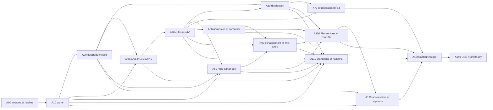
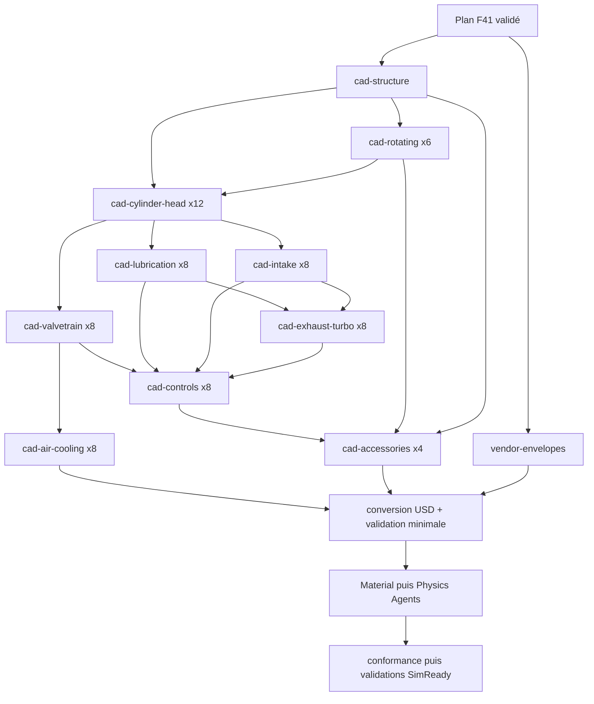

# F41 — usine de composants du flat-12 917 modernisé

F41 transforme les contrats F1, F34, F35 et F37 en un plan de production
parallèle et traçable. Le moteur cible est sans ambiguïté un **12 cylindres à
plat**, deux bancs de six cylindres. La culasse 2026 est une hypothèse à quatre
soupapes par cylindre, soit **48 soupapes** : 24 admission et 24 échappement.

F41 a deux modes distincts. Le planificateur produit la nomenclature, les
occurrences, le graphe d'assemblage et les lots de travail sans géométrie. Le
runner exécutable matérialise seulement les six familles F35 dont le contrat,
le générateur et le module mathématique sont tous liés par SHA-256. Les 132
autres familles sont
marquées `blocked_missing_measurements_or_source` : aucun proxy trompeur n'est
créé. Le résultat d'essai local antérieur n'est ni versionné ni publié et ne
vaut pas preuve d'exécution de la configuration actuelle à six familles. Toute
sortie future restera une graine de recherche, pas une pièce fabricable ni un
moteur complet.

## Résultat du registre

| Élément | Résultat F41 |
|---|---:|
| Familles inventoriées | 138 |
| Familles générables avec les sources présentes | 6 |
| Familles avec preuve versionnée du run actuel | 0 |
| Familles bloquées faute de mesures ou de source | 132 |
| Occurrences topologiques connues | 1 265 |
| Occurrences couvertes si les six graines sont générées | 81 |
| Familles dont la quantité reste inconnue | 9 |
| Familles documentaires | 28 |
| Familles de conception 2026 | 100 |
| Familles classées inconnues | 10 |
| Familles avec géométrie mesurée et libérée | 0 |
| Sorties STEP / STL / 3MF / USD attendues après un run réussi | 6 / 6 / 6 / 6 |
| Soupapes | 48 |
| Pistons / bielles / cylindres / culasses | 12 / 12 / 12 / 12 |
| Turbocompresseurs | 2 |

Les 1 265 occurrences comprennent les pièces répétées : ressorts doubles,
demi-clavettes, goujons, joints, capteurs, injection étagée, double allumage,
éléments de turbo, huile et refroidissement par air. Ce total n'est pas une
preuve qu'aucune vis ne manque. Neuf familles restent volontairement sans
quantité : boulonnerie de carter, pions, chapeaux de paliers d'arbres à cames,
conduites/raccords, V-bands, connectique et quincaillerie. Une dixième famille,
l'adaptateur de transmission, a une occurrence mais une interface inconnue.

## Sources réutilisées, sans transfert abusif

- F35 fournit uniquement six graines paramétriques de recherche : vilebrequin,
  paire de paliers principaux, bielle, piston, axe et segment.
- F34 reste une référence historique de procédé pour planifier la famille
  culasse. Sa géométrie n'est ni exécutable par F41 ni incluse dans son bundle
  public; elle ne prouve aucune identité dimensionnelle 917.
- Le générateur F1 deux soupapes reste une référence topologique. F41 interdit
  son exécution comme géométrie moderne quatre soupapes.
- F37 fournit la frontière d'assemblage sémantique. Il n'autorise aucun joint
  physique, collision, masse, volume CFD ou preuve de puissance.

## Graphe d'assemblage



Il s'agit d'un DAG de dépendances de définition. Ce n'est pas encore un
assemblage contraint : zéro joint PhysX, zéro collision, zéro masse et zéro
inertie sont autorisés tant que les interfaces ne sont pas mesurées ou validées.

## Planification et exécution locale

Validation seule :

```bash
python3 twins/reference-917-engine/source/build_component_factory_f41.py \
  --validate-only
```

Génération déterministe des manifestes uniquement :

```bash
make 917-component-factory-f41-plan
```

Cette commande écrit exactement :

- `generation-report.json` ;
- `bom-occurrences.json` avec les 1 265 occurrences connues ;
- `assembly-dag.json` ;
- `vast-jobs.json` ;
- 138 fichiers `family-plans/<family>.json`.

Elle n'écrit aucun STEP, 3MF, STL ou USD. Le rapport conserve donc les cinq
compteurs de géométrie à zéro. Les familles CAO indiquent seulement les sorties
attendues : maître build123d/FreeCAD éditable, STEP neutre, 3MF de prototype,
STL d'affichage et USD. Les pièces achetées reçoivent un plan d'enveloppe
fournisseur STEP/USD; leur 3MF/STL est explicitement interdit.

Prévol des deux runtimes immuables référencés, s'ils sont présents localement :

```bash
make 917-component-factory-f41-preflight
```

Exécution complète :

```bash
make 917-component-factory-f41
```

Le wrapper refuse de télécharger implicitement une image, coupe le réseau,
impose `linux/amd64`, vérifie les `RepoDigests`, monte le dépôt en lecture seule
et refuse d'écraser une sortie existante. Les images exigées sont exactement :

```text
ghcr.io/cluster2600/3dprinting993-cad-author-f28@sha256:18dbfa559306a31c909480695acf0e89a9bc904c83d280065c1d9d29036fec57
ghcr.io/cluster2600/3dprinting993-simready-workflow@sha256:41ddde8e527fcc17a3f29ac90183bd1326c330388240baf2004f99de980d6ebe
```

Le premier conteneur régénère uniquement les six familles F35. Le second
convertit chaque STEP en USD et
vérifie qu'il s'ouvre avec OpenUSD, avec axe et unité lisibles, sans schéma
PhysX inventé. Les artefacts sont rangés sous :

```text
work/917-component-factory-f41-execution/artifacts/<family>/step/*.step
work/917-component-factory-f41-execution/artifacts/<family>/stl/*.stl
work/917-component-factory-f41-execution/artifacts/<family>/3mf/*.3mf
work/917-component-factory-f41-execution/artifacts/<family>/usd/*.usd
```

`factory-final-report.json` sépare explicitement `planned`, `generateable`,
`generated` et `blocked`. Les six familles autorisées sont :
vilebrequin, paire de paliers principaux, bielle, piston, axe de piston,
segment. Les 81 occurrences couvertes correspondent à
1 + 8 + 12 + 12 + 12 + 36 occurrences; ce nombre n'est pas 81 modèles
dimensionnels indépendants.

## Bundle public transférable à Vast

```bash
make 917-component-factory-f41-bundle
```

Cette cible produit l'archive déterministe
`work/917-component-factory-f41-bundle/917-component-factory-f41-public.tar.gz`
et son `bundle-manifest.json`. Le builder refuse tout dépôt contenant une
modification suivie ou un fichier non suivi. Il exige que `HEAD` soit visible
au même SHA sur une branche distante vérifiée par `git ls-remote`, puis lit
chaque payload depuis ce commit avec `git show` plutôt que depuis le worktree.
L'archive est construite par allowlist, contient uniquement du texte UTF-8 et
n'inclut ni scan brut, ni géométrie, ni chemin privé absolu, ni secret. Sa
racine est `917-component-factory-f41/`; son manifeste embarqué
`BUNDLE-MANIFEST.json` consigne `source_revision` et les
`public_remote_refs` vérifiées.

Il faut donc d'abord faire revoir, committer et publier les fichiers F41 via le
workflow Git approuvé. Le builder bloque volontairement un essai depuis ce
worktree tant que ces conditions ne sont pas remplies.

Dans le conteneur CAO Vast, après extraction du bundle :

```bash
export F41_RUNTIME_IMAGE_REF='ghcr.io/cluster2600/3dprinting993-cad-author-f28@sha256:18dbfa559306a31c909480695acf0e89a9bc904c83d280065c1d9d29036fec57'
bash twins/reference-917-engine/source/run_component_factory_f41_cad_job.sh /workspace/output
```

Après transfert du même dossier `output` vers le runtime USD :

```bash
export F41_RUNTIME_IMAGE_REF='ghcr.io/cluster2600/3dprinting993-simready-workflow@sha256:41ddde8e527fcc17a3f29ac90183bd1326c330388240baf2004f99de980d6ebe'
bash twins/reference-917-engine/source/run_component_factory_f41_usd_job.sh /workspace/output
python twins/reference-917-engine/source/execute_component_factory_f41.py finalize \
  --project-root . --output /workspace/output
```

Ces commandes ne louent aucune machine et ne récupèrent aucune clé. Le transfert,
le lancement Vast et la récupération des résultats restent des opérations
séparées et explicitement autorisées.

La première qualification réussie du runtime C59 et du lot borné à six graines
F35 est documentée dans
[`917_COMPONENT_FACTORY_F41_VAST_RUNTIME.md`](917_COMPONENT_FACTORY_F41_VAST_RUNTIME.md).
Elle valide le transport et ce lot précis, pas la géométrie moteur, les 132
familles bloquées, la simulation ou la fabrication.

## Lots parallèles pour la machine Vast à 384 CPU



La machine 384 CPU peut exécuter la planification, la génération F35, les
exports STEP/STL/3MF, les contrôles de hash et la conversion USD. Les dix lots
`cpu_cad` et le lot `cpu_vendor_envelope` du DAG sont parallélisables quand
leurs mesures ou modèles fournisseurs seront disponibles. Les maîtres
répétitifs sont calculés une seule fois par famille puis instanciés : 1 265
occurrences ne signifient pas 1 265 exports OCCT. Le runner de référence traite
encore les six graines séquentiellement pour conserver un échec fermé simple;
OCCT n'occupera donc pas 384 cœurs en continu. Le GPU RTX 3060 Ti n'est pas
nécessaire pour écrire les STEP ou les USD minimaux.

Un très gros GPU n'est justifié qu'après les sorties CAO et la validation USD :
déploiement local éventuel des Content Agents, rendu haute fidélité, CFD lourd
ou entraînement PhysicsNeMo sur un jeu de données déjà validé. F41 ne fixe pas
de seuil VRAM avant de disposer d'un workload et d'un benchmark reproductible;
le GPU 8 Go de l'offre CPU n'est pas présenté comme suffisant. Une deuxième
machine ne doit être louée qu'au moment de cette étape, avec une image immuable
vérifiée et un arrêt après récupération des artefacts.

## Ordre USD / Omniverse

Le handoff suit le workflow CAD vers SimReady : prévol, disponibilité des
Content Agents, conversion USD, validation USD minimale, Material Agent,
Physics Agent, conformance, puis validations asset/géométrie/physique/profil.
Un `NVIDIA_API_KEY` n'est requis que si les services Content Agents doivent être
déployés localement; il ne sert pas à la génération CPU des STEP.

## Pistons et bielles additifs

F41 réserve quatre études séparées : treillis sous calotte, galerie fermée de
refroidissement du piston, bielle ajourée/treillis et canal d'huile interne de
bielle. Aucune de ces fonctions n'est dessinée avant l'obtention des traces de
charge, conditions thermiques, cartes matière-procédé, stratégie d'évacuation
de poudre, traitement/HIP, usinage, fatigue et plan CT/NDT. Les candidats
titane et aluminium LPBF restent des routes comparatives, pas des pièces
imprimables.

## Gates

Tous les gates restent faux : quantités complètes, métrologie, cotes,
tolérances, matériaux, STEP/3MF/USD, interférences, huile, refroidissement,
combustion, suralimentation, fatigue, corrélation flowbench/dyno, revue
professionnelle, impression métal, démarrage, intégration 993 et 1 600 ch.
