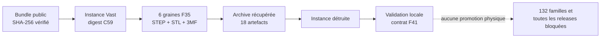

# F41 — qualification runtime Vast C59

Le digest C59 de l'image CPU/CAO F41 a terminé une exécution Vast supervisée le
3 septembre 2026. La preuve canonique est
[`f41-vast-runtime-c59-attempt-1/`](../twins/reference-917-engine/evidence/f41-vast-runtime-c59-attempt-1/README.md).

## Portée acquise

- transport SSH/SCP supervisé avec l'image immuable C59 ;
- exécution du lot `f41-c59-20260903t025511z` ;
- génération et validation d'intégrité de six familles de graines F35 ;
- 6 STEP, 6 STL et 6 fichiers 3MF vérifiés ;
- récupération avant destruction, destruction confirmée puis validation locale.

Le statut `vast_runtime_qualified` est limité à ce runtime et
`f41_batch_qualified` à ce lot de six familles. Il ne qualifie ni les 132
familles bloquées, ni la géométrie moteur, ni une pièce de production.

## Étape suivante

La prochaine étape calculable est un lot séparé de conversion USD minimale et
de contrôle Omniverse. Elle exige d'abord une image GPU immuable corrigée,
publiée puis qualifiée sur Vast : le pilote antérieur n'a pas qualifié son
image. L'affectation des matériaux, les propriétés PhysX et PhysicsNeMo restent
bloqués jusqu'à disposer de données traçables et de critères de validation
adaptés.

Toutes les gates dimensionnelles, physiques, de simulation, de corrélation,
de 1 600 ch, de démarrage et de fabrication restent fermées.
