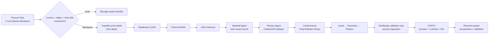

# F42b — enrichissement GPU strict des six USD canoniques

F42b enrichit **exactement** les six USD privés et reproductibles produits par
F42a. Le lot ajoute un look visuel sourcé, des colliders statiques de diagnostic,
les quatre validateurs NVIDIA et des rendus OVRTX. Il ne lance aucune simulation
et n'autorise ni fabrication, ni installation, ni revendication de performance.

Le contrat exécutable est
`twins/reference-917-engine/component-factory-f42b-gpu.json`. À sa création,
`runtime.qualified_image_ref` vaut `null` et le statut runtime reste `pending` :
le transfert distant est donc volontairement bloqué avant toute garde SSH ou
location utile. Une simple édition du contrat ne suffit pas : la qualification
doit ajouter la preuve Git
`twins/reference-917-engine/evidence/f42b-gpu-runtime-qualification.json`
(run GitHub, commit, manifeste `linux/amd64`, visibilité publique, pull anonyme
du digest exact et smoke runtime), puis synchroniser le digest littéral
`SIMREADY_IMAGE` du wrapper OpenBao sans le laisser dans la denylist. Le contrat,
la preuve hashée et ce pin exact sont vérifiés ensemble avant tout transfert.

## Chaîne fermée



Les phases sont séquentielles par famille. Une sortie existante refuse une
relance sous le même `run-id`; un nouveau run doit employer un nouvel identifiant
de job, pas écraser une preuve précédente.

Chaque phase préfixe le répertoire de `USD_PYTHON` dans son `PATH` et exporte
`PYTHONDONTWRITEBYTECODE=1`. Ce contrat est nécessaire en SSH batch : il rend le
CLI `simready-validate` installé visible au prévol et empêche Python d'ajouter des
`__pycache__` dans le skill transféré après le calcul de son empreinte.

## Entrées F42a exactes

| Famille | Taille | SHA-256 | `defaultPrim` |
|---|---:|---|---|
| `connecting_rod` | 22 222 | `f995b603ec6d6b467e87b2ad26913e402b864bee10736fca16a65612260d1ec8` | `/connecting_rod` |
| `crankshaft` | 40 439 | `20be6e2ff0afe25bde546148833d51d7546a7e50d9abe75e963808c472292cf1` | `/crankshaft` |
| `main_bearing_pair` | 15 091 | `aaa12a2eb966a506be21f9f44733dac3edb4c5d399441a2d9a8fbfd44b657a33` | `/main_bearing_pair` |
| `piston` | 65 639 | `95a4c5ef57c87af25e12a5784ced63c6fd88b3199f86213903ad2e03d05506df` | `/piston` |
| `piston_pin` | 11 219 | `fefe43fdabd8b7eea63bf7b8e191f02eac2f4be28c538c644f76a63da526934d` | `/piston_pin` |
| `piston_ring` | 12 156 | `a0f7bba825e4e3f9e3faae2d1318584d99ab836da0d224ab35039b4c0a7a1aa3` | `/piston_ring` |

Le total est de 166 766 octets. Le transfert refuse un septième USD, un fichier
manquant, une taille ou une empreinte différente, un lien symbolique et tout
fichier spécial. Les fichiers sont copiés vers
`/workspace/jobs/<job>/inputs/f42a-usd/`; aucun USD, STEP, log ou archive privé
n'entre dans Git.

## Matériaux : trois notions distinctes

| Famille | Look visuel F7 | Contexte historique | Propriétés PhysX |
|---|---|---|---|
| `connecting_rod` | `titanium` | titane forgé documenté pour une variante, nuance/process non qualifiés | inconnues |
| `crankshaft` | `steel` | forge documentée, famille d'alliage non qualifiée par source primaire | inconnues |
| `main_bearing_pair` | `steel` | inconnue | inconnues |
| `piston` | `light_alloy` | alliage léger documenté pour la variante FIA, nuance/process non qualifiés | inconnues |
| `piston_pin` | `steel` | inconnue | inconnues |
| `piston_ring` | `steel` | inconnue | inconnues |

Les looks viennent de la palette F7 et restent des hypothèses visuelles. Ils ne
deviennent pas une identification métallurgique. Densité, friction statique ou
dynamique et restitution restent toutes `null`; le pipeline refuse qu'elles
soient authorées sans preuve. Les six USD F42a contiennent déjà les bindings
all-purpose générés par le convertisseur sur leurs seuls `Mesh`; le gate minimum
les conserve parce que les fichiers sont liés à leur hash exact, tout en
refusant les bindings purpose/collection ou placés sur d'autres prims. Le
Material Agent produit un diagnostic conservé, mais sa sortie USD libre n'entre
jamais dans la chaîne : le pipeline repart de l'USD minimum et remplace ces
bindings afin que leur seule cible active soit le `UsdPreviewSurface` canonique
issu de F7, avec un binding all-purpose par `Mesh`, aucun purpose/collection
alternatif et aucune connexion shader non contractuelle. Les anciens prims
`Looks` du convertisseur restent inertes afin de ne supprimer aucun prim du USD
F42a attesté; aucun `Mesh` ne peut encore pointer vers eux après le gate Material.

## Sous-ensemble PhysX autorisé

Le seul enrichissement physique admis est `UsdPhysics.CollisionAPI`, appliqué
avec `physics:collisionEnabled=true` aux `Mesh` déjà présents.
`UsdPhysics.MeshCollisionAPI` est omis de ce profil déterministe : aucune
approximation ou géométrie proxy n'est fabriquée.
La sortie libre du Physics Agent reste elle aussi diagnostique; `CollisionAPI`
est authorée sur une copie du stage matériel contractuel.
L'audit compare après chaque agent, puis après conformance et validation :

- le `defaultPrim`, les chemins et types géométriques ;
- les attributs de géométrie, leurs échantillons temporels et les transforms ;
- la présence d'un binding matériel effectif sur chaque `Mesh` ;
- la présence d'un collider sur chaque `Mesh` au gate physique/final ;
- l'absence de schéma ou propriété dynamique, de masse et de charge.

Sont interdits : nouvelle géométrie de collision, rigid body, articulation,
joint, drive, masse, densité, inertie, friction, restitution, vitesse, force,
couple, time stepping et prédiction de contact. Aucune FEA, CFD, thermique,
fatigue ou simulation PhysicsNeMo n'est exécutée. Un collider valide seulement
une représentation statique diagnostique, jamais une résistance ou un
comportement réel.

## Préconditions avant Vast

Toutes les conditions suivantes sont bloquantes :

1. les nouveaux fichiers F42b sont suivis, committés et identiques à `HEAD` ;
2. le digest public `linux/amd64` de l'image locale-IA est qualifié, puis le
   contrat porte exactement ce `qualified_image_ref` et le statut
   `qualified_public_linux_amd64_digest` ;
3. `openbao-ghcr attest-simready-runtime` produit juste avant le transfert une
   attestation `0600` : le wrapper suivi par Git vérifie publiquement le run,
   son commit et ses étapes publication/manifeste/pull anonyme/promotion, puis
   l'identité du manifeste GHCR `linux/amd64` exact ;
4. l'image passée au wrapper est exactement ce digest, jamais un tag ;
5. l'arbre privé F42a contient uniquement les six chemins
   `pipeline/01_conversion/<famille>/<famille>.usd` attestés ci-dessus ;
6. le skill NVIDIA explicite et les deux prompts sans secret sont disponibles ;
7. l'unique instance, le GPU complet, le coût réel, le disque, SSH et le marqueur
   `/workspace/READY` satisfont les gates du runbook natif.

Le point 2 n'est pas satisfait par le contrat initial. Il est donc impossible
d'utiliser accidentellement ces commandes pour louer avec une image non
qualifiée.

## Incident Job D : profils SimReady non chargés

Le pilote `f42b-917-20260903d` a atteint la validation SimReady, mais le skill
NVIDIA transféré n'a pas ajouté `--profiles-path` à la commande
`simready-validate`. Sa branche compatible avec le CLI `2026.6.5` cherchait le
fichier unique `profiles/profiles.toml`, absent du commit SimReady Foundation
épinglé `0ed0dfbc539c9de99289771bd6848effe3ef5779`. Ce commit fournit plusieurs
fichiers TOML dans le répertoire `profiles/`; le CLI accepte précisément un
répertoire ou un fichier. Le résultat Job D (`available_profiles=[]` puis
`Profile 'Prop-Robotics-Physx' (version 1.0.0) is not registered`) est donc un
blocage d'orchestration, pas un constat sur la géométrie.

Le patch minimal versionné est
`deploy/vast/simready/patches/nvidia-simready-profiles-directory.patch`. Il ne
modifie qu'une ligne du script du skill : la cible devient le répertoire
`profiles`. Un essai diagnostique sur la même bielle et le même runtime a alors
chargé `Prop-Robotics-Physx@1.0.0` et produit les constats structurés
`com.nvidia.simready.GSP.001` et `com.nvidia.simready.NP.005`. Ces constats
restent des `needs_rerun`; ils ne justifient ni grasp point, ni masse, ni
géométrie inventés.

Ne jamais modifier le skill installé ni le bundle Job D déjà attesté. Préserver
Job D, créer une copie privée temporaire, lui appliquer le patch, puis utiliser
un nouvel identifiant de job afin que le manifeste de transfert atteste l'arbre
réellement exécuté :

```bash
REPOSITORY_ROOT=/chemin/vers/3dprinting993
INSTALLED_SKILL_ROOT=/chemin/explicite/vers/omniverse-cad-to-simready
PROFILE_PATCH="${REPOSITORY_ROOT}/deploy/vast/simready/patches/nvidia-simready-profiles-directory.patch"
PATCHED_SKILL_PARENT="$(mktemp -d /tmp/917-simready-skill-XXXXXX)"
chmod 700 "${PATCHED_SKILL_PARENT}"
PATCHED_SKILL_ROOT="${PATCHED_SKILL_PARENT}/omniverse-cad-to-simready"
mkdir "${PATCHED_SKILL_ROOT}"
rsync -a -- "${INSTALLED_SKILL_ROOT}/" "${PATCHED_SKILL_ROOT}/"
/usr/bin/patch -N -s -p1 -d "${PATCHED_SKILL_ROOT}" < "${PROFILE_PATCH}"

grep -F 'profiles = foundation_spec_root / "profiles"' \
  "${PATCHED_SKILL_ROOT}/references/simready-validate/scripts/run.py"
! grep -F 'profiles = foundation_spec_root / "profiles" / "profiles.toml"' \
  "${PATCHED_SKILL_ROOT}/references/simready-validate/scripts/run.py"

SKILL_ROOT="${PATCHED_SKILL_ROOT}"
JOB_ID=f42b-917-<nouvel-identifiant>
```

La copie doit rester disponible jusqu'à la fin de
`transfer-f42b-job.sh`; ce transfert calcule son propre manifeste du skill et
refuse ensuite toute mutation distante du bundle.

## Transfert privé dédié

Après le lancement et les contrôles décrits dans
`archive/917/docs/917_VAST_SIMREADY_NATIVE.md`, définir uniquement des chemins locaux, sans
mettre leur contenu dans la ligne de commande :

```bash
F42A_OUTPUT_ROOT=/chemin/prive/vers/le/resultat/f42a
SKILL_ROOT=/chemin/explicite/vers/omniverse-cad-to-simready
MATERIAL_PROMPT=/chemin/prive/vers/material-prompt.txt
PHYSICS_PROMPT=/chemin/prive/vers/physics-prompt.txt

deploy/vast/simready/transfer-f42b-job.sh \
  --instance-id "${INSTANCE_ID}" \
  --expected-image "${EXPECTED_IMAGE}" \
  --job-id "${JOB_ID}" \
  --skill-root "${SKILL_ROOT}" \
  --material-prompt "${MATERIAL_PROMPT}" \
  --physics-prompt "${PHYSICS_PROMPT}" \
  --f42a-output-root "${F42A_OUTPUT_ROOT}" \
  --max-actual-dph "${MAX_ACTUAL_DPH}" \
  --max-runtime-minutes 180 \
  --control-root "${CONTROL_ROOT}" \
  --known-hosts "${CONTROL_ROOT}/known_hosts"
```

Le transfert génère lui-même le reçu runtime public et privé associé au
`JOB_ID`, avec un nonce neuf, puis le vérifie avant la garde réseau. Il ne prend
donc aucun chemin `--runtime-attestation` fourni par l'appelant.

Les prompts ne doivent demander que le look visuel contractuel, puis les
colliders statiques. Toute instruction de fabriquer une valeur manquante ou
d'ajouter dynamique, masse, joint, grasp point, force ou simulation sera de
toute façon arrêtée par l'audit de sortie.

## Exécution distante séquentielle

Préparer la connexion bornée comme dans le runbook natif, puis :

```bash
PROJECT_ROOT="/workspace/jobs/${JOB_ID}/project"
SKILL_REMOTE="/workspace/jobs/${JOB_ID}/vendor/omniverse-cad-to-simready"
CONTROL_REMOTE="/workspace/jobs/${JOB_ID}/control/job-control.json"
OUTPUT_ROOT="/workspace/results/${JOB_ID}"
PHASES="${PROJECT_ROOT}/twins/reference-917-engine/remote-simready"
F42B_PHASES="${PHASES}/f42b"
COMMON_JOB="--project-root ${PROJECT_ROOT} --output-root ${OUTPUT_ROOT} --run-id ${JOB_ID} --control ${CONTROL_REMOTE}"

"${SSH[@]}" "export SIMREADY_SKILL_ROOT='${SKILL_REMOTE}'; '${PHASES}/phase-readiness.sh' ${COMMON_JOB}"
READINESS_REPORT="${OUTPUT_ROOT}/readiness/${JOB_ID}/phase-readiness.json"
"${SSH[@]}" "export SIMREADY_SKILL_ROOT='${SKILL_REMOTE}'; '${PHASES}/phase-preflight.sh' ${COMMON_JOB} --readiness-report '${READINESS_REPORT}'"

remote_validation() {
  set +e
  "${SSH[@]}" "$1"
  rc=$?
  set -e
  case "${rc}" in
    0|3) return 0 ;;
    *) return "${rc}" ;;
  esac
}

run_family() {
  FAMILY="$1"
  RUN_ID="${JOB_ID}-${FAMILY}"
  COMMON_FAMILY="--project-root ${PROJECT_ROOT} --output-root ${OUTPUT_ROOT} --run-id ${RUN_ID} --control ${CONTROL_REMOTE}"
  MATERIAL_REMOTE="/workspace/jobs/${JOB_ID}/inputs/material-prompt.txt"
  PHYSICS_REMOTE="/workspace/jobs/${JOB_ID}/inputs/physics-prompt.txt"

  "${SSH[@]}" "export SIMREADY_SKILL_ROOT='${SKILL_REMOTE}'; '${F42B_PHASES}/phase-minimum-usd.sh' ${COMMON_FAMILY} --family '${FAMILY}'"
  MINIMUM_REPORT="${OUTPUT_ROOT}/minimum-usd/${RUN_ID}/phase-minimum-usd.json"

  "${SSH[@]}" "export SIMREADY_SKILL_ROOT='${SKILL_REMOTE}'; '${F42B_PHASES}/phase-material.sh' ${COMMON_FAMILY} --family '${FAMILY}' --minimum-report '${MINIMUM_REPORT}' --prompt-file '${MATERIAL_REMOTE}'"
  MATERIAL_REPORT="${OUTPUT_ROOT}/material/${RUN_ID}/phase-material.json"

  "${SSH[@]}" "export SIMREADY_SKILL_ROOT='${SKILL_REMOTE}'; '${F42B_PHASES}/phase-physics.sh' ${COMMON_FAMILY} --family '${FAMILY}' --material-report '${MATERIAL_REPORT}' --prompt-file '${PHYSICS_REMOTE}'"
  PHYSICS_REPORT="${OUTPUT_ROOT}/physics/${RUN_ID}/phase-physics.json"

  "${SSH[@]}" "export SIMREADY_SKILL_ROOT='${SKILL_REMOTE}'; '${PHASES}/phase-conform.sh' ${COMMON_FAMILY} --physics-report '${PHYSICS_REPORT}' --profile Prop-Robotics-Physx --profile-version 1.0.0"
  CONFORM_REPORT="${OUTPUT_ROOT}/conform/${RUN_ID}/phase-conform.json"

  remote_validation "export SIMREADY_SKILL_ROOT='${SKILL_REMOTE}'; '${PHASES}/phase-validate-asset.sh' ${COMMON_FAMILY} --conform-report '${CONFORM_REPORT}'"
  ASSET_REPORT="${OUTPUT_ROOT}/validate-asset/${RUN_ID}/phase-validate-asset.json"

  remote_validation "export SIMREADY_SKILL_ROOT='${SKILL_REMOTE}'; '${PHASES}/phase-validate-geometry.sh' ${COMMON_FAMILY} --conform-report '${CONFORM_REPORT}' --previous-validation-report '${ASSET_REPORT}'"
  GEOMETRY_REPORT="${OUTPUT_ROOT}/validate-geometry/${RUN_ID}/phase-validate-geometry.json"

  remote_validation "export SIMREADY_SKILL_ROOT='${SKILL_REMOTE}'; '${PHASES}/phase-validate-physics.sh' ${COMMON_FAMILY} --conform-report '${CONFORM_REPORT}' --previous-validation-report '${GEOMETRY_REPORT}'"
  VALIDATE_PHYSICS_REPORT="${OUTPUT_ROOT}/validate-physics/${RUN_ID}/phase-validate-physics.json"

  "${SSH[@]}" "export SIMREADY_SKILL_ROOT='${SKILL_REMOTE}'; '${F42B_PHASES}/phase-render-preview.sh' ${COMMON_FAMILY} --family '${FAMILY}' --conform-report '${CONFORM_REPORT}' --previous-validation-report '${VALIDATE_PHYSICS_REPORT}'"
}

# Pilote complet, rendu OVRTX inclus.
run_family connecting_rod

# Ce gate additionne les durées attestées de readiness/prévol, mesure les huit
# phases du pilote, puis projette: commun + 6 × pilote. Son code 2 stoppe le
# shell si la projection dépasse 10 800 secondes.
PILOT_GATE="${OUTPUT_ROOT}/pilot-gate/${JOB_ID}/f42b-pilot-runtime-gate.json"
"${SSH[@]}" "'${F42B_PHASES}/_contract.py' project-runtime --contract '${PROJECT_ROOT}/twins/reference-917-engine/component-factory-f42b-gpu.json' --output-root '${OUTPUT_ROOT}' --job-id '${JOB_ID}' --report '${PILOT_GATE}'"

# Inatteignable sans gate pilote passed; verify-control le relit encore au
# début de chacune des phases F42b restantes.
for FAMILY in crankshaft main_bearing_pair piston piston_pin piston_ring; do
  run_family "${FAMILY}"
done
```

Les codes `3` des trois validateurs atomiques ne sont émis qu'après lecture
d'un rapport NVIDIA `FAIL` comportant des constats `ERROR`/`FAILURE` structurés ;
ils signifient « diagnostic terminé, constats à corriger », pas une validation.
`BLOCKED`, `TIMEOUT`, `ERROR`, une CLI absente ou une interruption arrêtent le
lot et rendent la récupération incomplète. La phase de rendu lance ensuite
`simready-validate` une seule fois sous `Prop-Robotics-Physx@1.0.0`, sans passer
son rapport au conformeur. Ainsi FET004/RB.MB.001 et FET005/GSP.001 peuvent
rester des constats explicites, mais ne déclenchent jamais la création d'un body,
d'une masse ou d'un grasp point inventé. Le rendu ne transforme pas un résultat
`needs_rerun` en succès SimReady.

Chaque famille produit une preview 1024×1024, 24 frames 1280×720, quatre photos
aux indices 0/6/12/18, et un MP4 H.264 `yuv420p`. Le hash complet de l'USD est
comparé avant et après OVRTX afin d'attester que la caméra distante n'a pas
muté l'actif.

## Récupération, résumé et destruction

Choisir un parent existant hors de toute worktree Git. Le helper crée au plus
le dernier répertoire en mode `0700`; un répertoire existant doit déjà être
non-symlink, appartenir à l'utilisateur courant et être en mode `0700`.

```bash
PRIVATE_RESULTS_ROOT=/chemin/absolu/hors-git/f42b-results

deploy/vast/simready/collect-artifacts.sh \
  --instance-id "${INSTANCE_ID}" \
  --expected-image "${EXPECTED_IMAGE}" \
  --job-id "${JOB_ID}" \
  --workflow-profile f42b-six-usd-v1 \
  --destination-root "${PRIVATE_RESULTS_ROOT}" \
  --max-actual-dph "${MAX_ACTUAL_DPH}" \
  --control-root "${CONTROL_ROOT}" \
  --known-hosts "${CONTROL_ROOT}/known_hosts"

RETRIEVAL_REPORT="${CONTROL_ROOT}/retrieval-report.json"
jq -e '
  .workflow_profile == "f42b-six-usd-v1" and
  .artifact_archive_verified == true and
  .retrieval_complete == true and
  .expected_pipelines.required_report_count == 50 and
  (.phase_reports | length) == 50 and
  .pilot_runtime_gate.passed == true and
  .pilot_runtime_gate.projected_total_seconds <= 10800 and
  .simulation_validated == false
' "${RETRIEVAL_REPORT}"

deploy/vast/simready/destroy-instance.sh \
  --instance-id "${INSTANCE_ID}" \
  --expected-image "${EXPECTED_IMAGE}" \
  --job-id "${JOB_ID}" \
  --workflow-profile f42b-six-usd-v1 \
  --confirm-job-id "${JOB_ID}" \
  --confirm-instance-id "${INSTANCE_ID}" \
  --confirm-digest "${EXPECTED_IMAGE}" \
  --retrieval-report "${RETRIEVAL_REPORT}" \
  --control-root "${CONTROL_ROOT}"
```

`retrieval_complete=true` prouve uniquement que l'archive et les 50 rapports
top-level attendus ont été récupérés sans doublon. `simready_validated=true`
exige séparément six validations SimReady réussies **et** six audits statiques
finaux. `simulation_validated` reste toujours `false`. Les rapports synthétiques
attestent aussi que l'archive persistante est sous la destination privée
non-symlink, hors de toute worktree Git, possédée par l'utilisateur et en mode
`0700`; le gate de destruction recalcule cette frontière au lieu de croire le
booléen du résumé.
ne contiennent que noms de fichiers, tailles, empreintes, statuts et compteurs :
aucun secret ni chemin privé local n'est publié.
