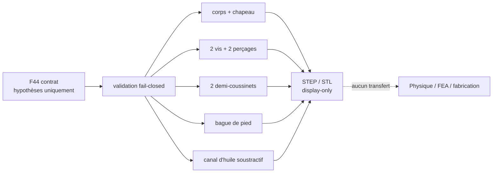

# Bielle détaillée de démonstration F44

F44 remplace, pour une étude visuelle isolée, la bielle monolithique F35 par
des composants sémantiques séparés : corps, chapeau, deux vis avec tête et
écrou simplifiés, deux demi-coussinets et une bague de pied. Deux perçages
traversants sont soustraits au corps et au chapeau. Chaque axe traverse une
oreille dédiée et reçoit deux vrais lamages cylindriques de profondeur définie;
les têtes ne sont donc plus noyées dans le corps circulaire. Un canal d'huile
continu est soustrait entre les volumes d'alésage de tête et de pied, traverse
les deux demi-coussinets, puis est exporté aussi comme solide de référence afin
de pouvoir le rendre visible dans une future scène de revue.



## Incohérence axiale bloquante

F35 place deux bielles de 22 mm côte à côte avec un jeu visuel égal à 6 % de
leur largeur. L'encombrement requis vaut donc `2 × 22 + 0,06 × 22 = 45,32 mm`,
alors que le maneton F35 ne fait que 26 mm. Le déficit est de 19,32 mm. F44 ne
réduit pas silencieusement les bielles et n'élargit pas le maneton : seule une
bielle est exportée. Une mesure traçable et un choix d'architecture sont requis
avant de sélectionner un maneton élargi, des bielles plus étroites, une
architecture fourche-et-lame ou des manetons distincts.

## Statut d'ingénierie

Chaque cote consommée par le générateur est inscrite dans
`connecting-rod-cad-f44.json` comme `design_hypothesis`. Les interfaces et
données fonctionnelles encore absentes restent `null` avec la classification
`unknown_requires_traceable_measurement`. Les jeux de coussinet et de bague,
les vis, le plan de joint et le canal d'huile sont des choix de représentation,
pas des tolérances, un circuit de lubrification, ni une définition de pièce.

Les deux dimensions auparavant dérivées dans le code sont désormais des
paramètres explicites du registre fermé :
`rod_bolt_boss_radial_margin_mm = 2,0 mm` et
`rod_bolt_seat_radial_clearance_mm = 0,5 mm`. La profondeur réelle de chacun
des quatre lamages est elle aussi une hypothèse explicite,
`rod_bolt_spotface_depth_mm = 1,5 mm`. Le générateur consomme exclusivement ces
trois valeurs via le registre; aucune formule cachée ne redimensionne les
oreilles ou les portées.

L'axe visuel des vis est placé à 35,5 mm de l'axe de tête. Avec le logement de
coussinet de rayon 28,93 mm et le trou de rayon 4,3 mm, le ligament géométrique
minimal vaut 2,27 mm. Cette valeur reste une hypothèse d'affichage, mais le
générateur la contrôle avant tout export. Il vérifie aussi par intersections
BRep que chaque outil de perçage enlève réellement de la matière dans le corps
et le chapeau. Pour chaque lamage, son volume soustrait, sa position et sa
profondeur sont contrôlés avant et après soustraction. Pour le canal d'huile,
les intersections avant soustraction avec le corps, chacun des deux
demi-coussinets et la bague sont positives; le solide de référence doit rester
unique, couper les deux volumes d'alésage et dépasser le rayon extérieur du
demi-coussinet inférieur de la surcourse explicitement enregistrée. Ces
contrôles prouvent uniquement la continuité géométrique, pas le débit ni la
lubrification. Le volume
d'interférence résiduel entre les deux vis et la bielle reste inférieur à
`1e-9 mm³`.

`bearing_split_visual_gap_mm` vaut `0,4 mm`, exactement comme
`cap_joint_visual_gap_mm`. Toute divergence est bloquante; cet alignement
visuel n'implique ni crush, ni serrage, ni tolérance de coussinet.

F44 n'établit aucune masse, matière, résistance, fatigue, thermique,
lubrification, aptitude LPBF, imprimabilité, cinématique, physique Omniverse,
puissance de 1 600 hp, démarrage moteur ou compatibilité 993. Toutes les portes
de libération restent fermées dans le contrat.

## Vérifier et générer

La vérification ne requiert que Python :

```bash
make 917-connecting-rod-cad-f44-check
```

La génération CAO utilise l'image `linux/amd64` déjà verrouillée par digest,
refuse d'écraser une sortie existante et exécute un smoke réel. Celui-ci exige
exactement neuf STEP, neuf STL, la réouverture OCCT de chaque STEP, les SHA-256 et le
`geometry-report.json` avant de retourner le marqueur
`F44_DOCKER_CAD_SMOKE_OK` :

```bash
make 917-connecting-rod-cad-f44
```

Les fichiers dérivés sont écrits sous
`work/917-connecting-rod-cad-f44/`. Ils ne doivent pas être confondus avec une
CAO de fabrication. Le rapport `geometry-report.json` conserve les drapeaux
`display_only`, `physics_enabled: false` et
`paired_rod_assembly_exported: false`. Il conserve aussi `geometry_checks`, les
audits BRep détaillés et les SHA-256 exacts du contrat, du générateur, du
validateur et du smoke. Le commit Git vaut `null` lorsque les métadonnées Git ne
sont volontairement pas montées dans le conteneur CAO; les SHA des sources
restent alors l'autorité reproductible.

Avant chaque export, les métriques de la forme construite sont comparées à
celles de la forme nettoyée par `clean_export_shape`. Le nombre de solides doit
rester identique, la dérive relative de volume ne peut dépasser `1e-9` et la
dérive de bornes ne peut dépasser `1e-6 mm`. Le rapport distingue ensuite les
métriques `authored`, `created`, `canonical` et celles de la réouverture STEP.

Le master éditable est le couple formé par le contrat JSON et le générateur
Python build123d. Les STEP sont des échanges CAO neutres dérivés, pas le master
paramétrique et encore moins une définition de fabrication.
