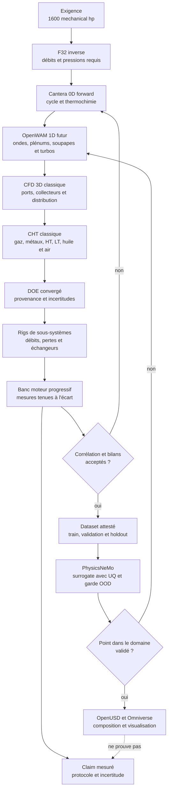
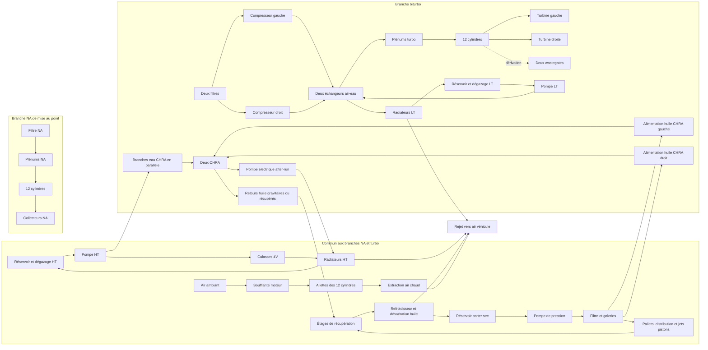

# F33 — cycle moteur, réseaux thermiques et preuve du flat-12 917-inspired 2026

> **Statut d'architecture : étude historique remplacée.** F33 conserve le
> calcul 0D à culasses liquides et ses preuves d'exécution telles qu'elles ont
> été produites. Depuis F34a, l'architecture sélectionnée est un cœur moteur
> strictement air/huile avec gestion électronique moderne ; aucun résultat
> thermique liquide F33 n'est transférable à cette architecture. Voir
> [F34a](917_AIR_OIL_CORE_CONTROLS_F34A.md).

## Résultat et statut

F33 définit le prochain modèle physique du flat-12 clean-sheet 2026 décrit par
[F32](917_CLEAN_SHEET_2026_F32.md). Il contient désormais un écran forward 0D
Cantera à quatre états, exécuté séparément pour les variantes atmosphérique et
biturbo. Il ne contient encore ni cylindre ouvert résolu au vilebrequin, ni
réseau OpenWAM, ni calcul CFD/CHT, ni entraînement PhysicsNeMo, ni résultat de
banc. Il fixe aussi les interfaces entre solveurs, les domaines de DOE et les
critères qui empêchent ce calcul non corrélé d'être présenté comme une preuve.

La cible de programme reste une **exigence utilisateur** :

- `1600 mechanical_hp`, soit `1 193,119795 kW` ;
- régime de dimensionnement F32 : `9 000 tr/min` ;
- couple requis par identité : `1 265,939 N·m` ;
- BMEP requise par identité : `29,600 bar` pour `5,374385 l`.

Ces valeurs décrivent le problème à résoudre. Elles ne prouvent ni combustion,
ni refroidissement, ni adéquation des turbos, ni endurance. Le terme « 1 600
ch » est interdit dans un résultat sans préciser s'il signifie `mechanical_hp`
ou `PS`. Dans F33, il signifie exclusivement `mechanical_hp`.

La variante de travail est le moteur hybride retenu comme candidat par F32 :

- cylindres à ailettes, air forcé, jets d'huile et carter sec ;
- culasses quatre soupapes refroidies par une boucle liquide haute température
  dédiée ;
- deux échangeurs air-eau sur une boucle liquide basse température distincte ;
- refroidissement d'huile indépendant ;
- refroidissement et hot-soak des deux CHRA à résoudre, sans inventer leur
  charge thermique.

Le montage dans une 993 demeure une étude ultérieure. La 993 de série est un
véhicule air/huile ; les boucles liquides F33 seraient une conversion nouvelle,
pas un système Porsche d'origine.

### Écran forward reproductible

L'exécution F33 utilise l'image publique immuable
`ghcr.io/cluster2600/3dprinting993-engine-cycle-f33@sha256:287bd6ea04ff97205cbea9f63b2cc5a7c63ff754b27a183eb482e7896d1e9251`,
sans réseau, en lecture seule et sous l'identité non-root `9133:9133`.
Le contrat est
[`clean-sheet-cycle-thermal-f33.json`](../twins/reference-917-engine/clean-sheet-cycle-thermal-f33.json)
et le résultat suivi est
[`cycle-thermal-report.json`](../twins/reference-917-engine/evidence/f33/cycle-thermal-report.json).

| Sortie forward 0D non corrélée à 9 000 tr/min | Atmosphérique | Biturbo |
| --- | ---: | ---: |
| Puissance frein | 620,410 mechanical hp | 1 601,196 mechanical hp |
| Couple | 490,876 N·m | 1 266,886 N·m |
| BMEP | 11,478 bar | 29,622 bar |
| Rendement thermique frein | 33,625 % | 25,012 % |
| BSFC | 248,981 g/kWh | 334,727 g/kWh |
| Charge boucle HT culasses | 192,621 kW | 668,333 kW |
| Débit HT hypothétique | 3,567 kg/s | 12,377 kg/s |
| Charge refroidisseur de suralimentation | sans objet | 158,476 kW |
| Débit LT hypothétique | sans objet | 3,668 kg/s |
| Charge huile hypothétique | 127,587 kW | 285,793 kW |
| Débit huile hypothétique | 2,454 kg/s | 5,496 kg/s |

Le biturbo tombe à `+1,196 mechanical_hp`, soit `+0,0747 %`, de la cible.
Ce rapprochement n'est pas une preuve : la pression de collecteur reste un seed
de dimensionnement inverse, la combustion est un équilibre à volume constant,
les pertes sont des hypothèses et aucune carte turbo n'est interpolée. Un test
adversarial remplace la cible par 1 400 hp et confirme que les deux sorties
forward ne changent pas ; la cible n'entre donc pas dans `solve_forward`.

L'écran turbo calcule `3,2156` de rapport de pression, `80,680 lb/min` corrigés
par turbo et `191,573 kW` de puissance compresseur totale. Les `23,43 %` de
wastegate sont une inversion algébrique de capacité, pas une fermeture d'arbre
ni un matching de carte. Les seize gates physiques et de fabrication restent
à `false`.

```bash
make 917-cycle-thermal-f33
make 917-cycle-thermal-f33-check
make 917-cycle-thermal-f33-test
```

## Quatre classes de puissance qui ne doivent jamais être mélangées

| Classe | Entrées | Sortie ou rôle | Claim autorisé |
| --- | --- | --- | --- |
| `requested_target` | 1 600 mechanical hp, 9 000 tr/min | exigence de conception | « puissance demandée » |
| `inverse_sizing_seed` | puissance demandée, BSFC, AFR, rendement volumétrique et hypothèses turbo | débits et pressions nécessaires | « dimensionnement inverse hypothétique » |
| `forward_prediction` | géométrie, carburant, masses piégées, combustion, pertes, cartes et frontières thermiques | puissance prédite par un solveur convergé | « puissance simulée » avec domaine et incertitude |
| `measured_result` | moteur physique, carburant certifié, conditions, accessoires et instrumentation | puissance nette/brute mesurée et corrigée | « puissance mesurée » selon le protocole déclaré |

F32 appartient aux deux premières classes. Il part de la puissance demandée et
emploie notamment `0,55 lb/(hp·h)`, AFR `11`, rendement volumétrique `1,00`,
température plénum `325 K` et rendement compresseur `0,75` pour obtenir :

| Quantité inverse F32 | Valeur |
| --- | ---: |
| Débit d'air total | 1,219659 kg/s |
| Débit d'air par turbo | 0,609830 kg/s |
| Débit de carburant | 0,110878 kg/s |
| Pression absolue plénum | 2,822861 bar |
| Rapport de pression compresseur | 3,200897 |
| Puissance compresseur totale | 192,145 kW |
| Chaleur rejetée par les intercoolers | 159,234 kW |

Le modèle forward F33 ne devra pas reprendre `1 193,119795 kW` comme source de
chaleur de combustion. Il imposera une masse de carburant, sa composition, son
pouvoir calorifique, les conditions d'admission, un phasage de combustion et
les pertes. La puissance frein sera une sortie. Toute boucle qui ajuste
automatiquement le carburant jusqu'à retrouver 1 600 hp restera un solveur
inverse et sera étiquetée comme tel.

La quatrième classe exige un banc. Pour qu'un claim soit sans ambiguïté, la
puissance mesurée corrigée, moins son incertitude élargie, devra atteindre la
cible déclarée. Les méthodes de référence sont
[ISO 15550:2016](https://www.iso.org/standard/70030.html), sa
[notice allemande DIN Media](https://www.dinmedia.de/de/norm/iso-15550/266596996)
et [SAE J1349](https://saemobilus.sae.org/standards/j1349_202511-engine-power-test-code-spark-ignition-compression-ignition-installed-net-power-torque-rating).

## Chaîne de preuve



Ni le nombre de composants USD, ni une animation de vilebrequin, ni un champ
PhysicsNeMo ne constitue une mesure de puissance. PhysicsNeMo vient après les
solveurs classiques, le DOE et la constitution de holdouts ; il ne remplace
pas la solution de référence.

## Stack minimale, gratuite et séquencée

### 1. Cantera 0D : premier solveur forward

[Cantera](https://cantera.org/) est le minimum libre retenu pour les propriétés
thermochimiques, la cinétique, les bilans ouverts et le réseau de réacteurs. Son
[exemple officiel de moteur](https://cantera.org/stable/examples/python/reactors/ic_engine.html)
illustre piston, soupapes et injection ; il est explicitement simplifié et ne
constitue pas une calibration essence du flat-12.

L'exécutable de référence F33 résout pour l'instant compression isentropique,
équilibre `UV`, détente isentropique, rétention de travail indiqué, FMEP,
pompage et auxiliaires. Il utilise le mécanisme `nDodecane_IG` fourni par
Cantera 3.2.0. C'est une garde de calcul et un point de départ DOE, pas encore
le modèle moteur ouvert décrit ci-dessous.

Le prochain exécutable devra contenir :

- un cylindre 0D répliqué douze fois, avec ordre d'allumage versionné ;
- volumes bielle-manivelle, soupapes, injecteur, paroi mobile et plénums ;
- carburant et mécanisme chimique épinglés par version et SHA-256 ;
- propriétés dépendantes de la température, sans `gamma` constant dans la voie
  de référence ;
- deux modes distincts : cinétique chimique et dégagement de chaleur calibré ;
- frottement, pompage et auxiliaires séparés du travail indiqué ;
- états NA de mise au point puis états turbo, sans héritage silencieux ;
- bilans par cylindre et global, convergence cyclique et étude de pas angulaire.

Le mode Wiebe est autorisé pour le harness et la calibration initiale, jamais
comme prédiction autonome de cliquetis. Ses coefficients doivent être ajustés
à des traces de pression cylindre. Une méthodologie SI validant Wiebe et Woschni
sur mesure est décrite par
[SAE 2002-01-2193](https://saemobilus.sae.org/papers/modelling-methodology-a-spark-ignition-engine-experimental-validation-part-i-single-zone-combustion-model-2002-01-2193)
et [SAE 2005-01-2106](https://saemobilus.sae.org/downloads/papers/2005-01-2106/Full%20Text%20PDF).

### 2. OpenWAM 1D : futur réseau gazeux

[OpenWAM](https://openwam.webs.upv.es/docs/) est la cible libre pour les tubes
1D, jonctions, plénums 0D, cylindres, soupapes, échangeurs et turbomachines. Ses
[équations numériques](https://openwam.webs.upv.es/docs/?p=180), sa
[fiche UPV](https://aplicat.upv.es/exploraupv/ficha-software/software/15104?busqueda=Motores+de+combusti%C3%B3n+interna)
et son [dépôt source](https://github.com/CMT-UPV/OpenWAM) sont publics.

OpenWAM est **futur** dans F33 : aucune installation ni compatibilité actuelle
n'est attestée. Son historique de release est ancien. Avant de le retenir, il
faut épingler un commit, construire une image `linux/amd64`, passer des cas
analytiques et comparer un réseau simple à une seconde implémentation. Il ne
sera activé qu'après acquisition des longueurs et sections de conduits, volumes
de plénums, lois de levée, coefficients de débit et cartes turbo.

Les travaux TUM rappellent la frontière essentielle : les cartes turbo sont
mesurées en stationnaire sur banc composant, tandis qu'un moteur leur impose
des pressions, températures et débits pulsés. Les extrapolations nécessaires à
la stabilité numérique ne sont pas une preuve physique :

- [modèle moteur et turbo TUM](https://mediatum.ub.tum.de/doc/1072199/1072199.pdf) ;
- [dimensionnement turbo 0D TUM](https://mediatum.ub.tum.de/doc/1711922/1711922.pdf).

### 3. CFD et CHT classiques

[OpenFOAM 14](https://openfoam.org/version/14/) est la référence libre prévue
pour :

- CFD des ports et chambres sur géométries étanches ;
- répartition entre cylindres dans les plénums ;
- ondes et pertes des collecteurs d'échappement ;
- volumes turbine/wastegate lorsqu'une géométrie et des frontières valides
  existent ;
- écoulement sous capot et à travers les faisceaux de radiateurs 993 ;
- CHT entre gaz, culasses, cylindres, sièges, huile et liquides HT/LT.

Le 1D fournit les conditions temporelles aux domaines 3D ; le 3D retourne des
coefficients de débit, pertes, répartition et échange au 1D. AVL décrit cette
complémentarité dans ses publications germanophones sur les
[niveaux 0D/1D/3D](https://www.avl.com/de/blog/avl-simulation-software-release-2026-r1)
et le [couplage 1D–3D](https://www.avl.com/de/blog/system-simulation-cfd-1d-3d-coupling-avl-cruise-m-and-avl-fire-m).

### 4. PhysicsNeMo après le DOE

[NVIDIA PhysicsNeMo](https://docs.nvidia.com/physicsnemo/latest/) fournit des
architectures, recettes, évaluation, apprentissage actif, UQ et garde-fous. Son
[code officiel](https://github.com/NVIDIA/physicsnemo) est ouvert. Dans F33 il
reste désactivé jusqu'à ce que les jeux suivants existent :

- solutions 0D/1D et CFD/CHT convergées avec provenance ;
- mesures de rigs et de banc corrélées ;
- splits par géométrie et point de fonctionnement, pas seulement aléatoires ;
- holdout physique jamais vu à l'entraînement ;
- métriques par sortie, estimation d'incertitude et décision hors domaine.

Une prédiction hors enveloppe retourne au solveur classique ou exige un nouvel
essai. PhysicsNeMo ne complètera jamais une carte turbo manquante ni une
géométrie non mesurée par simple interpolation apprise.

## Équations du modèle de référence

### Cinématique et volume cylindre

Avec rayon de manivelle `a`, longueur de bielle `l`, alésage `B`, cylindrée
unitaire `Vd` et rapport volumétrique `rc` :

\[
x(\theta)=a(1-\cos\theta)+l-\sqrt{l^2-a^2\sin^2\theta}
\]

\[
V(\theta)=\frac{V_d}{r_c-1}+\frac{\pi B^2}{4}x(\theta)
\]

L'alésage/course F32 `90,0 × 70,4 mm` reste un seed clean-sheet, pas une
mesure du scan ni une cote libérée.

### Premier principe et espèces

Pour un cylindre ouvert, écrit en angle vilebrequin :

\[
\frac{dU}{d\theta}=\frac{\dot Q}{\omega}
-p\frac{dV}{d\theta}
+\sum_{in}\frac{\dot m h}{\omega}
-\sum_{out}\frac{\dot m h}{\omega}
\]

\[
\frac{dm_k}{d\theta}=
\frac{\sum\dot m_{in,k}-\sum\dot m_{out,k}+\dot m_{chem,k}}{\omega}
\]

### Dégagement de chaleur et parois

Le fallback Wiebe calibrable est :

\[
x_b=1-\exp\left[-A
\left(\frac{\theta-\theta_0}{\Delta\theta}\right)^{m+1}\right]
\]

\[
\frac{dQ_{comb}}{d\theta}=\eta_{comb}m_fLHV\frac{dx_b}{d\theta}
\]

Le transfert aux parois est :

\[
\dot Q_w=hA_w(T_g-T_w)
\]

La corrélation Woschni fournit seulement un point de départ ; ses coefficients
doivent être recalés. Source primaire :
[SAE 670931](https://saemobilus.sae.org/papers/a-universally-applicable-equation-instantaneous-heat-transfer-coefficient-internal-combustion-engine-670931).

### Soupapes et wastegates

Le débit quasi-stationnaire compressible s'écrit :

\[
\dot m=C_dA_{eff}\frac{p_0}{\sqrt{RT_0}}
\Phi\left(\frac{p_d}{p_u},\gamma\right)
\]

`Phi` doit couvrir les branches subsonique, étranglée et inverse. `Cd` et
`Aeff` proviendront de mesures ou de CFD corrélée, pas de la photographie des
soupapes.

### Travail, couple et puissance

\[
W_i=\oint p\,dV
\]

\[
P_b=BMEP\,V_d\frac{N_{rpm}}{120}
\]

\[
BMEP=\frac{4\pi T}{V_d},\qquad
P=\frac{2\pi N_{rpm}T}{60}
\]

La puissance frein doit fermer :

\[
P_b=P_i-P_{pompage}-P_{friction}-P_{accessoires}
\]

Le FMEP sera calibré sur rotation entraînée, pression cylindre et couple. Un
coefficient de frottement générique n'autorise pas de claim moteur.

### Plénums et conduits 1D

\[
\frac{dm_{plenum}}{dt}=\dot m_{entrée}-\sum\dot m_{cylindres}
\]

avec bilan d'énergie et fermeture d'état. Dans chaque conduit :

\[
\frac{\partial U}{\partial t}+\frac{\partial F(U)}{\partial x}=S(U)
\]

`S(U)` contient variation de section, frottement et transfert thermique. Les
conditions de frontière sont les soupapes, plénums, échangeurs, compresseurs,
turbines et sortie d'échappement.

### Cartes et arbre turbo

Les grandeurs corrigées génériques sont :

\[
N_{corr}=N\sqrt{\frac{T_{ref}}{T_{in}}}
\]

\[
\dot m_{corr}=\dot m
\frac{\sqrt{T_{in}/T_{ref}}}{p_{in}/p_{ref}}
\]

Chaque carte doit fournir ses propres références. Garrett emploie notamment
`13,95 psi` et `545 °R` dans sa
[notice capteur de vitesse](https://www.garrettmotion.com/wp-content/uploads/2023/02/737639-34_781328_Speed_Sensor_Kit_Installation_Instructions_revG.pdf).
La NASA publie les dérivations officielles des
[débits corrigés](https://www.grc.nasa.gov/www/k-12/rocket/wcora.html) et du
[travail compresseur](https://www.grc.nasa.gov/www/k-12/airplane/compth.html).

Compresseur :

\[
PR_c=\frac{p_{2t}}{p_{1t}}
\]

\[
T_{2t}=T_{1t}\left[1+
\frac{PR_c^{(\gamma-1)/\gamma}-1}{\eta_c}\right]
\]

\[
P_c=\dot m_c(h_2-h_1)
\]

Turbine :

\[
T_{4t}=T_{3t}\left[1-\eta_t
\left(1-PR_t^{-(\gamma-1)/\gamma}\right)\right]
\]

\[
P_t=\dot m_t(h_3-h_4)
\]

Rotor :

\[
J_t\omega_t\frac{d\omega_t}{dt}=P_t-P_c-P_f
\]

et, au point stabilisé, `Pt × eta_m = Pc`. Une simple égalité de puissance ne
suffit pas : débit turbine, pression échappement, wastegate, vitesse d'arbre et
carte compresseur doivent converger simultanément.

### Échangeurs et boucles

\[
\dot Q=\dot m c_p(T_{entrée}-T_{sortie})
\]

\[
\epsilon=\frac{T_{chaud,in}-T_{chaud,out}}
{T_{chaud,in}-T_{froid,in}}
\]

Chaque échangeur exige aussi une carte de perte de charge, une courbe de rejet
vers l'air véhicule, les performances des pompes/ventilateurs et un modèle de
hot-soak.

## Candidat turbo F33 : G42-1325, non gelé

F32 plaçait la paire Garrett G35-1050 dans une shortlist de capacité sans carte
numérisée. L'inspection F33 fait passer une paire
[Garrett G-Series II G42-1325](https://www.garrettmotion.com/fr/racing-and-performance/performance-catalog/turbo/g-series-ii-g42-1325-73mm/)
au rang de **candidat de référence non gelé** :

- compresseur `73/91 mm`, turbine `82/75 mm` ;
- carters turbine `1,01`, `1,15` et `1,28 A/R` ;
- roue turbine Inconel et carters inox annoncés jusqu'à `1 050 °C` ;
- vitesse maximale constructeur `120 krpm` ;
- aucune garantie de puissance : Garrett lie le rating au choke flow potentiel.

Avec les conditions F32, le débit réel de `80,67 lb/min` par turbo devient
environ `80,2 lb/min` corrigés selon Garrett. La lecture visuelle de la
[carte compresseur officielle](https://www.garrettmotion.com/wp-content/uploads/2025/07/G42-1325-G-Series-II-Compressor-Map-scaled.jpg)
au point `(80,2 lb/min ; PR 3,20)` suggère environ `76–77 %` et `105–108 krpm`.
Cette lecture d'image n'est ni une table de solveur, ni une validation.

La
[courbe turbine G42](https://www.garrettmotion.com/wp-content/uploads/2022/06/Turbine-Flow-Maps-G42-scaled.jpg)
ne décrit complètement que le `T4 1,01 A/R` et plafonne vers `43 lb/min`
corrigés. Un équilibre algébrique exploratoire, avec `T3t=1100 K`,
`p4=1,10 bar`, `eta_t=0,70` et `eta_m=0,97`, place l'intersection aux environs
de :

- `PRt = 2,65–2,75` ;
- `p3 = 2,9–3,0 bar abs` ;
- débit roue `0,51–0,53 kg/s` ;
- dérivation wastegate `20–23 %`.

Ce seed ne traite ni pulsations, ni échange thermique du turbo, ni rendement
turbine complet. De plus, la page produit annonce jusqu'à `74 %` de rendement
turbine alors que l'image liée indique `77 % maximum`. Cette divergence doit
être résolue avec Garrett ou une carte brute avant gel.

Le [G35-1050](https://www.garrettmotion.com/racing-and-performance/performance-catalog/turbo/g-series-g35-1050/)
reste un challenger de réponse transitoire. Sa
[carte compresseur](https://www.garrettmotion.com/wp-content/uploads/2022/06/35-1050-Comp-Map-kg-sec-scaled.jpg)
place approximativement le point F32 vers `120 krpm` pour une limite de
`130 krpm`, et sa
[courbe turbine](https://www.garrettmotion.com/wp-content/uploads/2022/06/Turbine-Flow-Maps-G35-scaled.jpg)
plafonne vers `35 lb/min` même à `1,21 A/R`. Sa capacité turbine et sa marge de
vitesse sont donc plus serrées.

Avant sélection, il faut :

1. obtenir ou numériser les cartes compresseur **et turbine** de chaque A/R ;
2. conserver images, conditions de référence, méthode et SHA-256 ;
3. définir les marges surge/choke et vitesse sur toute la trajectoire ;
4. résoudre turbine, wastegate et contre-pression avec les pulsations 1D ;
5. valider le hot-soak, les débits huile/eau et l'after-run du CHRA ;
6. confronter G42, G35 et au moins une famille alternative sur les mêmes
   hypothèses, sans comparer les ratings marketing.

## DOE classique avant PhysicsNeMo

### Trajectoire initiale régime/pression

Cette trajectoire est un domaine d'exploration, pas une consigne ECU :

| Régime | Domaine de rapport compresseur |
| ---: | ---: |
| 3 000 tr/min | 1,10–1,20 |
| 4 000 tr/min | 1,30–1,50 |
| 5 000 tr/min | 1,70–1,90 |
| 6 000 tr/min | 2,20–2,50 |
| 7 000 tr/min | 2,50–2,80 |
| 8 000 tr/min | 2,80–3,10 |
| 9 000 tr/min | 3,10–3,30 |

Les bas régimes peuvent tomber hors de la carte publiée du G42. Ils doivent
retourner `out_of_map`, pas recevoir une efficacité inventée. Ils permettent de
quantifier lag et besoin éventuel de recirculation ou d'assistance.

### Facteurs de screening

Les bornes suivantes sont des priors de conception et non des valeurs Porsche
mesurées :

| Facteur | Bas | Centre | Haut |
| --- | ---: | ---: | ---: |
| Rapport volumétrique | 8,5 | 9,5 | 10,5 |
| Lambda | 0,75 | 0,82 | 0,90 |
| CA50, °ATDC | 5 | 8 | 11 |
| Durée CA10–90, °CA | 35 | 50 | 65 |
| Rendement volumétrique piégé | 0,90 | 1,00 | 1,10 |
| Température plénum, K | 310 | 325 | 340 |
| Perte du circuit de charge, kPa | 10 | 25 | 40 |
| Température entrée turbine, K | 1 000 | 1 100 | 1 200 |
| Échelle FMEP calibrée | 0,8 | 1,0 | 1,2 |
| A/R G42 | 1,01 | 1,15 | 1,28 |

Les rendements compresseur et turbine ne sont pas des facteurs libres lorsque
les points sont à l'intérieur d'une carte : ils proviennent de l'interpolation
de la carte. Une variation séparée de quelques points n'est autorisée que pour
l'analyse d'incertitude de mesure/interpolation.

Le DOE est séquencé :

1. demi-fraction `2^(5-1)` de résolution V, 16 cas, plus 4 à 6 centres sur les
   cinq facteurs de combustion principaux ;
2. sélection des facteurs dominants et vérification des interactions ;
3. plan composite centré face-centered : 16 points factoriels, 10 axiaux et
   6 centres, soit 32 cas ;
4. blocs à 6 000, 7 500 et 9 000 tr/min ;
5. 8 à 12 cas forward réservés, jamais vus par le fit ;
6. transitoires tip-in, coupure/réapplication, changement de rapport et
   hot-soak ;
7. corrélation sur rigs puis banc, avec mesures physiques tenues à l'écart ;
8. seulement alors, préparation des splits PhysicsNeMo.

Références officielles : [NIST, principes DOE](https://www.itl.nist.gov/div898/handbook/pri/section3/pri3.htm),
[screening](https://www.itl.nist.gov/div898/handbook/pri/section3/pri33.htm) et
[plans composites centrés](https://www.itl.nist.gov/div898/handbook/pri/section3/pri3361.htm).

Les sorties minimales sont puissance/couple, IMEP/PMEP/FMEP/BMEP, BSFC,
rendement thermique, CA10/50/90, pression maximale et angle, taux de montée de
pression, cliquetis, EGT/TIT, états des deux turbos, contre-pression,
wastegate, chaleur HT/LT/huile/air, pertes de charge et dispersion entre les
douze cylindres.

Le cliquetis n'est libéré qu'avec un carburant défini et des traces mesurées.
La méthode primaire FKFS/Porsche validée sur plus de 12 000 cycles constitue
une référence de calibration :
[SAE 2021-01-0381](https://saemobilus.sae.org/papers/knock-model-covering-thermodynamic-chemical-influences-two-stage-auto-ignition-gasoline-fuels-2021-01-0381).

## Réseaux fluides et thermiques NA/turbo

Le banc doit commencer par une branche NA de mise au point, avec le même long
block, les mêmes culasses HT, le même carter sec et le même air d'ailettes. La
branche turbo ajoute les CHRA, le circuit de suralimentation, la boucle LT et
les charges d'échappement. Elle ne doit pas hériter automatiquement d'une
calibration NA.



Ce diagramme décrit une topologie candidate, pas un schéma de fabrication. Les
positions, diamètres, pompes, thermostats, clapets, réservoirs, purgeurs,
pression de bouchon et stratégies de secours restent à calculer et mesurer.

### Boucle HT — culasses

Le seed F32 alloue environ `667 kW` aux culasses et calcule `12,4 kg/s` pour un
`DeltaT=15 K`. C'est une exigence dérivée d'un partage de chaleur hypothétique,
pas une capacité validée. Le modèle réseau doit résoudre :

- répartition parallèle entre deux bancs et six culasses par banc ;
- pertes de charge, cavitation/NPSH, dégazage et points hauts ;
- warm-up, thermostat, bypass et pompe à vitesse variable ;
- températures métal et liquide locales issues du CHT ;
- capacité radiateurs/ventilateurs avec vitesse véhicule et air chaud recyclé ;
- fonctionnement dégradé après perte de pompe ou ventilateur.

### Boucle LT — échangeurs de suralimentation

F32 estime `159 kW` et `3,5 kg/s` pour `DeltaT=12 K`. La boucle LT doit rester
thermiquement distincte de la boucle culasses afin de conserver une température
d'admission basse. Son modèle inclut soak du réservoir, rendement des deux
cores, déséquilibre gauche/droite, pertes de charge air/eau et rejet vers l'air
de la 993.

### Huile — carter sec, pistons et turbos

Le seed hybride F32 alloue environ `286 kW` et `5,5 kg/s` pour `DeltaT=25 K`.
La boucle réelle doit séparer :

- alimentation pressurisée, filtre et soupape de décharge ;
- paliers principaux/bielles, distribution et jets sous pistons ;
- alimentation restreinte de chaque CHRA ;
- retours gravitaires ou étage de récupération dédié, sans mise en charge des
  joints turbo ;
- six ou davantage de zones de récupération du flat-12, selon la géométrie
  finalement mesurée ;
- désaération, niveau dynamique, moussage, thermostat et refroidisseur.

Les `286 kW` ne prouvent ni la viscosité disponible aux paliers ni la capacité
de récupération.

### Air forcé des cylindres

Le seed hybride attribue environ `191 kW` à l'air d'ailettes. Il faut mesurer la
courbe de soufflante, les pertes du carénage, le débit par cylindre et la
recirculation sous capot. Le CFD doit recevoir les courbes de ventilateur et de
radiateurs mesurées, pas un débit uniforme imposé à chaque cylindre.

### CHRA et hot-soak

La charge thermique des CHRA est `null` dans F32. F33 refuse donc de
dimensionner leur débit liquide. La boucle candidate les place en parallèle
sur HT, avec pompe électrique after-run, mais une boucle dédiée peut devenir
nécessaire après données fabricant et essais. Il faut mesurer :

- débit/pression d'huile requis et restriction ;
- débit/pression liquide et sens de thermosiphon ;
- chaleur transférée en charge et après arrêt ;
- températures carter/huile/eau, vitesse d'arbre et durée d'after-run ;
- risque de cokéfaction, ébullition locale et siphonnage.

## Intégration dans une Porsche 993

Porsche décrit la 993 comme la dernière 911 refroidie par air :
[source Porsche germanophone](https://newsroom.porsche.com/de/historie/porsche-911-sieben-generationen-teil-4-typ-993-16456.html).
Le passage ultérieur à des culasses quatre soupapes refroidies par eau est
également expliqué par
[Porsche](https://newsroom.porsche.com/de/2024/produkte/porsche-911-carrera-gts-antrieb-technologie-christophorus-411-36731.html).
Ces sources justifient l'étude hybride ; elles ne valident aucune conversion.

Avant tout placement F33 dans le twin véhicule, il faut acquérir avec
incertitude :

1. enveloppe 3D du compartiment moteur, capot, traverse, suspension et boîte ;
2. masse, centre de gravité et inerties du groupe motopropulseur complet ;
3. charges sur essieu arrière et chemins d'effort des supports dans la coque ;
4. capacité de la boîte/transmission à `1 266 N·m` plus les pics torsionnels ;
5. volumes et écoulements disponibles pour radiateurs HT, LT et huile ;
6. passages avant-arrière des conduites, protections choc/abrasion/feu et
   stratégie de purge d'un véhicule à moteur arrière ;
7. encombrement des intercoolers, plénums, turbos, wastegates, échappement et
   écrans thermiques vis-à-vis de la carrosserie ;
8. puissance électrique des pompes/ventilateurs, alternateur, batterie, ECU,
   capteurs, contacteurs et arrêts sûrs ;
9. alimentation carburant, ventilation, détection fuite/incendie et extinction ;
10. freins, pneus, suspension, aérodynamique, structure, homologation et
    assurance correspondant au véhicule complet.

Les radiateurs ne peuvent pas être sélectionnés par leur seule puissance
catalogue. Leur capacité dépend du débit d'air, de la température extérieure,
de la vitesse véhicule, de l'étanchéité des ducts et du rejet d'air chaud. Le
cas critique peut être un banc statique ou un roulage lent après pleine charge,
pas nécessairement la vitesse maximale.

Le twin 993 doit exposer des interfaces de packaging, pas des placements
validés : volumes réservés, surfaces d'admission/rejet, rayons de courbure,
points hauts, masses et points de fixation. Tant que ces mesures sont absentes,
`porsche_993_packaging_validated` et
`porsche_993_vehicle_installation_authorized` restent `false`.

## Gates numériques et expérimentaux

Les seuils ci-dessous sont des critères de projet à versionner, pas des seuils
Porsche ou Garrett publiés :

- résidu masse et énergie global inférieur à `0,1 %` ;
- dérive cyclique des états inférieure à `0,1 %` et du travail indiqué à
  `0,2 %` ;
- variation de puissance et pression maximale inférieure à `1 %` après
  raffinement du pas angulaire ;
- tous les points nominaux à l'intérieur du domaine mesuré des cartes ;
- vitesse G42 soutenue inférieure ou égale à `108 krpm`, soit `90 %` de la
  limite constructeur, sans jamais dépasser la limite transitoire publiée ;
- définition explicite et marge surge minimale de projet de `10 %` ;
- résidu du bilan de puissance de l'arbre turbo inférieur à `2 %` au régime
  stabilisé ;
- dispersion de masse piégée et IMEP entre cylindres inférieure à `2 %` dans
  le modèle 1D ;
- indépendance maillage CFD/CHT et conservation des bilans aux interfaces ;
- corrélation sur points physiques non utilisés pour calibrer le modèle.

Un succès numérique autorise uniquement `forward_prediction`. Il n'autorise
pas `measured_result`, fabrication, impression métal, démarrage moteur ou
montage dans la 993.

Le banc doit progresser par gates :

1. rotation entraînée et amorçage d'huile ;
2. rigs de pompes, échangeurs, wastegates et CHRA chaud ;
3. allumage/injection et branche NA à faible charge ;
4. cartographie NA instrumentée ;
5. ajout des turbos à pression minimale avec protection survitesse ;
6. paliers de régime, charge et durée avec inspections ;
7. répétitions thermiquement stabilisées et bilan d'incertitude ;
8. seulement ensuite, point de puissance maximale.

## Frontière de preuve F33

F33 documente une architecture de calcul, des hypothèses de DOE et un écran
forward 0D non corrélé. À ce stade :

- le point `1600 mechanical_hp` reste une exigence non mesurée et non prouvée ;
- l'écran Cantera produit `1601,196 mechanical_hp`, mais sans cycle ouvert,
  convergence cyclique, calibration combustion/frottement ou corrélation ;
- les débits F32 sont inverses et hypothétiques ;
- le G42-1325 est un candidat, pas un turbo sélectionné ;
- aucune carte brute n'est intégrée au solveur ;
- aucune combustion, pression cylindre ou marge cliquetis n'est calculée ;
- aucune boucle HT, LT, huile, air ou CHRA n'est dimensionnée physiquement ;
- aucune géométrie fluide étanche n'autorise CFD/CHT ;
- aucun dataset corrélé n'autorise PhysicsNeMo ;
- aucune enveloppe mesurée n'autorise le packaging 993 ;
- aucune pièce moteur fortement chargée ou chaude n'est libérée pour
  fabrication ou impression 3D.

Les gates `target_power_proven`, `thermodynamic_cycle_validated`,
`turbo_match_validated`, `combustion_and_knock_validated`,
`cooling_system_validated`, `oil_system_validated`,
`held_out_physical_correlation_complete`, `test_bench_start_authorized`,
`porsche_993_vehicle_installation_authorized`, `metal_print_authorized` et
`manufacturing_authorized` restent tous à `false`.

## Sources primaires et officielles

### Cycle, transfert thermique et cliquetis

- [Cantera, exemple officiel de moteur](https://cantera.org/stable/examples/python/reactors/ic_engine.html)
- [Woschni, SAE 670931](https://saemobilus.sae.org/papers/a-universally-applicable-equation-instantaneous-heat-transfer-coefficient-internal-combustion-engine-670931)
- [Modèle SI 0D validé, SAE 2002-01-2193](https://saemobilus.sae.org/papers/modelling-methodology-a-spark-ignition-engine-experimental-validation-part-i-single-zone-combustion-model-2002-01-2193)
- [Modèle Wiebe/Woschni validé, SAE 2005-01-2106](https://saemobilus.sae.org/downloads/papers/2005-01-2106/Full%20Text%20PDF)
- [Modèle de cliquetis FKFS/Porsche, SAE 2021-01-0381](https://saemobilus.sae.org/papers/knock-model-covering-thermodynamic-chemical-influences-two-stage-auto-ignition-gasoline-fuels-2021-01-0381)

### Réseaux 1D, CFD et surrogate

- [OpenWAM, documentation UPV](https://openwam.webs.upv.es/docs/)
- [OpenWAM, équations](https://openwam.webs.upv.es/docs/?p=180)
- [OpenWAM, code source](https://github.com/CMT-UPV/OpenWAM)
- [AVL, niveaux 0D/1D/3D](https://www.avl.com/de/blog/avl-simulation-software-release-2026-r1)
- [AVL, couplage 1D–3D](https://www.avl.com/de/blog/system-simulation-cfd-1d-3d-coupling-avl-cruise-m-and-avl-fire-m)
- [OpenFOAM 14](https://openfoam.org/version/14/)
- [NVIDIA PhysicsNeMo](https://docs.nvidia.com/physicsnemo/latest/)

### Turbomachines

- [Garrett, calcul de sélection](https://www.garrettmotion.com/news/newsroom/article/how-to-select-a-turbo-part-2-understanding-calculations-to-turbo-any-engine/)
- [Garrett G42-1325](https://www.garrettmotion.com/fr/racing-and-performance/performance-catalog/turbo/g-series-ii-g42-1325-73mm/)
- [Garrett, carte compresseur G42-1325](https://www.garrettmotion.com/wp-content/uploads/2025/07/G42-1325-G-Series-II-Compressor-Map-scaled.jpg)
- [Garrett, courbe turbine G42](https://www.garrettmotion.com/wp-content/uploads/2022/06/Turbine-Flow-Maps-G42-scaled.jpg)
- [TUM, modélisation moteur/turbo](https://mediatum.ub.tum.de/doc/1072199/1072199.pdf)
- [TUM, dimensionnement turbo 0D](https://mediatum.ub.tum.de/doc/1711922/1711922.pdf)

### Validation et véhicule

- [NIST, plans d'expériences](https://www.itl.nist.gov/div898/handbook/pri/section3/pri3.htm)
- [ISO 15550:2016](https://www.iso.org/standard/70030.html)
- [SAE J1349](https://saemobilus.sae.org/standards/j1349_202511-engine-power-test-code-spark-ignition-compression-ignition-installed-net-power-torque-rating)
- [Porsche, 993 refroidie par air](https://newsroom.porsche.com/de/historie/porsche-911-sieben-generationen-teil-4-typ-993-16456.html)
- [Porsche, culasses 4V et refroidissement liquide](https://newsroom.porsche.com/de/2024/produkte/porsche-911-carrera-gts-antrieb-technologie-christophorus-411-36731.html)
