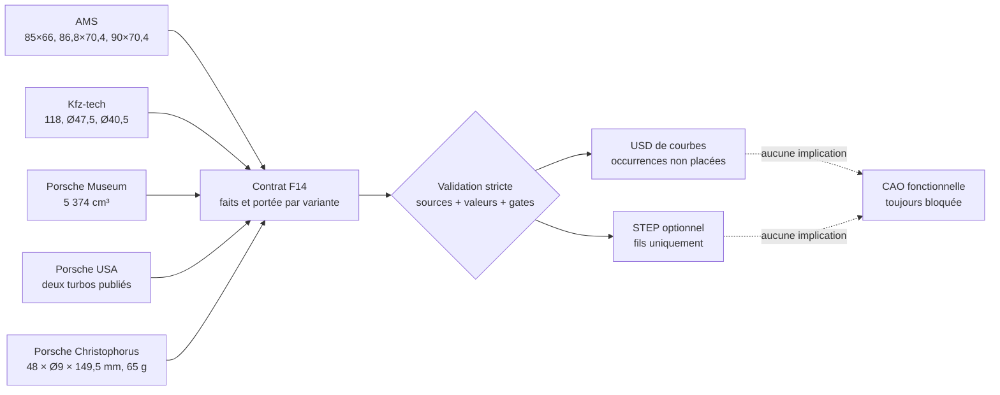

# Squelette dimensionnel sourcé F14 du moteur Porsche 917

## Résultat

F14 produit un contrat, un rapport et un stage OpenUSD de **guides**. Il ne
produit aucune pièce moteur. Il sépare trois définitions documentaires sans
prétendre identifier le scan :

- le Type 912 4,5 l atmosphérique ;
- le 917 5,0 l atmosphérique, conservé comme candidat de comparaison non
  sélectionné ;
- le 917/30 5,374 l biturbo.

Les anneaux représentent seulement un diamètre publié et les segments une
longueur publiée. Les occurrences de cylindres, de turbocompresseurs et de
goujons sont nommées mais ne reçoivent aucune transformation. Le stage ne
contient ni maillage, ni volume, ni joint Physics, ni matière.

Le niveau vérifié du moteur reste `F0_source_integrity`. Le fait qu'un stage
emploie `metersPerUnit = 0.001` signifie uniquement que ses guides documentaires
sont écrits en millimètres. Cette convention ne convertit pas le scan OBJ en
millimètres.

## Chaîne de preuve



Le générateur relit les cinq fiches de source du catalogue. Pour chacune, le
contrat épingle le `source_id`, l'URL attendue et le SHA-256 attendu. Le
générateur compare ensuite le fichier courant à ces deux pins, vérifie le
niveau de preuve et recherche les marqueurs factuels attendus dans les notes.
Il ne se contente donc pas de recalculer puis d'afficher l'empreinte courante.
Une URL remplacée, une mutation de contenu conservant les marqueurs, une cote
modifiée, une source absente, une affectation de variante prématurée ou une
coordonnée de placement provoque un refus avant la création des sorties.

La cylindrée exacte de 5 374 cm³ et le compte de deux turbocompresseurs restent
deux affirmations séparées : la première vient de Porsche Museum, la seconde de
Porsche USA. Cette séparation interdit qu'une page soit utilisée pour prouver
un fait qu'elle ne publie pas.

## Faits géométriques autorisés

| Branche | Faits utilisés pour les guides | Ce qui reste inconnu |
| --- | --- | --- |
| Type 912 4,5 l atmosphérique | 12 cylindres, alésage 85 mm, course 66 mm, entraxe régulier candidat 118 mm, têtes de soupape candidates Ø47,5/Ø40,5 mm | écart central, bancs, registres, piston, bielle, chambre, axes et sièges |
| 917 5,0 l atmosphérique candidat | 12 cylindres, alésage 86,8 mm, course 70,4 mm | identité du scan, entraxes, toute interface et tout contour de pièce |
| 917/30 5,374 l biturbo | 12 cylindres, alésage 90 mm, course 70,4 mm, deux turbos au niveau topologique | implantation, référence, roues, volutes, cartes, wastegates, plénums et conduits |

Les cylindrées publiées sont conservées comme métadonnées. Elles ne créent pas
de géométrie supplémentaire. Les diamètres de soupapes et l'entraxe de 118 mm
restent des candidats secondaires propres au Type 912 ; ils ne sont ni étendus
au 917/30 ni utilisés pour mettre le scan à l'échelle.

## Référence de goujon

La publication Porsche décrit 48 goujons, une longueur libre de 149,5 mm, une
tige de 9 mm et une masse de 65 g par pièce pour le moteur présenté en 1970.
F14 crée donc :

- un cercle de diamètre et un segment de longueur ;
- 48 occurrences sans position ;
- aucune extrémité, aucun filet et aucune gaine géométrique ;
- aucune affectation automatique à l'une des trois branches, notamment au
  917/30.

Le « goujon » F14 est un repère documentaire, pas un modèle de goujon à
fabriquer.

## Exécution

Depuis la racine du dépôt :

```bash
python3 twins/reference-917-engine/source/build_dimensional_skeleton_f14.py
```

Les sorties locales, ignorées par Git, sont écrites dans
`work/917-dimensional-skeleton-f14/` :

- `917-dimensional-skeleton-f14.report.json` ;
- `917-dimensional-skeleton-f14.usda`.

Un STEP de fils peut être demandé si Build123d est disponible :

```bash
python3 twins/reference-917-engine/source/build_dimensional_skeleton_f14.py \
  --optional-step
```

Même dans ce cas, le rapport exige `solid_count: 0` et conserve toutes les
libérations à `false`.

Le contrôle ciblé est :

```bash
python3 -m unittest discover -s tests \
  -p 'test_917_dimensional_skeleton_f14.py' -v
```

## Critères de succès F14

F14 est réussi uniquement si :

1. les trois branches sont distinctes et aucune n'identifie le scan ;
2. chaque valeur géométrique pointe vers au moins une fiche source vérifiée ;
3. le 5,0 l reste explicitement un candidat non sélectionné ;
4. les 36 occurrences de cylindres, les deux occurrences turbo et les 48
   occurrences de goujons restent sans coordonnées ;
5. le stage contient uniquement des `BasisCurves`, des scopes et des Xforms
   vides ;
6. le nombre de solides, de pièces placées et de joints physiques reste nul ;
7. aucune libération d'impression, de fabrication, de simulation ou de
   fonctionnement n'est activée.

## Porte suivante

Une CAO moteur réellement assemblable exige encore au minimum :

- trois contrôles physiques indépendants pour l'échelle du scan ;
- des datums de carter et les registres carter–cylindre–culasse ;
- le motif et les filetages complets des goujons ;
- la métrologie ou le CT d'un cylindre et d'une culasse identifiés ;
- les tourillons, manetons, axes, jeux, profils de came et masses ;
- les surfaces internes et sections des circuits d'huile, d'air, de carburant
  et d'échappement ;
- la référence et les cartes des turbocompresseurs.

Tant que ces données n'existent pas, épaissir les guides F14 produirait une
forme imaginaire et non une réingénierie.
