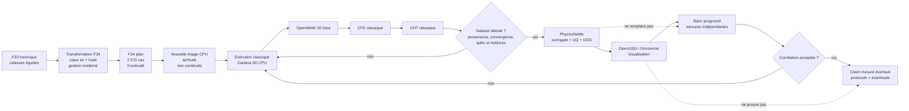

# F34 — plan DOE déterministe et sélection des surrogates PhysicsNeMo

## Résultat et frontière de preuve

F34 applique la décision 2026 suivante : le cœur du flat-12 conserve un
refroidissement **air forcé + huile**, sans chemise, jacket ou galerie d'eau
dans le carter, les cylindres ou les culasses. La version turbo peut employer
un liquide auxiliaire pour les échangeurs de suralimentation et, si le matériel
retenu l'exige, pour les CHRA ; ces circuits restent isolés du cœur moteur.

Le contrat transforme ensuite les centres numériques hérités de
[F33](917_CYCLE_THERMAL_F33.md) en seeds air/huile distincts pour le flat-12
atmosphérique (`NA`) et le flat-12 biturbo (`TT`). Les résultats F33 à culasses
liquides restent une étude antérieure non transférable. Le générateur
matérialise exactement **2 570 entrées forward planifiées** dans le
[manifeste suivi](../twins/reference-917-engine/evidence/f34/doe-case-manifest.json).
Aucun cas n'a été exécuté, convergé, attesté ou étiqueté ; aucun modèle n'a été
entraîné.

| Objet | État F34 |
| --- | --- |
| Cas planifiés | 2 570 |
| Cas exécutés / convergés / attestés | 0 / 0 / 0 |
| Dataset apte au ML | aucun |
| Poids PhysicsNeMo | aucun |
| Résultat de banc | aucun |
| Autorisation d'entraînement | `false` |

La cible utilisateur de `1600 mechanical_hp` reste une exigence de programme,
pas une donnée d'apprentissage. Elle est interdite dans les features, labels,
transformations, critères de split et fonctions d'échantillonnage F34. Une
future puissance frein pourra être un label uniquement parce qu'elle aura été
calculée par un solveur forward accepté. F34 ne prétend donc ni atteindre ni
approcher 1 600 ch.

Cette exclusion directe n'est pas une indépendance complète : le point central
TT F33, notamment sa pression de collecteur, descend du dimensionnement inverse
établi autour de la cible. Le manifeste conserve explicitement
`inverse_sizing_seed_ancestry_present: true` et
`full_target_independence_proven: false`. Une future itération devra reconstruire
l'espace depuis des frontières physiques indépendantes avant d'ouvrir ce gate.

Le [contrat machine-readable](../twins/reference-917-engine/doe-surrogate-f34.json)
fixe variantes, facteurs, unités, bornes, graines et règles de génération. Les
vecteurs numériques existent désormais au niveau du plan ; les résultats,
labels et décisions de convergence n'existent pas. Chaque ligne ne contient
que son vecteur d'entrée, son hash et le statut `planned_not_executed`.

## Architecture moderne verrouillée

« Moderne » signifie ici une architecture contrôlable et testable, pas une
marque d'ECU déjà sélectionnée :

- injection électronique multipoint séquentielle, avec 12 voies au minimum et
  24 voies étagées comme candidat pour la version haute puissance ;
- double allumage électronique indépendant, 24 voies candidates, sans
  distributeur mécanique ;
- référence vilebrequin et phase de chaque arbre actionné, VVT et levée variable
  comme candidats fail-closed ;
- deux actionneurs de papillon au minimum, un par banc, chacun avec mesure
  redondante ; wastegates électroniques ouvertes en état désénergisé et retour
  à la pression de ressort sur défaut ;
- mesure CHT et EGT par cylindre, lambda, cliquetis, pression différentielle
  carburant, huile, air de suralimentation et vitesses turbos ;
- boucles candidates lambda large bande et knock attribué au cylindre, sans
  matériel, carte ni seuil encore sélectionné ;
- journalisation synchronisée, communication CAN-FD, arrêt câblé indépendant
  de l'ECU et interlock de survitesse turbo non encore validé.

La page officielle du [RUF Tribute](https://www.ruf-automobile.de/en/modelle/ruf-tribute/)
établit un précédent pertinent : flat-six 3,6 l biturbo refroidi par air,
quatre arbres à cames, calage et levée variables, 550 hp. Elle ne documente
ni son injection, ni son ECU, ni son allumage et ne prouve évidemment pas la
faisabilité thermique de notre cible. La fiche officielle
[Bosch Motorsport MS 7.8](https://www.bosch-motorsport.com/media/catalog_content/downloads_catalog/pdf_catalog/data_sheet_326570507_engine_control_unit_ms_7-8.pdf)
sert seulement de référence de classe I/O : jusqu'à 12 cylindres en injection
basse pression, 12 commandes d'allumage, deux papillons, VVT, turbo, CAN-FD et
logging. Le double allumage 24 voies du projet dépasse cette configuration
seule et exigera une architecture additionnelle validée.

Injection directe, actionneurs VVT/VVL, injecteurs et ECU définitifs, pression
carburant, énergie d'étincelle, triggers, pinout, faisceau, topologie CAN-FD et
calibrations restent ouverts.
Le solveur L0 ne modélise encore aucune réponse à l'avance, au phasage
d'injection, au knock control ou aux lois DBW/boost.

## Manifeste des 2 570 cas planifiés

Les nombres séparés par une barre sont toujours ordonnés `NA / TT`. Les deux
branches ont des frontières physiques et thermiques indépendantes ; `variant`
n'est pas une feature catégorielle commune et aucun réglage NA ne doit être
recopié silencieusement vers TT.

| Bloc | NA | TT | Total | Rôle futur | État |
| --- | ---: | ---: | ---: | --- | --- |
| Ancre transformée | 1 | 1 | 2 | seed F33 dépouillé du liquide cœur et verrouillé air/huile | non exécuté |
| Morris | 216 | 432 | 648 | screening des facteurs | non exécuté |
| LHS centrée | 512 | 1 024 | 1 536 | couverture intérieure, sans jitter | non exécuté |
| OOD réservé | 128 | 256 | 384 | test d'abstention hors enveloppe | non exécuté |
| **Total** | **857** | **1 713** | **2 570** | — | **0 exécuté** |

Le bloc Morris fixe 17 facteurs et 12 trajectoires pour NA,
`12 × (17 + 1) = 216`, et 26 facteurs et 16 trajectoires pour TT,
`16 × (26 + 1) = 432`. Les facteurs et leurs unités sont versionnés dans
`axis_registry` : 17 facteurs communs, plus 9 facteurs turbo. Les axes
`head_heat_to_oil_fraction` et `cooling_air_delta_t_k` remplacent le faux axe
de liquide-culasse. Leurs plages sont
des hypothèses numériques F34, pas des limites sûres ou mesurées.

Les plages d'identifiants sont réservées comme suit :

| Variante | Bloc | Identifiants |
| --- | --- | --- |
| NA | ancre | `F34-NA-ANCHOR-0001` |
| NA | Morris | `F34-NA-MORRIS-0001` à `F34-NA-MORRIS-0216` |
| NA | LHS | `F34-NA-LHS-0001` à `F34-NA-LHS-0512` |
| NA | OOD | `F34-NA-OOD-0001` à `F34-NA-OOD-0128` |
| TT | ancre | `F34-TT-ANCHOR-0001` |
| TT | Morris | `F34-TT-MORRIS-0001` à `F34-TT-MORRIS-0432` |
| TT | LHS | `F34-TT-LHS-0001` à `F34-TT-LHS-1024` |
| TT | OOD | `F34-TT-OOD-0001` à `F34-TT-OOD-0256` |

L'ordre canonique est `NA`, puis `TT` ; dans chaque branche : `ANCHOR`,
`MORRIS`, `LHS`, `OOD`, puis index croissant. Il ne dépend ni de l'ordre d'un
dictionnaire, ni du parcours du système de fichiers, ni du nombre de workers.

### Règles déterministes

1. L'ancre reprend les paramètres de cycle F33 de sa branche, retire les champs
   liquide-culasse, ajoute le partage chaleur culasse vers huile/air et verrouille
   la gestion électronique moderne, sans cible de puissance.
2. Morris utilise six niveaux, des directions `+/-` équilibrées par axe et des
   départs compatibles couvrant les deux bornes ; il doit produire exactement
   216 ou 432 lignes.
3. La LHS centrée évalue le centre de chaque strate, sans tirage continu ; ses
   permutations doivent produire 512 ou 1 024 vecteurs uniques.
4. Les cas OOD dépassent au moins une borne d'entraînement de 5 %. Ce dépassement
   est un challenge numérique, pas une enveloppe déclarée sûre. Ils ne peuvent
   entrer dans aucun split in-domain.
5. Chaque bloc possède une graine de base distincte. La graine effective est
   dérivée par SHA-256 du namespace, de cette graine, de la variante, du bloc
   et du suffixe d'axe ou de trajectoire ; les huit premiers octets sont lus en
   entier non signé big-endian. Les permutations utilisent ensuite un compteur
   SHA-256 et un Fisher–Yates versionnés, sans dépendre de `random` ni de la
   version Python.
6. Les valeurs doivent être finies, ordonnées selon `factor_space` et
   sérialisées avec clés triées. Un SHA-256 doit couvrir en-tête, espace de
   facteurs et lignes ordonnées.
7. Une collision d'identifiant, un doublon non déclaré ou un nombre différent
   de 2 570 invalide le manifeste.

Le manifeste enregistre séparément le SHA-256 du contrat, le SHA-256 du fichier,
le SHA-256 des entrées historiques F33, celui des seeds F34 air/huile et une
racine du plan DOE. Un test remplace
uniquement le scalaire `1600` par `1400` et confirme qu'il n'est pas lu
directement par le générateur. Un second test doit montrer qu'une modification
de l'entrée inverse dérivée change bien les cas ; la racine n'est donc jamais
présentée comme indépendante de toute ascendance cible.

## Contrat d'une ligne planifiée

Une ligne contient `case_id`, `variant_id`, `configuration`, `design_block`,
`design_index`, `design_block_id`, le vecteur ordonné `feature_values`, le hash
de l'entrée forward reconstruite, `execution_status: planned_not_executed` et
`training_eligible: false`. Les IDs et unités correspondants sont définis une
seule fois dans le schéma du manifeste pour éviter de les répéter 2 570 fois.

Avant exécution, `solver_result_ref`, `solver_result_sha256`, `convergence` et
`labels` restent absents ou `null`. Des zéros ne remplacent jamais une valeur
inconnue. Les champs `requested_target_hp`, `target_power`,
`power_error_to_target`, `distance_to_1600_hp` et `meets_1600_hp` sont interdits
dans le contrat ML.

Les labels futurs peuvent inclure puissance/couple, IMEP/PMEP/FMEP/BMEP,
BSFC, rendement, CA10/50/90, pression maximale, états turbo, contre-pression,
débits, températures, flux et bilans. Ils ne deviennent éligibles qu'avec
unité, solveur et frontières versionnés, convergence acceptée et hash
d'artefact. Un cas divergent reste dans le ledger mais hors dataset ML.

## Nouvelle image CPU requise, sans Vast

F34 ne justifie ni une nouvelle image multi-logiciels, ni une location Vast.ai.
La génération du plan utilise uniquement la bibliothèque standard Python de
l'hôte et ne lance aucun solveur. Ce runtime hôte est explicitement classé
`unattested_host_python_stdlib_only` : il n'atteste ni isolement réseau, ni
rootfs read-only, ni version Python.

L'image F33 ne doit pas être réutilisée : son solveur affecte encore la chaleur
des culasses à une boucle liquide HT. F34 impose donc `immutable_ref: null`,
`execution_authorized: false` et `future_solver_image_available: false` jusqu'à
la construction, le test et la publication d'une image CPU minimale contenant
le nouveau solveur air/huile. Cette étape précède toute exécution des 2 570 cas.
Aucun job Vast ou GPU n'est autorisé ; un GPU ne devient pertinent qu'après
attestation d'un dataset classique, condition actuellement fausse.

## Choix PhysicsNeMo observé live

La découverte a été faite dans le clone absolu observé
`/tmp/physicsnemo-src`, au commit
`4fbfcfd62bf050b48ceec6b438da409b9f4644b3`. Ce chemin temporaire peut
disparaître ; les références durables sont les chemins upstream-relative
épinglés à ce commit.

### Modèles

| Rôle futur | Famille | Chemin upstream-relative | Limite actuelle |
| --- | --- | --- | --- |
| DOE tabulaire 0D | `FullyConnected` | `physicsnemo/models/mlp/fully_connected.py` | futur seulement, aucun fit |
| CFD/CHT principal | `DoMINO` | `physicsnemo/models/domino/model.py` | exige champs classiques attestés |
| Benchmark irrégulier | `GeoTransolver` | `physicsnemo/models/geotransolver/geotransolver.py` | CHT conjoint à démontrer |
| Benchmark grands nuages | `FIGConvUNet` | `physicsnemo/models/figconvnet/figconvunet.py` | pas de preuve CHT moteur conjoint |

`FullyConnected` est le baseline naturel pour de futurs tenseurs tabulaires
`(batch, in_features)`. DoMINO est le candidat principal pour géométrie et
champs surface/volume. GeoTransolver et FIGConvUNet restent des benchmarks,
pas des dépendances obligatoires.

### Datapipes

| Données futures | Composants | Chemins upstream-relative |
| --- | --- | --- |
| DOE NPZ | `NumpyReader` puis `Dataset` | `physicsnemo/datapipes/readers/numpy.py`; `physicsnemo/datapipes/dataset.py` |
| Champs DoMINO | `DoMINODataPipe` | `physicsnemo/datapipes/cae/domino_datapipe.py` |
| Maillages natifs | `DomainMeshReader` puis `MeshDataset` | `physicsnemo/datapipes/readers/mesh.py`; `physicsnemo/datapipes/mesh_dataset.py` |

Deux exemples éclairent les API sans prescrire une solution moteur :

1. `examples/cfd/darcy_physics_informed/README.md` et
   `examples/cfd/darcy_physics_informed/darcy_physics_informed_deeponet.py`
   montrent un MLP de coordonnées, mais ni FNO ni la perte Darcy ne sont
   prescrits pour le cycle 0D.
2. `examples/cfd/transient_conjugate_heat_transfer_tank_fill/README.md` et
   `examples/cfd/transient_conjugate_heat_transfer_tank_fill/train.py`
   montrent DoMINO avec géométrie et champs thermiques surface/volume. Il
   s'agit d'un réservoir, pas d'un moteur, et le dataset annoncé n'est pas
   encore public.

Ces recettes attestent seulement l'existence d'interfaces au commit observé.
Elles ne fixent ni notre schéma, ni les pertes, ni les hyperparamètres.

## Chaîne d'exécution et de preuve



Les mesures de banc restent séparées du train. Toute corrélation produit une
nouvelle version du dataset et du modèle. Ni un rendu Omniverse, ni une
prédiction PhysicsNeMo, ni le nombre de cas planifiés n'autorise un claim.

## Gates fail-closed

| Gate | Condition | État F34 |
| --- | --- | --- |
| `plan_count_exact` | 857 NA + 1 713 TT = 2 570 | `true` technique |
| `engine_core_air_oil_locked` | aucun liquide carter/cylindres/culasses | `true` architecture |
| `modern_controls_contract_valid` | injection, allumage, DBW et sûreté exigés | `true` contractuel, `false` matériel |
| `future_solver_image_available` | image air/huile immuable publiée et testée | `false` |
| `factor_space_pinned` | facteurs, unités et bornes | `true` technique, sans autorité physique |
| `manifest_regeneration_identical` | mêmes lignes et même hash | `true` technique |
| `target_scalar_absent_from_ml_fields` | scalaire cible absent des features/labels | `true` par tests adversariaux |
| `full_target_independence_proven` | aucun seed ou borne dérivé de la cible | `false` |
| `classical_execution_complete` | ledger et artefacts classiques | `false` |
| `dataset_attested` | provenance, convergence, splits et OOD | `false` |
| `physicsnemo_training_authorized` | approbation distincte | `false` |
| `vast_spend_authorized` | besoin et autorisation explicites | `false` |
| `bench_claim_authorized` | mesure, protocole et incertitude | `false` |

```bash
make 917-doe-f34
make 917-doe-f34-check
make 917-doe-f34-test
```

La prochaine mutation autorisée est la construction de l'image CPU minimale et
du solveur thermique air/huile, puis seulement l'exécution contrôlée des cas 0D
avec un ledger exhaustif des réussites et échecs. En parallèle, la gestion
électronique doit recevoir un modèle crank-angle/combustion, un banc SIL/HIL et
une caractérisation des injecteurs et bobines. L'entraînement d'un surrogate
reste interdit.
