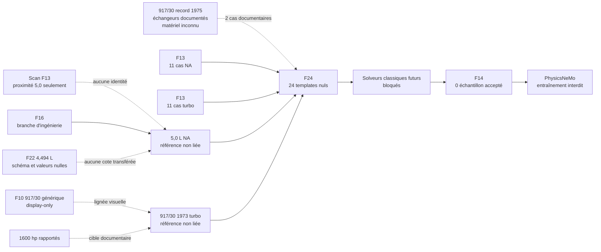

# F24 — préparation fonctionnelle des deux variantes 917

## Portée

F24 crée la plus petite couche commune utile entre deux branches d'ingénierie
et une configuration record strictement documentaire, encore non liées à une
géométrie qualifiée :

- `type_912_5_0_na`, référence atmosphérique 5,0 L ;
- `917_30_1973_turbo_5374`, référence 917/30 turbo 1973 ;
- `917_30_1975_record_turbo_5374`, configuration record 1975 avec échangeurs,
  sans équivalence matérielle déduite avec 1973.

Le résultat est un crosswalk d'identifiants, une matrice d'applicabilité des
12 cas F13 et 24 templates d'entrées nuls : 11 pour chaque branche
d'ingénierie et 2 pour la configuration record. Ce résultat ne
rend aucune variante fonctionnelle. Il ne crée ni CAO, ni deck solveur, ni
résultat, ni échantillon PhysicsNeMo.



## Entrées suivies

Le builder refuse tout changement silencieux des huit contrats amont. Chaque
entrée est enregistrée dans `upstream_contracts` avec son chemin et son SHA-256 :

- F10 : noms de variantes et lignée visuelle seulement ;
- F13 scan : candidats et politique de sélection fermée seulement ;
- F13 solveurs : scénarios, couples variante/cas et schéma d'entrées ;
- F14 banc : frontière sémantique, sans physique moteur ;
- F14 PhysicsNeMo : schéma de dataset et état initial à zéro ;
- F16 : nom de la branche 5,0 L et politique de valeurs nulles ;
- F21 : gates d'identité, d'échelle et d'orientation fermés ;
- F22 : schéma et politique de valeurs nulles du 4,494 L seulement.

Le rapport local `work/917-engine/scan-metrology-f13-report.json` est mentionné
pour traçabilité, mais il n'est ni requis ni lu par le builder. Le scan reste
sans `selected_variant_id`, sans liaison autorisée et sans preuve d'identité,
d'échelle ou d'ajustement dimensionnel.

## Couples de cas

Les dix cas communs sont `001` à `007`, `009`, `010` et `012`.

- `CASE-917-F13-008` est requis pour le 5,0 L NA. Il reste
  `blocked_variant_scope_missing` pour le 917/30, car F13 ne généralise pas la
  preuve des goujons de culasse à cette variante.
- `CASE-917-F13-011` est requis pour le 917/30. Il est
  `not_applicable_turbo_only` pour le 5,0 L NA.
- La branche record 1975 ne reçoit que `CASE-917-F13-001` et `011`. Son compte
  de turbocompresseurs, le nombre et la géométrie des échangeurs ainsi que leurs
  cartes restent `null`; aucune entrée propre à 1975 n'est injectée dans 1973,
  et aucun claim non spécifique de boost ou de spool n'est injecté dans 1975.

Le validateur F14 contrôle également le couple `variant_id` / `case_id` à
partir du registre F13. Un `case_id` connu associé à une variante non admise
est donc rejeté avant toute acceptation d'échantillon.

## Template généré

Chaque élément de `solver_input_templates` contient :

- `template_id`, `variant_id`, `scenario_ref`, `case_id`, `domain` et
  `gate_profile_ref` ;
- les entrées F13 avec `id`, `quantity`, `unit`, `required`, `source_status` et
  `candidate_ref` ; `input_variant_scope` décrit l'applicabilité du template,
  tandis que `source_variant_scope` conserve strictement la portée de la preuve
  F13 (ou reste vide en l'absence de candidat) ;
- `candidate_adopted: false`, puis `value`, `uncertainty`,
  `evidence_manifest_ref` et `review_status` à `null` ;
- les inconnues bloquantes et exigences d'acceptation F13 ;
- les sorties attendues avec `value` et `artifact_ref` à `null` ;
- une géométrie, un runtime solveur, des conditions limites, des critères
  d'acceptation et un export PhysicsNeMo non renseignés ;
- `execution.authorized`, `attempted` et `results_present` à `false`.

Les `candidate_ref` conservent la provenance sans adopter les valeurs candidates
comme données de calcul. Le validateur rejette toute valeur renseignée, toute
adoption d'un candidat, tout manifeste ou runtime renseigné et tout gate F24
ouvert.

## Sorties autorisées maintenant

Seuls les éléments suivants peuvent être générés :

- `twins/reference-917-engine/dual-variant-functional-readiness-f24.json` ;
- le crosswalk des deux variantes d'ingénierie et de la configuration record ;
- la matrice d'applicabilité des 12 cas ;
- les 24 templates d'entrées nuls.

Les listes `geometry_artifacts`, `solver_decks`, `solver_results` et
`physicsnemo_samples` doivent rester vides. F24 ne modifie pas les sorties
locales F14.

## Génération et contrôle

```sh
PYTHONDONTWRITEBYTECODE=1 python3 twins/reference-917-engine/source/build_dual_variant_functional_readiness_f24.py
PYTHONDONTWRITEBYTECODE=1 python3 twins/reference-917-engine/source/build_dual_variant_functional_readiness_f24.py --check
```

Le mode `--check` est en lecture seule. Il recalcule la source déterministe,
vérifie les SHA-256, les 24 couples, toutes les valeurs nulles et tous les gates
fermés. Un rapport `passed` valide uniquement ce contrat fail-closed.

## Conditions avant calcul

Une exécution future exige au minimum, séparément pour chaque variante :

- une identité physique, une échelle et des interfaces vérifiées ;
- une CAO dimensionnée et révisée, sans transfert des cotes F10 ou F22 ;
- des conditions limites, matériaux, tolérances et critères d'acceptation
  sourcés ;
- un runtime solveur immuable, une corrélation aux mesures et une revue
  professionnelle.

PhysicsNeMo reste en aval de cas classiques qualifiés et corrélés. La structure
d'un échantillon, un import logiciel ou la mention documentaire de 1600 hp ne
constituent pas une preuve de simulation.
