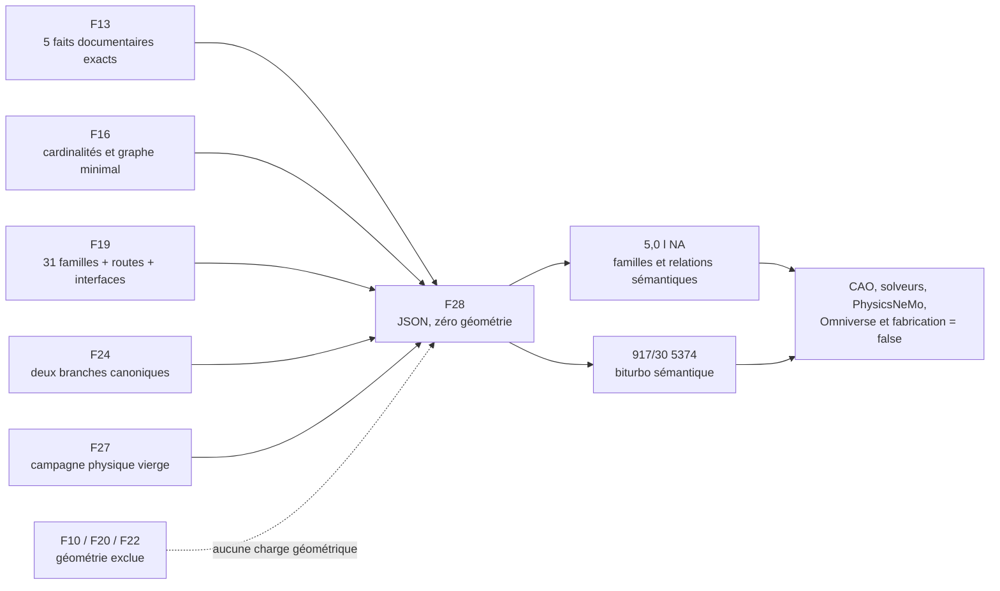
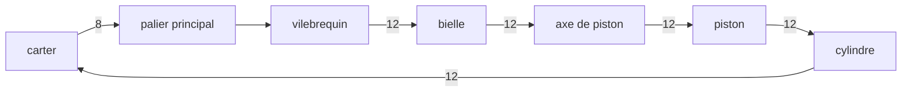
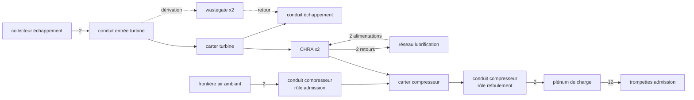
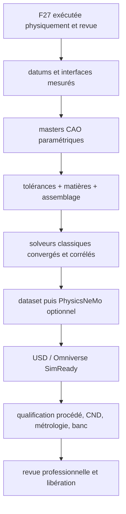

# F28 — contrat CAO paramétrique dual-variant du moteur 917

## Résultat et limite

F28 crée un **contrat sémantique sans géométrie**, pas encore un moteur CAO.
Il sépare strictement :

- `type_912_5_0_na`, référence d'ingénierie atmosphérique 5,0 l ;
- `917_30_1973_turbo_5374`, référence d'ingénierie 917/30 biturbo 1973.

Le contrat contient 54 familles : les 31 familles F19, sans omission ni
changement de route, et 23 extensions explicitement reliées à une famille, une
interface ou une catégorie de backlog F19. Il ne contient aucun solide, mesh,
joint actif, coordonnée, transformation, matière choisie, tolérance ou mesure.
Il ne génère ni `.FCStd`, STEP, STL, 3MF, USD, deck solveur ou dataset
PhysicsNeMo.

`real_bom_complete` reste `false`. Les 54 familles constituent la portée de ce
contrat, pas une nomenclature physique complète. Aucune mention de
fonctionnement, d'imprimabilité ou de puissance validée n'est autorisée.



## Liaisons canoniques et résistance au rebase

Les huit fichiers amont sont liés par des SHA-256 littéraux. La validation
consomme une table canonique interne ; la vue publique `UPSTREAMS` est en
lecture seule. Changer un fichier puis essayer de remplacer son SHA dans cette
vue échoue.

L'empreinte n'est pas la seule défense. Des invariants indépendants vérifient :

- les cinq enregistrements F13, leur variante, valeur, unité, usage, source et
  `design_lock: false` ;
- les sept groupes d'instances et les six relations minimales F16 ;
- les 31 identifiants F19 dans leur ordre, leur route, leur portée visuelle et
  tous leurs gates de libération ;
- les deux identifiants de branche et la référence 1 600 hp de F24 ;
- l'état vierge et non lié de F27 ;
- la frontière d'exclusion F10/F20/F22.

Ainsi, les contournements suivants sont testés et refusés même au niveau des
invariants : reclasser le piston en additif, vider le registre de composants
F16, remplacer la référence 1 600 hp F24 ou faire passer la variante du fait
F13 pour la branche de conception.

## Faits documentaires F13

Les guides ne sont plus recopiés indirectement depuis F24. Ils sont chargés
dans le registre F13 verrouillé :

| Branche F28 | Variante du fait F13 | Alésage | Course | Autorité |
| --- | --- | ---: | ---: | --- |
| `type_912_5_0_na` | `type_912_5_0_na` | 86,8 mm | 70,4 mm | guide documentaire |
| `917_30_1973_turbo_5374` | `917_30_turbo_5374` | 90,0 mm | 70,4 mm | guide documentaire |

Pour chaque valeur, `design_lock`, `cad_parameter_applied` et
`boundary_condition` restent `false`. Aucun slot `dimension_set` n'est rempli.

La mention 1 600 hp distingue volontairement :

- `source_fact_variant_id` :
  `917_30_1600_hp_reported_qualifying_target` ;
- `related_design_branch_id` : `917_30_1973_turbo_5374`.

Ces identifiants ne sont pas interchangeables. La puissance reste
`documentary_only_not_boundary_condition`, sans cible solveur ni validation.

## Couverture F19 et routage

`f19_coverage` énumère les 31 familles F19 et confirme une couverture exacte
31/31. Les familles auparavant omises sont rétablies : `output_shaft`,
`distributor`, `pressure_oil_pump`, `scavenge_oil_pump`, `alternator` et
`turbocharger`. `piston`, `camshaft` et `central_output_gear` sont eux aussi
contrôlés explicitement.

`intake_trumpet` est commun aux deux branches, conformément à la portée F19
`base_and_turbo`. `turbocharger` et `charge_plenum` restent limités à la
branche 917/30.

Chaque extension possède un `source_crosswalk` précis :

- registre F19 exact ;
- un ou plusieurs identifiants source ;
- type de relation vers la famille F28 ;
- règle de dérivation de route.

La chaîne ambiguë
`manufacturing_routing_f19_or_f19_taxonomy_extension` n'existe plus. Les
classes ne sont jamais une sélection : `route_selected` et `released` restent
`false`, et dimensions, interfaces, matières, placements, tolérances,
provenance, revue et datum restent `null`.

Les carters compresseur et turbine restent `unresolved`, car F19 ne donne
qu'une route achetée au turbocompresseur complet. Cette route parent n'est pas
« héritée » artificiellement. Le bâti de banc reste lui aussi `unresolved`.
Les assemblages de conduits, le support/train d'engrenages et l'accouplement
du dynamomètre suivent la classe `hybrid_candidate` de leurs interfaces F19.

## Graphe mécanique commun

Les six relations F16 sont conservées avec leurs intermédiaires, cardinalités
et types :



Le graphe ajoute, toujours sans interface physique :

- culasse ↔ cylindre et joint de feu ;
- arbre à cames ↔ porte-arbre ↔ culasse ;
- arbre à cames → poussoir → soupape d'admission et d'échappement ;
- ressorts des deux soupapes et guidage dans la culasse ;
- train d'engrenages, engrenage de sortie, arbre de sortie, paliers et
  dynamomètre ;
- soufflante, carénage et refroidissement par air ;
- admission, injection, allumage, échappement, lubrification et banc.

Les relations indiquent une `cardinality` et un `planned_interface_type`, mais
`interface_definition`, `placement_transform`, `tolerance_set`, `datum_ref`,
`joint_created` et `active` restent respectivement `null` ou `false`. Une
relation F28 est une exigence de topologie, pas une preuve de connexion réelle.

## Décomposition biturbo

F19 représente deux `turbocharger`. F28 conserve cette famille parent et la
relie à exactement deux assemblages sémantiques :

- `turbo_semantic_01` ;
- `turbo_semantic_02`.

Chaque assemblage possède les références de familles suivantes, sans modèle,
map, position ou géométrie : CHRA acheté, carter compresseur non résolu, carter
turbine non résolu et wastegate achetée.



La famille `compressor_duct_assembly` reste sans quantité physique mais possède
deux rôles sémantiques distincts : frontière ambiante → entrée compresseur, et
sortie compresseur → plénum. La topologie inclut donc les carters, les conduits
chaud et froid, le plénum, la wastegate et les deux liaisons d'huile. Le bypass
NA collecteur → extraction est limité à `na_topology_requirements` : il n'entre
jamais dans le tronc commun ni dans la branche turbo. `maps_selected`,
`flow_network_released`, `lubrication_network_released` et
`topology_bound_to_geometry` restent `false`.

## Fermeture sémantique, pas fonctionnement

Les tests reconstruisent les ensembles NA et turbo et vérifient que chaque
famille déclarée apparaît dans au moins une relation, directement ou comme
intermédiaire. Cela élimine les familles essentielles isolées du graphe.

Cette fermeture est seulement taxonomique. Les étapes nécessaires restent :



PhysicsNeMo ne reconstruit pas les cotes absentes et ne remplace ni solveur
classique ni essais. Une pièce chargée, tournante, sous pression ou chaude ne
peut pas être déclarée imprimable depuis F28.

## Validation reproductible

Depuis la racine du dépôt :

```bash
python3 twins/reference-917-engine/source/build_dual_variant_parametric_cad_contract_f28.py \
  --root . \
  --output twins/reference-917-engine/dual-variant-parametric-cad-contract-f28.json \
  --check

PYTHONDONTWRITEBYTECODE=1 python3 \
  tests/test_917_dual_variant_parametric_cad_f28.py -v
```

Pour reconstruire un JSON déterministe dans un emplacement temporaire :

```bash
python3 twins/reference-917-engine/source/build_dual_variant_parametric_cad_contract_f28.py \
  --root . \
  --output /tmp/dual-variant-parametric-cad-contract-f28.json \
  --write
```

`--check` et `--write` sont mutuellement exclusifs. `--check` ne modifie jamais
le fichier. Le générateur refuse tout suffixe autre que `.json`. Les tests
refusent les fausses valeurs booléennes comme `"true"`, `"false"`, `0`, `1`,
`null`, `[]` ou `{}` dans un gate.

Un résultat `passed` signifie uniquement que le contrat JSON est déterministe,
lié aux upstreams attendus, complet par rapport aux 31 familles F19 et fermé à
toute autorité physique. Il ne prouve aucune géométrie, imprimabilité ni
fonction moteur.
