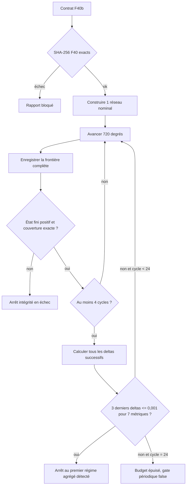

# F40b — recherche étendue du régime périodique agrégé

## Pourquoi F40b existe

Les six cas F40 ont tous achevé quatre cycles, mais aucun n'a satisfait le
seuil de stabilisation de 0,1 %. Le cas nominal `mesh 2,0 / CFL 0,2 / pression
initiale 1,00` présente encore un delta maximal de 4,32 % entre les cycles 3 et
4. Une sensibilité au maillage, au CFL ou à l'état initial n'est pas interprétable
tant que ce transitoire commun reste aussi grand.

F40b prolonge donc ce seul cas nominal de quatre à vingt-quatre cycles. Il
conserve le même réseau et le même état d'un cycle au suivant. Il s'arrête au
premier cycle qui termine une fenêtre de trois deltas consécutifs inférieurs ou
égaux à 0,1 % sur les sept métriques F40. Si aucune fenêtre ne passe au cycle
24, le rapport est conservé mais la commande retourne un échec distinct.

Ce résultat reste strictement numérique et `motored`. Il ne prouve ni la
géométrie, ni la combustion, ni le couple, ni une puissance de 1 600 ch.

## Provenance verrouillée

Le contrat
`twins/reference-917-engine/extended-periodic-state-f40b.json` lie exactement,
par SHA-256 :

- le contrat F40 : `6fff578f...de9178c` ;
- le runner F40 : `fa2e5293...f925d3` ;
- l'image Aeolus1D 0.3.3 : `sha256:742569a4...e096a3`.

Le runner F40 lié vérifie à son tour ses sources F39. Le commit
`c3d68ba9eddbaf19e316ff79ef39037d3d7e5bd6` reste une référence documentaire,
pas une contrainte sur le `HEAD` courant. Le runner ne prétend pas inspecter le
digest du conteneur qui l'exécute ; cette propriété est imposée par la cible
Docker et doit être vérifiée par l'orchestrateur.

## Algorithme d'arrêt



Les sept métriques sont :

- masses des conduits, des composants 0D et du gaz total ;
- pression moyenne volumique des conduits et des composants 0D ;
- température moyenne massique des conduits et des composants 0D.

Pour chaque métrique `q` :

```text
delta(q) = abs(q_n - q_n-1) / max(abs(q_n-1), 1e-12)
```

Un delta est conforme seulement si le maximum des sept valeurs est inférieur
ou égal à `0,001`. Les trois derniers deltas doivent tous être conformes. Le
premier arrêt possible est donc la frontière du quatrième cycle. Chaque
frontière calculée est conservée dans le JSON, y compris lorsque le budget de
24 cycles est épuisé.

## Pourquoi il n'y a pas encore de normes phase-résolues

La couche d'intégration utilisée ici appelle `dispatch_advance` une fois par
cycle et ne dispose pas d'un hook de trace phase-résolue dont la stabilité et
la sémantique aient été vérifiées pour Aeolus1D 0.3.3. F40b refuse de déduire
des normes L2/L∞ à partir d'échantillons implicites ou de frontières de cycle.
Les trois indicateurs `sampling`, `L2` et `Linf` restent donc explicitement
faux. Une phase ultérieure devra ajouter un instrument déterministe par angle
de vilebrequin avant de parler de convergence des formes d'onde, des débits de
soupape, des conduits ou des cylindres.

## Gates et codes de sortie

Le rapport distingue :

- la provenance et le cas nominal ;
- l'intégrité de l'exécution (un réseau, frontières complètes, finitude,
  positivité, couverture exacte) ;
- le respect de la règle d'arrêt ;
- la périodicité agrégée ;
- la convergence phase-résolue, maintenue à `false`.

Toutes les `physical_release_gates` restent à `false`.

En mode exécution :

- code `0` : régime périodique agrégé démontré dans le budget ;
- code `2` : intégrité d'exécution incomplète ;
- code `3` : 24 cycles intègres mais seuil périodique non atteint.

Le code `3` est volontaire : il empêche F41 de consommer silencieusement un
état encore transitoire, tout en préservant le rapport complet.

## Commandes

Manifeste sans exécuter Aeolus :

```bash
make 917-extended-periodic-state-f40b-manifest
```

Smoke dans l'image immuable :

```bash
make 917-extended-periodic-state-f40b-image-smoke
```

Campagne nominale :

```bash
make 917-extended-periodic-state-f40b
```

Le rapport est écrit dans
`work/917-extended-periodic-state-f40b/extended-periodic-state-f40b-report.json`.
Le répertoire peut être remplacé par `F40B_OUTPUT=/chemin/absolu`.

## Frontière d'autorité

F40b contient exactement douze cylindres, comme F39 et F40. Les 27 conduits et
les trois plénums/collecteurs ne sont pas des cylindres supplémentaires. Même
si la gate périodique passe, les dimensions, CdA de soupape, calages, pertes,
transferts thermiques et données de banc restent à mesurer et corréler. Aucune
gate F40b n'autorise injection, combustion, turbo, démarrage ou fabrication.
