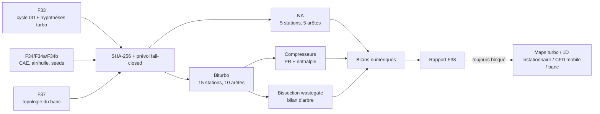

# Réseau stationnaire admission–moteur–échappement — F38

## Résultat

F38 exécute hors réseau un premier réseau de stations pour les deux études
2026 : atmosphérique et biturbo. Il consomme sept parents liés par SHA-256 : le
contrat et le rapport cycle F33, le contrat DOE et le rapport F34, la décision
air/huile F34a, les seeds F34b et le banc sémantique F37.

Le calcul exécute trois familles de contrôles numériques, sans les confondre
avec des validations physiques indépendantes :

- relecture de l'identité F33 `air + carburant = échappement` pour chaque
  variante ;
- calcul du devoir thermique requis de l'échangeur à partir de températures
  prescrites ; ce devoir n'est pas une validation d'échangeur ;
- puissance turbine–compresseur par turbo, avec une fraction wastegate résolue
  par bissection bornée.

Il ne résout pas les ondes dans les conduits, les volumes de plénum, les
soupapes mobiles, la combustion transitoire, les vitesses de rotor ou une
carte turbo. Le résultat de 1 601,196 hp mécaniques reste donc un point 0D F33
non corrélé. F38 ne recalcule avec les mêmes entrées qu'un sous-ensemble de
l'algèbre turbo ; ce n'est ni un modèle indépendant, ni une preuve de
performance.



## Point calculé

Le point biturbo hérité de F33 est à 9 000 tr/min :

| Grandeur | Valeur F38 | Autorité |
|---|---:|---|
| air total | 1,226549579 kg/s | calcul 0D F33 non corrélé |
| carburant | 0,111018754 kg/s | calcul 0D F33 non corrélé |
| échappement | 1,337568333 kg/s | identité F33 reproduite |
| rapport de pression compresseur | 3,215625 | hypothèses F33 |
| débit corrigé par turbo | 0,609927871 kg/s | calcul stationnaire F38 |
| puissance compresseurs | 191,573391 kW | calcul stationnaire F38 |
| puissance retirée aux gaz par les turbines | 197,498341 kW | calcul stationnaire F38 |
| puissance d'arbre turbine après rendement mécanique | 191,573391 kW | calcul stationnaire F38 |
| perte mécanique turbo non affectée | 5,924950 kW | différence F38 ; destination thermique inconnue |
| fraction débit turbine | 0,765696656 | bissection F38 |
| fraction wastegate | 0,234303344 | solution inverse F38 |
| résidu relatif d'arbre | 2,69e-10 | convergence numérique |
| puissance F33 | 1 601,195945 hp mécaniques = 1 623,403997 PS/ch | screening 0D non corrélé |

Changer la cible du seul contrat F38 ne modifie pas la prédiction forward. Un
test porte cette valeur à 1 700 hp mécaniques et vérifie que la prédiction reste
exactement 1 601,195945 hp ; seul le bloc de comparaison change. Cela démontre
uniquement l'absence d'une entrée directe de cible dans F38. Le DOE F34 déclare
explicitement une ascendance indirecte de la cible et un seed de dimensionnement
inverse dans les entrées F33 ; l'indépendance complète vis-à-vis de la cible
reste donc `false`.

Le contrat emploie le **horsepower mécanique** (`1 hp = 745,699871582 W`). Le
`PS`, ou « ch » métrique (`1 PS = 735,49875 W`), est une autre unité : la cible
actuelle de 1 600 hp mécaniques vaut 1 622,191465 PS/ch. Si l'exigence métier
désigne 1 600 PS/ch, il faut modifier explicitement le contrat au lieu de
réutiliser silencieusement le nombre 1 600.

## Refroidissement retenu

F38 lie la décision F34a : le cœur moteur reste strictement refroidi par air
forcé et huile de carter sec. Aucun circuit liquide n'est admis dans le carter,
les cylindres ou les culasses. Un circuit liquide auxiliaire, hydrauliquement
isolé du cœur, reste seulement candidat pour l'échangeur de suralimentation et
éventuellement les CHRA.

Les charges F33 portant encore le nom `head_ht_coolant` sont conservées comme
hypothèses historiques dans l'identité énergétique, explicitement marquées
« non sélectionnées par F34a ». Elles ne définissent pas l'architecture 2026.
La perte mécanique turbo de 5,925 kW est publiée séparément ; F38 ne sait pas
encore quelle part chauffe les paliers, l'huile, un éventuel CHRA auxiliaire ou
l'environnement.

## Exécution

```bash
make 917-gas-path-network-f38
```

Sortie ignorée par Git :

```text
work/917-gas-path-network-f38/gas-path-network-f38-report.json
```

Le dossier reçoit aussi un marqueur `.f38-output.json` lié au hash du rapport.
Le runner refuse de remplacer un dossier existant qui n'est pas reconnu comme
une sortie F38. Une ancienne sortie reconnue est déplacée par renommage atomique
avant installation ; si cette installation échoue, elle est restaurée.

Le runtime utilise uniquement la bibliothèque standard Python. Il n'a besoin
ni de GPU, ni d'accès réseau, ni de clé API NVIDIA. Pour rendre le JSON
canonique entre versions Python supportées, toute valeur flottante calculée
est publiée avec 12 chiffres significatifs ; cette règle est déclarée dans le
contrat et testée séparément de la répétabilité sur un même runtime.

Si le runtime F37 est déjà présent, l'overlay Omniverse est généré par :

```bash
make 917-gas-path-overlay-f38
```

La publication de l'overlay est atomique et refuse d'écraser un dossier
existant. Pour conserver deux itérations, donner une nouvelle destination :

```bash
make 917-gas-path-overlay-f38 \
  F38_OVERLAY_OUTPUT=work/917-gas-path-network-f38/omniverse-run-2
```

Deux USDA sous `work/917-gas-path-network-f38/omniverse/` embarquent chacun une
copie hashée du stage F37 puis la sublayerent localement. Le rapport F37 doit
référencer le contrat F37 épinglé par F38 et le rapport numérique doit être
identique octet par octet à la preuve canonique avant authoring. Les overlays
ajoutent les stations, débits, pressions, températures et résidus sous
`IntegratedRegistry/F38GasPath`. Aucun prim de géométrie, matériau, collision,
masse, joint ou schéma PhysX n'est créé.

L'ouverture réelle avec OpenUSD 26.8 confirme 141 prims composés pour la
variante atmosphérique et 173 pour la biturbo, avec zéro `RigidBodyAPI` et zéro
`CollisionAPI`. Cette vérification porte sur la composition USD, pas sur une
simulation physique.

## Image CPU dédiée

F38 dispose d'une image séparée de la pile Omniverse/CFD. Elle contient onze
fichiers publics exactement autorisés par le contexte Docker : le runner, le
contrat, la preuve canonique et ses sept parents. Elle n'embarque ni scan, ni
maillage, ni poids de modèle, ni client API, ni secret, ni dépendance Python
externe.

```bash
make 917-gas-path-f38-image
make 917-gas-path-f38-image-smoke
```

Le build et le runtime sont `linux/amd64`, non-root (`9138:9138`), sans réseau,
avec système de fichiers en lecture seule au runtime. Le smoke rejoue le calcul
et exige une identité octet par octet avec le rapport canonique
`f433c3a7e0dbfee9139bcd72b244dedfa28bf781101c0bd38ccb47bb9b565e10`.
Il a passé sous Docker Desktop puis nativement sur un nœud Intel `x86_64` sans
GPU NVIDIA.

Le workflow manuel `gas-path-f38-image.yml` construit depuis `main`, publie un
candidat GHCR avec provenance et SBOM, exécute le smoke durci par digest, puis
exige un pull anonyme avec un `DOCKER_CONFIG` vide pour les workers Vast. La
présence du workflow dans une branche ne prouve pas encore qu'un digest GHCR a
été publié : la publication et l'accès anonyme doivent passer dans GitHub
Actions après intégration à `main`.

## Tests de falsification

```bash
make 917-gas-path-network-f38-test
make 917-gas-path-overlay-f38-test
make 917-gas-path-f38-image-test
```

Les tests couvrent : hashes parents, séparation stricte des variantes,
topologie et débits, relecture masse, devoir thermique prescrit, arbre et perte
mécanique turbo, absence de maps, ascendance indirecte de la cible, rendement
compresseur invalide, turbine insuffisante, NaN/valeurs négatives, refus d'un
dossier de sortie non-F38, restauration après échec d'installation et maintien
de toutes les gates physiques à `false`. Ils couvrent aussi la canonisation à
12 chiffres significatifs et l'identité octet à octet de deux exécutions.

## Étape suivante réelle

Le prochain solveur ne pourra être appelé « 1D moteur » qu'après acquisition
des données suivantes :

1. géométries internes étanches et longueurs/sections des conduits ;
2. profils de levée sur 720° et tables `CdA` des soupapes ;
3. volumes de plénum, pertes de charge et températures de paroi ;
4. cartes compresseur et turbine sous licence, numérisées et hashées, sans
   extrapolation hors surge/choke ;
5. inerties, frottements, limites de vitesse turbo et loi `CdA` wastegate ;
6. répartition thermique mesurée des pertes paliers/CHRA et modèle échangeur
   `UA`/pertes ;
7. données carburant, injection et allumage ;
8. traces banc réservées à la corrélation.

À ce stade seulement, un cycle ouvert à douze cylindres, soupapes et pistons
mobiles pourra être convergé sur plusieurs cycles puis comparé au banc. Même
une simulation forward atteignant l'exigence de puissance gardera la
revendication publique bloquée jusqu'à corrélation physique indépendante.
