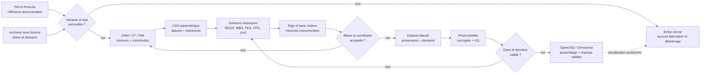

# F29 — sources allemandes et matrice de mesures du moteur Porsche 917

## Objet et frontière d'autorité

Cette note transforme la recherche germanophone en une matrice exploitable pour
la réingénierie du moteur Porsche 917. Elle couvre les données dimensionnelles,
fonctionnelles et matérielles publiquement accessibles pour les moteurs Type 912
atmosphériques et le 917/30 biturbo. Elle indique aussi, champ par champ, ce qui
doit encore être obtenu par dessin autorisé, métrologie ou essai.

Les valeurs ci-dessous sont des **paramètres de CAO candidats**. Elles ne sont ni
des cotes de fabrication, ni des tolérances, ni une preuve d'identité du scan, ni
une preuve de fonctionnement. À la date de cette note :

- aucun moteur physique identifié n'est lié au scan par chaîne de garde ;
- aucune campagne CMM, CT, PMI, dureté ou rugosité n'est exécutée ;
- aucune géométrie interne n'est qualifiée ;
- aucun solveur n'est corrélé à un banc moteur instrumenté ;
- aucune pièce interne n'est autorisée à la fabrication ou au montage ;
- aucun PDF, plan, dessin ou média protégé cité ici ne doit être redistribué
  dans le dépôt.

Les liens directs servent à retrouver la source et à vérifier le contexte. Ils
ne constituent pas une licence de copie. Le dépôt ne doit conserver que des
faits courts paraphrasés, leur provenance et la décision d'ingénierie associée.

## Échelle de confiance et états de maturité

| Code | Confiance documentaire | Usage admissible |
| --- | --- | --- |
| `A` | Source primaire Porsche, FIA ou publication technique originale | Valeur de référence documentaire pour la variante et le contexte exacts |
| `B+` | Observation d'un moteur réel par un reconstructeur identifié | Architecture et séquence d'assemblage ; aucune cote implicite depuis une photo |
| `B` | Source technique secondaire attribuée ou entretien d'un ingénieur identifié | Hypothèse paramétrique à confirmer indépendamment |
| `C` | Métadonnée, inventaire ou preuve d'existence d'un dossier | Piste d'acquisition ; aucune valeur de conception extraite |

Les états suivants ne sont pas interchangeables :

| État | Sens |
| --- | --- |
| `reference_documentaire` | Fait attribué à une source et à une variante |
| `candidate_parametric` | Paramètre provisoire utilisable pour une CAO ou un calcul exploratoire |
| `measured_reference` | Valeur issue d'une mesure physique traçable avec incertitude |
| `simulation_correlated` | Modèle numérique comparé à des essais dans un domaine déclaré |
| `manufacturing_authorized` | Définition, matière, procédé et validation approuvés par l'autorité compétente |

La présente note atteint au mieux `candidate_parametric`. Aucun élément ne
devient `measured_reference`, `simulation_correlated` ou
`manufacturing_authorized` par sa seule présence dans ce document.

## Variantes strictement séparées

| Identifiant de travail | Configuration | Données publiées retenues | À ne pas fusionner |
| --- | --- | --- | --- |
| `type912_4494_1969` | Type 912 initial atmosphérique | 4 494,2 cm³ ; 85 × 66 mm ; RV 10,5:1 ; fiche FIA à 520 ch DIN et 8 000 tr/min | Les états ultérieurs annoncés à 580 ch, le 4,907 l et le 4,999 l |
| `type912_4907_1970_71` | Évolution atmosphérique homologuée | 4 907,28 cm³ ; 86 × 70,4 mm ; vilebrequin monobloc `912.102.031.00` ; fiche Porsche KH 1971 à 600 ch | Le 4,999 l final à alésage 86,8 mm |
| `type912_4999_final_na` | Atmosphérique final 5,0 l | 4 999 cm³ ; candidat secondaire 86,8 × 70,4 mm ; RV 10,5:1 ; 630 ch à 8 300 tr/min | Le 4,907 l, même si les deux partagent une course publiée de 70,4 mm |
| `91730_001_5000_turbo` | Prototype 917/30-001 biturbo | 5,0 l ; environ 1 000 ch selon Porsche | Le 917/30 de course 5,374 l |
| `91730_5374_1973` | 917/30 biturbo 1973, cible Type 912/52 à confirmer sur l'actif | 5 374 cm³ ; candidat secondaire 90 × 70,4 mm ; RV 6,5:1 ; état de course publié à 1 100 ch et fiche musée à 1 200 ch | Le prototype 5,0 l et le réglage record 1975 |
| `91730_5374_1975_record` | État record 1975 avec échangeurs | 1 230 ch publiés ; premiers échangeurs de suralimentation 917 en 1975 | Le moteur 1973 sans échangeur ; la puissance et les conditions de boost ne sont pas transférables |

Les puissances de 1 100, 1 200 et 1 230 ch décrivent des états, réglages ou
années différents. Elles doivent devenir des cas de charge séparés avec leur
propre carburant, pression de suralimentation, avance, température, durée et
source. Elles ne doivent pas être moyennées.

La désignation `Type 912/52` doit être liée à une plaque, un numéro de moteur ou
un dossier Porsche autorisé avant de devenir l'identité de l'actif physique.

## Matrice des sources

| ID | Source et URL directe | Variante | Page ou section | Faits paraphrasés retenus | Droits et conservation | Confiance |
| --- | --- | --- | --- | --- | --- | --- |
| `S01` | [FIA Historic Database, homologation n° 250](https://historicdb.fia.com/node/99501) ; [PDF direct de 17 pages](https://historicdb.fia.com/sites/default/files/car_attachment/1601078401/homologation_form_number_250_group_4.pdf) | `type912_4494_1969` | p. 8 | 12 cylindres, 85 × 66 mm, 4 494,2 cm³, RV 10,5:1, chambre nominale 39,5 cm³, cylindres et culasses séparés en alliage léger, alésages chromés durs, piston alliage léger à 3 segments, hauteur axe-calotte 43 mm, vilebrequin forgé assemblé à 8 paliers, carter sec, 30 l d'huile en circulation, ventilateur Ø 330 mm à 6 pales | La FIA présente la fiche pour consultation et précise qu'elle n'a pas valeur d'homologation actuelle. Ne pas redistribuer le scan ; citer les champs courts | `A` |
| `S02` | [Même fiche FIA n° 250](https://historicdb.fia.com/sites/default/files/car_attachment/1601078401/homologation_form_number_250_group_4.pdf) | `type912_4494_1969` | p. 8 | Maneton de bielle Ø 52 mm ; volant 2,2 ± 0,2 kg ; volant et embrayage 5,35 ± 0,2 kg ; vilebrequin 23,75 ± 0,2 kg ; bielle 0,42 ± 0,02 kg ; piston, axe et segments 0,46 ± 0,02 kg | Même restriction. La conversion impériale imprimée de 43 mm paraît erronée ; conserver la valeur métrique. Le libellé de la cote 56 mm de l'article 159 est ambigu et ne doit pas piloter la CAO | `A` |
| `S03` | [Même fiche FIA n° 250](https://historicdb.fia.com/sites/default/files/car_attachment/1601078401/homologation_form_number_250_group_4.pdf) | `type912_4494_1969` | p. 4 et p. 9 | Quatre arbres à cames en tête entraînés par engrenages, poussoirs godets. Admission : Ø 47,5 mm, levée 12,1 mm, jeu froid 0,1 mm, ouverture 104° avant PMH, fermeture 104° après PMB. Échappement : Ø 40,5 mm, levée 10,5 mm, jeu 0,1 mm, ouverture 105° avant PMB, fermeture 75° après PMH. Enveloppes de lobe S/T/U : admission 27,1/15/30 mm ; échappement 25,5/15/30 mm | Les croquis de brides et les enveloppes de lobe sont des références documentaires, pas une définition surfacique ni une loi de levée complète | `A` |
| `S04` | [Même fiche FIA n° 250](https://historicdb.fia.com/sites/default/files/car_attachment/1601078401/homologation_form_number_250_group_4.pdf) | `type912_4494_1969` | p. 10 | Pompe Bosch `PED 12 KL 60 A 120 LV 1675`, 12 pistons, 12 injecteurs indirects, conduit d'admission Ø 41 mm avec tolérance supérieure publiée de 0,8 mm, 3 pompes électriques ; 2 distributeurs, 4 bobines et 2 bougies par cylindre ; alternateur, courroie, 12 V ; 520 ch DIN à 8 000 tr/min, couple 46 mkp à 6 800 tr/min | Citation factuelle seulement. La référence de pompe n'apporte ni loi de came, ni calibration, ni débit d'injecteur | `A` |
| `S05` | [Même fiche FIA, extension 1/1E](https://historicdb.fia.com/sites/default/files/car_attachment/1601078401/homologation_form_number_250_group_4.pdf) | `type912_4907_1970_71` | p. 14, valable au 1er janvier 1970 | 4 907,28 cm³, 86 × 70,4 mm, 408,94 cm³ par cylindre, vilebrequin forgé monobloc `912.102.031.00` | Ne pas appliquer ces valeurs au 4,999 l à alésage publié de 86,8 mm | `A` |
| `S06` | [Brochure usine Porsche 917 de 1969, miroir Stuttcars](https://www.stuttcars.com/wp-content/uploads/2025/02/Porsche-917-1969-INT-.pdf) | `type912_4494_1969` | p. 5 et p. 7 | Carter, culasses et cylindres en métal léger, alésages chromés durs, vilebrequin en deux pièces matricées, bielles en titane forgé, paliers lisses, deux ACT par banc avec godets et engrenages, trois pompes électriques vers une pompe d'injection double rangée à 12 pistons, double allumage transistorisé, carter sec et ventilateur horizontal entraîné par la distribution | Brochure Porsche protégée, hébergée par un tiers. Ne pas la copier ni en extraire des images ou dessins ; conserver URL, pages et paraphrase | `A` pour le document et la variante |
| `S07` | [Porsche, fiche technique 917 KH 1971](https://newsroom.porsche.com/dam/jcr:f4ee0730-e7ea-4bfe-9fd9-2592ef47b762/Datenblatt%20Porsche%20917_KH_) | `type912_4907_1970_71` | p. 1 | V12 à 180°, 4 907 cm³, 441 kW/600 ch, véhicule de 800 kg | Média Porsche protégé. Le réservoir d'huile de 55 l décrit pour cette voiture du Mans est un composant véhicule et un choix de répartition des masses, pas le remplissage générique du moteur | `A` |
| `S08` | [Porsche Museum, 917/30 Spyder](https://newsroom.porsche.com/de/pressemappen/Porsche-Museum/Porsche-917-30-Spyder.html) ; [fiche PDF directe](https://newsroom.porsche.com/pdf/9ede995b-d407-49e1-a654-b29b43514ed2?print=) | `91730_5374_1973` | PDF p. 1 | Année modèle 1973, 12 cylindres en V à 180°, turbo, 5 374 cm³, 882 kW/1 200 ch, vitesse maximale publiée de 385 km/h | Média Porsche protégé. La fiche musée ne donne pas l'état exact de boost, le carburant, la température ni la durée au banc | `A` |
| `S09` | [Porsche, « Die Anfänge und die Turbo-Technologie im Motorsport »](https://newsroom.porsche.com/de/pressemappen/50-Jahre-Porsche-Turbo-36122/Die-Anf%C3%A4nge-und-die-Turbo-Technologie-im-Motorsport.html) | 917/10 et 917/30 turbo | Section « Drucksache » et chronologie | Un turbocompresseur plus petit par banc ; wastegate placée en amont et dérivant les gaz pour régler la pression ; organe allégé, automatique et refroidi intensément ; gaz d'échappement jusqu'à 1 100 °C. Chronologie publiée : 4,5 l turbo 850 ch/270 kg, 5,0 l 1972 1 000 ch, 5,4 l 1973 1 100 ch, moteur record 1975 1 230 ch | Texte et médias Porsche protégés ; paraphrase factuelle seulement | `A` |
| `S10` | [Porsche, « Turbo-Vision »](https://newsroom.porsche.com/de/2024/historie/porsche-turbotechnologie-motorenbau-vision-christophorus-411-36722.html) | `91730_5374_1973` et `91730_5374_1975_record` | Passages sur le « Dampfrad » et les échangeurs | Pression réglable par le pilote ; surveillance thermique déterminante ; premiers échangeurs de suralimentation du 917 en 1975 | Média Porsche protégé. Fait nécessaire pour maintenir une branche 1973 sans échangeur et une branche 1975 avec échangeurs | `A` |
| `S11` | [Porsche, « Am Limit »](https://newsroom.porsche.com/de/motorsport/porsche-919-hybrid-evo-917-30-canam-spyder-timo-bernhard-mark-donohue-rennwagen-16319.html) | `91730_5374_1973` et `91730_5374_1975_record` | Passages 917/30 et Talladega | État de course publié à 1 100 ch et 7 800 tr/min ; moteur record 1975 à 1 230 ch avec échangeurs ; boost élevé au départ puis réduit pour la durée et la consommation | Média Porsche protégé. Chaque puissance doit rester liée à son état et à son année | `A` |
| `S12` | [Porsche Christophorus, Hans Mezger et Le Mans 1970](https://newsroom.porsche.com/christophorus/de/2019/390/le-mans-1970-hans-mezger-17024.html) | Moteur 917 Le Mans 1970 | Passage sur les goujons de culasse | 48 goujons Dilavar ; longueur 149,5 mm, tige Ø 9 mm, masse 65 g chacun ; isolation fibre de verre et résine pour limiter le refroidissement par le ventilateur et gérer les dilatations magnésium/aluminium | Média Porsche protégé. La géométrie d'extrémité, les filetages, la nuance, le traitement et la précharge ne sont pas publiés ; ne pas transposer au 917/30 sans mesure | `A` |
| `S13` | [Porsche, rencontre des constructeurs du 917-001](https://newsroom.porsche.com/de/2019/historie/porsche-917-001-treffen-zeitzeugen-weissach-mezger-kuechle-bemsel-ziegler-steckkoenig-burst-kolb-ahrens-17547.html) | `type912_4494_1969` | Passages sur la mise au point moteur | Premier moteur au banc au début de décembre 1968 ; 25 moteurs montés manuellement ; conduites d'injection mises en forme à chaud | Média Porsche protégé. Source de procédé et de chronologie, pas de géométrie | `A` |
| `S14` | [Porsche, 50 ans du 917 à Goodwood](https://newsroom.porsche.com/de/2019/unternehmen/porsche-917-50-jahre-goodwood-members-meeting-2019-17461.html) | `91730_001_5000_turbo` et 917/30 Sunoco | Passages sur les variantes exposées | Le châssis 917/30-001 est décrit avec un 5,0 l biturbo d'environ 1 000 ch ; le 5,4 l de course est une autre configuration | Média Porsche protégé. Sert à empêcher l'assimilation du prototype 5,0 l au 5,374 l | `A` |
| `S15` | [auto motor und sport, « Kraftwerk ohnegleichen »](https://www.auto-motor-und-sport.de/oldtimer/porsche-917-motor-kraftwerk-ohne-gleichen/) | `type912_4999_final_na` et `91730_5374_1973` | Paragraphes techniques moteur | Candidats : 4,999 l à 86,8 × 70,4 mm, RV 10,5:1, 630 ch à 8 300 tr/min et environ 588 N·m à 6 500 tr/min ; 5,374 l à 90 × 70,4 mm, RV 6,5:1, 1 100 ch à 7 800 tr/min et 112 mkg à 6 400 tr/min. Carter magnésium, 8 paliers, prise centrale, injection mécanique Bosch, double allumage, carter sec à une pompe de pression et six récupérations, 24 l, 260 kg NA et 285 kg turbo, ordre publié `1-9-5-12-3-8-6-10-2-7-4-11`, pression turbo publiée 1,3 bar | Article protégé sans licence ouverte. Source secondaire : toutes les valeurs deviennent des hypothèses à mesurer. La convention de numérotation des cylindres et le caractère absolu ou relatif du boost restent inconnus | `B` |
| `S16` | [Canepa, reconstruction d'un moteur 917/30](https://www.canepa.com/porsche-917-30-engine-build-up/) | 917/30 réel, configuration exacte à identifier | Texte et séquence photographique | Carter magnésium séparé, bielles titane, pistons et cylindres, RV annoncé 6,5:1, engrenage central du vilebrequin vers les porte-arbres, 12 culasses séparées en aluminium, deux ACT par banc, grande admission et plus petite soupape d'échappement | Photographies et texte protégés. Utilisables pour vérifier une topologie et préparer une nomenclature, jamais pour relever des cotes depuis les pixels | `B+` |
| `S17` | [Hans Mezger, « The Development of the Porsche Type 917 Car », IMechE/SAGE](https://journals.sagepub.com/doi/10.1243/PIME_PROC_1972_186_005_02) | Développement 917 jusqu'en 1972 | Article pp. 11–28 ; page publique limitée aux métadonnées/résumé | Publication technique originale attribuée à Hans Mezger ; le résumé public mentionne le 12 cylindres refroidi par air et l'emploi de titane, aluminium, magnésium et fibre de verre | Article sous droits et accès restreint. Obtenir légalement le texte complet ; ne pas reconstruire son contenu depuis une copie non autorisée | `A` pour métadonnées, contenu détaillé non acquis |
| `S18` | [Hans Mezger, SAE 780718, « Turbocharging Engines for Racing and Passenger Cars »](https://saemobilus.sae.org/papers/turbocharging-engines-racing-passenger-cars-780718) | Développement turbo Porsche | Page publique de métadonnées/résumé | Piste primaire pour l'architecture et le contrôle de suralimentation ; aucune cote détaillée n'est publique sur la page | Publication SAE sous droits. Acquisition légale requise avant exploitation du corps de l'article | `A` pour métadonnées, contenu détaillé non acquis |
| `S19` | [Automobilia Ladenburg, catalogue, lot 1650](https://www.automobilia-ladenburg.de/aAPI/catalogs/de/d440a08575b5c254b9d51d484a0bede9/page/24?layout=print) | Dossier usine Type 912 et 917 | Page 24, lot 1650 | Le catalogue décrit un dossier comprenant données 917 K/L/10/30, couples et ordre d'injection Type 912, réglage de pompe, révision 30 h, diagramme de compression, schéma d'huile, calage des cames et de l'allumage, dessin moteur/boîte au 1:5 et dessins d'arbres intermédiaires au 1:1 | La notice prouve l'existence du dossier, pas un droit de copie ni la validité d'une transcription. Propriétaire et droits à établir avant consultation ou acquisition | `C` |
| `S20` | [Porsche Unternehmensarchiv](https://www.porsche.com/germany/aboutporsche/porschemuseum/archiveandcollection/) ; [contacts Porsche Newsroom](https://newsroom.porsche.com/de/kontakte-de.html) | Toutes | Pages institutionnelles | Voie licite à privilégier pour identifier les dessins, états moteur, numéros, spécifications et droits de reproduction | Demande et licence nécessaires. Décrire l'objet de recherche, l'usage numérique et toute intention de fabrication ; aucun contact externe sans autorisation du propriétaire du projet | `A` pour la procédure d'accès |

Les [conditions d'utilisation du Porsche Newsroom](https://newsroom.porsche.com/de/bilder-media/videos/porsche-newsroom-nutzungshinweise.html)
encadrent les textes, images, vidéos et autres médias Porsche. Aucune des
sources tierces ci-dessus n'affiche une licence ouverte autorisant la
redistribution générale de ses plans, PDF ou photographies.

## Matrice CAO candidate contre mesures indispensables

| Sous-système | Ce qui peut être construit maintenant | Variante et preuve | Mesures ou documents indispensables avant modèle fonctionnel | Porte minimale visée |
| --- | --- | --- | --- | --- |
| Architecture d'assemblage | Deux bancs, 12 cylindres, 12 culasses séparées, 4 ACT, 2 soupapes et 2 bougies par cylindre, prise centrale candidate | `S01` à `S06`, `S15`, `S16` | Identification physique de la variante ; coordonnées des datums ; entraxes XYZ ; plans de joints ; chiralité ; enveloppe complète | `measured_reference` |
| Carter | Demi-carters et logements fonctionnels symboliques | `S01`, `S15`, `S16` | CT et CMM ; épaisseurs ; selles de paliers ; galeries ; filetages ; défauts ; alliage Mg exact par PMI/OES ; traitement et propriétés à température | `measured_reference` |
| Cylindres | Primitives aux alésages et courses publiés | `S01`, `S05`, `S15` | Entraxe, longueur, deck, embase, bride, ailettes, ovalisation, conicité, état de surface, revêtement et jeu piston | `measured_reference` |
| Culasses/chambres | Volumes cibles et ports symboliques | `S01`, `S03` | CT haute résolution, CMM des interfaces, volume liquide, épaisseurs, sièges/guides, conduits, ailettes, joints et alliage/traitement | `measured_reference` |
| Vilebrequin | Axe, 8 paliers et course candidate ; budget de masse du 4,494 l | `S01`, `S02`, `S05`, `S15` | Tourillons/manetons, largeurs, rayons, déphasages, contrepoids, perçages d'huile, faux-rond, matière, dureté, TTH, contraintes résiduelles et équilibrage | `measured_reference` puis FEA corrélée |
| Bielles | Corps simplifié avec masse cible du 4,494 l | `S02`, `S06`, `S16` | Entraxe, alésages et largeurs, axe, sections, rayons, vis, précharge, nuance Ti, forge/TTH, état de surface, NDT et données fatigue | `measured_reference` puis essais coupons/pièce |
| Pistons/segments/axes | Piston simplifié par alésage, course et RV ; masse cible du 4,494 l | `S01`, `S02`, `S15` | Calotte/chambre appariées, compression height, pin bore/offset, jupe, gorges, pack segments, jeux à froid/chaud, alliage, revêtement, canal d'huile éventuel et fatigue thermique | `measured_reference` puis thermique/tribologie corrélées |
| Engrenages/prise centrale | Graphe cinématique et corps primitifs | `S03`, `S15`, `S16` | Module, nombres de dents, angles, profils, entraxes, largeurs, jeux, phases, roulements, lubrification, matière, dureté et bruit/vibration | `measured_reference` |
| Soupapes/sièges/guides | Diamètres et levées maximales du 4,494 l ; mouvements simplifiés | `S03` | Diamètres de tige, longueurs, angles, sièges, guides, masses, matériaux, revêtements, dilatations, étanchéité et durée à chaud | `measured_reference` puis banc culasse |
| Cames/ressorts | Événements et enveloppes de lobes du 4,494 l | `S03` | Loi de levée complète par angle, cercle de base, rampes, phase, torsion, ressorts par courbes force-course, masses mobiles, hauteur installée et marge d'affolement | `measured_reference` puis banc distribution |
| Goujons | 48 tiges candidates de 149,5 × Ø 9 mm et 65 g pour le contexte 1970 | `S12` | Filetages, extrémités, longueurs engagées, nuance Dilavar, TTH, isolation, couple, précharge, relaxation et confirmation propre à chaque variante | `measured_reference` |
| Lubrification | Schéma carter sec ; une pression et six récupérations comme hypothèse secondaire | `S01`, `S07`, `S15`, `S19` | Géométrie des pompes, galeries, gicleurs, clapets, réservoir, thermostat et radiateur ; courbes débit/pression/température ; pertes, moussage et niveaux dynamiques | `simulation_correlated` sur rig huile |
| Refroidissement par air | Ventilateur simplifié du 4,494 l et réseau thermique conceptuel | `S01`, `S09`, `S12` | Scan des pales/ailettes, rapport d'entraînement, courbe Q-ΔP-puissance, fuites, distribution cylindre par cylindre, températures culasse/cylindre et rejet thermique | `simulation_correlated` sur rig puis banc |
| Injection/carburant | Nomenclature fonctionnelle Bosch et ordre d'allumage candidat | `S04`, `S15`, `S19` | Loi de came/plongeur, calibration régime-charge, débit et jet injecteur, compliance conduites, carburant, filtres, pompes, pression et température | `simulation_correlated` sur banc d'injection |
| Allumage/électricité | Double allumage symbolique, 24 bougies, 4 bobines, 2 distributeurs | `S04` | Schéma, avance, dwell, phasage distributeurs, bougies/gap, alternateur, démarreur, résistance, isolation et mesures tension/courant | `simulation_correlated` sur rig électrique |
| Collecteurs/turbos | Un turbo par banc, wastegate amont, branche 1973 sans échangeur | `S09`, `S10`, `S15` | Modèles et numéros de turbos ; roues, volutes et A/R ; cartes compresseur/turbine ; inertie, jeux, paliers, alimentation/retour huile ; géométrie et volume des collecteurs | `measured_reference` puis rig gaz |
| Wastegates/commande | Valve de dérivation et commande pilote conceptuelles | `S09`, `S10`, `S11` | Siège/clapet/tige/diaphragme, ressort, refroidissement, pression de référence, hystérésis, loi du « Dampfrad », sécurité et réponse transitoire | `simulation_correlated` sur rig chaud |
| Matériaux | Affectations provisoires : Mg, alliages légers, titane forgé, Dilavar, acier des échappements | `S01`, `S06`, `S12`, `S15`, `S16` | Nuance et état exacts, PMI/XRF/OES, dureté, métallographie, revêtements, conductivité, dilatation, module, fluage, fatigue, corrosion et compatibilité galvanique | Dossier matière approuvé |
| Masse/inertie | Masses unitaires FIA du 4,494 l et budgets moteur secondaires | `S02`, `S09`, `S15` | Pesée étalonnée de chaque pièce/configuration, centre de gravité, tenseurs d'inertie et bilan des fluides | `measured_reference` |
| Banc moteur | Points de puissance/couple servant de cibles historiques | `S04`, `S07` à `S11`, `S15` | Couple, débit air/carburant, BSFC, lambda, EGT/CHT par cylindre, pression cylindre, huile P/T, boost, cliquetis, blow-by, vibrations, chaleur rejetée, transitoires, endurance et inspection | `simulation_correlated` |

## Données explicitement non établies

Les éléments suivants doivent rester `unknown`, même si une géométrie plausible
peut être dessinée :

- plans cotés complets du carter, du vilebrequin, des bielles, pistons,
  culasses, chambres et arbres intermédiaires ;
- entraxe de bielle, diamètres et déports complets des paliers, rayons, jeux et
  tolérances ;
- motif de fixation complet des culasses et spécification de précharge ;
- lois de cames continues, ressorts, sièges, guides et matières de soupapes ;
- nuance, traitement et propriétés des alliages Mg, Al, Ti et Dilavar ;
- géométrie des pompes, galeries, gicleurs, clapets et cartes huile ;
- référence exacte, cartes, inerties et jeux des turbos historiques ;
- dimensions et loi de commande des wastegates ;
- calibration de l'injection, de l'allumage et du « Dampfrad » ;
- conditions complètes associées aux chiffres de puissance historiques ;
- carte de banc corrélée et limites de défaillance.

Le chrome dur est documenté pour le 4,494 l. Une affirmation de revêtement
Nikasil pour une évolution ultérieure reste secondaire tant qu'elle n'est pas
liée à une pièce et à une analyse. Les affirmations non primaires concernant
des soupapes d'échappement en titane ne sont pas retenues : elles exigent un
certificat matière ou une analyse métallurgique, surtout au regard des
températures de gaz publiées jusqu'à 1 100 °C.

## Ordonnancement d'acquisition et de validation

1. **Geler les variantes.** Créer quatre branches documentaires séparées pour
   4,4942 l, 4,90728 l, 4,999 l et 5,374 l, plus les états distincts prototype
   5,0 l turbo et record 1975. Interdire tout héritage non sourcé entre elles.
2. **Lier l'actif.** Relever plaque, numéro moteur, configuration, historique,
   photographie de custody et masse sans publier les identifiants sensibles.
3. **Acquérir légalement les sources primaires.** Demander à Porsche Archiv les
   plans et dossiers de Type 912/état 917/30 ; obtenir légalement les articles
   IMechE et SAE ; rechercher la traçabilité du dossier décrit au lot 1650.
4. **Figer la métrologie avant démontage.** Définir datums, caractéristiques,
   incertitudes, répétitions, environnement, instruments et chaîne de garde.
5. **Mesurer l'extérieur et l'intérieur.** Combiner CMM, CT, scan structuré,
   pesée, volume liquide, rugosité et métrologie des engrenages sur un moteur NA
   identifié puis sur un 917/30 5,374 l identifié.
6. **Caractériser les matériaux.** Employer PMI/OES, dureté, métallographie,
   mesure de revêtement et NDT sur des zones autorisées ; distinguer chaque lot
   et chaque état thermique.
7. **Construire la CAO paramétrique.** Modéliser chaque pièce depuis ses datums,
   cotes, tolérances et interfaces ; conserver la source et l'incertitude de
   chaque paramètre ; produire des volumes fluides séparés et étanches.
8. **Fermer les solveurs classiques.** Corréler d'abord les modèles 0D/1D,
   thermique, lubrification, MBD, FEA, CFD et transfert thermique conjugué sur
   des rigs de sous-systèmes.
9. **Passer le banc par paliers.** Rotation entraînée et amorçage d'huile,
   étanchéité, allumage/injection sur rigs, démarrage atmosphérique à faible
   charge, cartographie progressive, puis branche turbo avec protections.
10. **Produire un dataset attesté.** Versionner géométrie, maillage, conditions,
    solveur, convergence, mesures, incertitudes et états de fonctionnement sans
    mélanger les variantes dans les splits.
11. **Entraîner PhysicsNeMo.** L'utiliser comme surrogate d'un domaine déjà
    corrélé, avec holdout par géométrie et point de fonctionnement, estimation
    d'incertitude et garde hors domaine.
12. **Publier dans Omniverse.** Exporter OpenUSD, cinématique et champs validés
    avec l'état de preuve de chaque prim ; un rendu ou une animation ne relève
    aucun gate de fabrication ou de démarrage.

## Chaîne de preuve numérique et physique

Cette chaîne interdit trois raccourcis :

1. une fiche FIA ne remplace pas CMM/CT et l'identification de l'actif ;
2. PhysicsNeMo ne remplace ni un solveur de référence ni un banc corrélé ;
3. Omniverse ne constitue ni une preuve de fonctionnement ni une autorisation
   de fabriquer, assembler ou démarrer.

## Verdict F29

Les sources publiques suffisent pour créer une architecture, une nomenclature
initiale, des squelettes cinématiques et des paramètres exploratoires. La base
4,907 l est la mieux délimitée par des documents primaires publics. Les
géométries finales 4,999 l et 5,374 l restent dépendantes de sources secondaires
pour plusieurs cotes fondamentales.

Un moteur visuellement complet ou cinématiquement animé peut donc être produit
comme **modèle candidat**. Un moteur « 100 % fonctionnel et imprimable » ne peut
pas être affirmé : il manque les plans autorisés, la liaison au moteur réel, les
mesures internes, les matériaux et traitements exacts, les jeux, les cartes de
fluides, la corrélation des solveurs et le banc instrumenté. Toute fabrication
de pièces internes, toute mise sous pression, toute rotation à haute vitesse et
tout démarrage restent interdits sans revue d'ingénierie et validation physique
documentées.
