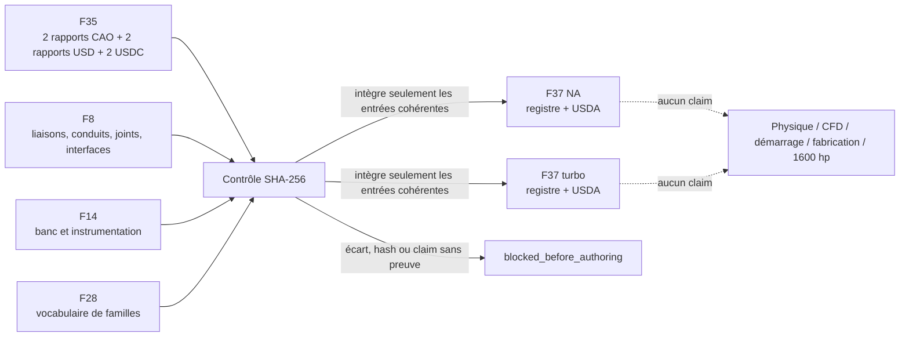

# Assemblage systèmes et banc bi-variante — F37

## Résultat

F37 produit deux registres intégrés, un pour le Type 912 4,5 L atmosphérique
et un pour le 917/30 5,374 L biturbo. Le générateur consomme à l'exécution les
deux rapports de géométrie F35, les deux rapports USD et les deux fichiers USDC.
Chaque fichier est lié au rapport F37 par son SHA-256 et sa taille.
Les deux inventaires de 99 repères F35 sont aussi verrouillés par total et par
famille : 1 axe vilebrequin, 8 paliers, 6 manetons, 12 grands bouts, 12 petits
bouts, 12 axes de piston, 12 plans de calotte et 36 gorges de segments. Le
rapport USD doit reproduire exactement ces comptes, avec zéro repère mesuré et
zéro joint physique.

F37 est une composition **sémantique**. Elle ne crée pas de nouvelle géométrie,
ne copie pas les USDC F35, n'active aucun joint, et ne prétend pas que les
arêtes de conduits F8 sont des volumes fluides fermés.



## Frontière d'autorité

Le fichier F28 atmosphérique décrit `type_912_5_0_na`, alors que l'artefact F35
est `type_912_4_5_na`. F37 ne les fusionne pas. Il importe uniquement le
vocabulaire de familles de F28 et enregistre explicitement
`f28_identity_match: false`. Aucune cote, géométrie, position, matière ou
identité de variante n'est transférée.

L'alias turbo F28 contient aussi l'année dans son identifiant. Il est conservé
comme référence sémantique et non comme liaison géométrique.

## États publiés

Chaque groupe du registre porte l'un de ces deux états :

- `proxy` : représentation visuelle F35 ou endpoint sémantique F8/F14 ;
- `not_modelled` : famille ou domaine inventorié sans géométrie exploitable.

Les six familles tournantes F35 totalisent 81 occurrences par variante. Les
autres familles F28 restent `not_modelled`. Les équipements et capteurs F14
sont des proxies sémantiques. Les liaisons F8 restent des arêtes sémantiques
avec `physics_enabled: false`. Les conduits et interfaces d'étanchéité F8
restent `not_modelled`.

| Registre | NA groupes / occurrences | Turbo groupes / occurrences | État F37 |
|---|---:|---:|---|
| Familles F28 | 45 / 81 connues | 53 / 81 connues | 6 proxies, reste non modélisé |
| Équipements F14 | 12 / 16 | 12 / 16 | proxy sémantique |
| Instrumentation F14 | 10 / 49 | 10 / 49 | proxy sémantique |
| Liaisons mécaniques F8 | 17 / 117 | 18 / 119 | proxy, zéro joint physique |
| Conduits F8 | 14 / 82 | 19 / 92 | non modélisé |
| Étanchéités F8 | 22 / 170 | 28 / 192 | non modélisé |
| Interfaces externes F8 | 4 / 4 | 6 / 6 | proxy sans condition limite |

Le nombre d'occurrences des familles non modélisées reste zéro : F37 ne déduit
pas une nomenclature physique à partir de la simple présence d'un nom F28.

## Politique CFD à échec fermé

Si un conduit amont déclare `geometry_released: true` ou
`flow_simulation_ready: true`, le générateur exige un objet
`closed_volume_evidence` contenant :

- le chemin de l'artefact de preuve ;
- son SHA-256 ;
- `watertight_check_passed: true`.

L'absence du fichier, un hash différent, un champ manquant ou un contrôle
d'étanchéité faux bloque toute écriture USDA. Cette attestation minimale reste
un prérequis logiciel ; elle ne remplace ni la revue de maillage, ni les
conditions limites, ni la corrélation expérimentale.

## Sorties

Le générateur utilise uniquement la bibliothèque standard Python. Il produit
un USDA ASCII autoportant pour le registre sémantique, sans dépendre d'OpenUSD
et sans référence USD vivante vers la géométrie F35 :

```bash
python3 twins/reference-917-engine/source/build_integrated_bench_f37.py
```

Sorties ignorées par Git sous `work/917-integrated-bench-f37/` :

- `integrated-bench-f37-report.json` ;
- `<variant>/integrated-registry-f37.json` ;
- `<variant>/integrated-bench-f37.usda`.

Le rapport positif signifie uniquement que les entrées attendues étaient
présentes, liées par hash et cohérentes avec le contrat fail-closed. Les gates
de masses/inerties, joints physiques, volume CFD, démarrage, fabrication et
1 600 hp restent tous faux.

## Vérification ciblée

```bash
python3 tests/test_917_integrated_bench_f37.py -v
```

Les sept tests couvrent les comptes bi-variante, la non-équivalence F28/F35,
les mutations des inventaires de repères CAO et USD, le tampering d'un USDC, un
gate F35 passé abusivement à vrai, et un claim CFD sans preuve étanche liée par
SHA-256.
