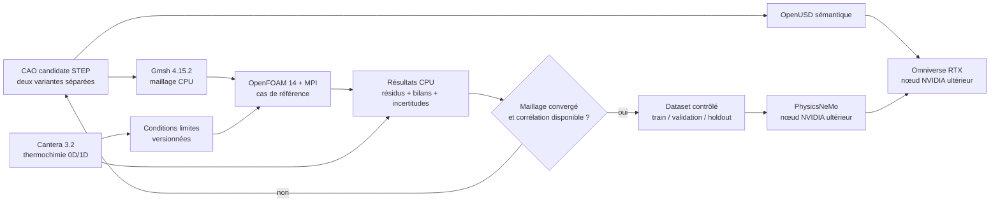

# F35 — nœud Intel CPU pour le jumeau moteur 917

## Décision

La machine Intel du réseau devient le nœud de référence pour les calculs CPU.
L'absence de GPU NVIDIA n'est pas bloquante pour le maillage Gmsh, OpenFOAM en
MPI, Cantera, les contrôles STEP et une grande partie de la préparation USD.
Elle ne recevra ni PhysicsNeMo CUDA, ni rendu RTX Omniverse.

Le partage retenu est le suivant :



PhysicsNeMo n'est donc pas le premier solveur. Il pourra apprendre un opérateur
de substitution seulement après des calculs classiques convergés et, pour les
claims physiques, après corrélation avec des mesures de banc.

## Trois images séparées

| Image | Rôle CPU | État F35 |
| --- | --- | --- |
| `3dprinting993-gmsh-mesh-f35` | OCC et maillage volumique avec groupes physiques | recette et smoke synthétique ; publication GHCR encore à prouver |
| `3dprinting993-openfoam-engine-f35` | OpenFOAM Foundation 14, OpenMPI et quatre utilitaires ICengines/AATE | recette et vrais smokes série/MPI validés localement ; publication GHCR encore à prouver |
| `3dprinting993-engine-cycle-f33` | Cantera 3.2.0 et réseau thermochimique Python | image publiée par digest ; ne prouve ni cycle moteur corrélé, ni puissance |

Référence Cantera actuellement verrouillée :

```text
ghcr.io/cluster2600/3dprinting993-engine-cycle-f33@sha256:287bd6ea04ff97205cbea9f63b2cc5a7c63ff754b27a183eb482e7896d1e9251
```

Les deux autres références resteront absentes de ce document jusqu'à ce que
GitHub Actions ait vérifié leur manifeste `linux/amd64`, leur provenance, leur
SBOM, leur smoke hors ligne et un pull anonyme du même digest. Un tag mutable
n'est jamais une référence de calcul.

## Prévol sans secret

Sur la machine Intel, depuis une copie du dépôt :

```bash
mkdir -p work/intel-f35
deploy/intel/host-preflight.sh | tee work/intel-f35/host-preflight.json
```

Le script ne scanne pas le réseau, ne lit aucun secret, ne télécharge rien et
ne révèle pas le nom de la machine. Il exige seulement un moteur Docker Linux
`amd64` accessible, au moins 4 CPU, 16 Gio de RAM Docker et 40 Gio libres. Il
rapporte le nombre de CPU, la mémoire allouée à Docker et l'espace libre du
répertoire courant. Il conserve explicitement les claims
`engine_simulation_proved` et `performance_1600_hp_proved` à `false`.

Après publication et pull **explicite** des trois digests, le wrapper de smokes
refuse tout tag mutable et toute image absente du cache local :

```bash
export F35_GMSH_IMAGE_REF='ghcr.io/cluster2600/3dprinting993-gmsh-mesh-f35@sha256:<digest-verifie>'
export F35_OPENFOAM_IMAGE_REF='ghcr.io/cluster2600/3dprinting993-openfoam-engine-f35@sha256:<digest-verifie>'
deploy/intel/run-f35-cpu-smokes.sh
```

Cantera possède déjà un digest par défaut verrouillé. Le wrapper exécute les
trois smokes sans réseau et écrit rapports, références d'images et empreintes
SHA-256 sous `work/intel-f35/`. Il exige `jq` et refuse un dépôt inattendu, un
digest absent de `RepoDigests`, un schéma de rapport différent ou le moindre
gate physique ouvert. Il ne distribue encore aucun cas moteur.

Il faut encore connaître le système d'exploitation, le nombre de cœurs, la RAM,
le stockage et le nom d'accès exact de la machine avant d'y distribuer un cas.
Les tailles ci-dessous sont des hypothèses de planification, pas des critères de
validation physique :

| Usage | Cible de planification |
| --- | --- |
| smokes des trois images | 4 threads, 16 Go RAM, 40 Go libres |
| premiers maillages et cas stationnaires | 16 threads ou plus, 64–128 Go RAM, 250 Go NVMe |
| maillage mobile fin et campagnes paramétriques | à mesurer par benchmark ; 128–256 Go RAM peuvent devenir nécessaires |

## Ordre de calcul autorisé

1. Exécuter les smokes hors ligne des trois images par digest.
2. Mailler un conduit ou un cylindre **synthétique**, puis vérifier groupes,
   volumes, Jacobiennes et convergence de maillage.
3. Lancer OpenFOAM sur des cas de référence stationnaires série et MPI.
4. Produire avec Cantera des propriétés et tendances thermochimiques clairement
   non corrélées ; ne pas injecter de calibration moteur inventée.
5. Construire ensuite un seul cas moteur mobile réduit, avec géométrie étanche,
   mouvement piston/soupapes et conditions limites revues.
6. Étendre aux douze cylindres seulement après bilan de masse/énergie, étude de
   maillage et comparaison à des mesures.

OpenFOAM 14 et ICengines fournissent les briques de maillage mobile, mais leur
présence dans l'image ne prouve pas qu'un cas 917 existe ni qu'il converge. Le
spray d'injection directe, la combustion turbulente, le cliquetis, les échanges
thermiques conjugués, l'huile et les turbocompresseurs restent des lots de
validation distincts.

## Frontières de sécurité et de preuve

- Les conteneurs de calcul s'exécutent sans GPU, sans secret et avec réseau
  désactivé lorsque leurs entrées sont déjà locales.
- Les scans privés, STEP sous licence et résultats volumineux restent sous
  `work/` ou dans un stockage privé ; ils n'entrent pas dans Git.
- Gmsh prouve un maillage, OpenFOAM une résolution numérique et Cantera une
  thermochimie : aucun ne prouve seul un moteur fonctionnel.
- Une simulation n'autorise ni impression métal, ni démarrage, ni montage dans
  une 993. Les matériaux, tolérances, NDT, fatigue, tribologie et essais de banc
  restent obligatoires.
- La cible de 1 600 ch reste une exigence de conception. Elle n'est prouvée que
  par une courbe de banc corrigée, répétable, avec carburant, boost, régime,
  températures et durée documentés.
