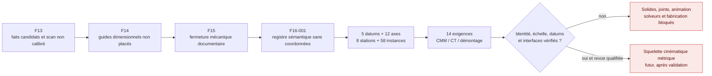

# F16-001 — readiness des interfaces cinématiques du Porsche 917

## Résultat

F16-001 crée le registre machine-readable nécessaire avant de construire le
train mobile du moteur. Il inventorie les datums, les huit stations de paliers,
les douze cylindres, bielles, axes et pistons, ainsi que leurs relations
minimales. Tous restent sans coordonnées, sans géométrie et sans mouvement.

La branche `type_912_5_0_na` sert uniquement de référence d'ingénierie. Le scan
local n'est **pas** identifié comme un 5,0 L atmosphérique :
`scan_binding` vaut `false`, son identité reste `unbound` et son échelle métrique
reste `null`.

Le contrat est
[`kinematic-interface-readiness-f16.json`](../twins/reference-917-engine/kinematic-interface-readiness-f16.json)
et le générateur est
[`build_kinematic_interface_readiness_f16.py`](../twins/reference-917-engine/source/build_kinematic_interface_readiness_f16.py).



## Niveaux de données

F16 sépare quatre catégories qui ne doivent pas être fusionnées :

| Catégorie | Contenu F16 | Autorité |
| --- | --- | --- |
| Fait publié candidat | 12 cylindres, alésage 86,8 mm, course 70,4 mm, cylindrée 4 999 cm³, 8 paliers principaux et ordre d'allumage candidat | Référence avec provenance, jamais cote de fabrication |
| Dérivation transparente | Rayon candidat `70,4 / 2 = 35,2 mm` | Contrôle algébrique seulement |
| Observation du scan | Aucune coordonnée consommée dans F16 | Scan non lié et non calibré |
| Inconnue | Positions, axes, diamètres de portée, bielles, pistons, phases et jeux | Valeur obligatoire `null` |

L'ordre d'allumage conserve explicitement la contradiction de numérotation des
cylindres du registre F13. Il ne permet donc ni de numéroter les douze axes
géométriques, ni de définir les phases des manetons.

## Registres générés

### Datums et paliers

Le registre contient cinq datums fixes non vérifiés :

- repère moteur ;
- axe du vilebrequin ;
- plan de joint du carter ;
- plan de deck du banc positif ;
- plan de deck du banc négatif.

Il ajoute douze axes `cylinder_axis_geometric_01` à `12`. Leur origine, leur
direction et leur numéro historique sont `null`. Les huit stations
`main_bearing_station_01` à `08` ont également toutes leurs coordonnées,
diamètres, largeurs et jeux à `null`.

### Composants sémantiques

| Famille | Instances |
| --- | ---: |
| Carter | 1 |
| Vilebrequin | 1 |
| Paliers principaux | 8 |
| Cylindres individuels | 12 |
| Bielles | 12 |
| Axes de piston | 12 |
| Pistons | 12 |
| **Total** | **58** |

Chaque instance a `transform_mm`, `orientation`, `geometry_ref`, matériau,
masse, inertie et dimensions d'interface à `null`. Les corps physiques et la
libération de fabrication valent `false`.

### Graphe minimal

Le graphe développe 68 relations requises : huit supports de vilebrequin puis
douze relations pour chaque maillon cylindre–carter, vilebrequin–bielle,
bielle–axe, axe–piston et piston–cylindre.

Les cinq groupes déjà décrits en F8 gardent leur référence. La liaison
axe–piston, absente du contrat F8, est marquée
`required_topology_not_evidence` : c'est une exigence à mesurer, pas un fait
historique ajouté silencieusement. Toutes les relations ont :

```text
coordinates: null
active: false
physics_joint_enabled: false
```

## Campagne CMM, CT et démontage

Le template contient quatorze exigences :

- identité, variante et références des pièces ;
- trois contrôles d'échelle déjà exigés par F13 ;
- axe du vilebrequin ;
- centres, diamètres, largeurs et jeux des huit paliers ;
- topologie, centres, phases et dimensions des manetons ;
- entraxes et interfaces des douze bielles ;
- dimensions et ajustements des douze axes de piston ;
- hauteurs de compression, axes et diamètres des pistons ;
- axes, spigots, decks et registres des cylindres ;
- jeux assemblés et fermeture de la boucle cinématique ;
- correspondance entre phases, cylindres et ordre d'allumage.

Chaque mesure garde `value: null` et exige ensuite instrument, certificat
d'étalonnage, température, laboratoire, schéma de datums, incertitude, fichier
de preuve et revue. Le générateur refuse une valeur ou une coordonnée ajoutée
au contrat sans changement explicite du niveau de preuve.

## Sorties

Le générateur écrit trois artefacts locaux hors Git :

```text
work/917-kinematic-interface-readiness-f16/
├── kinematic-interface-readiness.json
├── kinematic-interface-registry.csv
└── kinematic-interface-axes.usda
```

Le JSON contient les faits résolus, la dérivation, les registres, le graphe, la
campagne et les gates. Le CSV offre une vue tabulaire de 172 lignes.

L'USD ASCII est volontairement non géométrique : 84 prims `Xform` et trois
`Scope`, sans `xformOp`, mesh, courbe, matériau, rigid body, joint ou
`timeSamples`. Les Xforms sont des conteneurs de noms et de statuts ; ils ne
placent rien dans l'espace Omniverse.

## Exécution et validation

Depuis la racine du dépôt :

```bash
python3 twins/reference-917-engine/source/build_kinematic_interface_readiness_f16.py

python3 -m unittest discover \
  -s tests \
  -p 'test_917_kinematic_interface_readiness_f16.py'
```

Les tests vérifient notamment :

- l'absence de lien entre le scan et la branche 5,0 L ;
- les six faits autorisés et le seul calcul `course / 2` ;
- les comptes exacts des datums, stations, composants et relations ;
- le maintien de toutes les inconnues à `null` ;
- le rejet d'une coordonnée, mesure, échelle ou transform inventé ;
- le rejet d'un rayon prérempli comme cote de fabrication ;
- l'ensemble exact des autorités F15 et des provenances, usages et
  contradictions des six faits ;
- les préfixes uniques des 58 instances, les extrémités et le type exact des
  six groupes de relations ;
- le contenu exact des quatorze exigences, y compris leur nombre minimal
  d'occurrences ;
- l'absence de géométrie, PhysX et animation dans l'USD ;
- le refus des identifiants ou chaînes sémantiques non sûrs avant écriture USDA ;
- la reproductibilité des trois sorties.

## Portes toujours fermées

Les vingt gates F16 restent tous à `false`. En particulier : identité et
échelle du scan, variante, sémantique des interfaces, datums, coordonnées,
géométrie du vilebrequin, des bielles, pistons et axes, fermeture de boucle,
collisions, solides CAO, joints, PhysX, animation, solveurs, entraînement
PhysicsNeMo, fabrication, impression métal et démarrage.

F16-001 constitue donc un plan de mesure et un graphe d'assemblage contrôlé. Il
ne constitue pas encore un assemblage cinématique, une pièce imprimable ou une
preuve que le moteur peut fonctionner.
