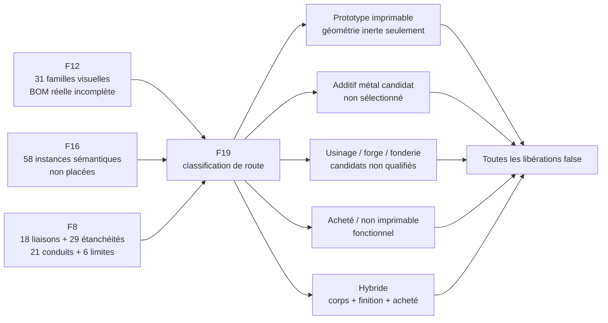
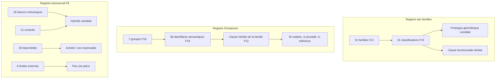
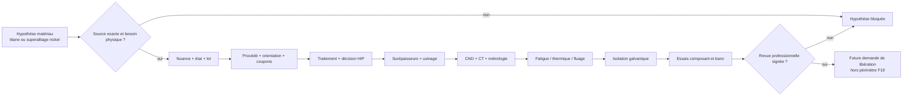
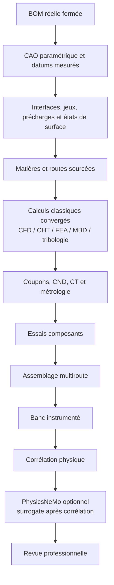

# Routage de fabrication F19 du moteur 917

## Décision F19

F19 transforme les inventaires existants en un registre de routage
**fail-closed**. Il couvre les 31 familles visuelles F12, les 58 instances
sémantiques F16 et les groupes d’interfaces F8. Il ne transforme pas ces
inventaires en nomenclature réelle et ne libère aucune fabrication.

Un moteur « 100 % fonctionnel » ne signifie jamais « 100 % imprimé ». Cela
signifie que 100 % des fonctions ont une définition, une interface, un modèle
physique, une route qualifiée et une preuve d’essai. Les roulements, joints,
ressorts, segments, injecteurs, bougies, capteurs, fixations et autres organes
achetés restent représentés dans le jumeau, mais ne deviennent pas des pièces
imprimables fonctionnelles.



## Taxonomie de route

| Classe F19 | Sens exact | Ce que F19 n’autorise pas |
|---|---|---|
| `printable_prototype` | maquette de forme, encombrement, accès ou assemblage statique | charge, pression, température, rotation ou combustion |
| `metal_additive_candidate` | disposition additive héritée de F12 à étudier | choix d’alliage, procédé, paramètres ou impression |
| `conventional_candidate` | usinage, forge, fonderie ou fabrication assemblée à qualifier | lancement de fabrication ou substitution de route |
| `purchased_non_printable` | fonction à spécifier et acheter auprès d’une source qualifiée | reproduction fonctionnelle par impression 3D |
| `hybrid_candidate` | combinaison potentielle de corps fabriqués, finitions, inserts et éléments achetés | définition automatique d’une gamme multiroute |
| `unresolved` | route inconnue | déduction depuis la forme du scan |
| `not_a_part` | passage, feature ou condition aux limites | création d’une fausse pièce autonome |

La classification est une disposition de travail, pas une sélection. Les
champs `selected_material_grade`, `selected_process` et
`selected_tolerance_set` restent donc `null` pour chaque famille et chaque
instance.

## Couverture des inventaires



Le carter sémantique unique de F16 est relié à la famille visuelle
`crankcase_half` de F12 comme crosswalk candidat. Cela ne prouve ni qu’une
occurrence F16 équivaut aux deux demi-carters F12, ni leur géométrie
d’assemblage.

Les 13 catégories de backlog F12 restent sans quantité et sans dimensions.
F19 classe explicitement comme achetés/non imprimables les fixations, joints,
retenues, roulements et bagues additionnels, capteurs, faisceaux et filtres. Les
conduites, petites pièces et commandes restent hybrides tant que leur vraie BOM
n’est pas fermée. Les galeries internes sont des features et non des pièces.

## Titane et superalliages nickel de type Inconel

F19 n’inscrit aucune nuance ni aucun procédé. Les noms `titanium` et
`inconel_nickel_superalloy` désignent uniquement deux politiques conditionnelles
à appliquer si une étude sourcée retient ensuite ces familles de matériaux.

Pour chacune, les preuves obligatoires couvrent :

- nuance exacte, état produit ou poudre et traçabilité de lot ;
- procédé exact, paramètres qualifiés et coupons représentatifs ;
- orientation, anisotropie, supports et zones critiques ;
- traitement thermique propre à la nuance et à la route ;
- décision documentée sur l’applicabilité du HIP, puis cycle qualifié si retenu ;
- surépaisseurs d’usinage déterminées depuis les distorsions mesurées ;
- méthodes CND et CT dont la détectabilité et les critères d’acceptation sont qualifiés ;
- fatigue HCF/LCF, fatigue thermique, fluage si pertinent, état de surface et spectre moteur corrélé ;
- isolation galvanique validée dans les vraies températures, huiles, carburants et couples de matériaux.



Les bielles portent uniquement la trace que F12 mentionne un contexte titane ;
aucune nuance ni route n’est sélectionnée. Les soupapes titane et les pièces
chaudes en superalliage nickel restent des hypothèses de conception. Une
modification du carter chaud d’un turbocompresseur acheté exige en plus les
données et l’accord du fournisseur, puis une nouvelle qualification de
l’ensemble tournant et thermique.

## Chaîne de décision vers un moteur fonctionnel



PhysicsNeMo peut accélérer une exploration après constitution d’un dataset de
solveurs de référence et corrélation physique. Il ne choisit pas la matière,
ne reconstruit pas les tolérances absentes et ne libère aucune impression.

## Validation reproductible

Depuis la racine du dépôt :

```bash
python3 twins/reference-917-engine/source/build_manufacturing_routing_f19.py \
  --project-root . \
  --contract twins/reference-917-engine/manufacturing-routing-f19.json \
  --check \
  --output work/917-engine/f19/manufacturing-routing-validation.json

python3 tests/test_917_manufacturing_routing_f19.py -v
```

Le générateur peut reconstruire le contrat dans un emplacement temporaire pour
contrôle déterministe :

```bash
python3 twins/reference-917-engine/source/build_manufacturing_routing_f19.py \
  --project-root . \
  --contract /tmp/manufacturing-routing-f19.json \
  --write-contract
```

Le code de sortie nul signifie seulement que le contrat est cohérent avec les
six fichiers amont et que toutes les frontières fail-closed sont respectées.
Il ne signifie pas qu’une pièce est imprimable, qu’un moteur peut être assemblé
ou qu’un essai peut être lancé.

## Prochaine preuve utile

F19 montre pourquoi l’étape suivante doit commencer par une vraie nomenclature
de démontage, l’identification de variante du scan, les mesures d’interfaces et
les masters CAO. Ensuite seulement, une revue par fonction pourra convertir une
classification F19 en demande de sélection de matière et de route, avec plan de
qualification séparé pour les prototypes, l’additif métal, les pièces
conventionnelles, les achats et les assemblages hybrides.
