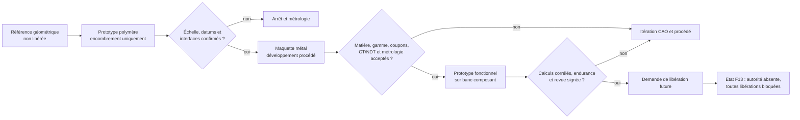
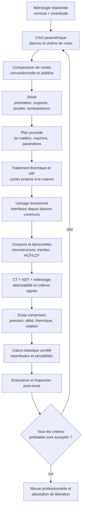
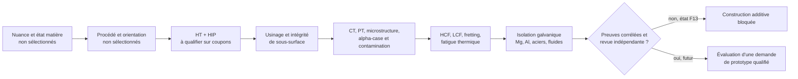
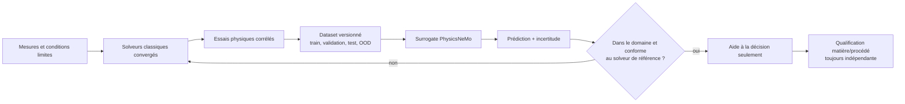

# Stratégie F13 de fabrication et validation du moteur 917

## Résultat et limite

F13 fournit un registre de décision de fabrication pour neuf familles critiques du
moteur 917. Il sépare les prototypes polymères, les maquettes métalliques et les
pièces destinées à un moteur fonctionnel. Il ne contient aucune géométrie ni
charge propriétaire et ne libère aucune fabrication.

À ce stade :

- aucune nuance ni route de fabrication n’est sélectionnée ;
- les 30 mesures critiques ont un nominal et une tolérance à `null` ;
- les exigences DfAM, usinage, traitement thermique, HIP, CT, NDT et coupons
  sont enregistrées pour chaque famille ;
- `printable`, `functional`, `engine_assembly` et `engine_start` restent à
  `false` ;
- PhysicsNeMo n’est ni une autorité de sélection matière, ni un moyen de
  qualification de fabrication.

Le registre source de vérité de cette phase est
`twins/reference-917-engine/manufacturing-validation-f13.json`. Le validateur
échoue si une cote est inventée, si une route candidate est déclarée
sélectionnée, si un contrôle obligatoire disparaît ou si une libération est
forcée.

## Trois objets très différents

| Niveau | But autorisé après revue | Ce qu’il ne prouve pas | État F13 |
| --- | --- | --- | --- |
| Prototype polymère | Encombrement, séquence d’assemblage, accessibilité, revue visuelle | Matière, étanchéité, pression, température, rigidité, fatigue | Candidat seulement, impression non autorisée |
| Maquette métal | Développement de gamme, métrologie, assemblage statique et instrumentation hors moteur | Tenue en combustion, survitesse, pression moteur, endurance | Candidate seulement, fabrication non autorisée |
| Pièce moteur fonctionnelle | Banc moteur après qualification complète et libération signée | Rien par ressemblance visuelle ou simulation seule | Bloquée |



## Familles et dispositions candidates

Les routes ci-dessous servent à organiser les essais comparatifs. Elles ne sont
ni les spécifications historiques du moteur, ni des choix approuvés.

| Famille stable | Information de départ | Routes à étudier | Risque dominant |
| --- | --- | --- | --- |
| `crankcase_magnesium_historical` | Famille magnésium historique, nuance inconnue | Fonderie sable puis usinage ; maquette aluminium usinée ou LPBF | Feu poudre, corrosion, porosité, ligne de paliers et galeries |
| `cylinder_nikasil_system` | Revêtement nickel-carbure de silicium ; substrat et finition inconnus | Brut conventionnel ou LPBF, puis alésage, dépôt et honage | Adhésion, circularité, texture, usure et transfert thermique |
| `piston_system` | Matière, segments, axe et jeux inconnus | Référence forgée 2618A ; R&D LPBF AlSi10Mg avec canal refroidi | Fatigue thermomécanique, bossages d’axe, gorges et canal fermé |
| `connecting_rod_titanium` | Famille titane historique ; nuance et état inconnus | Forge usinée ; R&D LPBF + HIP + usinage | HCF/LCF, fretting, alésages, équilibrage et contamination |
| `valve_titanium_candidate` | Le titane n’est pas établi pour les soupapes cibles | Titane R&D admission seulement ; superalliage à définir pour l’échappement | Impact, fluage, oxydation, guide, siège et clavettes |
| `camshaft_system` | Profils, calage, nuance et traitement inconnus | Acier forgé ou billette, usiné, traité et rectifié ; préforme AM en R&D | Fatigue de contact, pitting, torsion et distorsion |
| `dilavar_stud_system` | Famille Dilavar et trois mesures documentées ; spécification complète absente | Achat qualifié ; barre corroyée et filets roulés seulement avec spécification | Précharge, relaxation, dilatation, corrosion et fatigue thermique |
| `gas_ducts_and_manifolds` | Géométrie interne, parois et conditions limites inconnues | Tubes/tôles soudés ; LPBF segmenté ; titane côté froid ou Alloy 625 côté chaud en R&D | Rugosité, poudre, soudure, pulsations, dilatation et étanchéité |
| `turbocharger_system` | Architecture connue, cartes et composants internes inconnus | CHRA acheté qualifié et carters adaptés ; carters LPBF en R&D | Survitesse, éclatement, jeux rotor, paliers, étanchéité et fluage |

Le carter fonctionnel n’est pas automatiquement un bon candidat LPBF
magnésium. Le registre bloque cette route tant que la chimie, la sécurité poudre,
la corrosion, la tenue au feu et la route industrielle ne sont pas établies. De
même, un turbo n’est jamais traité comme une pièce monobloc imprimable : rotor,
arbre, paliers, joints et équilibrage constituent un sous-système qualifié
distinct.

## Boucle de qualification par famille



### DfAM et usinage

L’additif doit être justifié face à la forge, la fonderie, l’usinage et la
fabrication soudée. L’orientation, les supports, l’anisotropie, le retrait, la
distorsion, la rugosité interne et l’évacuation de poudre font partie de la
définition. Les surfaces fonctionnelles conservent une surépaisseur : paliers,
alésages, gorges, plans de joint, filetages, faces de brides et portées ne sont
pas libérés à l’état brut.

La gamme d’usinage est construite depuis des datums mesurés. Elle inclut
l’ordre des opérations, le bridage, les effets de relaxation, le nettoyage des
passages de fluide et une métrologie après traitement thermique puis après
finition.

### Traitement thermique et HIP

Un cycle n’est réutilisable ni entre deux nuances, ni entre une pièce corroyée
et une pièce LPBF sans qualification. Temps, température, atmosphère, rampes,
charge du four et lot sont enregistrés. Dureté, microstructure, distorsion et
propriétés sont mesurées après cycle.

Le HIP est une opération candidate, pas une preuve d’absence de défaut. Son
effet sur la porosité, la microstructure, la fatigue et les dimensions doit être
qualifié. Le CT et les essais restent obligatoires lorsque le plan de contrôle
les exige.

### CT, NDT et coupons

Le CT possède une résolution et une détectabilité qualifiées sur défauts de
référence. Les méthodes NDT — ressuage, magnétoscopie, ultrasons, radiographie
ou courants de Foucault — sont choisies selon la matière, l’épaisseur, la route
et le défaut recherché. Une mention « CT passé » sans seuil, artefact, zone
d’intérêt et critère signé n’est pas une preuve.

Les coupons sont cofabriqués avec le même lot, l’orientation critique et
l’historique thermique représentatif. La qualification couvre au minimum
chimie, densité, microstructure, dureté, traction et fatigue ; elle ajoute les
essais de fluage, oxydation, corrosion, contact, usure ou cyclage thermique
propres à la famille.

## Porte spéciale pour toute pièce en titane

Le registre détecte toute famille contenant un candidat `titanium` et exige les
neuf sujets suivants : alliage, procédé de construction, orientation, traitement
thermique, HIP, usinage, inspection, fatigue et isolation galvanique.



Pour une bielle, l’état de surface réel, les alésages, le chapeau, les vis, le
fretting et l’équilibrage bout à bout sont inclus dans le spectre de fatigue.
Pour une soupape, le titane est limité à une hypothèse d’admission tant que les
preuves de température, oxydation, fluage et impact ne permettent pas de
statuer ; aucune soupape d’échappement titane n’est libérée. Pour un conduit
d’admission, l’isolation galvanique des brides et fixations reste obligatoire.

## Tolérances à mesurer, pas à deviner

Le registre définit 30 caractéristiques critiques, sans leur attribuer de
valeur :

- ligne et diamètres de paliers, registres de cylindres, plans de joint et
  galeries du carter ;
- diamètre, circularité, conicité, revêtement et portées des cylindres ;
- hauteur de compression, axe, gorges, masse et équilibrage des pistons ;
- entraxes, torsion, alésages et équilibrage des bielles ;
- tiges, faces, faux-rond et gorges des soupapes ;
- profils, levées, phases, portées et faux-rond des arbres à cames ;
- longueur, filets, précharge, relaxation, dilatation et fluage des goujons ;
- sections, axes, parois, rugosité, brides et fuite des conduits ;
- cartes, jeux, concentricité, équilibrage, survitesse et distorsion des turbos.

Chaque mesure doit préciser la méthode, la condition thermique et mécanique,
l’incertitude, la traçabilité de l’étalon et la chaîne de cotes. Une dimension
lue sur un maillage ne devient pas une tolérance de fabrication.

## Place de PhysicsNeMo dans ce plan

PhysicsNeMo intervient éventuellement après la production de jeux de calculs
classiques convergés — CFD, CHT, FEA, dynamique multi-corps, rotordynamique — et
leur corrélation à des essais physiques. Il peut accélérer une exploration de
paramètres ou détecter une sortie hors domaine. Il ne sélectionne pas une
nuance, ne qualifie pas une poudre, ne contrôle pas une porosité, ne signe pas
un NDT et n’autorise pas un démarrage moteur.



## Critères de sortie futurs

Une famille ne pourra quitter `blocked` qu’avec, au minimum :

1. identité, variante, échelle et interfaces confirmées par métrologie ;
2. CAO éditable et chaîne de cotes revue ;
3. nuance, état matière et route sélectionnés sur spécification ;
4. gamme DfAM/usinage/HT/HIP approuvée et traçable ;
5. coupons et éprouvettes représentatifs acceptés ;
6. CT, NDT et métrologie conformes à des critères gelés avant fabrication ;
7. calculs classiques convergés et corrélés ;
8. essais composant et endurance passés avec inspection post-essai ;
9. revue professionnelle signée et vérifiée par une autorité de libération.

Le passage de toutes les familles ne suffit pas à libérer le moteur : la
nomenclature, les circuits d’huile, de refroidissement, de carburant, les
commandes, l’allumage, l’équilibrage et le banc instrumenté doivent aussi être
fermés au niveau assemblage.

## Validation reproductible

Depuis la racine du dépôt :

```bash
python3 twins/reference-917-engine/source/validate_manufacturing_f13.py \
  --output work/917-engine/f13/manufacturing-validation-report.json

python3 tests/test_917_manufacturing_f13.py -v
```

Un code retour nul confirme uniquement que le registre est cohérent et
fail-closed. La décision attendue est
`strategy_contract_consistent_releases_still_blocked`; elle ne constitue ni une
qualification, ni une autorisation d’imprimer.
