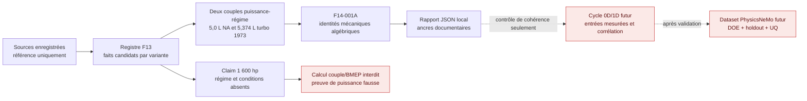

# F14-001A — benchmark mécanique algébrique du moteur Porsche 917

## Résultat

F14-001A exécute un premier calcul reproductible sur les deux seuls couples
puissance–régime actuellement liés à une provenance commune dans le registre
F13 : le 5,0 L atmosphérique et le 5,374 L turbo de 1973. Il résout des
identités mécaniques fermées ; il ne simule ni combustion, ni remplissage, ni
échanges thermiques, ni turbomachines.

Le contrat machine-readable est
[`mechanical-benchmark-f14.json`](../twins/reference-917-engine/mechanical-benchmark-f14.json).
Le runner relit les valeurs dans
[`classical-solver-cases-f13.json`](../twins/reference-917-engine/classical-solver-cases-f13.json)
au lieu de contenir des valeurs moteur par défaut. Chaque entrée de la sortie
conserve son `fact_ref`, ses `source_refs`, la variante du fait et son statut de
preuve.



## Entrées sourcées

| Cas | Géométrie candidate | Point documentaire | Source commune du couple |
| --- | --- | --- | --- |
| `CASE-917-F14-001A-5L-NA` | 12 cylindres, 86,8 × 70,4 mm, 4 999 cm³ | 630 PS à 8 300 tr/min | `SRC-AMS-917-ENGINE-TECHNICAL-ANALYSIS` |
| `CASE-917-F14-001A-5374-TURBO-1973` | 12 cylindres, 90 × 70,4 mm, 5 374 cm³ | 1 100 PS à 7 800 tr/min | `SRC-AMS-917-ENGINE-TECHNICAL-ANALYSIS` et `SRC-PORSCHE-NEWSROOM-91730-AM-LIMIT` |

Ces valeurs restent des candidats documentaires. Leur cohérence arithmétique
ne confirme ni l'identité et l'échelle du scan, ni une mesure de banc, ni une
cote de fabrication.

## Équations exécutées

Avec `N` cylindres, l'alésage `B`, la course `S`, la puissance publiée `P` et
le régime du même point `n` :

```text
Vd_calc = N * pi/4 * B^2 * S
delta_Vd = (Vd_calc - Vd_pub) / Vd_pub
omega = 2 * pi * n / 60
T = P / omega
BMEP_4t = 4 * pi * T / Vd
Up_mean = 2 * S * n / 60
```

Le rapport écrit deux BMEP : l'un avec la cylindrée publiée, l'autre avec la
cylindrée recalculée depuis alésage et course. Il ne choisit pas silencieusement
l'une comme géométrie réelle. La conversion `PS -> W` est une définition
d'unité, pas une hypothèse moteur.

## Résultats reproductibles

| Quantité | 5,0 L atmosphérique | 5,374 L turbo 1973 |
| --- | ---: | ---: |
| Cylindrée recalculée | 4 999,001153 cm³ | 5 374,385384 cm³ |
| Écart relatif à la cylindrée publiée | +0,000023 % | +0,007171 % |
| Puissance normalisée du point publié | 463,364213 kW | 809,048625 kW |
| Couple algébrique au régime publié | 533,108710 N·m | 990,492984 N·m |
| BMEP 4 temps avec cylindrée publiée | 13,401163 bar | 23,161336 bar |
| Vitesse moyenne du piston | 19,477333 m/s | 18,304000 m/s |

Ces nombres répondent à la question « quelles grandeurs mécaniques sont
mathématiquement compatibles avec le point publié ? ». Ils ne répondent pas à
la question « le moteur peut-il produire cette puissance ? » : aucune pression
cylindre, loi de combustion, friction, température, admission, échappement ou
carte turbo n'est calculée.

## Claim 1 600 hp

Le registre conserve `FACT-TURBO-POWER-1600-REPORTED` avec l'unité `hp`. La
source ne fournit ni régime associé, ni conditions d'essai, ni base de mesure,
ni correction, ni incertitude. F14-001A impose donc :

- `reported_power_speed_rpm: null` ;
- couple, BMEP, vitesse angulaire et vitesse moyenne piston à `null` ;
- `proof_status: not_proven` ;
- interdiction de substituer 7 800 ou 8 000 tr/min au régime absent.

Une grille de régimes exploratoire comme celle de F9 peut exprimer une exigence
de sensibilité, mais elle ne doit pas être confondue avec le point historique
ni avec une simulation de 1 600 hp.

## Sortie et validation

Le rapport est volontairement local et ignoré par Git :

```text
work/917-mechanical-benchmark-f14/mechanical-benchmark-results.json
```

Depuis la racine du dépôt :

```bash
python3 twins/reference-917-engine/source/run_mechanical_benchmark_f14.py

python3 -m unittest discover \
  -s tests \
  -p 'test_917_mechanical_benchmark_f14.py'
```

Les tests recalculent les deux points, contrôlent la provenance par champ et
font muter le contrat pour vérifier le rejet :

- d'un autre claim de puissance ;
- d'une source qui n'est pas commune au couple puissance–régime ;
- d'un moteur générique ou interpolé ;
- d'un régime inventé pour 1 600 hp ;
- d'une autorisation prématurée de performance ou de fabrication.

## Portes toujours fermées

F14-001A n'autorise pas le cas thermodynamique `CASE-917-F13-001`. Celui-ci
exige toujours le carburant et son mécanisme, la loi de combustion ou une
pression cylindre mesurée, les conditions admission/échappement, les pertes
par friction, la cinématique réelle, les levées de soupapes et la loi
d'injection.

Les deux lignes F14 sont trop peu nombreuses et trop documentaires pour
entraîner PhysicsNeMo. Elles serviront plus tard de contrôles de cohérence sur
un dataset issu d'un DOE de solveur classique convergé et d'un banc corrélé ;
elles ne sont ni un split d'entraînement, ni une validation indépendante.

Toutes les portes suivantes restent `false` : preuve de performance,
corrélation banc, entraînement PhysicsNeMo, simulation moteur validée,
fabrication, impression métal et démarrage physique.
