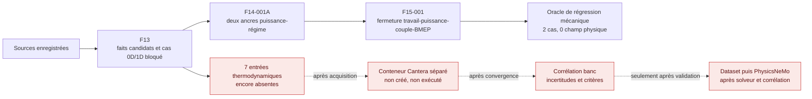

# F15-001 — solveur de fermeture mécanique par cycle du Porsche 917

## Résultat

F15-001 ajoute le premier oracle classique **par cycle** réellement exécutable
sans inventer de calibration Porsche. Il part exclusivement du registre F13 et
des deux ancres algébriques F14 : le 5,0 L atmosphérique à son point publié et
le 5,374 L turbo 1973 à son point publié.

Le solveur ferme les identités entre puissance, vitesse, travail par cycle,
couple et BMEP. La puissance publiée reste une **entrée documentaire** ; elle
n'est ni prédite, ni reproduite, ni validée par le calcul.

Le contrat est
[`mechanical-cycle-closure-f15.json`](../twins/reference-917-engine/mechanical-cycle-closure-f15.json)
et le runner est
[`run_mechanical_cycle_closure_f15.py`](../twins/reference-917-engine/source/run_mechanical_cycle_closure_f15.py).



## Pourquoi F15 n'exécute pas Cantera

Le cas `CASE-917-F13-001` exige encore sept éléments non résolus :

- définition du carburant et mécanisme chimique versionné ;
- pression cylindre mesurée ou loi de dégagement de chaleur validée ;
- pressions et températures admission/échappement ;
- modèle de frottement ;
- numérotation des cylindres ;
- lois de levée et coefficients de débit des soupapes ;
- loi d'injection.

Avec ces entrées absentes, démarrer Cantera imposerait un carburant, une
combustion, des pertes, des frontières gazeuses et une distribution génériques.
Le résultat décrirait un moteur théorique, pas le Porsche 917. F15 refuse donc
explicitement cette exécution : `backend_selected` reste `null`, Cantera reste
non exécuté et aucun échantillon n'est ajouté au contrat PhysicsNeMo.

Lorsque les mesures seront disponibles, le solveur 0D/1D devra être livré dans
une petite image distincte `917-engine-cycle-f15`, avec mécanisme chimique,
versions et smoke test verrouillés. Cette image n'est volontairement pas créée
tant qu'aucun calcul Porsche honnête ne peut l'utiliser.

## Calcul exécuté

Le modèle compte deux tours de vilebrequin par cycle quatre temps et un
événement moteur par cylindre et par cycle. Ces deux nombres définissent la
comptabilité du cycle ; ils ne constituent pas une calibration du 917.

Pour la puissance publiée `P`, le régime `n`, le nombre de cylindres `N` et la
cylindrée publiée `Vd` :

```text
revolutions_s = n / 60
cycles_s = revolutions_s / 2
firing_events_s = cycles_s * N
work_revolution = P / revolutions_s
work_cycle = P / cycles_s
work_cylinder_firing = P / firing_events_s
torque_reconstructed = work_cycle / (4 * pi)
bmep_reconstructed = work_cycle / Vd
power_reconstructed = work_cycle * cycles_s
```

Le contrôle numérique accepte un résidu relatif maximal de `1e-12`. Ce seuil
teste uniquement les identités en virgule flottante. Il n'est pas un critère
de corrélation physique.

## Résultats reproductibles

| Quantité | 5,0 L atmosphérique | 5,374 L turbo 1973 |
| --- | ---: | ---: |
| Cycles moteur par seconde | 69,166667 | 65,000000 |
| Événements moteur par seconde | 830,000000 | 780,000000 |
| Travail frein par tour | 3 349,620813 J | 6 223,450962 J |
| Travail frein par cycle moteur | 6 699,241627 J | 12 446,901923 J |
| Travail frein par cylindre et cycle | 558,270136 J | 1 037,241827 J |
| Couple reconstruit | 533,108710 N·m | 990,492984 N·m |
| BMEP reconstruite | 13,401163 bar | 23,161336 bar |

Le terme « travail frein par cylindre » est une répartition comptable du
travail total sur douze événements. Il ne représente ni une pression cylindre,
ni une charge instantanée de piston, bielle, vilebrequin ou palier.

## Claim de 1 600 hp

F15 réutilise sans le modifier le claim documentaire F14. Son régime associé,
ses conditions d'essai, sa base de correction et son incertitude ne sont pas
connus. Travail par cycle, couple et BMEP restent donc `null` pour ce claim ;
F15 ne substitue jamais le régime du point 1 100 PS.

## Exécution et validation

Depuis la racine du dépôt :

```bash
python3 twins/reference-917-engine/source/run_mechanical_cycle_closure_f15.py

python3 -m unittest discover \
  -s tests \
  -p 'test_917_mechanical_cycle_closure_f15.py'
```

La sortie locale non suivie par Git est :

```text
work/917-mechanical-cycle-closure-f15/mechanical-cycle-closure-results.json
```

Les tests contrôlent les résultats des deux cas, la provenance par champ, les
trois fermetures numériques et le maintien des sept blockers. Des mutations
doivent faire échouer le contrat si elles :

- autorisent Cantera ou le solveur thermodynamique ;
- enlèvent un blocker ;
- déclarent le cas F13-001 exécuté ;
- remplacent un fait F14 ou ajoutent un moteur générique ;
- autorisent PhysicsNeMo, la fabrication ou le démarrage.

## Portes toujours fermées

F15 ne produit aucune pression, température, composition, masse débitée,
efficacité volumétrique, loi de combustion, carte turbo ou charge instantanée.
Il ne passe aucun des douze cas classiques F13 et ne crée aucun échantillon
PhysicsNeMo. Corrélation banc, preuve de performance, simulation moteur
validée, CAO fonctionnelle, fabrication, impression métal et démarrage restent
tous bloqués.
