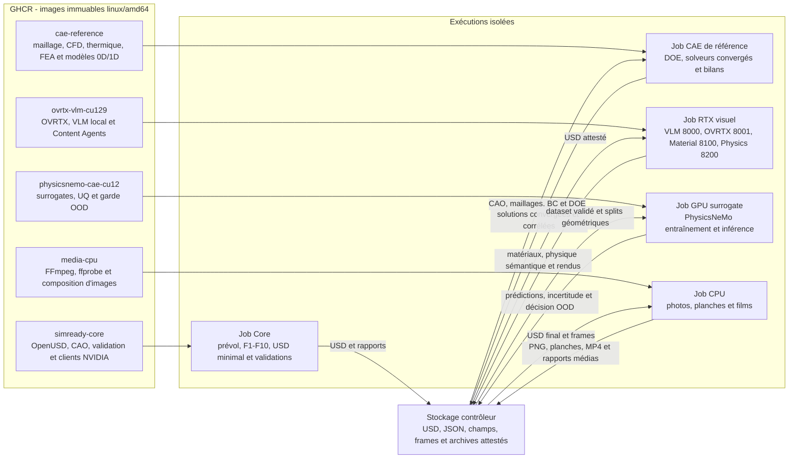
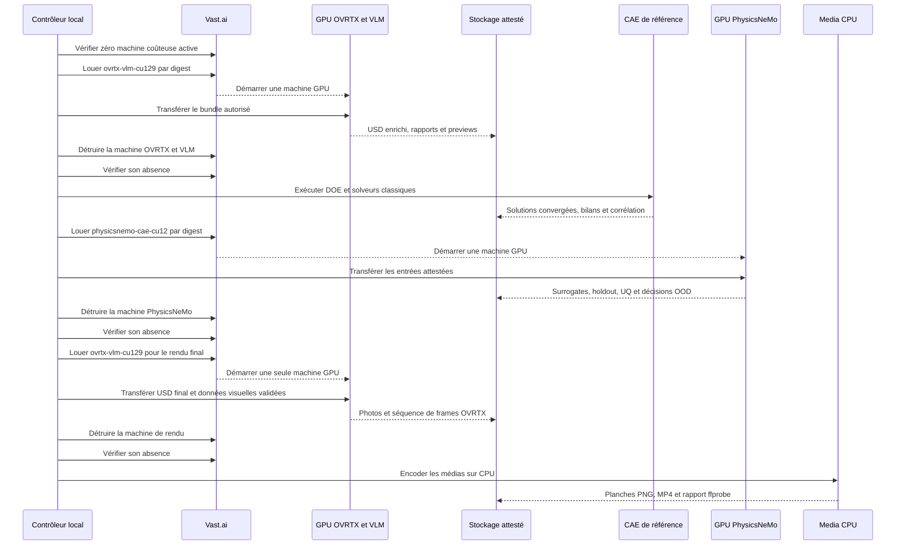
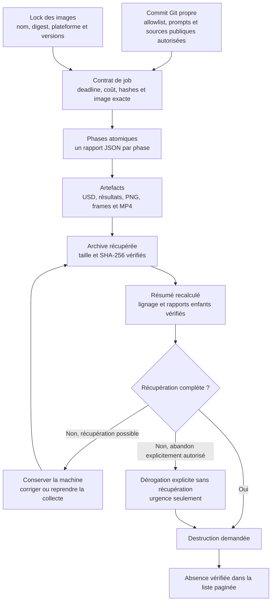

# Stack de calcul modulaire du moteur Porsche 917

## Statut et objectif

Ce document décrit l'architecture cible, pas un état déjà déployé. L'objectif
est de remplacer l'image GPU monolithique par cinq images indépendantes,
épinglées par digest et exécutées en séquence. Cette séparation doit réduire le
temps de build, de transfert et de démarrage, tout en gardant une chaîne de
preuves complète entre le modèle USD, les calculs, les photos et le film.

Les noms `simready-core`, `cae-reference`, `physicsnemo-cae-cu12`,
`ovrtx-vlm-cu129` et `media-cpu` sont les noms de travail des futures images.
Au 2 septembre 2026, seul `physicsnemo-cae-cu12` dispose d'un
[lock OCI vérifié](../containers/physicsnemo-cae-cu12.lock.json) : build
`linux/amd64`, pull anonyme par digest et smoke hors GPU sont verts. Son smoke
GPU et son transport SSH sur une location courante restent faux ; il n'est donc
pas encore autorisé pour un job Vast long. Les quatre autres noms ne doivent pas
être utilisés par le contrôleur tant que leur build, leur publication et leurs
smoke tests ne sont pas verts.

La règle de revendication reste stricte : un rendu OVRTX, une photo ou un film
ne démontre ni comportement physique, ni puissance, ni tenue thermique, ni
aptitude à la fabrication. Une simulation physique ne pourra être revendiquée
qu'à partir des entrées, du solveur, des conditions aux limites, des résultats
et des contrôles numériques attestés.

## Retour d'expérience du run du 1er septembre 2026

Le run a fourni cinq enseignements factuels à conserver dans les contrats de
build :

1. L'image locale-AI monolithique est lente à construire, publier et récupérer.
   Elle associe dans un même artefact le socle SimReady, OVRTX, un VLM et
   PhysicsNeMo, alors que ces runtimes n'ont ni le même cycle de mise à jour ni
   exactement la même pile PyTorch.
2. L'installation de `vllm==0.26.0` depuis PyPI a résolu une pile CUDA 13 alors
   que le runtime visé utilise PyTorch CUDA 12.9. La correction retenue est la
   roue du release officiel `vllm 0.26.0+cu129`, vérifiée avec :

   ```text
   sha256:6ce4ca30616f0a35810391015622b197a7b8b267ed27f8716f0789db79ff578b
   ```

   Le nom de l'artefact contient `+cu129`. Selon la vue packaging utilisee,
   l'identifiant expose peut etre `0.26.0` ou `0.26.0+cu129`; le controle
   exige donc une version de base strictement egale a `0.26.0`. Torch,
   TorchAudio, TorchVision et CUDA restent verrouilles separement, notamment
   `torch.version.cuda == "12.9"` au runtime.
3. L'ancien argument vLLM :

   ```text
   --limit-mm-per-prompt image=20
   ```

   doit être remplacé par la forme JSON, avec un niveau de quoting conservé
   jusqu'au processus `vllm serve` :

   ```text
   --limit-mm-per-prompt '{"image":20}'
   ```

4. Un rendu réussi prouve seulement que le renderer a pu ouvrir et représenter
   l'asset. Il est interdit de transformer ce succès visuel en revendication de
   simulation physique. Cette limite doit apparaître dans les rapports JSON,
   les rapports Markdown et les métadonnées des médias.
5. Le stage atmosphérique F10 contient 291 instances et 37 prototypes. Le job
   Material a généré 66 groupes de composition et n'a pas terminé en 3 600 s ;
   une inférence VLM prenait environ 71,5 s en moyenne et 290 prédictions sur
   291 seulement étaient présentes au moment de l'arrêt. La voie retenue est
   donc un proxy statique d'un représentant par famille, suivi d'une
   réapplication fail-closed des matériaux au stage complet. Ce constat
   concerne l'enrichissement visuel, pas l'ingénierie physique.

## Defaut runtime observe le 2 septembre 2026

La premiere qualification de l'image monolithique par digest sur une RTX PRO
6000 96 Go a trouve un defaut que le smoke CI sans GPU ne pouvait pas activer.
Les extensions CUDA de vLLM cherchaient `libcudart.so.13`, `libnvrtc.so.13` et
les bibliotheques PyTorch sans chemin de chargement explicite. Les fichiers
etaient bien presents dans les wheels sous `/opt/local-ai`, mais `vllm` echouait
avant d'ouvrir le modele.

Le correctif borne le `LD_LIBRARY_PATH` au seul processus vLLM et a son smoke :

```text
/opt/local-ai/lib/python3.12/site-packages/torch/lib
/opt/local-ai/lib/python3.12/site-packages/nvidia/cu13/lib
/opt/local-ai/lib/python3.12/site-packages/nvidia/cuda_runtime/lib
/opt/local-ai/lib/python3.12/site-packages/nvidia/cuda_nvrtc/lib
```

Il n'est pas applique globalement a l'environnement PhysicsNeMo, dont la pile
PyTorch/CUDA reste isolee. L'ancien digest demeure utile pour diagnostiquer le
defaut, mais il ne doit pas etre reloue ni qualifie SimReady. Une nouvelle image
et un nouveau digest doivent repasser le build, le pull anonyme, le smoke GPU et
les controles d'endpoints avant de remplacer le digest du wrapper Vast.

## Architecture cible



### Contrat de chaque image

| Image cible | Contenu autorisé | Sorties principales | Ce qu'elle ne prouve pas |
| --- | --- | --- | --- |
| `simready-core` | OpenUSD, génération CAO, F1-F10, profils SimReady, validateurs et scripts atomiques | USD, rapports de phase, contexte d'asset, rapports de conformance | Physique réelle, performance moteur ou fabrication |
| `cae-reference` | Gmsh, OpenFOAM, CalculiX, Cantera et outils 0D/1D libres, avec maillages, BC et modèles versionnés | Solutions convergées, bilans, études d'indépendance et datasets de référence | Corrélation expérimentale, qualification matière ou aptitude à la fabrication |
| `ovrtx-vlm-cu129` | VLM local épinglé, vLLM CUDA 12.9, OVRTX et clients Material/Physics | USD enrichi, rapports des agents, PNG et frames OVRTX | Résistance, débit, température, puissance ou durée de vie |
| `physicsnemo-cae-cu12` | PhysicsNeMo 2.2.1 stable et dépendances CAE CUDA 12, sans VLM, renderer ou scan embarqué | Modèles surrogates, prédictions, incertitude, métriques holdout et décisions OOD | Solution de référence, reconstruction CAO, validation expérimentale ou résultat de banc moteur |
| `media-cpu` | FFmpeg, ffprobe et outils CPU de composition | photos finales, planches contact, vidéos et manifeste de frames | Toute preuve physique ; cette image ne modifie pas le résultat scientifique |

Les environnements PyTorch de vLLM et PhysicsNeMo restent séparés. La cible VLM
peut ainsi conserver sa pile PyTorch 2.11 CUDA 12.9, tandis que PhysicsNeMo
2.2.1 utilise une image CAE CUDA 12 qualifiée indépendamment. Une mise à jour de l'un ne doit
jamais entraîner une résolution implicite des dépendances de l'autre.

Le Physics Agent du rôle OVRTX/VLM assigne et contrôle des propriétés dans
l'USD ; il ne remplace ni les solveurs classiques ni PhysicsNeMo. PhysicsNeMo
n'est lui-même pas le solveur de référence : il apprend à reproduire, dans une
enveloppe validée, les résultats CAE et essais préparés par `cae-reference`.
Tout cas hors enveloppe retourne au solveur ou exige un nouvel essai.

Les services GPU écoutent uniquement sur l'interface locale de la machine. Le
contrôleur les utilise dans le job via des endpoints attestés ou, pour le
diagnostic, via un tunnel SSH. Aucun endpoint ne doit être exposé publiquement.

## Location et exécution séquentielles

Le contrôleur impose un singleton : une seule machine GPU coûteuse du projet
peut être active. Le rôle OVRTX/VLM peut être loué une première fois pour
l'enrichissement de l'asset, puis une seconde fois après le calcul pour le
rendu final. Entre deux rôles, la collecte, la destruction et la vérification
d'absence sont obligatoires.



Le passage au rôle suivant est bloqué si l'archive du rôle précédent n'est pas
présente, vérifiée et résumée. Un échec de lancement ne doit jamais déclencher
une relance aveugle : le contrôleur relit d'abord toutes les instances et
résout l'état du singleton. Les plafonds de coût, de durée, de disque, de RAM,
de CPU, de VRAM et le modèle de GPU restent des postconditions contrôlées après
la création, pas de simples critères de recherche d'offre.

## Flux d'artefacts, attestations et destruction



La voie normale de destruction exige un résumé recalculé et complet. Une
simple présence d'archive ou un champ déclaré par le job ne suffit pas. La
dérogation sans récupération reste une voie d'urgence explicite ; elle ne doit
jamais être générée automatiquement pour faire passer un run incomplet.

Chaque transfert vers un nouveau rôle contient seulement :

- les scripts et contrats suivis par Git dans l'allowlist ;
- le skill NVIDIA attesté lorsqu'il est requis ;
- les prompts relus et leurs hashes ;
- les artefacts exacts du rôle précédent et leurs rapports producteurs ;
- le lock des images et les digests réellement utilisés.

Le bundle exclut les secrets, les scans bruts, les manuels propriétaires, les
identifiants de véhicule et les données personnelles. Les identifiants
temporaires de location restent dans les rapports locaux du contrôleur et ne
sont pas inscrits dans la documentation ou dans les images.

## Critères de build vert

Une image n'est éligible à la location que si tous les contrôles suivants sont
verts :

1. Les images de base, paquets, modèles et révisions de sources sont épinglés.
   Aucun `latest` ne participe à la résolution du build.
2. Le build produit la plateforme exacte `linux/amd64`. Le manifeste brut doit
   être un manifeste d'image simple Docker v2 ou OCI v1 et correspondre à
   l'image amd64 attendue ; le contrôleur refuse un tag ou un index ambigu à la
   place du digest de l'image.
3. Le digest publié respecte la forme `sha256:` suivie de 64 caractères
   hexadécimaux. Le smoke test tire et exécute l'image par ce digest exact.
4. Aucune couche compressée n'atteint 5 Go et la somme des couches reste
   inférieure à 45 Go. La modularisation doit conduire à des images nettement
   plus petites, mais ces plafonds restent des garde-fous bloquants.
5. Le smoke test hors GPU vérifie les imports, versions, fichiers embarqués,
   licences, commandes et absence de dépendances cassées. Les images GPU ont
   en plus un smoke test de readiness sur la première location : driver,
   visibilité CUDA, tenseur CUDA, versions attendues et santé des seuls
   services concernés.
6. `ovrtx-vlm-cu129` vérifie explicitement la roue vLLM `0.26.0+cu129`, son
   SHA-256, PyTorch CUDA 12.9, le modèle à révision immuable et la syntaxe JSON
   de `--limit-mm-per-prompt`.
7. `physicsnemo-cae-cu12` vérifie PhysicsNeMo `2.2.1`, la version de PyTorch,
   un runtime CUDA 12 compatible, les imports DoMINO, GeoTransolver et
   MeshGraphNet, puis un calcul minimal qui écrit un rapport. Ce calcul atteste
   le runtime, pas le moteur. L'image NGC `26.08`/CUDA 13.3.1 reste une variante
   séparée, interdite tant que le driver de la machine Vast n'a pas passé son
   prévol.
8. `media-cpu` vérifie un encodage court, puis relit le résultat avec `ffprobe`
   et compare nombre de frames, dimensions, cadence et durée attendus.
9. L'image publiée est récupérable anonymement si elle est déclarée publique,
   ou avec l'identité GHCR en lecture seule approuvée. Aucun credential GHCR
   n'est transféré à la machine Vast lorsque le digest public est accessible.

Le build vert et la readiness GPU sont deux portes distinctes. Un import réussi
en CI ne remplace pas une preuve CUDA sur la machine louée ; inversement, une
readiness GPU ne corrige pas un manifeste, un digest ou un smoke test de build
invalide.

## Stratégie GHCR

Chaque image cible possède son package GHCR et son cache de build propres. La
publication suit l'ordre suivant :

1. construire un tag candidat correspondant au commit Git ;
2. inspecter le manifeste brut et les limites de couches ;
3. obtenir le digest `linux/amd64` exact ;
4. tirer et exécuter le smoke test par digest depuis une configuration Docker
   propre ;
5. contrôler l'accès de lecture attendu ;
6. seulement après ces contrôles, déplacer un alias humain comme `stable` ou
   `latest` vers le digest vérifié.

Les wrappers et contrats de job n'utilisent jamais l'alias humain : ils
référencent toujours `ghcr.io/...@sha256:<digest>`. Un futur fichier de lock
versionné pourra associer les cinq noms d'image à leurs digests amd64, au
commit source, aux versions CUDA/PyTorch et aux dates des smoke tests. Sa mise
à jour devra être atomique : un mélange de digests provenant de deux releases
différentes est refusé.

Les digests utilisés par un run restent conservés tant que ses rapports ou ses
artefacts sont actifs. Le garbage collection GHCR ne doit supprimer ni un
digest mentionné dans un lock publié, ni un digest référencé par un rapport de
job conservé.

## Photos et films attendus

La chaîne média doit produire au minimum :

- une photo principale du moteur assemblé ;
- des vues orthographiques et des gros plans des sous-ensembles importants ;
- une planche contact avec le nom des caméras et le digest de l'USD source ;
- un film de rotation autour du moteur ;
- un film du banc moteur si une animation cinématique ou une série temporelle
  attestée est disponible.

OVRTX produit les PNG ou les frames et un rapport de rendu. `media-cpu` les
assemble sans recalculer la scène. Le rapport média enregistre le digest de
l'USD, le rapport OVRTX, l'ordre et le SHA-256 des frames, la résolution, la
cadence, le codec, la durée et la sortie `ffprobe` normalisée.

Les noms et légendes doivent distinguer trois cas :

- **turntable visuel** : caméra mobile, aucune revendication physique ;
- **animation cinématique** : mouvements imposés par les joints, sans preuve de
  charges, flux ou températures ;
- **visualisation de simulation** : frames dérivées d'une série temporelle de
  solveur attestée. Même dans ce dernier cas, le film illustre les résultats ;
  le rapport numérique du solveur reste la preuve.

## Ordre de migration proposé

1. Extraire `simready-core` sans changer les rapports ni l'ordre des phases.
2. Construire `ovrtx-vlm-cu129` avec la roue vLLM CUDA 12.9 et le modèle local
   épinglé, puis qualifier ses quatre endpoints sur une machine GPU unique.
3. Construire `cae-reference`, puis produire des cas convergés et corrélés avant
   tout entraînement.
4. Construire `physicsnemo-cae-cu12` et définir un contrat de dataset,
   validation holdout, incertitude et retour au solveur indépendant d'OVRTX.
5. Construire `media-cpu` et rendre reproductibles les photos, planches et
   films à partir de frames déjà récupérées.
6. Ajouter le lock de stack, les gates GHCR par digest et le contrôleur
   séquentiel qui interdit deux locations GPU coûteuses simultanées.
7. Exécuter un run complet, récupérer toutes les attestations, détruire chaque
   machine avant la suivante et comparer coûts, temps de démarrage et taille
   des transferts avec le run monolithique.

La migration n'est terminée que lorsque le workflow modulaire reproduit les
artefacts SimReady existants, produit les médias demandés et conserve les
frontières de revendication. Elle ne constitue pas encore la preuve qu'un
moteur Porsche 917 simulé fonctionne physiquement ou atteint une puissance
donnée.
