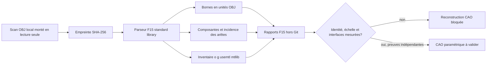

# Conteneur F15 de métrologie et segmentation OBJ

Cette image CPU exécute le vrai pipeline F15 pour caractériser un maillage OBJ
avant reconstruction CAO. Elle inventorie les déclarations, mesure les bornes
en unités OBJ et sépare les composantes connexes. Cette **segmentation géométrique**
ne constitue pas une reconnaissance sémantique des pièces du moteur.

## Pourquoi une image séparée

L'image historique `mesh-cfd` réunit Blender, Gmsh, OpenFOAM, SSH et de
nombreuses bibliothèques. Ce périmètre reste utile plus tard, mais il est trop
large pour l'inventaire initial. Le pipeline F15 s'exécute sans GPU et utilise
uniquement la bibliothèque standard de Python : aucune roue Python, dépendance
native, API ou licence logicielle payante n'est nécessaire.



## Frontières et reproductibilité

- la base CPython 3.12.14 est fixée au digest de son manifeste
  `linux/amd64` ;
- l'image contient seulement CPython, le contrat F15, son pipeline et le smoke ;
- le processus porte l'UID/GID numérique `9175:9175` et refuse root ;
- aucun scan, dataset, poids de modèle ou secret n'est copié dans l'image ;
- le smoke crée deux tétraèdres synthétiques dans `/tmp`, exécute le vrai
  pipeline avec `--synthetic-fixture-mode`, exige deux composantes et vérifie
  que toutes les autorités de release restent fermées ;
- le workflow manuel publie seulement un tag de commit, récupère le digest immuable,
  contrôle l'attestation BuildKit, l'architecture, l'utilisateur et
  rejoue le smoke sans réseau avec un système de fichiers en lecture seule.

CPython est distribué sous licence Python-2.0. Le contrat, le pipeline et le
smoke suivent la licence MIT du dépôt.

## Publication immuable vérifiée

Le verrou [`containers/obj-metrology-f15.lock.json`](../containers/obj-metrology-f15.lock.json)
fige les six entrées locales de recette par SHA-256 et la publication GHCR par
digest OCI :

```text
ghcr.io/cluster2600/3dprinting993-obj-metrology-f15@sha256:827e639cd126441dfa98fc097d4c8b09a01a28e25545de62ca3a01da963b959a
```

L'index OCI de 857 octets référence exactement un manifeste exécutable
`linux/amd64` et un manifeste d'attestations. Le manifeste exécutable contient
11 couches gzip, soit 45 462 453 octets compressés ; sa plus grande couche fait
28 232 655 octets. La configuration fixe Python 3.12.14 et l'utilisateur non
root `9175:9175`.

Le [workflow GitHub Actions vérifié](https://github.com/cluster2600/porscheparts/actions/runs/33571699112)
a terminé avec succès au commit
`6c3856b97b8fa87556c4443172e26683d6423d7d`. L'index, son manifeste de
plateforme et son manifeste d'attestations ont été relus et leurs digests
recalculés. La lecture anonyme du digest exact et le smoke hors ligne ont
réussi. L'attestation contient un SBOM SPDX et une provenance SLSA BuildKit ;
elle ne constitue pas une preuve physique du moteur.

Seuls les gates « image publique immuable » et « smoke CPU linux/amd64 » sont
ouverts. L'exécution du scan canonique dans cette image, l'identité, l'échelle,
la segmentation sémantique, la CAO dimensionnée, les solveurs classiques,
PhysicsNeMo, la corrélation physique, la simulation moteur, la fabrication,
l'impression et toute location Vast.ai restent explicitement bloqués.

## Construction locale

```bash
docker buildx build \
  --platform linux/amd64 \
  --file containers/obj-metrology-f15.Dockerfile \
  --tag 3dprinting993-obj-metrology-f15:dev \
  --load .

docker run --rm --network none --read-only \
  --tmpfs /tmp:rw,noexec,nosuid,size=16m \
  --cap-drop ALL --security-opt no-new-privileges \
  3dprinting993-obj-metrology-f15:dev
```

Pour le scan canonique, le fichier brut reste hors Git, monté en lecture seule
sur `/workspace/input`, et `/workspace/output` reçoit les rapports :

```bash
docker run --rm --network none --read-only \
  --tmpfs /tmp:rw,noexec,nosuid,size=256m \
  --mount type=bind,src="$PWD/raw-scans/917-engine/original",dst=/workspace/input,readonly \
  --mount type=bind,src="$PWD/work/917-engine/scan-segmentation-f15",dst=/workspace/output \
  --entrypoint python3 \
  3dprinting993-obj-metrology-f15:dev \
  /opt/3dprinting993/twins/reference-917-engine/source/build_scan_segmentation_f15.py \
  --contract /opt/3dprinting993/twins/reference-917-engine/scan-segmentation-f15.json \
  --source /workspace/input/917-engine-case-with-cylinders.obj \
  --output /workspace/output
```

## Ce que le résultat ne prouve pas

Un smoke vert, une segmentation ou une image GHCR publiée ne prouve pas
l'identité 917, l'échelle, la fidélité des interfaces, l'étanchéité, la CAO
reconstruite, la tenue thermomécanique, le fonctionnement du moteur ni
l'imprimabilité. Il ne déclenche aucune location Vast.ai. Le verrou prouve la
recette et l'exécution synthétique de l'image identifiée ; il ne transforme pas
ces résultats informatiques en validation d'ingénierie.
