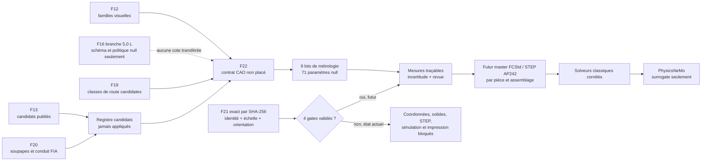

# Contrat CAO paramétrique F22 du Type 912 4,494 L

## Résultat

F22 prépare la réingénierie CAO de la branche atmosphérique
`type_912_4_5_na` sans inventer de forme. Le livrable est un **contrat
d’assemblage paramétrique**, pas un moteur CAO :

- 29 familles visuelles applicables à la branche atmosphérique sont inscrites
  dans un arbre non placé ;
- 71 paramètres critiques sont définis avec une unité, une cardinalité et une
  méthode de mesure, mais leur valeur reste `null` ;
- 10 interfaces d’assemblage sont décrites comme besoins inactifs, sans repère,
  ajustement ni tolérance ;
- 9 lots de métrologie peuvent recevoir les prochaines mesures avec identité,
  étalonnage, incertitude, référentiel et revue indépendante ;
- aucune géométrie, coordonnée, matière, contrainte, simulation ou fabrication
  n’est libérée.

Le contrat suivi est
`twins/reference-917-engine/parametric-cad-assembly-contract-f22.json`. Son
générateur et validateur unique est
`twins/reference-917-engine/source/build_parametric_cad_contract_f22.py`.

## Pourquoi F22 ne génère pas encore de solide

Le contrôle F21 d’échelle et d’orientation est une dépendance obligatoire mais
non satisfaite. F22 est lié au SHA-256 exact de F21 et lit ses quatre gates
d’identité, d’échelle, d’orientation et d’adaptation F11. Ils valent tous
`false` aujourd’hui ; aucune coordonnée ou superposition avec le scan n’est
donc autorisée.

En outre, aucune cote actuelle n’est une dimension de conception vérifiée. Les
faits publiés F13 et F20 ont tous `design_lock: false`. Les transformer dès
maintenant en cylindres, pistons, bielles ou culasses donnerait une géométrie
visuellement plausible mais techniquement indémontrable.



## Séparation stricte des niveaux de preuve

Le contrat distingue quatre espaces qui ne doivent jamais être fusionnés :

1. `verified_design_dimensions` et `verified_manufacturing_dimensions` sont
   actuellement des listes vides ;
2. `published_geometry_candidates` contient uniquement des valeurs publiées
   traçables et non verrouillées ;
3. `parameter_groups` contient les paramètres CAO réels, tous à `null` ;
4. `transparent_layout_guides` contient deux calculs reproductibles qui ne
   deviennent pas des cotes.

Les sept candidats géométriques directement reliés à la branche sont :

| Paramètre futur | Candidat publié | Source du registre | Autorité CAO |
|---|---:|---|---|
| alésage fini du cylindre | 85,0 mm | `FACT-45-BORE` | aucune |
| course | 66,0 mm | `FACT-45-STROKE` | aucune |
| distance axe de piston–calotte | 43,0 mm | `FACT-45-PISTON-COMPRESSION-HEIGHT` | aucune |
| diamètre de palier de maneton | 52,0 mm | `FACT-45-CRANKPIN-BEARING-DIAMETER` | aucune |
| diamètre extérieur soupape admission | 47,5 mm | `F20-INTAKE-VALVE-OUTER-DIAMETER` | aucune |
| diamètre extérieur soupape échappement | 40,5 mm | `F20-EXHAUST-VALVE-OUTER-DIAMETER` | aucune |
| diamètre déclaré du conduit admission | 41,0 mm | `F20-INTAKE-PORT-DIAMETER` | aucune |

La valeur FIA de 56,0 mm au champ 159 reste dans
`published_reference_candidates_not_geometry` avec le statut
`ambiguous_label_not_geometry_input`. Elle n'est plus associée au paramètre
`P-ROD-BIG-END-DIAMETER`, qui demeure `null` jusqu'à une mesure traçable ou un
plan primaire levant l'ambiguïté du libellé.

La tolérance ±0,8 mm associée au dernier point dans F20 reste une tolérance
d’homologation déclarée. Elle n’est pas une tolérance de fabrication. Le
paramètre CAO correspondant demeure donc `null` avec
`manufacturing_tolerance: null`.

Les levées maximales, jeux à froid et angles d’ouverture/fermeture F20 sont
conservés dans une liste d’exclusion explicite. Ce sont des candidats de
mouvement ou de réglage, pas des dimensions de solide. Sans loi de came mesurée
et validation de la chaîne cinématique assemblée, ils ne pilotent aucune CAO.
Les pressions d’injection et d’huile, le profil des lobes ainsi que les surfaces
internes sièges/conduits demeurent également `null`.

La demi-course de 33 mm et le déplacement géométrique calculé de
4 494,205371 cm³ sont des guides transparents issus de candidats. Ils servent à
détecter une incohérence de saisie, pas à verrouiller un vilebrequin ou une
chambre.

## Frontière entre variantes

F16 décrit une branche `type_912_5_0_na`. F22 en reprend seulement la structure
de registre, le principe des valeurs inconnues à `null` et la forme générale
d’une campagne de mesure. Il ne transfère aucune coordonnée, longueur,
cinématique ou géométrie 5,0 L vers la branche 4,494 L.

Les familles `turbocharger` et `charge_plenum` sont exclues de l’arbre F22. La
branche turbo devra posséder son propre contrat, ses propres mesures et ses
propres gates ; une modification de cote ne suffit pas à la dériver de F22.

## Arbre d’assemblage et fabrication

Les 29 familles F22 viennent du registre F12 dont le champ de variante n’est
pas `917_30_only`. Leur quantité est conservée comme
`visual_registry_candidate_not_real_bom`. Ce n’est pas une nomenclature réelle
fermée.

Chaque famille possède les emplacements suivants, tous non sélectionnés :

- `cad_master` et `placement_transform` ;
- matière, masse et inertie ;
- nuance, procédé et jeu de tolérances ;
- libération de layout, solide, assemblage, prototype, métal et fonction.

F22 recopie uniquement la **classe** de route F19. Ainsi une culasse reste
`metal_additive_candidate`, un vilebrequin `conventional_candidate`, un palier
principal `purchased_non_printable` et un piston `unresolved`. Aucun de ces
libellés ne sélectionne une nuance, un procédé ou un fournisseur.

## Campagne de mesures prête à remplir

Les paramètres sont regroupés par fonction :

| Groupe | Exemples à mesurer |
|---|---|
| référentiels et layout | axe vilebrequin, plans de banc, angle des bancs, axes et pas cylindres |
| carter et paliers | huit stations candidates, sièges, registres cylindres, goujons, galeries |
| vilebrequin | tourillons, manetons, phases, congés, perçages, sortie |
| bielles | entraxe, alésages, largeurs, déports, boulons, profil |
| pistons, axes et segments | profils, axe, bossages, gorges, jeu au deck |
| cylindres et culasses | registres, chambre, conduits, ailettes, passages d’huile |
| distribution | guides, sièges, axes de cames, profils de lobes, engrenages |
| admission, échappement, accessoires | trompettes, injecteurs, collecteurs, soufflante, pompes |

Une mesure ne devient exploitable que si son paquet fournit au minimum :

- l’identité de la pièce physique et de la variante ;
- l’instrument et son certificat d’étalonnage ;
- la température et le schéma de datums ;
- la valeur, l’unité et le budget d’incertitude ;
- le SHA-256 de l’artefact brut conservé hors Git si nécessaire ;
- l’opérateur ou laboratoire et une revue indépendante.

Le dépôt ne doit recevoir ni scan brut ni document propriétaire. Seuls les
faits minimaux, les empreintes et les décisions de revue peuvent entrer dans le
contrat suivi.

## Régénération et validation

Depuis la racine du dépôt :

```bash
python3 twins/reference-917-engine/source/build_parametric_cad_contract_f22.py \
  --root .

python3 twins/reference-917-engine/source/build_parametric_cad_contract_f22.py \
  --root . --check

python3 -m unittest discover -s tests \
  -p 'test_917_parametric_cad_contract_f22.py' -v
```

Le générateur vérifie les SHA-256 exacts des six contrats amont, y compris la
feuille F21 désormais finalisée. Il lit explicitement ses gates d'identité,
d'échelle, d'orientation et d'adaptation F11, qui restent tous fermés. Toute
modification d’une source impose une revue explicite et une mise à jour du
générateur ; elle ne peut pas modifier silencieusement la CAO.

## Passage au premier master CAO

La prochaine géométrie autorisable devra suivre cet ordre :

1. valider les quatre gates F21 liés par SHA-256 ;
2. identifier physiquement la variante Type 912 4,494 L ;
3. exécuter les lots F22 avec métrologie traçable ;
4. revoir et verrouiller les datums puis les interfaces critiques ;
5. créer d’abord un layout paramétrique sans solide ;
6. créer des masters éditables par pièce, puis l’assemblage et les chaînes de
   cotes ;
7. valider collisions, jeux, états de surface, matières et procédés ;
8. converger et corréler les solveurs classiques ;
9. seulement ensuite préparer un jeu de données PhysicsNeMo avec holdout,
   incertitude et contrôle hors distribution ;
10. qualifier séparément prototype polymère, fabrication métal et usage moteur.

Dans l’état F22, les exports `.FCStd`, STEP, USD, STL et 3MF sont interdits. Le
seul résultat autorisé est le contrat JSON et de futurs enregistrements de
mesure non libérés.
