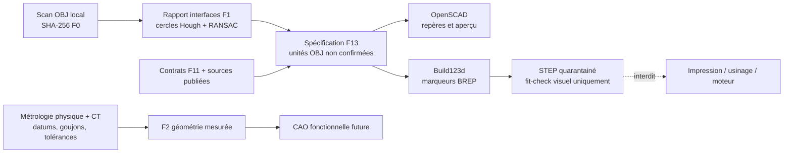

# Master paramétrique F13 carter–cylindre–culasse du 917

## Résultat et limite

F13 transforme le rapport local `interfaces.json` en un petit master CAO
reproductible de **repères d'interface**. Il place les douze ouvertures détectées,
leurs axes, deux bancs de six et un plan de coupure centrale de mise en page. Il
ne reconstruit encore ni le carter, ni les cylindres, ni les culasses comme
pièces fonctionnelles.

Le scan reste en unités OBJ. L'identité exacte, l'échelle millimétrique, les
faces usinées, les tolérances et la variante ne sont pas confirmées. Le STEP
optionnel est donc uniquement un transport visuel en quarantaine : son noyau
écrit les nombres OBJ dans des unités STEP millimétriques, sans que cela
constitue une conversion physique en millimètres.

Le générateur est :

`twins/reference-917-engine/source/build_parametric_interface_f13.py`

Il produit sous `work/917-parametric-interface-f13/` :

- une spécification JSON traçable ;
- un master OpenSCAD sans dépendance à FreeCAD ;
- un exporteur Build123d vers STEP, bloqué par défaut ;
- un rapport de génération.

Aucun STL n'est produit. Tous les drapeaux de libération fonctionnelle,
d'impression polymère ou métal restent à `false`.
La spécification recalcule également le SHA-256 exact du rapport d'interfaces
consommé afin de relier une génération à son entrée dérivée précise.

## Chaîne de preuve



Le sens de la coupure centrale est volontairement précis : il s'agit du plan
normal à X passant par la moyenne des milieux entre les ouvertures 3 et 4 de
chaque rangée. Ce n'est pas une face de joint de carter mesurée. Les trois axes
globaux viennent du repère PCA du rapport, pas d'un référentiel constructeur.

## Données utilisées

Les douze centres, diamètres apparents et axes sont marqués
`measured_from_scan_obj_units`, avec un pointeur JSON vers le rapport local. Les
valeurs de publication restent `published_reference_candidate` et ne changent
pas l'échelle du scan.

Sur le rapport actuellement disponible :

| Signal | Valeur | Statut |
|---|---:|---|
| diamètre apparent moyen des 12 ouvertures | 86,6271 unités OBJ | mesuré sur le maillage, pas un alésage certifié |
| moyenne des 8 pas réguliers | 117,9640 unités OBJ | mesuré sur les centres détectés |
| pas publié candidat | 118 mm | source secondaire, pas plan constructeur |

Une comparaison numérique est conservée comme hypothèse, sans sélection :

| Variante candidate | Alésage publié | facteur hypothétique | pas implicite | écart à 118 mm |
|---|---:|---:|---:|---:|
| Type 912 4,5 L | 85,0 mm | 0,981217 mm/OBJ | 115,748 mm | −1,908 % |
| 917 5,0 L / 4 999 cm³ | 86,8 mm | 1,001996 mm/OBJ | 118,199 mm | +0,169 % |
| 917/30 5 374 cm³ | 90,0 mm | 1,038936 mm/OBJ | 122,557 mm | +3,862 % |

Le rapprochement du candidat 5,0 L est intéressant, mais il ne prouve rien à
lui seul : il suppose que l'ouverture circulaire visible est exactement
l'alésage fini. F13 conserve donc `decision: null`, `identity_released: false`
et `scale_released: false` pour les trois variantes.

## Goujons et interfaces absentes

Le rapport d'interfaces ne contient pas de détection métrologique des goujons.
F13 écrit donc :

```json
{
  "stud_locations": [],
  "stud_status": "not_detected_not_generated"
}
```

Il n'extrapole pas un motif à partir d'une photo ou d'un autre moteur. Le carter
est représenté par son repère et le plan central de mise en page, le cylindre
par l'ouverture et l'axe détectés, et la culasse seulement par une référence
coaxiale. Les registres, faces d'appui, joints feu, chambres, conduits, ailettes,
goujons et surfaces d'usinage restent absents.

## Génération locale sans FreeCAD

Depuis la racine du dépôt :

```bash
python3 twins/reference-917-engine/source/build_parametric_interface_f13.py \
  --interfaces work/917-engine/vast-output/reports/interfaces.json \
  --source-contract twins/reference-917-engine/source-scan-integrity-f11.json \
  --engineering-contract twins/reference-917-engine/reengineering-contract-f11.json \
  --reference-contract twins/reference-917-engine/complete-engine-f1.json \
  --ams-source catalog/sources/src-ams-917-engine-technical-analysis.json \
  --output-dir work/917-parametric-interface-f13
```

Le test valide la spécification et les deux textes CAO sans importer FreeCAD,
OpenSCAD ou Build123d :

```bash
python3 -m unittest discover -s tests \
  -p 'test_917_parametric_interface_f13.py' -v
```

## Aperçu et STEP dans l'image CAO

Construire d'abord l'image CPU reproductible :

```bash
docker build --platform linux/amd64 \
  -f containers/cadsim.Dockerfile \
  -t 3dprinting993-cadsim:f13 .
```

Produire un aperçu PNG OpenSCAD, sans STL :

```bash
docker run --rm --platform linux/amd64 \
  -v "$PWD/work/917-parametric-interface-f13:/workspace" \
  3dprinting993-cadsim:f13 \
  xvfb-run -a openscad --autocenter --viewall --imgsize=1600,1000 \
  -o /workspace/917-engine-interface-master-f13-preview.png \
  /workspace/917-engine-interface-master-f13.scad
```

L'export STEP impose une reconnaissance explicite de l'absence d'échelle :

```bash
docker run --rm --platform linux/amd64 \
  -e F13_ALLOW_UNSCALED_STEP=fit-check-only \
  -v "$PWD/work/917-parametric-interface-f13:/workspace" \
  3dprinting993-cadsim:f13 \
  python /workspace/917-engine-interface-master-f13-build123d.py
```

Sans cette variable exacte, l'exporteur refuse de créer le STEP. Le fichier
résultant se nomme
`917-engine-interface-master-f13-fit-check-only.step`. Il peut être ouvert dans
FreeCAD pour superposition et revue visuelle, jamais coté comme une pièce
physique. Le rapport `step-export-report.json` rappelle que la conversion
physique en millimètres et la fabrication ne sont pas libérées.

## Passage vers une CAO fonctionnelle

Le prochain palier ne consiste pas à épaissir ces marqueurs. Il faut d'abord :

1. confirmer l'identité et la variante ;
2. relever au moins trois contrôles d'échelle physiques indépendants avec
   incertitude ;
3. mesurer les datums de carter, registres de cylindres et faces de culasses ;
4. mesurer le motif complet des goujons, filetages et chemins de serrage ;
5. acquérir un cylindre et une culasse par métrologie calibrée ou CT ;
6. définir les ajustements, états de surface, matériaux et cas de charge ;
7. faire relire et signer la définition avant toute simulation ou fabrication.

PhysicsNeMo n'intervient qu'après une géométrie qualifiée, des solveurs de
référence, des données de banc et un jeu d'entraînement séparé. F13 n'est pas un
jeu de données de simulation et ne doit pas être utilisé comme tel.
