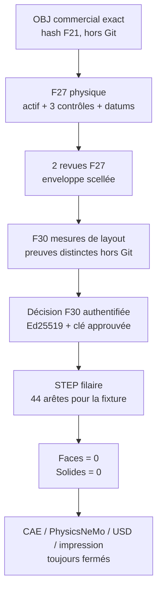

# F30 — master paramétrique mesuré du moteur 917

## Résultat et limite

F30 fournit l'auteur **fail-closed** du premier layout CAO mesuré du moteur
917. Il est prêt à produire, après exécution réelle de F27 et revue séparée :

- le repère moteur droitier ;
- l'axe du vilebrequin ;
- le plan de joint du carter ;
- les deux plans de deck ;
- douze axes de cylindres ;
- uniquement le nombre et les positions de paliers principaux confirmés
  physiquement.

La seule géométrie autorisée est un STEP filaire de construction. F30 interdit
les faces, les solides, STL, 3MF, USD, decks solveur, échantillons
PhysicsNeMo, plans de fabrication et autorisations de démarrage moteur.

Le dépôt ne contient toujours aucune mesure F27 exécutée. Il ne contient donc
pas de STEP moteur réel issu du scan. Le round-trip actuel est une fixture
synthétique de validation logicielle, pas une reconstruction du moteur.



## Résistance au blanchiment de preuve

Les upstreams F21, F22, F24, F27, F28, le formulaire d'observations F27, le
validateur F27 et le verrou de l'image CAO utilisent des SHA-256 littéraux.
`--write-template` refuse une dérive ; il ne recalcule pas une nouvelle vérité
depuis un fichier modifié.

Avant validation, F30 copie tous ses fichiers d'entrée dans un snapshot privé
sous `work/`. Le validateur F27 et l'auteur F30 consomment les mêmes octets. Le
snapshot comprend le scan, les formulaires, les deux dossiers de preuves, les
paramètres, le binding canonique, le rapport humain, la signature détachée et
la clé publique. Le validateur F27 exécuté est lui aussi copié, hashé puis
ouvert par descripteur immuable. Le snapshot est supprimé à la fin.

Les paramètres et la décision F30 doivent être du JSON canonique. La signature
Ed25519 porte sur les octets exacts de la décision, laquelle lie le hash des
paramètres, du rapport de revue, du scan et de l'enveloppe F27. La clé publique
doit correspondre à une empreinte approuvée dans le contrat suivi.

Cette empreinte est actuellement `null` : le chemin réel est donc
volontairement bloqué jusqu'à désignation d'un reviewer et ajout de son ancre
publique. Les tests emploient uniquement une doublure synthétique, jamais une
identité de production.

La publication prépare tous les fichiers et le marqueur dans un répertoire
frère privé, les synchronise, puis renomme le dossier entier de façon atomique
avec l'option *no-replace*. Le descripteur du parent reste ouvert pendant la
publication ; un dossier final partiel n'est jamais exposé et un dossier
existant n'est jamais remplacé.

## Deux registres de preuves séparés

F27 prouve l'identité de l'actif, l'échelle, l'orientation et la variante. Il
ne mesure pas les douze axes de cylindres ni les stations de paliers nécessaires
au layout. Réutiliser une preuve d'échelle comme preuve d'axe serait donc
incorrect.

F30 exige un second `evidence_index`, privé, dont chaque entrée contient :

- un identifiant et un rôle fermé ;
- un chemin relatif confiné dans le dossier de preuves F30 ;
- le SHA-256 du fichier régulier, sans symlink ;
- le drapeau de sensibilité ;
- `commit_allowed: false`.

Les rôles autorisés sont :

| Rôle | Entité qu'il peut justifier |
|---|---|
| `engine_coordinate_frame_fit` | repère moteur |
| `crankshaft_axis_fit` | axe du vilebrequin |
| `crankcase_split_plane_fit` | plan de joint |
| `bank_deck_plane_fit` | plans de deck |
| `cylinder_axis_fit` | axes de cylindres |
| `main_bearing_station_fit` | positions des paliers |
| `main_bearing_count_report` | nombre de paliers confirmé |

Une preuve de mauvais rôle, non référencée, absente, modifiée ou présente en
plus dans le dossier fait échouer l'auteur sans sortie. Tout chevauchement de
SHA-256 entre les charges utiles de preuve F27 et F30 est également rejeté :
copier le même fichier et lui donner un nouveau rôle ne crée pas une nouvelle
preuve.

## Variantes autorisées

F27 utilise encore des identifiants candidats plus larges que les branches
F28. F30 n'autorise actuellement qu'une liaison non ambiguë :

| Variante F27 identifiée physiquement | Branche F28 | F30 |
|---|---|---|
| `917_5_0_na` | `type_912_5_0_na` | autorisable après campagne et revue |
| `type_912_4_5_na` | aucune branche F28 | bloquée |
| `917_30_turbo_5374` | seulement un candidat générique ; F28 vise précisément 1973 | bloquée |

Le layout turbo ne sera pas dérivé d'une ressemblance visuelle. Il faut faire
évoluer F27 pour distinguer une identité `917_30_1973_turbo_5374` traçable de
toute autre évolution avant de cibler la branche turbo F28.

## Cohérence géométrique contrôlée

F30 vérifie notamment :

- origine moteur canonique et axe vilebrequin `+X` ;
- plan de joint normal à `+Z` et contenant l'origine ;
- deck positif côté `+Y`, deck négatif côté `-Y` ;
- normales de deck orthogonales au vilebrequin ;
- chaque origine d'axe cylindre sur son deck, dans l'incertitude déclarée ;
- chaque axe cylindre aligné avec la normale de son deck et orthogonal au
  vilebrequin ;
- six positions longitudinales strictement croissantes par banc ;
- stations de paliers triées, distinctes et dans la portée du vilebrequin ;
- hash exact de la transformation F27 scan→repère moteur.

La signature géométrique contient les extrémités canoniques de toutes les
arêtes réellement écrites. Les témoins purement visuels sont déclarés : axes
du repère de 25 mm et demi-marqueur de palier de 5 mm. Ils ne sont pas des cotes
du moteur.

## Apport des photographies

Les vues éclatées et photos de démontage permettent de confirmer une
nomenclature et des relations : 12 bielles, 24 soupapes et 24 ressorts, arbres
à cames et intermédiaires, entraînement de l'injection mécanique, admission et
architecture biturbo. Elles ne fournissent ni repère calibré, ni focale, ni
incertitude, ni surfaces cachées. F30 les accepte comme preuve topologique ou
de préparation de campagne, jamais comme cote CAO.

Les captures utilisateur et photographies tierces ne sont pas ajoutées au
dépôt. Seules les URL, observations et limites de droit peuvent être suivies.

## Préparer les entrées locales

Les chemins ci-dessous sont des exemples ; tous restent sous `work/` et hors
Git :

```text
work/917-engine/metrology/f27/campaign.json
work/917-engine/metrology/f27/observations.csv
work/917-engine/metrology/f27/evidence/
work/917-engine/metrology/f27/working-scan.obj
work/917-engine/cad/f30/layout-parameters.json
work/917-engine/cad/f30/layout-evidence/
work/917-engine/cad/f30/binding-decision.json
work/917-engine/cad/f30/binding-review-report.pdf
work/917-engine/cad/f30/binding-signature.bin
work/917-engine/cad/f30/reviewer-public-key.pem
```

Le formulaire suivi
`twins/reference-917-engine/parametric-layout-authoring-f30.template.json`
décrit les champs et l'ordre d'autorité. Il ne contient aucune cote.

## Vérification locale

```bash
python3 twins/reference-917-engine/source/build_parametric_layout_master_f30.py \
  --root . \
  --check-template

PYTHONDONTWRITEBYTECODE=1 python3 \
  tests/test_917_parametric_layout_master_f30.py -v
```

Après ajout revu de l'empreinte de clé publique dans le contrat, l'auteur réel
s'exécute dans l'image immuable CPU. Dans l'état suivi actuel, la commande
ci-dessous échoue volontairement avec
`binding_reviewer_trust_anchor_not_configured` :

```bash
cad_image='ghcr.io/cluster2600/3dprinting993-cad-author-f28@sha256:18dbfa559306a31c909480695acf0e89a9bc904c83d280065c1d9d29036fec57'

docker run --rm \
  --platform linux/amd64 \
  --network none \
  --read-only \
  --cap-drop ALL \
  --security-opt no-new-privileges \
  --user 9178:9178 \
  --tmpfs /tmp:rw,noexec,nosuid,size=512m \
  -v "$PWD:/workspace:ro" \
  -v "$PWD/work:/workspace/work:rw" \
  --entrypoint python \
  "$cad_image" \
  /workspace/twins/reference-917-engine/source/build_parametric_layout_master_f30.py \
  --root /workspace \
  --author \
  --record /workspace/work/917-engine/metrology/f27/campaign.json \
  --observations /workspace/work/917-engine/metrology/f27/observations.csv \
  --evidence-root /workspace/work/917-engine/metrology/f27/evidence \
  --working-scan /workspace/work/917-engine/metrology/f27/working-scan.obj \
  --binding /workspace/work/917-engine/cad/f30/binding-decision.json \
  --binding-report /workspace/work/917-engine/cad/f30/binding-review-report.pdf \
  --binding-signature /workspace/work/917-engine/cad/f30/binding-signature.bin \
  --reviewer-public-key /workspace/work/917-engine/cad/f30/reviewer-public-key.pem \
  --layout-evidence-root /workspace/work/917-engine/cad/f30/layout-evidence \
  --parameters /workspace/work/917-engine/cad/f30/layout-parameters.json \
  --output-dir /workspace/work/917-engine/cad/f30/F30-REAL-001
```

Le smoke synthétique de la chaîne réelle, exécuté hors réseau et sans GPU dans
cette image, a rouvert **44 arêtes linéaires, 0 face et 0 solide**, avec
validité OCCT. Le validateur compare aussi le multiensemble normalisé des deux
extrémités de chaque arête du STEP rouvert à celui des segments demandés ; le
nombre d'arêtes seul n'est pas accepté comme preuve du round-trip.

Le processus exécuté dans le conteneur ne peut pas prouver lui-même le digest
OCI de son image. Le manifeste de sortie enregistre donc l'image exigée comme
politique, avec `exact_image_identity_verified_in_process: false`. Une
attestation du contrôleur (inspection du digest, de la plateforme et de
l'utilisateur avant le lancement) reste obligatoire ; F30 ne la fabrique ni
ne la simule silencieusement.

Ce résultat démontre uniquement le chemin logiciel build123d→STEP→OCCT.

## Suite vers le jumeau fonctionnel

```mermaid
flowchart LR
    F30[Layout mesuré F30]
    CAD[Solides paramétriques<br/>interfaces + tolérances]
    MAT[Matières et procédés<br/>routes additive/usinée/achetée]
    SOL[Cas classiques convergés<br/>thermique, structure, CFD, rotation]
    COR[Corrélation banc<br/>mesures physiques]
    N[Dataset PhysicsNeMo<br/>surrogate qualifié]
    USD[USD + SimReady<br/>matériaux, joints, colliders]
    Q[Qualification fabrication<br/>CND, métrologie, endurance]

    F30 --> CAD --> MAT --> SOL --> COR --> N --> USD --> Q
```



PhysicsNeMo n'est pas un moteur de CAO et ne reconstitue pas les dimensions
absentes. Il devient utile après des solveurs classiques corrélés, pour explorer
plus rapidement l'espace de conception. Omniverse vient ensuite pour
l'assemblage USD/SimReady et la visualisation multiphysique ; ni l'un ni
l'autre ne remplace les essais, le contrôle matière ou la revue moteur.
