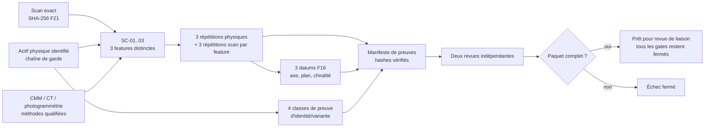

# F27 — campagne physique pour lier le scan 917 à un actif et une variante

## Résultat

F27 transforme les slots encore théoriques de F13, F16 et F21 en un dossier
d’acquisition utilisable par un laboratoire. Il fournit :

- un formulaire JSON vierge pour l’identité, les méthodes, les datums,
  l’incertitude, la chaîne de garde et les revues ;
- un formulaire CSV vierge de 18 observations appariées ;
- un validateur local strict des formulaires, des répétitions et des preuves ;
- une frontière d’autorité explicite : même un paquet complet est seulement
  `ready_for_independent_binding_review_gates_closed`.

Le dépôt ne contient aucune mesure physique, coordonnée du scan, géométrie
propriétaire, identité de moteur, donnée opérateur ou preuve brute. Les deux
formulaires suivis sont volontairement vides. Toute copie remplie et toutes ses
preuves restent soit sous `work/917-engine/metrology/f27/`, soit réellement hors
du dépôt ; dans les deux cas, elles restent hors Git.

F27 ne lie donc pas encore le scan à une variante. Il rend cette opération
réellement exécutable et auditable sans transformer une cote documentaire ou
une ressemblance visuelle en autorité métrologique.



## Audit de ce qui existait déjà

| Jalon | Ce qu’il apporte | Ce qui manquait pour exécuter la campagne |
| --- | --- | --- |
| F13 | Trois variantes candidates, un calcul conditionnel et trois contrôles physiques minimaux | Pas de formulaire d’observation appariée, de custody, de méthode qualifiée ni de décision de variante ; deux contrôles portent sur des goujons non observés par le rapport de scan actuel |
| F16 | Noms des datums et cibles cinématiques, campagne CMM/CT conceptuelle | Aucune coordonnée, procédure de recalage, répétition, incertitude ou preuve d’exécution ; la branche 5,0 l reste une référence non liée au scan |
| F21 | Hash exact du scan, trois slots same-feature, trois datums et seuil de dispersion F11 | Pas de paquet de terrain, de choix CMM/CT/photogrammétrie, de feuille répétitions, de budget pré-déclaré, de chaîne de garde, de vérification des fichiers ni d’adjudication de variante |

La liste de variantes F13 borne les identifiants acceptés par le formulaire ;
elle ne prouve pas l’identité de l’actif. Le rapprochement numérique F13 avec
un alésage publié reste explicitement interdit comme règle de sélection.

Les trois upstreams sont liés par des empreintes SHA-256 approuvées et figées
dans le code F27. Le paquet local ne peut ni recalculer ni remplacer ces
empreintes. Le validateur contrôle en plus les invariants d’autorité utiles de
F13, F16 et F21 : contrôles encore vides, scan non lié, datums sans
coordonnées, correspondance same-feature obligatoire et tous les gates fermés.
Une copie upstream modifiée échoue donc même si son nouveau hash est injecté
dans le manifeste du paquet.

Les anciens contrôles de longueur et diamètre de goujon ne peuvent être repris
comme contrôles d’échelle que si la **même caractéristique** et ses extrémités
sont observables sans ambiguïté sur le scan exact. Dans le cas contraire, le
métrologue doit choisir trois autres caractéristiques visibles sur le scan et
mesurables sur l’actif physique. F27 ne préremplit aucun choix.

## Préparer la copie de travail locale

Depuis la racine du dépôt :

```bash
mkdir -p work/917-engine/metrology/f27/evidence

cp twins/reference-917-engine/physical-metrology-campaign-f27.template.json \
  work/917-engine/metrology/f27/campaign.json

cp twins/reference-917-engine/physical-metrology-observations-f27.template.csv \
  work/917-engine/metrology/f27/observations.csv

cp raw-scans/917-engine/original/917-engine-case-with-cylinders.obj \
  work/917-engine/metrology/f27/working-scan.obj
```

Le JSON local doit passer de `blank_template_not_executed` à
`campaign_execution_complete_pending_binding_review` uniquement après
exécution réelle. Les booléens de `current_readiness` et tous les
`release_gates` restent à `false` : le validateur produit son évaluation dans
son rapport, sans modifier le formulaire ni conférer d’autorité.

## Protocole de terrain

### 1. Geler le protocole avant toute mesure

Avant la première observation, le laboratoire doit :

1. attribuer l’identifiant de campagne et de custody ;
2. identifier l’actif ou le jeu de pièces, sans publier ces identifiants ;
3. choisir les méthodes et les caractéristiques ;
4. définir les budgets d’incertitude et limites de répétabilité ;
5. faire signer la procédure pré-acquisition ;
6. enregistrer `protocol_frozen_at_utc` avant la première observation.

F27 n’invente aucune limite d’incertitude. Les champs
`maximum_relative_standard_uncertainty` et
`maximum_relative_repeatability_range` doivent être définis par le laboratoire
selon ses instruments, l’état de la pièce et l’usage futur, puis figés avant
l’acquisition. Les ajuster après lecture des résultats invalide la campagne.

Le formulaire exige le modèle conservateur
`unknown_correlations_bounded_by_one_use_worst_case_linear_sum`. Tant qu’une
matrice de covariance qualifiée n’existe pas, F27 borne chaque corrélation par
`|rho| <= 1`, conserve la moyenne arithmétique des incertitudes standard de
chaque côté et additionne linéairement les deux contributions relatives. Une
autre phrase libre dans `correlation_assumptions` est refusée. Les limites du
laboratoire doivent seulement être numériques, finies et strictement
positives ; F27 n’impose pas de borne métier arbitraire inférieure à 1.

### 2. Sceller la chaîne de garde

Six événements ordonnés sont obligatoires :

1. réception de l’actif physique ;
2. création de la copie de travail du scan ;
3. vérification des étalonnages ;
4. ouverture de l’acquisition ;
5. fermeture de l’acquisition ;
6. scellement du manifeste de preuves.

Chaque événement garde date UTC, acteur ou rôle, lieu ou système, identifiants
d’entrée/sortie, preuve et statut de témoin/revue. Toutes les observations CSV
doivent se situer entre l’ouverture et la fermeture de l’acquisition.

La copie de travail doit avoir exactement le SHA-256 F21
`428c4143d073f8330022f2fecbd1ac1ee7784d4f1565f1160020448dbdffa0ae`.
Un export, nettoyage ou ré-encodage différent constitue un autre actif et doit
recevoir un nouveau dossier de provenance ; il ne peut pas reprendre ce hash.
Le mode campagne exige `--working-scan` : le validateur ouvre réellement ce
fichier régulier, sans suivre de symlink, et calcule son SHA-256. Les deux
chaînes déclaratives du JSON et de la custody ne suffisent jamais seules.

### 3. Qualifier les méthodes

Le formulaire contient quatre routes. Seules les routes réellement utilisées
sont marquées `selected: true`.

| Route | Usage admissible | Preuves minimales du formulaire | Limite |
| --- | --- | --- | --- |
| `CMM` | Features accessibles, axes et plans de référence physiques | Certificat, procédure, qualification du palpeur, alignement des datums, logiciel/version | Ne voit pas une feature interne ou masquée sans démontage |
| `CT` | Géométrie interne/occluse et recalage volumique | Artefact d’échelle, rapport voxel, recette de reconstruction et segmentation | Une taille de voxel ou un rendu CT n’est pas une incertitude dimensionnelle |
| `PHOTOGRAMMETRY` | Réseau externe, transfert de repères et grandes distances | Calibration caméra, barres d’échelle certifiées, bundle adjustment, implantation des cibles | Ne suffit pas seule pour un datum interne ou l’identité de variante |
| `MESH_INSPECTION` | Mesure de la même feature dans le fichier OBJ exact | Validation du logiciel, script de mesure, version, procédure et hash de preuve | Ne transforme pas les unités OBJ en millimètres |

Au moins une route physique (`CMM`, `CT` ou `PHOTOGRAMMETRY`) et
`MESH_INSPECTION` sont requises. Les observations doivent référencer exactement
l’instrument ou le logiciel enregistré dans la route sélectionnée.

### 4. Enregistrer l’environnement et les étalonnages

Le laboratoire consigne la stabilisation, l’instrument de température, son
étalonnage, la température, l’humidité et le journal environnemental. Chaque
observation garde aussi sa température, son heure, son opérateur/laboratoire,
son certificat ou validation et sa preuve brute.

Une valeur sans certificat applicable, procédure, preuve ou incertitude est
rejetée. Le validateur accepte des nombres finis seulement : `NaN` et
`Infinity` sont interdits.

### 5. Réaliser les trois contrôles d’échelle

`SC-01`, `SC-02` et `SC-03` doivent satisfaire simultanément :

- trois caractéristiques physiques distinctes ;
- trois régions du scan distinctes ;
- pour chaque contrôle, la même définition de feature et les mêmes extrémités
  côté actif et côté scan ;
- trois répétitions physiques avec trois setups ou refits indépendants ;
- trois répétitions sur le scan avec trois setups ou refits indépendants ;
- méthode, température, incertitude standard et preuve pour chaque lecture ;
- preuve explicite de correspondance scan↔actif.

Le CSV contient donc 18 lignes :

```text
3 contrôles × 2 côtés (physical, scan) × 3 répétitions = 18 observations
```

Pour chaque contrôle, le validateur calcule seulement comme métriques de
screening :

```text
scale_i = mean(distance_physical_mm) / mean(distance_scan_OBJ)

u_rel_worst_case(scale_i) =
  mean(u_physical) / mean_physical
  + mean(u_scan) / mean_scan
```

Cette somme linéaire est la borne conservative appliquée en l’absence d’une
matrice de covariance qualifiée ; elle ne suppose pas l’indépendance des
répétitions ou des deux côtés.

Il vérifie aussi les limites pré-déclarées et la dispersion relative des trois
facteurs. Le maximum `0,005` n’est pas une tolérance inventée par F27 : il est
repris exactement de F21/F11. Il s’agit d’un seuil de cohérence, pas d’une
déclaration de précision ni d’une cote de fabrication.

### 6. Construire l’orientation

Les trois datums proviennent strictement de F16/F21 :

| Slot F27 | Datum F16 | Résultat attendu |
| --- | --- | --- |
| `OR-PRIMARY-AXIS` | `crankshaft_axis` | Origine, vecteur unitaire, résidus et incertitude angulaire |
| `OR-SECONDARY-PLANE` | `crankcase_split_plane` | Point, normale unitaire, résidus et incertitude angulaire |
| `OR-HANDEDNESS` | `bank_positive_deck_plane` | Témoin asymétrique et règle de signe non ambiguë |

Chaque datum doit être établi physiquement, identifié sur le scan, puis relié
par des preuves de fit et de recalage. La transformation finale contient
échelle, matrice de rotation 3×3 de déterminant positif, translation et rapport
d’incertitude. Le validateur vérifie la cohérence numérique de la matrice et
que l’échelle de transformation égale la moyenne calculée des trois contrôles.

Cette transformation reste un résultat local candidat. Elle n’est ni écrite
dans le scan suivi, ni importée automatiquement en CAO/USD.

Le contrat de cohérence de coordonnées est pré-déclaré dans le formulaire :

- l’axe primaire doit appartenir au plan secondaire ;
- la ligne 0 de la rotation doit être la direction signée de l’axe ;
- la ligne 2 doit être la normale signée du plan ;
- la ligne 1 doit être `ligne_2 × ligne_0` ;
- la translation doit envoyer l’origine de l’axe primaire sur l’origine moteur ;
- la chiralité doit être exactement
  `bank_positive_on_positive_engine_y`, suivre la règle sémantique du slot et
  fournir un point témoin asymétrique dont la coordonnée moteur Y transformée
  est strictement positive.

La tolérance absolue `1e-6` sert uniquement à comparer des nombres flottants
du paquet ; les tolérances `1e-9` relative et `1e-12` absolue servent uniquement
à la cohérence du facteur d’échelle. Ce ne sont ni des tolérances de pièce, ni
des incertitudes métrologiques, ni des seuils de fabrication.

### 7. Identifier et adjuger la variante

Une variante ne peut pas être choisie à partir du seul diamètre apparent, du
nom de fichier, d’une photo ou de la meilleure proximité numérique. F27 exige
quatre classes de preuves indépendantes :

1. marquage direct ou identité de pièce ;
2. correspondance de références/configuration ;
3. discriminant de démontage ou d’architecture ;
4. comparaison métrologique calibrée.

Les quatre sources ont des identifiants indépendants et un statut accepté. Un
journal des contradictions est obligatoire, même s’il conclut qu’aucune
contradiction n’a été observée. Le dossier doit aussi documenter explicitement
le crosswalk entre l’identifiant F13 sélectionné et la branche de référence
F16, car leurs identifiants ne constituent pas eux-mêmes une équivalence.

Enfin, un métrologue qualifié et un ingénieur indépendant, identifiés par deux
IDs distincts, signent chacun un rapport distinct **après** le scellement du
paquet. Leurs IDs doivent aussi être distincts du responsable de campagne, des
opérateurs/laboratoires enregistrés et des acteurs de custody. Le validateur
vérifie dates, rôles, présence et hash ; il ne juge ni compétence ni contenu.

## Manifeste de preuves

Toutes les références `*_evidence_ref` du JSON et les deux références de chaque
ligne CSV pointent vers `evidence_index`. Une entrée contient :

- un `evidence_id` unique ;
- le type de preuve ;
- un chemin POSIX relatif à la racine locale des preuves ;
- le SHA-256 attendu ;
- le statut sensible/propriétaire ;
- `commit_allowed: false` sans exception.

Le champ `kind` n’est pas libre : il doit correspondre au rôle de la référence
qui consomme l’entrée. Une calibration peut être partagée entre plusieurs
lectures et un jeu brut peut regrouper plusieurs répétitions, mais une donnée
brute ne peut pas remplacer une calibration, quatre classes d’identité doivent
avoir quatre artefacts et quatre digests distincts, et les deux revues deux
rapports et digests distincts. Deux IDs différents ne peuvent pas masquer le
même chemin ou le même inode, et un fichier de preuve vide est toujours refusé.

Les identifiants utilisés pour prouver une indépendance — features, régions,
setups, sources, acteurs et reviewers — doivent déjà être sans espaces en bord
et normalisés Unicode NFC. Le validateur compare aussi leur forme normalisée ;
des variantes visuelles d’un même ID ne comptent jamais comme sources ou
contrôles indépendants.

Le scellement est construit en deux étages pour respecter la chronologie :

1. l’événement `evidence_manifest_seal` contient le SHA-256 canonique du paquet
   **d’acquisition** : JSON, CSV et index des preuves disponibles à la fermeture ;
   `independent_reviews` et les deux futurs rapports sont explicitement exclus ;
2. chaque revue, créée et signée après cet événement, renseigne
   `reviewed_acquisition_packet_sha256` avec exactement ce digest ;
3. après les deux signatures, `final_envelope.sha256` lie le record complet, le
   CSV, toutes les preuves et les deux revues.

Pour éviter les circularités, le champ de digest en cours est neutralisé
pendant son propre calcul. Dans l’acquisition seal, le hash de son artefact est
aussi neutralisé ; identité, rôle et chemin restent liés, puis le fichier est
vérifié séparément. Une modification d’acquisition invalide le premier digest
et l’enveloppe finale ; une modification de revue invalide l’enveloppe finale.

Dans `evidence_index`, le validateur refuse les chemins absolus, `..`,
symlinks, fichiers non réguliers, JSON à clés dupliquées, nombres JSON non
finis, fichier modifié pendant la lecture et hash différent. Les arguments
`--record`, `--observations`, `--evidence-root`, `--working-scan`, chaque
composant de répertoire et chaque preuve sont ouverts par `openat`/`dir_fd`,
avec `O_NOFOLLOW`, puis
contrôlés par `fstat` avant/après ; aucun `resolve()` permissif ne précède ces
contrôles. Sur macOS, seuls les alias système `/var` et `/tmp` sont ancrés vers
leurs répertoires `/private` connus avant ce parcours strict.

La frontière hors Git est contrôlée à partir des chemins réellement ouverts,
pas à partir du booléen déclaratif du JSON. Le JSON, le CSV et la copie du scan
doivent partager le même dossier de campagne, avec une racine `evidence/`. Les
quatre chemins peuvent être
réellement hors du dépôt ou sous
`work/917-engine/metrology/f27/` ; toute autre zone du dépôt et tout chemin
suivi par Git sont refusés.

## Validation

Vérifier les formulaires suivis :

```bash
python3 twins/reference-917-engine/source/validate_physical_metrology_campaign_f27.py \
  --root . \
  --check-templates
```

Évaluer une campagne locale :

```bash
python3 twins/reference-917-engine/source/validate_physical_metrology_campaign_f27.py \
  --root . \
  --record work/917-engine/metrology/f27/campaign.json \
  --observations work/917-engine/metrology/f27/observations.csv \
  --evidence-root work/917-engine/metrology/f27/evidence \
  --working-scan work/917-engine/metrology/f27/working-scan.obj
```

Le code de sortie est non nul si un champ, une répétition, un contrôle
d’indépendance, une limite pré-déclarée, un datum, une preuve, une revue ou un
hash manque. Le formulaire vierge échoue volontairement en mode campagne.

Un paquet complet produit
`ready_for_independent_binding_review_gates_closed`. Cette phrase signifie
uniquement que la structure et les preuves référencées sont complètes pour une
revue humaine. Le rapport conserve explicitement :

- `scan_variant_bound: false` ;
- `cad_input_authorized: false` ;
- `solver_authorized: false` ;
- `physicsnemo_authorized: false` ;
- `fabrication_authorized: false`.

## Suite après F27

Après une vraie campagne acceptée, il faudra encore créer et qualifier un
adaptateur de liaison séparé qui consomme le rapport signé, publie seulement un
résumé non sensible, met à jour le niveau de preuve du scan et ouvre au cas par
cas les entrées CAO. Les solveurs classiques viennent après des solides
paramétriques contrôlés et des conditions aux limites traçables ; PhysicsNeMo
vient après convergence et corrélation des solveurs de référence. F27, seul,
n’autorise aucune de ces étapes.
