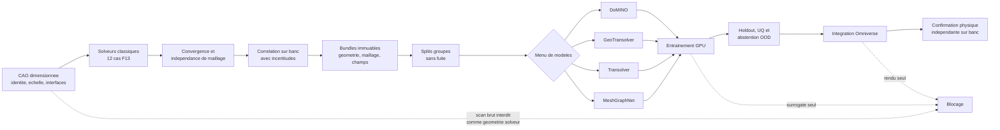

# Contrat de donnees PhysicsNeMo du moteur 917 — F14

## Objet

La phase F14 definit le passage controle entre les solveurs classiques et les
surrogates PhysicsNeMo. Elle ne contient encore aucun echantillon, aucun poids
de modele et aucun resultat moteur. Un scan, une scene USD, un import Python ou
un rendu Omniverse ne constitue pas une validation physique.

Le contrat executable est
`twins/reference-917-engine/physicsnemo-dataset-f14.json`. Son validateur est
`twins/reference-917-engine/source/validate_physicsnemo_dataset_f14.py`.



## Decouverte PhysicsNeMo relue

Le menu a ete relu dans le depot NVIDIA PhysicsNeMo au commit
`4f027d906f2d7300ee230d7f6bc85865ab0fae8c`. Les chemins enregistres sont :

- `physicsnemo/models/domino/__init__.py` pour DoMINO ;
- `physicsnemo/models/geotransolver/__init__.py` pour GeoTransolver ;
- `physicsnemo/models/transolver/__init__.py` pour Transolver ;
- `physicsnemo/models/meshgraphnet/__init__.py` pour MeshGraphNet ;
- `physicsnemo/datapipes/cae/domino_datapipe.py` ;
- `physicsnemo/datapipes/cae/transolver_datapipe.py` ;
- `physicsnemo/datapipes/mesh_dataset.py` et son interface Reader.

Le modele et la datapipe restent deux choix independants. Aucun modele n'est
selectionne. L'image verrouillee a seulement prouve les imports DoMINO,
GeoTransolver et MeshGraphNet hors GPU. L'import Transolver et la compatibilite
complete du commit amont avec PhysicsNeMo 2.2.1 restent des gates ouverts.

## Contenu minimal d'un echantillon

Chaque repertoire d'echantillon doit contenir un `sample.json` et huit roles
d'artefacts, tous adresses par chemin relatif et SHA-256 :

1. geometrie CAO dimensionnee ;
2. maillage ;
3. configuration du solveur ;
4. conditions aux limites ;
5. champs calcules ;
6. rapport de convergence ;
7. rapport d'independance de maillage ;
8. rapport de correlation physique.

La geometrie doit avoir une identite, une echelle et des interfaces verifiees.
Le scan brut et les proxies visuels sont exclus comme geometrie de calcul. Le
producteur doit identifier le solveur, sa version, son image par digest et son
commit source. Les droits doivent autoriser explicitement l'usage pour
l'entrainement.

Un echantillon structurellement accepte ne rend pas le dataset pret et
n'autorise pas l'entrainement : la couverture, les seuils, les splits, les cas
de controle et les validations restent a approuver collectivement.

## Strategie de split

Les fractions train/validation/test ne sont pas encore fixees. Elles seront
definies avant la release du dataset et groupees au minimum par famille de
geometrie, campagne d'essais physiques et famille de point de fonctionnement.
Une meme famille ne pourra pas traverser plusieurs splits. Un holdout de
geometrie, un holdout de region de fonctionnement et une suite hors distribution
sont obligatoires.

## Execution locale

```bash
python3 twins/reference-917-engine/source/validate_physicsnemo_dataset_f14.py
python3 tests/test_917_physicsnemo_dataset_f14.py
```

Le rapport local est ecrit sous
`work/917-physicsnemo-f14/validation.json`. Un statut `passed` signifie seulement
que le contrat et les eventuels manifests respectent ces garde-fous. Il ne
prouve ni entrainement, calcul moteur valide, objectif de 1600 hp, aptitude a la
fabrication, impression ou demarrage.

## Prochaine sortie attendue

La prochaine etape n'est pas une location GPU. Elle consiste a produire, avec
les solveurs classiques et une geometrie mesuree, les premiers bundles
convergents puis a les correler a des mesures de banc. Le test GPU PhysicsNeMo
ne devient pertinent qu'apres cette preuve et apres verification de l'image
`linux/amd64`, du digest immuable et du transport SSH de la location courante.
