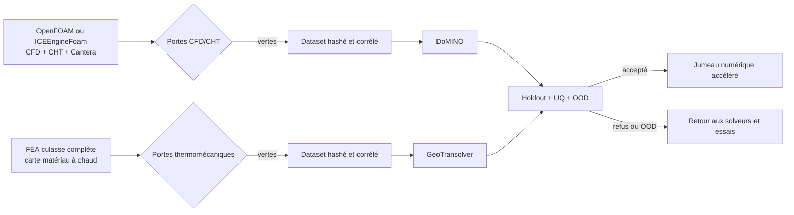

# PhysicsNeMo 2V/4V — porte de données F52

## Décision

PhysicsNeMo est retenu comme accélérateur futur, après les solveurs de
référence. La phase F52 n’a exécuté qu’un smoke test d’import de l’image
PhysicsNeMo 2.2.1 déjà épinglée. Elle n’a exécuté aucune passe avant DoMINO ou
GeoTransolver, aucun entraînement, aucune inférence et aucune évaluation.

L’image `linux/amd64` est adressée par le digest immuable
`sha256:045e8bc3151e0938d0f339aceb74c8583878effe5d0e316715e10818a018598a`.
Son smoke test prouve les versions et les imports publics de DoMINO,
GeoTransolver et MeshGraphNet. Il ne prouve ni GPU utilisable pour cette image,
ni dataset, ni modèle entraîné.

F52 ne modifie aucune géométrie. Les deux maîtres privés 2V et 4V restent
liés par hash au B-Rep F50, avec la peau extérieure issue du scan F43.

## Deux voies séparées



DoMINO est réservé aux champs spatiaux CFD et CHT : pression, vitesse,
densité, températures fluide/solide, flux thermique pariétal et débit. Il ne
recevra que des cas convergés, conservatifs, indépendants du maillage et
corrélés à des mesures.

GeoTransolver est réservé aux champs thermomécaniques de la culasse complète :
température, déplacement, contraintes et fatigue. Il exige une carte matériau
LPBF dépendante de la température, les précharges et contacts, un transfert CHT
et une corrélation thermique/déformation.

## Pourquoi les 12 cas steady ne suffisent pas

Les 12 cas F50 publiés sont un contrôle incompressible stationnaire sur trois
niveaux de maillage. Les 12 ont un reçu d’exécution OpenFOAM, mais seulement 7
passent leur porte numérique de débit et 5 échouent. Aucun ne résout l’équation
d’énergie : 0/12 passe une porte énergie et aucun champ CHT n’est produit. Le
rapport F50 reste donc `CFD_RECOVERY_FAIL_CLOSED` et sa revendication de
validation est fausse. Ces cas ne peuvent pas fournir les sorties DoMINO
requises ni un holdout géométrique indépendant. Le témoin thermomécanique F50
porte sur un deck local, sans carte matériau à chaud ni durée de vie en fatigue ;
il ne peut pas alimenter GeoTransolver.

Le nombre d’échantillons ne sera pas inventé. Il sera figé avant entraînement à
partir d’une courbe d’apprentissage, après couverture des deux variantes, de
plusieurs familles géométriques et de plusieurs régimes indépendants.

## Split, incertitude et abstention

Après libération des données, le split sera effectué par groupes avant toute
normalisation : 70 % train, 15 % validation et 15 % test. Une même famille de
géométrie, de régime ou de campagne physique ne pourra pas traverser plusieurs
splits. Les holdouts obligatoires couvrent une géométrie jamais vue par variante,
un régime jamais vu, une campagne solveur indépendante et une campagne d’essais
physiques indépendante.

Le test exige notamment :

- erreur L2 relative par champ et erreur des intégrales inférieures ou égales à
  5 % ;
- intervalle prédictif à 90 % avec couverture empirique entre 85 % et 95 % ;
- ensemble profond d’au moins cinq membres ;
- AUROC OOD et rappel d’abstention OOD d’au moins 0,95 ;
- moins de 5 % de fausses abstentions en distribution ;
- conservation masse/énergie au moins aussi stricte que celle du cas solveur.

Le runtime s’abstient si le hash géométrique est inconnu, si le régime sort de
l’enveloppe ou si l’incertitude est trop élevée. Une prédiction non physique ou
non conservative est rejetée. PhysicsNeMo ne remplace jamais les solveurs de
référence, les essais ni une décision de fabrication.

## État mesuré

| Élément | État F52 |
|---|---|
| Image PhysicsNeMo 2.2.1 | construite, tirée par digest et imports vérifiés |
| GPU pour cette image | non vérifié |
| Passe avant de modèle | non exécutée |
| Dataset admissible | 0 échantillon |
| F50 exécuté | 12/12 cas avec reçu solveur |
| F50 débit numérique | 7/12 passent, 5/12 échouent |
| F50 énergie/CHT | 0/12 ; équation énergie et CHT absents |
| DoMINO | bloqué |
| GeoTransolver | bloqué |
| Split figé | non |
| UQ/OOD évalués | non |
| Autorisation d’entraînement | non |
| Autorisation de fabrication, impression ou démarrage | non |

## Vérification

```bash
make 917-physicsnemo-readiness-f52-check
```

Le rapport public est
`twins/reference-917-engine/evidence/f52-physicsnemo-readiness/physicsnemo-readiness-f52.json`.
Le contrat exécutable est
`twins/reference-917-engine/physicsnemo-readiness-f52.json`.

Références primaires : [PhysicsNeMo v2.2.1](https://github.com/NVIDIA/physicsnemo/releases/tag/v2.2.1),
[DoMINO](https://github.com/NVIDIA/physicsnemo/tree/v2.2.1/physicsnemo/models/domino),
[GeoTransolver](https://github.com/NVIDIA/physicsnemo/tree/v2.2.1/physicsnemo/models/geotransolver),
[quantification d’incertitude](https://docs.nvidia.com/physicsnemo/latest/user-guide/uncertainty_quantification.html)
et [guardrails](https://docs.nvidia.com/physicsnemo/latest/user-guide/guardrails.html).
