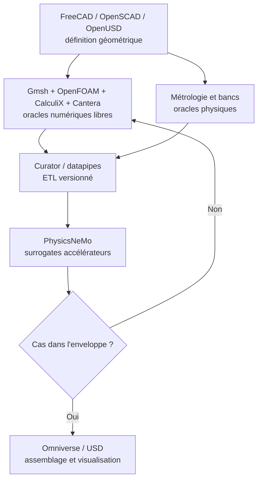

# Programme de réingénierie du moteur Porsche 917

## Résultat visé et état réel

Le résultat visé est un jumeau numérique de moteur complet, assemblable dans
OpenUSD/Omniverse, simulable dans une enveloppe corrélée et accompagné d'un
dossier de fabrication par pièce. Le scan OBJ est une référence extérieure ;
ce n'est ni une CAO de définition, ni une nomenclature, ni une preuve de
fonctionnement.

Au 1er septembre 2026, le niveau vérifié est `F0_source_integrity` : les octets
du scan local correspondent au SHA-256 enregistré. L'identité exacte, l'échelle,
les surfaces internes, les interfaces usinées et les tolérances restent à
mesurer. Le scan contient 1 282 880 sommets, 2 465 879 triangles et 101 809
arêtes ouvertes ; il n'est donc pas une enveloppe CFD étanche ni une géométrie
imprimable.

Les 271 instances atmosphériques et les 4 instances turbo supplémentaires du
stage F1 sont des composants visuels issus de 31 familles. Elles ne constituent
pas la nomenclature réelle : visserie, joints, circlips, passages internes,
roulements, conduites, capteurs, traitements, calages et éléments de sécurité
restent notamment à identifier et dénombrer depuis une dépose documentée.

## Itération F13 implémentée le 2 septembre 2026

F13 transforme les inconnues principales en contrats reproductibles sans
promouvoir le niveau vérifié au-delà de F0 :

| Lot | Résultat vérifié | Limite conservée |
| --- | --- | --- |
| [Métrologie conditionnelle](917_SCAN_METROLOGY_F13.md) | 12 ouvertures, 2 rangées de 6, résidus et trois hypothèses d'échelle | identité, unité, variante et sémantique d'alésage non confirmées |
| [Master paramétrique d'interface](917_PARAMETRIC_INTERFACE_F13.md) | OpenSCAD et STEP quarantainé de 25 marqueurs/repères, entrée liée par SHA-256 | aucune surface moteur, aucun goujon inventé, aucune fabrication |
| [Cas solveurs classiques](917_CLASSICAL_SOLVER_CASES_F13.md) | 12 cas, 44 faits, 5 enveloppes dérivées, 14 contradictions et 4 scénarios | zéro calcul, zéro résultat, zéro entraînement PhysicsNeMo |
| [Fabrication et qualification](917_MANUFACTURING_VALIDATION_F13.md) | 9 familles critiques, 30 mesures à acquérir et trois niveaux de maturité séparés | aucune matière, route, cote, tolérance ou libération sélectionnée |

Le signal le plus intéressant est la cohérence numérique avec le 5,0 l
atmosphérique : supposer que l'ouverture visible moyenne est l'alésage publié
de 86,8 mm donne environ 1,001996 mm/unité OBJ et un entraxe implicite de
118,199 mm. Cette proximité reste une hypothèse de triage ; elle ne remplace
pas trois contrôles physiques étalonnés, une identification indépendante ni la
mesure des interfaces internes.

`100 % fonctionnel et imprimable` est traité comme un critère final
d'acceptation, pas comme une propriété déduite du scan. Un moteur fonctionnel
restera un assemblage multi-procédés : certaines pièces pourront être produites
par LPBF puis usinées, d'autres devront être forgées, rectifiées, moulées ou
achetées auprès de fournisseurs qualifiés. Ressorts, roulements, joints,
segments, électronique et la plupart des soupapes ne doivent pas être convertis
en pièces imprimées par défaut.

## Cycle d'ingénierie et chaîne de preuves

```mermaid
flowchart LR
    SCAN["Scan brut local<br/>hash et provenance"]
    METRO["Métrologie et démontage<br/>CT, CMM, rugosité, masse"]
    CAD["CAO paramétrique par pièce<br/>datums, cotes et tolérances"]
    ASM["Assemblage maître<br/>interfaces, jeux et cinématique"]
    MESH["Volumes étanches et maillages<br/>CFD, CHT, FEA, MBD"]
    DOE["Plan d'expériences<br/>géométrie, régime, charge, matériaux"]
    SOLVER["Solveurs de référence<br/>0D/1D, CFD, thermique, FEA"]
    TEST["Essais physiques<br/>coupons, flux, pression, rigs, banc"]
    DATA["Dataset attesté<br/>VTK/VTU/VTP vers Zarr/NPZ"]
    NEMO["PhysicsNeMo 2.2.1<br/>DoMINO, GeoTransolver, MGN"]
    GUARD["Validation holdout<br/>UQ et détection OOD"]
    USD["USD/Omniverse<br/>cinématique et champs validés"]
    MFA["Dossier fabrication<br/>procédé, usinage, CT/NDT, contrôle"]
    BENCH["Banc moteur instrumenté<br/>NA puis turbo"]

    SCAN --> METRO --> CAD --> ASM --> MESH --> DOE --> SOLVER
    CAD --> MFA
    SOLVER --> DATA
    TEST --> DATA
    DATA --> NEMO --> GUARD
    GUARD -->|dans l'enveloppe| USD
    GUARD -->|hors enveloppe| SOLVER
    MFA --> BENCH
    USD --> BENCH
    BENCH --> TEST
```

La boucle n'est jamais uniquement numérique. Une divergence entre scan, CAO,
solution ou mesure retourne au niveau qui a produit l'écart. Le rapport F11
vérifie la complétude et la cohérence des preuves typées ; même un dossier F6
reste soumis à une autorité externe, à des parseurs qualifiés des sorties
solveur/banc et à une signature cryptographique avant fabrication ou démarrage.

## Niveaux d'acceptation

| Niveau | Livrable | Porte de sortie |
| --- | --- | --- |
| F0 | Intégrité du scan | Re-hash direct du fichier brut local |
| F1 | Enveloppe identifiée et à l'échelle | Trois contrôles métrologiques indépendants et variantes sélectionnées |
| F2 | Géométrie mesurée et CAO paramétrique | Datums, interfaces, tolérances et distribution 2V documentés |
| F3 | Physique de référence couplée | Maillages indépendants, bilans masse/énergie, convergence et incertitude numérique |
| F4 | Architectures corrélées | Comparaison 2V/4V aux mêmes conditions, essais et budget d'incertitude |
| F5 | Prototype métal qualifié | Coupons de la route finale, CT/NDT, usinage, pression, fuite et cycles thermiques |
| F6 | Banc moteur instrumenté | Huile amorcée, rotation à sec, démarrage NA, turbo progressif, endurance et inspection |

La montée de niveau est cumulative. Un rendu USD, une animation PhysX, une
prédiction PhysicsNeMo ou un fichier STEP isolé ne satisfait aucune porte par
implication.

## Répartition des responsabilités physiques

PhysicsNeMo stable `v2.2.1` est retenu. DoMINO est le premier candidat pour les
champs CFD et le transfert thermique conjugué ; GeoTransolver pour les champs
thermiques et mécaniques sur maillages non structurés ; MeshGraphNet pour les
dynamiques transitoires sur maillage. FNO n'est pertinent qu'après remaillage
sur grille régulière. Aucun exemple stable prêt à l'emploi ne couvre la
combustion réactive ou une turbomachine de 917 : ces datasets et adaptations
devront être produits dans le projet.

PhysicsNeMo ne reconstruit pas la CAO et ne remplace ni la CFD/FEA de référence,
ni les propriétés matière dépendantes de la température, ni la tribologie, ni
les essais. Un faible résidu physique n'est pas une preuve suffisante de
prédiction correcte ; chaque surrogate doit conserver une estimation
d'incertitude, un domaine de validité et une route de retour au solveur.

## Stratégie matière et fabrication

Chaque famille reçoit une classe de fabrication explicite :

- `additive_candidate_finish_machined` pour une géométrie réellement favorable
  au LPBF, avec surépaisseurs, datums, supports, poudre, traitement, CT/NDT et
  usinage final ;
- `machined_or_forged` pour les pièces à forte fatigue, friction ou précision
  qui ne gagnent rien à être imprimées ;
- `qualified_supplier` pour soupapes, ressorts, roulements, segments, joints,
  allumage, injection et capteurs ;
- `reference_only` tant que matière, géométrie, charges ou procédé ne sont pas
  suffisamment connus.

Pour le titane, aucun choix ne se résume au nom de l'alliage. La fiche de pièce
doit couvrir alliage, lot poudre ou barre, procédé, orientation, traitement,
HIP si justifié, usinage, état de surface, inspection, fatigue, température,
usure et isolation galvanique. Une soupape d'admission en titane ou une bielle
titane reste un composant critique à route fournisseur/forge-usinage qualifiée,
pas un STL à lancer directement en LPBF. Pour les zones chaudes, les candidats
Inconel restent à sélectionner depuis les températures, contraintes, corrosion
et cycles réels.

## Ordre d'exécution

1. Geler l'intégrité et la provenance du scan hors Git, puis certifier échelle
   et datums.
2. Construire la nomenclature de démontage réelle et le registre des
   interfaces avant d'ajouter de nouvelles formes visuelles.
3. Refaire carter, cylindres, culasses, vilebrequin, bielles, pistons,
   distribution, lubrification, refroidissement, admission, échappement et
   turbos en CAO paramétrique versionnée.
4. Produire les cas de référence convergés et les essais corrélés.
5. Entraîner PhysicsNeMo seulement lorsque F4 autorise un dataset, avec split
   par géométrie et point de fonctionnement, holdout et garde OOD.
6. Publier les champs validés dans USD/Omniverse, sans confondre rendu et preuve.
7. Qualifier les procédés par coupons et prototypes, puis passer le banc NA
   avant le turbo et la cible documentaire de 1 600 hp.

## Sources NVIDIA primaires

- [PhysicsNeMo v2.2.1](https://github.com/NVIDIA/physicsnemo/releases/tag/v2.2.1)
- [Configuration requise PhysicsNeMo](https://docs.nvidia.com/physicsnemo/latest/getting-started/system_requirements.html)
- [Exemple DoMINO de transfert thermique conjugué](https://github.com/NVIDIA/physicsnemo/tree/v2.2.1/examples/cfd/transient_conjugate_heat_transfer_tank_fill)
- [Exemple GeoTransolver en mécanique des structures](https://github.com/NVIDIA/physicsnemo/tree/v2.2.1/examples/structural_mechanics/drop_test)
- [PhysicsNeMo Curator](https://docs.nvidia.com/physicsnemo/latest/user-guide/curator.html)
- [Quantification d'incertitude](https://docs.nvidia.com/physicsnemo/latest/user-guide/uncertainty_quantification.html)
- [Guardrails PhysicsNeMo](https://docs.nvidia.com/physicsnemo/latest/user-guide/guardrails.html)
