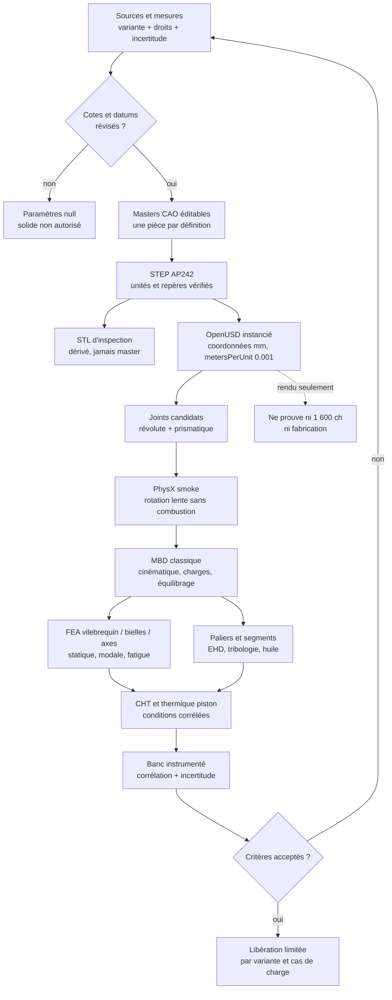

# Groupe mobile CAO du moteur 917 — contrat F35

## Résultat et portée

F35 documente et construit un groupe mobile paramétrique du Type 912 sans
transformer une cote publiée en définition de fabrication. Le périmètre couvre
le vilebrequin, les paliers principaux, les douze bielles, pistons, axes et
packs de segments. La prise de puissance centrale est seulement une enveloppe
visuelle ; l'interface vers le volant et les cylindres complets ne sont pas
encore reconstruits. Le lot ne couvre pas une combustion, un démarrage moteur
ou une libération de pièce métallique.

Le dépôt permet aujourd'hui de construire un squelette paramétrique, des
prototypes CAO explicitement candidats et une scène cinématique à basse vitesse.
Il ne contient pas les plans complets, les tolérances, les jeux, les lois matière
à chaud, les masses modernes, les inerties mesurées ni les données de banc qui
permettraient d'affirmer qu'un groupe mobile 917/30 ou 2026 fonctionne.

Les règles F35 sont donc les suivantes :

- une valeur `documentary_candidate` reste attachée à sa variante et à sa
  source, sans devenir une cote de fabrication ;
- une valeur `derived_from_documentary_candidate` doit publier sa formule et
  ses entrées ;
- une valeur `design_hypothesis` ne peut piloter qu'une étude exploratoire ;
- une valeur inconnue reste `null`, jamais complétée par une proportion lue sur
  une photographie ou par une valeur typique de moteur moderne ;
- STEP est le dérivé neutre de la CAO éditable ; STL n'est jamais le master ;
- OpenUSD et PhysX décrivent une scène et un test cinématique, pas une preuve de
  résistance, de lubrification, de puissance ou de fabricabilité.

## Provenance publique retenue

| Source du dépôt | Faits admissibles | Droits et usage F35 | Confiance |
| --- | --- | --- | --- |
| `catalog/sources/src-fia-917-homologation-250.json` — [FIA, fiche n° 250](https://historicdb.fia.com/sites/default/files/car_attachment/1601078401/homologation_form_number_250_group_4.pdf) | Type 912 4 494,2 cm³ : 85 × 66 mm, hauteur axe-calotte 43 mm, maneton Ø 52 mm, huit paliers principaux et masses publiées. Extension 4 907,28 cm³ : 86 × 70,4 mm et vilebrequin monobloc forgé `912.102.031.00` | Copyright FIA, référence seulement, redistribution interdite. Le PDF reste externe au dépôt | `A`, primaire, propre à la variante |
| `catalog/sources/src-porsche-newsroom-91730-turbo.json` — [Porsche Museum, 917/30 Spyder](https://newsroom.porsche.com/de/pressemappen/Porsche-Museum/Porsche-917-30-Spyder.html) | V12 à 180°, turbo, 5 374 cm³ et 882 kW/1 200 ch publiés | Copyright Porsche, paraphrase factuelle seulement. Aucune cote interne publiée | `A`, primaire, mais non dimensionnel pour le groupe mobile |
| `catalog/sources/src-porsche-newsroom-91730-1600-qualifying.json` — [Porsche Newsroom USA](https://newsroom.porsche.com/en_US/2023/company/capturing-the-spirit-of-Porsche-33474.html) | Porsche rapporte un 5,4 l biturbo et 1 600 HP en configuration de qualification | Copyright Porsche, paraphrase factuelle seulement. Régime, durée, correction, carburant, boost, températures et courbe de banc absents | `A` pour la provenance du récit, aucune preuve de reproductibilité |
| `catalog/sources/src-ams-917-engine-technical-analysis.json` — [auto motor und sport](https://www.auto-motor-und-sport.de/oldtimer/porsche-917-motor-kraftwerk-ohne-gleichen/) | Candidats 4 999 cm³ à 86,8 × 70,4 mm, 5 374 cm³ à 90 × 70,4 mm, six manetons partagés, huit paliers, prise centrale et ordre publié `1-9-5-12-3-8-6-10-2-7-4-11` | Article protégé, aucune redistribution. Toutes les valeurs restent secondaires et doivent être confirmées | `B` documentaire, `candidate_parametric` au mieux |
| `catalog/sources/src-kfz-tech-917-type912-engine.json` — [kfz-tech.de](https://www.kfz-tech.de/Buchprojekte/Porsche/917Teil2.htm) | Architecture candidate à deux bielles opposées par maneton, entraxe cylindres annoncé de 118 mm, huit paliers et deux paliers centraux annoncés plus grands | Site protégé, référence seulement ; aucune cote depuis les images | `C/D`, corroboration secondaire |
| `catalog/sources/src-stuttcars-917-technical-details.json` — [Stuttcars](https://www.stuttcars.com/porsche-917-technical-details/) | Longueur de vilebrequin annoncée à 757 mm, bielles titane forgé et acier chrome-molybdène-nickel annoncé pour le vilebrequin | Source secondaire non corroborée, sans définition des extrémités ni méthode de mesure. La longueur de 757 mm ne peut pas devenir une cote de fabrication | `C/D`, piste seulement |
| `catalog/sources/src-porsche-additive-piston-validation.json` — [Porsche, pistons LMF](https://newsroom.porsche.com/de/2020/technik/porsche-kooperation-mahle-trumpf-kolben-3d-drucker-leistung-effizienz-911-gt2-rs-21461.html) | Méthode moderne : alliage d'aluminium spécial, canal de refroidissement fermé, allègement déclaré de 10 % et endurance moteur de 200 h | Copyright Porsche. Exemple GT2 RS, pas une définition de piston 917 | `A` pour la méthode, aucune autorité géométrique F35 |

La brochure usine Porsche de 1969 référencée dans
`archive/917/docs/917_GERMAN_SOURCE_AND_MEASUREMENT_MATRIX_F29.md` documente un
vilebrequin forgé en deux pièces, des bielles en titane forgé et des pistons en
alliage léger pour le 4,494 l. Elle est protégée et hébergée par un tiers : F35
n'en copie ni texte long, ni dessin, ni image.

## Registre de paramètres : sourcé, dérivé ou hypothétique

| Paramètre | Valeur | Variante | État F35 | Autorité CAO |
| --- | ---: | --- | --- | --- |
| Alésage | 85 mm | `type_912_4_5_na` | `documentary_candidate` | candidat documentaire, sans tolérance de fabrication |
| Course | 66 mm | `type_912_4_5_na` | `documentary_candidate` | candidat documentaire |
| Hauteur axe de piston-calotte | 43 mm | `type_912_4_5_na` | `documentary_candidate` | profil de calotte et axe inconnus |
| Masse piston + axe + segments | 0,46 ± 0,02 kg | `type_912_4_5_na` | `documentary_candidate` | enregistrée pour corrélation future, jamais affectée au proxy CAO ou USD |
| Diamètre de maneton | 52 mm | `type_912_4_5_na` | `documentary_candidate` | largeur et congés inconnus |
| Nombre de paliers principaux | 8 | `type_912_4_5_na` | `documentary_candidate` | topologie seulement |
| Alésage et course | 90 × 70,4 mm | `917_30_turbo_5374` | `documentary_candidate`, AMS secondaire | enveloppe exploratoire, pas cote de fabrication |
| Masse piston + axe + segments | inconnue | `917_30_turbo_5374` | `unknown_not_transferred` | la masse FIA du 4,5 l ne doit pas être transférée |
| Rayon de manivelle | course / 2 | les deux variantes | `derived_from_documentary_candidate` | 33 mm ou 35,2 mm ; jamais une cote indépendante |
| Six manetons, deux bielles par maneton | 6 × 2 | les deux variantes | `design_hypothesis` corroborée par AMS/kfz-tech | topologie candidate ; phase absolue inconnue |
| Ordre d'allumage | `1-9-5-12-3-8-6-10-2-7-4-11` | source AMS non identifiée par état moteur | hors géométrie F35 | interdit pour une séquence absolue tant que la numérotation des cylindres et le zéro angulaire ne sont pas confirmés |
| Longueur d'enveloppe vilebrequin | 757 mm | NA : candidat secondaire ; turbo : hypothèse transférée uniquement comme enveloppe 2026 | `documentary_candidate` / `design_hypothesis` | interdite comme cote de fabrication |
| Valeur FIA, champ 159 | 56 mm | `type_912_4_5_na` | `ambiguous_label_not_geometry_input` | ne doit jamais devenir le diamètre de tête de bielle |

La cylindrée calculée par
`12 × π/4 × alésage² × course` sert uniquement au contrôle de cohérence des
entrées. Elle ne confirme ni une chambre, ni un rapport volumétrique, ni une
géométrie de piston.

Restent explicitement `unknown` : longueur vraie du vilebrequin, diamètre et
position de chaque tourillon, largeurs et rayons des manetons, contrepoids,
perçages d'huile, équilibrage, entraxe et sections des bielles, alésages et
largeurs de leurs pieds et têtes, dimensions et déport des axes, profils des
pistons, gorges et jeux des segments, jeux de paliers, tolérances, rugosités,
nuances, traitements, précharges et inerties polaires.

Les valeurs FIA du 4,907 l et la valeur AMS du 4,999 l restent du contexte de
source. Elles ne créent aucune troisième variante dans le contrat F35 et ne
pilotent aucun solide de ce lot.

## Deux variantes sans héritage silencieux

| Branche | Rôle | Entrées admissibles | Interdictions |
| --- | --- | --- | --- |
| `type_912_4_5_na` | référence atmosphérique 4,5 l | candidats documentaires propres à cette variante et hypothèses explicitement classées | aucune cote du 4,907, 4,999 ou 917/30 transférée comme fait |
| `917_30_turbo_5374` | enveloppe biturbo 5,374 l | cylindrée Porsche, candidats AMS propres au turbo et hypothèses 2026 séparées | ni géométrie NA copiée comme fait, ni attribution de 1 200 ou 1 600 ch à un cas de banc inconnu |

Une future branche 2026 doit posséder un registre de décisions séparé pour le régime,
la pression cylindre, le carburant, le boost, le cliquetis, les températures,
la durée de vie et le facteur de sécurité. La forme historique peut être une
contrainte d'enveloppe ; elle ne dispense pas de redimensionner le groupe
mobile entier.

## Chaîne CAO vers scène de test



### 1. Masters CAO

Chaque pièce doit avoir un identifiant stable, un repère local, une unité, une
révision, une variante, un statut de preuve et une table de paramètres. Les
masters éditables peuvent être FreeCAD ou Build123d ; leur représentation STEP
AP242 est le format neutre d'échange. Les douze occurrences d'une même bielle
ou d'un même piston sont des instances, pas douze copies divergentes.

Un solide n'est exporté que si ses dimensions minimales sont connues. Avant
cela, la pièce est un nœud d'assemblage sans forme ou une enveloppe marquée
`visual_proxy`. Les proxies ne participent ni aux calculs de masse, ni aux
contacts, ni à une simulation de contrainte.

### 2. STEP et STL

Le contrôle STEP doit vérifier au minimum : unités, corps fermé, orientation,
repère, nombre de solides, noms de pièces, absence d'auto-intersection et
empreinte SHA-256. Le STL est généré depuis le STEP révisé avec des paramètres
de tessellation enregistrés. Il sert à l'inspection visuelle ou à un prototype
polymère d'encombrement ; il ne contient ni tolérance ni historique CAO et ne
doit pas autoriser une impression métal.

### 3. OpenUSD et joints

La scène OpenUSD emploie des coordonnées en millimètres, déclare
`metersPerUnit=0.001`, `upAxis=Z` sur l'assemblage **et sur chacun des
prototypes convertis**, et des prims
séparés pour le vilebrequin, les douze bielles et les douze ensembles
piston-axe. Chaque occurrence conserve un identifiant stable, la famille, la
variante et son statut de preuve. Le rapport de scène conserve les chemins et
hashes des six prototypes STEP convertis ; une future révision devra porter
ces informations sur chaque prim avant un échange PLM. Les matériaux visuels
et physiques restent séparés.

Les deux bielles candidates de chaque maneton utilisent une topologie visuelle
`side_by_side_visual_design_hypothesis`. Leur décalage axial ne doit jamais être
recodé dans un export : `paired_rod_axial_layout_mm()` dans
`rotating_assembly_f35_math.py` est l'unique autorité consommée par le STEP et
l'USD. La séparation des axes vaut la largeur de bielle plus un jeu positif de
6 %. Elle supprime le recouvrement des deux occurrences, mais **ne valide pas**
la largeur du maneton, les joues, le jeu fonctionnel ou un contact mécanique ;
ces inconnues restent bloquantes pour toute simulation de charge.

Chaque conversion STEP→USD est écrite vers un fichier temporaire du même
répertoire, puis publiée par remplacement atomique. Son rapport scelle le STEP
et l'USD par SHA-256, l'axe vertical demandé et la stabilité de la source durant
la conversion. L'authoring refuse un prototype si le rapport, les hashes,
`upAxis=Z` ou `metersPerUnit=0.001` ne correspondent plus au contenu courant ;
un ancien USD ne peut donc pas être accepté comme résultat frais.

Le graphe de contrainte candidat comprend :

- un joint révolute entre vilebrequin et carter de banc virtuel ;
- un joint prismatique par piston le long de l'axe de cylindre ;
- les liaisons pivot des bielles aux manetons et aux axes de piston ;
- une future prise centrale séparée de la liaison vers le volant ; ce candidat
  n'est pas encore créé dans les 37 repères F35.

Ce mécanisme forme des boucles fermées. Il faut donc détecter les contraintes
redondantes, la surcontrainte, les singularités et la dérive d'énergie plutôt
que masquer les erreurs par de grandes tolérances PhysX.

### 4. PhysX smoke

Le smoke test est entraîné par une vitesse lente et bornée. Il doit démontrer
uniquement que les axes et joints sont cohérents, que les pistons restent dans
leurs guides et qu'aucune pénétration ou divergence numérique grossière
n'apparaît sur plusieurs cycles. Les masses peuvent rester des marqueurs non
physiques tant qu'elles sont étiquetées comme telles.

Il est interdit d'exécuter directement 7 800, 8 300 ou 9 000 tr/min avec des
masses, jeux et inerties hypothétiques. Un PhysX smoke vert ne valide ni la
pression cylindre, ni les efforts de palier, ni la torsion du vilebrequin, ni la
fatigue, ni l'huile, ni les segments.

## Solveurs de référence avant PhysicsNeMo

| Modèle | Entrées encore requises | Sorties et critères minimaux |
| --- | --- | --- |
| Multicorps classique | géométrie mesurée, masses, centres de gravité, inerties, phases et loi de couple | trajectoires, réactions, équilibrage, absence de singularité et bilan d'énergie |
| Torsion et modal du vilebrequin | géométrie complète, volant, prise centrale, raideurs de paliers, ordre/phase confirmés | vitesses critiques, amplitudes, marges au régime et convergence de maillage |
| FEA bielles, manetons et axes | charges cylindre corrélées, précharges, contacts, congés, états matière à chaud | contraintes, déformations, durée de vie, sensibilité et facteurs de sécurité approuvés |
| Paliers EHD et réseau d'huile | jeux, rugosités, viscosité-température, débits, pressions, galeries et déformations | épaisseur minimale de film, pertes, températures et stabilité sur tout le cycle |
| Piston, axe et segments | pression cylindre, flux thermique, profils, jeux, revêtements et lois de frottement | températures, déformations, blow-by, consommation d'huile, friction et grippage exclu dans le domaine validé |
| CHT moteur | volumes fluides étanches, combustion corrélée, débit d'air et d'huile | bilans de masse/énergie, températures par cylindre et incertitudes |

PhysicsNeMo peut ensuite accélérer un solveur classique corrélé. Son dataset
doit séparer les variantes et les géométries entre entraînement, validation et
holdout, publier les unités, maillages, conditions limites, résidus et
incertitudes, et refuser toute requête hors domaine. Il ne remplace ni la FEA,
ni la tribologie, ni le banc.

## Matériaux, titane et fabrication

Les sources historiques justifient seulement les familles `light_alloy` pour
le piston et `forged_titanium` pour la bielle du 4,494 l. Elles ne publient ni
nuance, ni état métallurgique, ni forge, ni traitement, ni état de surface, ni
données de fatigue. Le matériau du vilebrequin et la mention chrome-molybdène-
nickel de Stuttcars restent secondaires tant qu'un document primaire ou une
analyse matière ne les confirme pas.

Pour la branche 2026 :

- une bielle en titane doit spécifier nuance, produit de départ, sens de forge,
  traitement thermique, usinage, grenaillage éventuel, rugosité, visserie,
  fretting, NDT, dispersion et courbes S-N/ε-N à température ;
- `Ti-6Al-4V` n'est pas sélectionné par défaut parce qu'il est courant ; une
  nuance et un procédé ne deviennent admissibles qu'après exigences, données
  fournisseur, coupons et essais de pièce représentatifs ;
- une bielle LPBF, un vilebrequin LPBF ou un axe de piston titane restent
  interdits au stade F35. Leur faible masse supposée ne compense pas l'absence
  de preuve sur fatigue, défauts internes, surface, tribologie et variabilité ;
- le précédent Porsche de piston LMF valide une méthode d'étude sur un autre
  moteur. Il n'autorise ni l'alliage, ni le canal, ni le procédé pour le 917 ;
- les masses et tenseurs d'inertie sont calculés depuis une CAO et une densité
  tracées, puis confirmés par pesée et pendule/inertie mesurée. Une masse
  historique ne doit pas être redimensionnée par simple règle de trois.

Avant toute pièce métallique tournante, le dossier doit inclure matière et lot,
certificats, procédé, orientation si additive, traitement thermique, HIP si
requis, surépaisseurs, usinage final, équilibrage, contrôles dimensionnels,
ressuage ou magnétoscopie selon matière, ultrasons ou tomographie selon le
risque, critères de rebut et revue d'un ingénieur moteur compétent.

## Gates F35 à échec fermé

| Gate | Preuve requise | État créé par ce document |
| --- | --- | --- |
| `G0_source_rights` | source, variante, pages/champs, droits et hash des références autorisées | documenté, pas une licence de redistribution |
| `G1_variant_identity` | identité physique ou exigence 2026 signée, sans fusion NA/turbo | `false` |
| `G2_measured_datums` | datums, CMM/CT, étalonnage, incertitudes et revue | `false` |
| `G3_cad_solids` | masters éditables et paramètres non hypothétiques | `false` |
| `G4_step_integrity` | STEP AP242 fermé, unités, repères, hashes et contrôle indépendant | `false` |
| `G5_mesh_inspection` | STL dérivé, tessellation et topologie vérifiées | `false` |
| `G6_usd_semantics` | prims, instances, unités, provenance et matériaux séparés | `false` |
| `G7_physx_smoke` | plusieurs cycles lents sans divergence, pénétration ni surcontrainte | `false` |
| `G8_mbd_correlated` | charges, inerties et cinématique comparées à un rig | `false` |
| `G9_structural_fatigue` | FEA convergée, courbes matière, sensibilité et revue | `false` |
| `G10_lubrication_tribology` | EHD, huile, segments et essais de sous-systèmes | `false` |
| `G11_thermal_combustion_turbo` | bilans convergés et conditions moteur instrumentées | `false` |
| `G12_bench_correlation` | banc par paliers, données brutes, incertitudes et critères acceptés | `false` |
| `G13_manufacturing_release` | dossier matière/procédé/NDT et autorité professionnelle | `false` |
| `G14_1600_hp_claim` | puissance corrigée mesurée, durée, carburant, boost, températures et répétabilité | `false` |

Un gate logiciel ne relève jamais automatiquement un gate physique. La
présence d'un STEP, d'un STL, d'un USD, d'une animation ou d'un rapport de
solveur ne permet donc ni impression métal, ni rotation rapide, ni démarrage.

## Incrément réalisé et prochain verrou

Le constructeur F35 instancie désormais, séparément pour les deux variantes,
un vilebrequin candidat, huit paliers, douze bielles, douze pistons, douze axes
et trente-six segments, soit 81 occurrences par variante. Les paramètres
hypothétiques restent visibles dans le contrat et les dérivés sont écrits
uniquement sous `work/`. Les STEP ferment et se rouvrent dans le smoke CAO ;
cela prouve la chaîne logicielle, pas les cotes. Le rapport enregistre la
référence OCI immuable réellement passée au processus CAO par `docker run` ;
le générateur refuse de démarrer si cette provenance runtime n'est pas injectée.

Les huit familles exigées par le contrat sont matérialisées et comptées : axe
de vilebrequin (1), centres de paliers (8), centres de manetons (6), axes de
gros et petits bouts de bielle (12 + 12), axes de piston (12), plans de calotte
(12) et plans de gorges (36), soit 99 datums par variante. Ces repères restent
des hypothèses non mesurées et n'activent aucun joint physique.

L'authoring OpenUSD cinématique est également réalisé. Chaque scène binaire
`rotating-assembly-f35.usdc` référence six prototypes convertis depuis STEP,
contient les 81 occurrences, les 99 datums contractuels, 37 repères de joints
candidats et 721 échantillons analytiques de 0 à 720 degrés sur 12 secondes. Le vilebrequin et les pistons
sont animés selon l'unique autorité mathématique F35. L'ordre d'allumage
historique n'est pas utilisé parce que la correspondance cylindres/phases n'est
pas résolue.

Les validations locales de référence NVIDIA exécutées dans l'image SimReady verrouillée
passent sur les deux variantes : ouverture et métadonnées USD, Asset Validator
général et règles géométriques. Les scènes emploient `Z` comme axe vertical,
`0.001` mètre par unité, un graphe `Kind` valide et le format crate adapté aux
nombreux échantillons d'animation. Elles ne contiennent aucun joint physique,
rigid body, collider, matériau physique, masse ou inertie. Le rapport garde
donc tous les gates physiques et de fabrication à `false`.

Les rapports détaillés de ces validations restent sous `work/` et ne sont pas
versionnés ; cette phrase rapporte un résultat local reproductible, pas encore
une preuve CI publiée.

La chaîne reproductible s'exécute ainsi :

```bash
make 917-rotating-assembly-usd-f35
make 917-rotating-assembly-usd-f35-test
```

La première commande construit d'abord la CAO puis les USD et utilise
exclusivement des images `linux/amd64` référencées par digest, sans réseau et
sans secret. La seconde réexécute les tests OpenUSD dans la même image SimReady
verrouillée. Les fichiers STEP, STL, prototypes `.usd`, scènes `.usdc`, rapports et rendus restent sous
`work/` et ne sont pas versionnés.

Le prochain verrou n'est plus la visualisation : il faut mesurer les datums,
jeux, masses et inerties, puis activer progressivement un mécanisme multicorps
sur le nœud CPU Intel. Gmsh, OpenFOAM et Cantera y produiront ensuite des cas de
référence classiques. PhysicsNeMo et Omniverse RTX ne seront utilisés sur GPU
qu'après obtention de datasets et critères physiques défendables. Cet incrément
ne porte aucun claim de puissance et ne remplace ni plans licites, ni
métrologie, ni matériaux, ni solveurs classiques, ni banc instrumenté.
