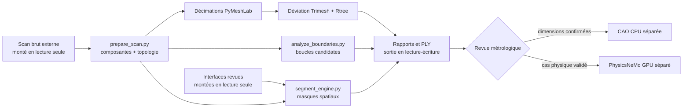

# Conteneur CPU F17 — préparation et segmentation géométrique du scan 917

## Portée

F17 fournit une recette d'image `linux/amd64` versionnée, sans GPU, pour exécuter les
trois outils de maillage déjà présents dans le dépôt :

- `prepare_scan.py` : copie de travail contrôlée, composantes connexes,
  topologie, vraie décimation PyMeshLab et écart géométrique par proximité ;
- `analyze_boundaries.py` : détection géométrique de bords ouverts et filtrage
  de boucles approximativement circulaires ;
- `segment_engine.py` : découpage spatial conservateur en quatre régions PLY.

Le Dockerfile ne copie dans le bundle applicatif que ces trois scripts et le
smoke : aucun scan, aucune interface réelle, aucun jeu de données et aucun poids
de modèle. L'audit d'exécution inspecte précisément `/opt/3dprinting993` par
liste attendue, suffixe et nom suspect ; ce contrôle limité n'est pas un scanner
universel de secrets du système de fichiers. L'image ne prouve pas l'identité Porsche
917, l'échelle physique, la sémantique des régions, l'étanchéité, l'aptitude à
la simulation, l'imprimabilité ou le fonctionnement d'un moteur.



Les sorties de segmentation sont des régions de revue ouvertes. Une boucle
circulaire détectée est seulement une candidate géométrique : ce n'est pas la
preuve d'une soupape, d'un cylindre ou d'une interface fonctionnelle.

## Stack épinglée

| Élément | Version | Rôle |
|---|---:|---|
| Python slim bookworm | 3.12.14, image de base par digest | runtime CPU |
| NumPy | 2.5.2 | tableaux et géométrie numérique |
| SciPy | 1.18.1 | composantes connexes |
| Trimesh | 5.1.0 | lecture, topologie, échantillonnage et proximité |
| PyMeshLab | 2025.7.post1 | décimation quadrique réelle |
| Rtree | 1.4.1 | index spatial requis par la déviation |
| `libgl1`, `libopengl0` | 1.6.0-1 | chargeurs Debian nécessaires aux plugins PyMeshLab |

Le frontend Dockerfile est fixé par digest, tout comme la base
`python:3.12.14-slim-bookworm@sha256:9c47360a2a0355e2da18516d0b1c2126ec22c195d2185e97347c9d98398c5bef`.
Chaque roue Python est fixée par version et SHA-256 dans
`containers/scan-mesh-f17-requirements.txt`. L'installation interdit les
dépendances implicites et les distributions source.

Ce verrouillage n'est pas une promesse de build bit à bit reproductible : les
index Debian utilisés pour `libgl1` et `libopengl0` ne sont pas servis depuis un
snapshot daté. Les deux versions de premier niveau sont fixées, mais leurs
dépendances transitives et leur disponibilité peuvent évoluer. Seul un digest
GHCR publié, relu et vérifié identifie un artefact immuable précis.

PyMeshLab domine la taille de l'image. Blender, FreeCAD, OpenFOAM, Gmsh, CUDA,
Omniverse et PhysicsNeMo ne sont volontairement pas inclus. La reconstruction
CAO paramétrique appartient à une image CPU ultérieure ; l'apprentissage ou
l'inférence PhysicsNeMo appartient à l'image GPU dédiée, après constitution
d'un jeu de données et comparaison avec un solveur classique.

## Construction et smoke local

Depuis la racine du dépôt :

```bash
docker buildx build \
  --platform linux/amd64 \
  --file containers/scan-mesh-f17.Dockerfile \
  --tag 3dprinting993-scan-mesh-f17:dev \
  --load .

docker run --rm --platform linux/amd64 \
  --network none --read-only \
  --tmpfs /tmp:rw,noexec,nosuid,size=256m \
  --pids-limit 256 --cap-drop ALL \
  --security-opt no-new-privileges \
  3dprinting993-scan-mesh-f17:dev
```

Le smoke est construit avec `RUN --network=none` et doit aussi être exécuté avec
`--network none`. Il refuse de conclure `offline: true` si son espace réseau
contient une interface routée extérieure ou une route extérieure par défaut
IPv4 ou IPv6 ; les interfaces noyau dormantes ne sont pas prises pour une route.
il n'effectue volontairement aucun appel réseau. Il crée seulement des fixtures temporaires. Il vérifie deux composantes,
la topologie ouverte, une décimation qui réduit réellement le nombre de faces,
50 000 requêtes de déviation via Rtree, deux boucles de frontière, puis une
segmentation qui conserve toutes les faces sans chevauchement. Quatre contrats
d'interface invalides sont également refusés : valeur non finie, repère indirect,
nombre de centres canonique incorrect et SHA-256 discordant. Son succès ne
valide que ces chemins logiciels sur géométries synthétiques.

## Exécution sur une entrée autorisée

Le contrat de montage est : entrée brute en lecture seule, interfaces revues en
lecture seule et sortie en lecture-écriture. Exemple de préparation :

```bash
docker run --rm --platform linux/amd64 \
  --network none --read-only \
  --tmpfs /tmp:rw,noexec,nosuid,size=256m \
  --cap-drop ALL --security-opt no-new-privileges \
  --mount type=bind,src=/chemin/scan-autorise,dst=/workspace/input,readonly \
  --mount type=bind,src=/chemin/interfaces-revues,dst=/workspace/interfaces,readonly \
  --mount type=bind,src=/chemin/resultats-f17,dst=/workspace/output \
  3dprinting993-scan-mesh-f17:dev \
  python /opt/3dprinting993/twins/reference-917-engine/source/prepare_scan.py \
    /workspace/input/917-engine.obj /workspace/output/prepared
```

`prepare_scan.py` refuse une source dont le SHA-256 diffère de la référence
attendue. Ce contrôle de provenance ne confirme ni la licence, ni l'identité,
ni l'unité. `segment_engine.py` exige en plus un JSON d'interfaces validé hors
image ; le rapport de frontières ne le remplace pas automatiquement. En mode
canonique, le script exige des valeurs finies, une matrice 3 x 3 orthonormale et
directe, exactement six centres par banc, puis compare les SHA-256 attendus de
l'entrée et du rapport :

```bash
python /opt/3dprinting993/twins/reference-917-engine/source/segment_engine.py \
  /workspace/output/prepared/derived/917-engine-full.ply \
  /workspace/interfaces/interfaces.json \
  /workspace/output/segmented \
  --input-sha256 SHA256_DU_MAILLAGE \
  --interfaces-sha256 SHA256_DES_INTERFACES
```

Le mode `--synthetic-fixture-mode` autorise des bancs réduits uniquement pour
les tests. Son rapport fixe explicitement
`provenance_hashes_matched_external_expectations` à `false`.

Pour le scan canonique, prévoir 32 Gio de RAM ; 16 Gio est un minimum risqué.
L'émulation `linux/amd64` sur Mac ARM convient au smoke, mais elle est lente et
n'est pas le chemin recommandé pour le traitement complet.

## Publication immuable

Le workflow manuel `.github/workflows/scan-mesh-f17-image.yml` fixe toutes les
actions GitHub par SHA complet, construit uniquement `linux/amd64`, produit une
SBOM SPDX et une provenance SLSA, publie un tag de commit, puis recalcule les
digests de l'index et des manifestes. Il relie le manifeste d'attestation à son
sujet amd64, vérifie dépôt et commit dans la provenance, valide le document SPDX,
exécute le smoke dans un runtime isolé et exige l'accès anonyme au digest exact
pour toute publication. Il ne publie aucun tag `latest` et ne provisionne aucun
calcul.

SBOM et provenance ne constituent pas une signature cryptographique. Aucun flux
Cosign ou signature GitHub n'est configuré dans F17 : le gate
`cryptographic_signature_verified` reste explicitement à `false`.

La publication vérifiée est verrouillée dans
[`containers/scan-mesh-f17.lock.json`](../containers/scan-mesh-f17.lock.json) :

```text
ghcr.io/cluster2600/3dprinting993-scan-mesh-f17@sha256:b48f23d64ceab9c2e6b7b7474cdd81011d27b8a584f7af6b50b6cc05823c5189
```

Le verrou fixe le run GitHub, l'artefact de preuve, l'index, les manifestes, la
provenance, la SBOM, les entrées de recette et le smoke synthétique. Il conserve
les gates physiques fermés et ne remplace pas une signature cryptographique.

## Exécution du criblage sur le scan canonique

Le binaire canonique a ensuite été lu localement par cette référence immuable,
avec réseau coupé, racine en lecture seule, capacités supprimées et source
montée en lecture seule. L'exécution a retrouvé 101 809 arêtes de bord et 944
composantes, identiques à l'inventaire indépendant F15. Parmi 528 composantes
préfiltrées, seulement deux passent le filtre numérique actuel de circularité,
planéité et diamètre.

Ces deux résultats restent `unclassified`. Le seuil de diamètre est exprimé en
unités OBJ non confirmées et les grands contours interrompus peuvent être liés à
d'autres ouvertures ; deux résultats ne signifient donc ni deux cylindres, ni
deux conduits, ni deux interfaces valides. F18 doit visualiser et faire relire
les 944 composantes, pas seulement les deux sorties du filtre.

Le rapport détaillé reste local sous `work/`, hors Git. La preuve suivie
[`scan-mesh-execution-evidence-f17.json`](../twins/reference-917-engine/scan-mesh-execution-evidence-f17.json)
ne contient que les agrégats, métriques sans coordonnées, empreintes et limites
de revendication. Elle ne contient ni sommets, ni faces, ni centres de candidats.

## Gates avant Vast.ai et avant simulation

Une location Vast.ai reste bloquée tant que tous les points suivants ne sont
pas établis par des preuves relues :

1. build `linux/amd64` vert et smoke synthétique hors réseau ;
2. digest immuable GHCR, sujet amd64, SBOM SPDX, provenance dépôt/commit et
   lecture anonyme obligatoire vérifiés ;
3. signature cryptographique ajoutée et vérifiée, ou dérogation documentée sans
   prétendre que SLSA équivaut à une signature ;
4. licence et SHA-256 de l'entrée autorisés, sans intégrer le scan à l'image ;
5. identité, orientation et échelle métrique confirmées indépendamment ;
6. interfaces critiques mesurées et revues, sans nommage sémantique automatique ;
7. budget CPU, mémoire, stockage et durée établi sur un sous-ensemble local ;
8. sorties inspectées : conservation des faces, absence de chevauchement et
   écarts de décimation dans les tolérances approuvées.

Même après ces gates, F17 ne débloque ni CFD, ni PhysicsNeMo, ni fabrication.
Il faut ensuite reconstruire des volumes CAO dimensionnés, fermer et mailler
les domaines physiques, définir matériaux, conditions limites et cas de charge,
comparer à un solveur de référence puis corréler avec des mesures. Les gates
fabrication, impression 3D et moteur fonctionnel restent fermés jusqu'aux revues
professionnelles et validations physiques prévues par le projet.
