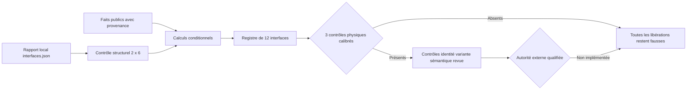

# F13 — Métrologie conditionnelle du scan moteur 917

## Résultat et limite

F13 construit un registre reproductible des douze ouvertures visibles détectées
sur le scan local : centres, axes, entraxes successifs, diamètres apparents,
résidus d'ajustement et enveloppes de sensibilité. Le scan et ses dérivés
géométriques restent hors Git.

Le rapport **ne confirme pas** que ces ouvertures sont des alésages, que l'unité
est le millimètre, que le moteur est un Porsche 917, qu'il s'agit d'une variante
précise, ou qu'une pièce est fonctionnelle ou imprimable. `passed_hypothesis_only`
signifie uniquement que le fichier d'entrée possède une structure cohérente de
deux rangées de six détections.



## Séparation des niveaux de preuve

### Faits publiés

- alésages publiés : 85 mm pour le Type 912 4,5 l, 86,8 mm pour le
  917 5,0 l atmosphérique et 90 mm pour le 917/30 turbo ;
- entraxe candidat de 118 mm pour le Type 912, issu d'une source technique
  secondaire classée D dans le catalogue du dépôt et non d'un plan d'usine ;
- 48 goujons Dilavar, longueur 149,5 mm, tige de 9 mm et masse de 65 g par
  goujon, publiés par Porsche pour le moteur présenté pour 1970.

Ces valeurs sont enregistrées avec leur source et leur périmètre dans
`scan-metrology-f13.json`. Elles ne constituent pas des tolérances de
fabrication. Les valeurs de goujon ne sont pas observées par le rapport de
détection actuel.

### Observations et calculs dérivés

Pour chaque rangée, le plus grand des cinq écarts successifs est classé comme
coupure centrale. Les quatre autres écarts alimentent une hypothèse d'échelle :

`échelle conditionnelle = médiane(118 mm / chaque entraxe régulier observé)`

Le diamètre apparent et le résidu radial P95 de chaque cercle sont ensuite
convertis avec cette échelle. L'« enveloppe » publiée combine deux fois le
résidu radial P95 et la sensibilité aux huit estimations d'échelle. Ce nombre
sert au triage ; ce n'est **pas** une incertitude métrologique traçable.

### Hypothèses

Sur le rapport local de SHA-256
`1e0cf2690fc0caab668a4c2f20b57a4ede9da5ad532cb8fe3fc5d9b9789eb21f`,
le calcul donne environ 0,99977 mm par unité OBJ sous l'hypothèse des 118 mm.
Le diamètre visible moyen devient environ 86,61 mm. La valeur publiée de
86,8 mm est donc la candidate **numériquement la plus proche**, mais la variante
reste `ambiguous_not_selected` : une ouverture projetée n'est pas un alésage
certifié et ne permet aucune identification.

Le calcul réciproque garde la même réserve : si l'on suppose que le diamètre
visible moyen brut de 86,62708 unités est réellement l'alésage de 86,8 mm,
l'échelle vaudrait 1,001996 mm/unité et l'entraxe régulier moyen brut de
117,96400 unités deviendrait 118,19948 mm, soit +0,16905 % face au candidat de
118 mm. Les hypothèses 85 et 90 mm donnent respectivement -1,90818 % et
+3,86192 %. Cette proximité numérique ne sélectionne toujours pas la variante.

## Registre des interfaces

Les identifiants `bank_positive_geometric_01` à `06` et
`bank_negative_geometric_01` à `06` décrivent uniquement l'ordre géométrique.
Ils ne prétendent pas reprendre la numérotation historique des cylindres.

Chaque entrée contient :

- le centre longitudinal/vertical et le centre dans le repère du scan ;
- l'axe détecté ;
- l'écart au voisin précédent et sa classe `regular_pitch` ou
  `central_split` ;
- le diamètre visible brut et conditionnel ;
- le résidu radial P95 du cercle ;
- l'enveloppe de triage non traçable ;
- les résidus numériques aux trois alésages publiés.

## Trois contrôles physiques obligatoires

Avant toute libération de l'échelle, trois contrôles indépendants doivent être
réalisés sur un moteur ou des pièces identifiés, avec instruments étalonnés,
certificats, datums, température et rapport signés :

1. au moins trois mesures d'entraxe régulier de centres cylindres ;
2. au moins trois mesures de longueur libre de goujon ;
3. au moins trois mesures de diamètre de tige de goujon.

Même si ces trois contrôles concordent, ils sont nécessaires mais insuffisants.
Il faut encore une preuve indépendante d'identité et de variante, une mesure
physique définissant si l'ouverture est un alésage, un spigot ou une autre
surface, puis une revue métrologique et d'ingénierie professionnelle. Le
vérificateur d'autorité n'est pas implémenté ; F13 garde donc toutes les
libérations à `false` par construction.

## Exécution locale

```bash
python3 twins/reference-917-engine/source/build_scan_metrology_f13.py \
  --contract twins/reference-917-engine/scan-metrology-f13.json \
  --interfaces work/917-engine/vast-output/reports/interfaces.json \
  --output work/917-engine/scan-metrology-f13-report.json

python3 tests/test_917_scan_metrology_f13.py
```

Le fichier généré sous `work/` est une preuve de travail locale. Il ne faut ni
le présenter comme une cote de fabrication, ni l'utiliser pour entraîner un
surrogate PhysicsNeMo avant métrologie calibrée, calcul de référence et données
de corrélation.
