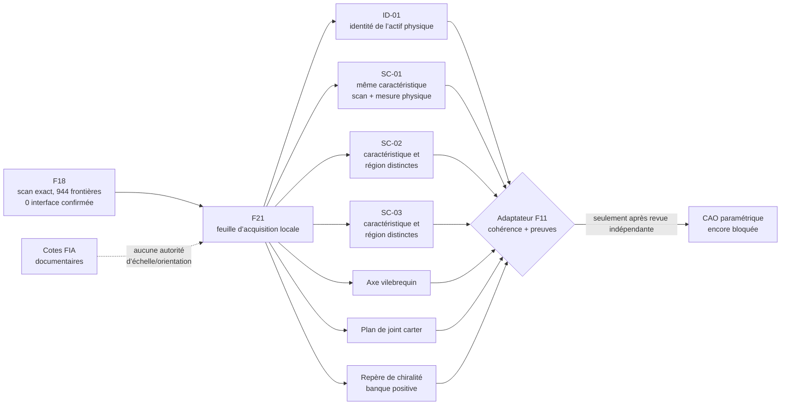

# F21 — feuille d’acquisition de l’échelle et de l’orientation du scan 917

F21 prépare la **campagne physique minimale** qui doit précéder toute CAO
ajustée au scan. Il ne calibre pas encore le maillage. Le scan reste au niveau
`F0_reference` : unités OBJ, identité, variante, échelle, axes et interfaces ne
sont pas confirmés.

Le contrat suivi est
[`scan-scale-orientation-acquisition-f21.json`](../twins/reference-917-engine/scan-scale-orientation-acquisition-f21.json).
Il ne contient ni scan, ni sommet, ni face, ni coordonnée, ni mesure physique,
ni copie du PDF FIA. Les acquisitions et leurs pièces justificatives doivent
rester dans `work/917-engine/metrology/f21/`, hors Git.

## Pourquoi F21 n’est pas un second validateur F11

F11 sait déjà vérifier une identité, une valeur `mm_per_obj_unit`, trois
contrôles indépendants et leurs manifestes de preuve. F21 ne duplique pas cette
logique. Il fournit l’instance canonique propre au scan 917 :

- le SHA-256 exact du scan déjà placé sous garde ;
- un slot de preuve d’identité compatible avec le manifeste F11 ;
- la correspondance `SC-01..03` vers `control_A..C` de F11 ;
- les trois datums d’orientation absents de F11 ;
- l’exclusion explicite des cotes documentaires FIA ;
- des verrous de libération fermés tant que l’acquisition n’est pas revue.

F18 est l’inventaire canonique qui consolide les exécutions maillage F15 et F17 ;
F21 le consomme donc directement au lieu de recopier leurs statistiques. F19
classe des routes de fabrication mais n’apporte aucune preuve métrologique : il
ne participe pas au calcul d’échelle ou d’orientation. F20 est consommé
uniquement pour verrouiller la frontière entre faits FIA et calibration du scan.



## Trois contrôles d’échelle réellement indépendants

Chaque contrôle doit relier **la même caractéristique** observée sur le scan à
une mesure physique de cette caractéristique sur l’actif identifié. Trois
valeurs répétées d’une même ouverture ne comptent pas comme trois contrôles.
F21 exige simultanément :

1. trois identifiants de caractéristiques physiques distincts ;
2. trois régions du scan distinctes ;
3. une longueur dans les unités OBJ et la longueur physique correspondante ;
4. une incertitude combinée pour chaque contrôle ;
5. l’instrument, son certificat d’étalonnage, la méthode, la température et le
   laboratoire ou opérateur ;
6. un manifeste de preuve et le SHA-256 de son artefact ;
7. une revue avant adaptation vers `source_identity_and_scale` de F11.

Le seuil de dispersion relative reste celui de F11, `0,005`. Ce seuil n’est pas
une déclaration de précision du scan : il est seulement un critère de cohérence
entre les trois facteurs d’échelle lorsque les mesures existeront.

## Orientation minimale avant CAO

Une échelle métrique ne suffit pas pour assembler le moteur. F21 reprend trois
datums nommés par F16 :

| Slot | Datum F16 | Fonction |
|---|---|---|
| `OR-PRIMARY-AXIS` | `crankshaft_axis` | axe primaire |
| `OR-SECONDARY-PLANE` | `crankcase_split_plane` | plan secondaire |
| `OR-HANDEDNESS` | `bank_positive_deck_plane` | signe et chiralité |

Chacun doit être identifié sur le scan exact, enregistré vers une référence
physique, associé à une règle sémantique de direction et accompagné d’une
incertitude angulaire et d’une provenance traçable. Une vue de rendu, le nom du
fichier ou le dessin général d’un moteur ne définit pas l’orientation du scan.
Les transformations numériques restent dans la preuve locale ; elles ne sont
pas versionnées dans ce contrat.

## Les cotes FIA ne mettent pas le scan à l’échelle

Le formulaire d’homologation apporte des faits historiques utiles, mais il ne
mesure pas ce maillage. Une ouverture peut ressembler à un alésage ; F18 ne
certifie pourtant ni sa sémantique, ni sa correspondance à la caractéristique
physique cotée par la FIA. Alésages, courses, diamètres internes, masses,
levées, jeux et événements de distribution restent donc sans autorité de
calibration. Même une valeur numériquement proche demeure une hypothèse.

La règle F21 est stricte : seule une mesure physique de la même caractéristique,
directement observable sur le scan exact, avec provenance et incertitude, peut
alimenter un contrôle d’échelle. Il n’existe aucune exception documentaire.

## Revue des frontières : ne pas confondre cercle et interface

Le filtre F18 a retenu 19 boucles suffisamment circulaires et planes ; il n’a
pas découvert 19 interfaces moteur. Seules trois de ces boucles ont au moins
50 sommets, tandis que plusieurs des meilleures notes géométriques reposent sur
12 à 17 sommets. Elles servent à organiser une revue humaine, jamais à produire
directement une cote.

La revue ne doit pas non plus ignorer les 925 boucles non classées. Des ports
ovales, brides, découpes et plans de joint incomplets peuvent échouer le filtre
circulaire tout en restant fonctionnellement importants. La campagne locale
doit donc traiter deux lots :

1. les 19 candidats circulaires, avec contexte surfacique et coupes normales ;
2. les frontières non classées les plus résolues ou les plus planes, ciblées
   par les interfaces attendues dans F16.

Chaque décision reste `artifact`, `physical_boundary` ou `undetermined` jusqu’à
recoupement avec l’actif physique, une photo recalée ou une seconde acquisition.
Une classification visuelle seule ne libère ni sémantique, ni dimension CAO.

## État et gates

À ce stade :

- preuve d’identité complétée : `false` ;
- contrôles d’échelle complétés : `0 / 3` ;
- datums d’orientation complétés : `0 / 3` ;
- interfaces F18 confirmées : `0` ;
- adaptateur F11 prêt : `false` ;
- échelle, orientation et CAO prêtes : `false`.

Tous les gates CAO, solveurs classiques, PhysicsNeMo, Omniverse SimReady,
fabrication, impression métal et démarrage moteur restent à `false`.

## Vérification reproductible

```bash
python3 twins/reference-917-engine/source/build_scan_scale_orientation_f21.py \
  --root . --check

python3 tests/test_917_scan_scale_orientation_f21.py
```

Le premier contrôle vérifie aussi les empreintes et la compatibilité des
contrats F11, F16, F18 et F20. Modifier une empreinte, injecter une mesure dans
la feuille suivie, ouvrir un gate, ajouter une coordonnée ou donner une autorité
de calibration aux faits FIA fait échouer la validation.

## Étape suivante

Faire une copie de travail locale de la feuille, réaliser la campagne CMM ou CT
sur l’actif physique identifié, puis soumettre les manifestes à une revue
indépendante. Une étape d’ingestion ultérieure pourra adapter les trois
contrôles approuvés vers F11 et publier uniquement un résumé non sensible. La
CAO paramétrique ne commence qu’après ce passage et la revue sémantique des
interfaces F18.
