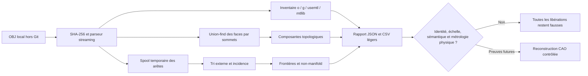

# F15 — Segmentation topologique reproductible du scan moteur 917

## Résultat livré

F15 ajoute un inventaire OBJ reproductible, écrit uniquement avec la bibliothèque
standard Python. Il lit le scan local, recalcule son SHA-256, inventorie les
déclarations `o`, `g`, `usemtl` et `mtllib`, mesure la boîte englobante dans les
unités natives du fichier, dénombre les composantes topologiques et calcule
l'incidence de chaque arête.

Ce lot ne segmente pas encore une culasse, un carter, un cylindre ou un goujon au
sens mécanique. Une composante F15 est seulement un ensemble de faces reliées
par des indices de sommets. Une frontière est seulement une arête non orientée
incidente à une face. Les identifiants `surface_0001` ou `boundary_0001` sont
donc stables et reproductibles, mais **sans sémantique fonctionnelle**.

Le scan, ses sommets et ses faces restent dans `raw-scans/` ou `work/`, hors Git.
F15 ne produit aucune copie OBJ, PLY, STL ou USD.



## Audit des pipelines précédents

Les scripts existants ont des objectifs différents :

- `prepare_scan.py` utilise NumPy, SciPy, Trimesh et PyMeshLab, crée une copie de
  travail, exporte des composantes PLY et deux maillages allégés ;
- `analyze_boundaries.py` utilise NumPy, SciPy et Trimesh pour cribler des
  frontières approximativement planes et circulaires ;
- `segment_engine.py` applique des masques spatiaux autour des douze ouvertures
  déjà détectées et exporte quatre régions PLY non fermées ;
- `build_scan_metrology_f13.py` compare conditionnellement ces douze ouvertures
  à des dimensions publiées, sans confirmer l'échelle ni la variante.

F15 ne remplace aucun de ces traitements. Il établit une couche plus basse,
indépendante de leurs bibliothèques : la garde de l'entrée, la structure du
conteneur OBJ et la topologie brute. Cette couche peut ensuite contrôler que les
pipelines géométriques plus riches reçoivent exactement le même fichier.

## Réconciliation du fichier canonique

Le contrat fixe le SHA-256 attendu :

`428c4143d073f8330022f2fecbd1ac1ee7784d4f1565f1160020448dbdffa0ae`

Un rapport local antérieur, produit par `prepare_scan.py`, avait observé :

- 1 282 880 sommets et 2 465 879 triangles ;
- trois composantes topologiques, dont 1 206 735, 74 044 et 2 101 sommets ;
- 101 809 arêtes de frontière, aucune arête non-manifold et deux faces d'aire
  nulle ;
- bornes brutes `[-416.154602, -515.711365, 250.128326]` à
  `[586.020447, 252.563721, 989.893677]`, soit une enveloppe de
  `[1002.175049, 768.275086, 739.765351]` **unités OBJ**.

Ces valeurs sont seulement une référence de régression pour le même fichier
binaire. Elles ne sont ni une nouvelle exécution F15, ni une preuve métrologique
indépendante. Le vérificateur F15 exige la concordance du SHA-256, des comptes
globaux, du nombre de composantes, de la topologie et des bornes. Les trois
tailles de composantes ci-dessus sont documentées dans la preuve d'exécution,
mais ne constituent pas chacune un gate de réconciliation du contrat actuel.

## Algorithme et limites de ressources

Les sommets sont conservés dans trois tableaux compacts de doubles. Les
composantes de surface utilisent une structure union-find compacte. Les arêtes
ne sont pas placées dans un dictionnaire Python géant : chaque paire d'indices
est encodée sur huit octets, triée par blocs de 250 000 enregistrements, puis
fusionnée. Les fichiers de tri sont temporaires et supprimés à la fin.

Pour un maillage triangulaire de 2 465 879 faces, le spool représente environ
7,4 millions d'occurrences d'arêtes, soit environ 59 Mo avant les runs triés.
Il faut donc réserver de la place temporaire supplémentaire dans `work/`. Le
rapport final reste léger et plafonne le détail à 250 composantes de surface et
500 composantes de frontière ; les comptes globaux restent complets si la liste
est tronquée.

F15 ne calcule pas :

- d'unité métrique ou de facteur d'échelle ;
- d'axe longitudinal, de rangée de cylindres ou de numéro de cylindre ;
- de volume, de masse ou de tolérance de fabrication ;
- de fermeture automatique, de réparation ou de surface CFD ;
- d'identité Porsche 917 ou de variante atmosphérique/turbo.

## Sorties locales

La commande écrit sous `work/917-engine/scan-segmentation-f15/` :

- `scan-segmentation-f15-report.json` : garde, compteurs, boîte englobante,
  topologie, erreurs et libérations ;
- `surface-components-f15.csv` : compteurs et boîtes englobantes des composantes
  topologiques ;
- `boundary-components-f15.csv` : degrés, extrémités, embranchements et candidats
  de boucles fermées ;
- `obj-declarations-f15.json` : inventaire des objets, groupes, matériaux et
  bibliothèques déclarés.

Aucun de ces fichiers ne contient une liste de sommets ou de faces.

## CLI stable pour le conteneur

Smoke test synthétique :

```bash
python3 twins/reference-917-engine/source/build_scan_segmentation_f15.py \
  --contract twins/reference-917-engine/scan-segmentation-f15.json \
  --source /tmp/fixture.obj \
  --output /tmp/f15-smoke \
  --synthetic-fixture-mode
```

Future exécution canonique, après validation de l'image conteneur :

```bash
python3 twins/reference-917-engine/source/build_scan_segmentation_f15.py \
  --contract twins/reference-917-engine/scan-segmentation-f15.json \
  --source raw-scans/917-engine/original/917-engine-case-with-cylinders.obj \
  --output work/917-engine/scan-segmentation-f15
```

Le code de sortie vaut `0` uniquement pour `passed_synthetic_fixture_only` ou
`passed_inventory_only`. Une erreur de contrat, de SHA-256, de syntaxe OBJ ou de
réconciliation canonique renvoie `1`. Le mode synthétique accepte un autre
SHA-256 pour tester le parseur, mais ne peut ouvrir aucune libération.

## Exécution canonique observée localement dans l'image immuable

Le 2 septembre 2026, le binaire canonique a été exécuté dans l'image publique
exacte verrouillée par digest, avec réseau coupé, racine en lecture seule,
capacités supprimées et source montée en lecture seule. Le passage a duré
565,65 secondes sous émulation `linux/amd64` sur l'hôte `arm64` et a produit le
statut `passed_inventory_only` sans erreur de contrat, de garde, de parsing ou
de réconciliation.

Le fichier fait 107 128 223 octets. Le parseur a confirmé 1 282 880 sommets,
2 465 879 triangles, trois composantes de surface, 7 397 637 occurrences
d'arêtes, 3 749 723 arêtes uniques, 101 809 arêtes ouvertes, 944 composantes de
frontière, aucune arête non-manifold et deux faces d'aire nulle. Le maillage
reste donc non étanche.

L'OBJ ne contient que les directives `v` et `f`. Il ne porte aucun objet,
groupe, matériau ou fichier de matériaux nommé. Les trois composantes et les
944 frontières restent sans sémantique mécanique ; le fait que chaque frontière
soit une candidate de boucle topologique ne signifie pas qu'il s'agit d'un
alésage, d'un conduit ou d'une interface de pièce.

Le rapport complet et ses CSV restent sous `work/`, hors Git. La preuve suivie
[`scan-execution-evidence-f15.json`](../twins/reference-917-engine/scan-execution-evidence-f15.json)
ne contient que les agrégats, les empreintes des quatre sorties et les limites
de revendication. Son manifeste d'exécution assaini enregistre l'image runtime,
l'argv interne sans chemin hôte, la politique de confinement et le code de
sortie `0` comme observation locale. Il n'enregistre pas d'identifiant runtime
signé : la preuve n'est donc ni une attestation indépendante, ni une mesure
physique.

Après cette exécution, il faut faire une revue visuelle des frontières, relier
les régions à des interfaces physiques mesurées, puis reconstruire des maîtres
CAO paramétriques. Un inventaire topologique, même parfaitement reproductible,
ne rend pas le moteur fonctionnel ou imprimable.
