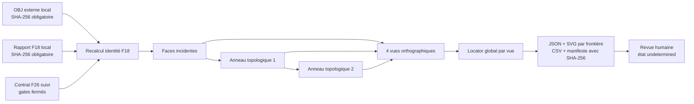
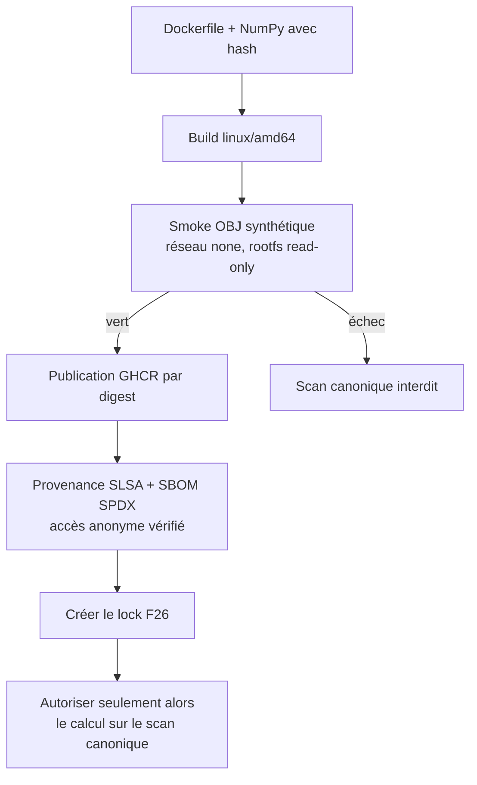
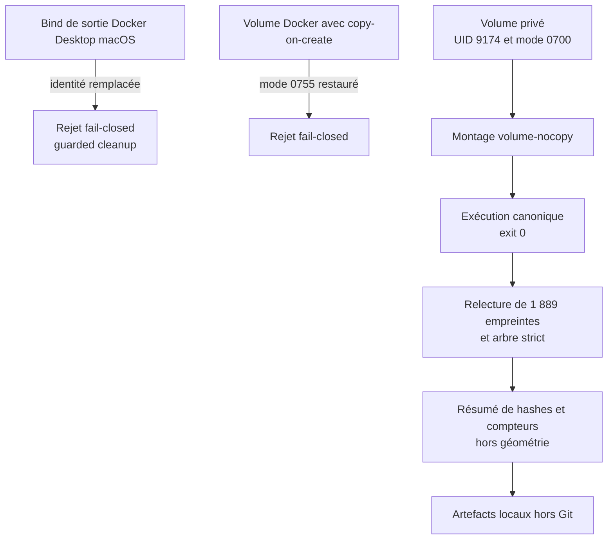

# F26 — contexte topologique déterministe des frontières du scan 917

F26 prépare la revue humaine exhaustive des **944 frontières F18**. Pour chaque
frontière, le générateur montre les faces incidentes, puis **exactement deux
anneaux topologiques** de faces voisines. Il produit quatre vues orthographiques
et un locator global dans chaque vue. Il ne classe aucune ouverture et ne
confirme aucune interface.

Les SVG contiennent des coordonnées dérivées du scan : toutes les sorties F26
restent dans `work/`, hors Git. Le dépôt ne contient que le contrat, le code, la
fixture synthétique et la définition de l'image.

## Définition topologique

- `incident_faces` : faces propriétaires d'au moins une arête d'incidence 1 de
  la composante F18 ;
- `ring_1` : faces partageant une arête triangulaire complète avec les faces
  incidentes, hors faces incidentes ;
- `ring_2` : faces partageant une arête triangulaire complète avec `ring_1`,
  hors faces incidentes et `ring_1` ;
- les trois ensembles sont disjoints ; une arête non-manifold provoque un échec
  fermé ;
- un anneau peut être vide sur une fixture pathologique, mais les deux niveaux
  sont toujours calculés et enregistrés. La fixture de smoke exige que les deux
  anneaux soient non vides.



Les quatre projections portent des noms de coordonnées de scan, pas des noms
physiques :

1. `scan_xy_plus_z` ;
2. `scan_xy_minus_z` ;
3. `scan_xz_plus_y` ;
4. `scan_yz_plus_x`.

L'unité, l'échelle et le sens physique des axes restent non confirmés.

## Lots et sorties locales

La limite dure est de **48 composantes par lot**. Les 944 composantes donnent
donc 20 lots : 19 lots de 48 et un lot de 32. La structure locale est :

```text
work/917-engine/topology-context-f26/
├── topology-context-manifest-f26.json
├── topology-context-inventory-f26.csv
├── batch_0001/
│   ├── boundary_0001.json
│   └── boundary_0001.svg
└── ...
```

Le manifeste fournit le SHA-256 et le nombre d'octets de chaque JSON/SVG et du
CSV. Il ne se hache pas lui-même afin d'éviter une référence récursive. Chaque
JSON conserve `review.state = undetermined`,
`semantic_interface_confirmed = false` et `release_authority = false`.

## Contrat d'entrée fail-closed

Le générateur exige :

- un OBJ externe, un rapport F18 et le contrat F26, tous liés par SHA-256 ;
- dans `source` F18, `actual_sha256` et `expected_sha256` doivent tous deux
  correspondre à l'OBJ, `provenance_hash_matched` doit être vrai et
  `raw_geometry_embedded_in_report` doit être faux ;
- le nombre attendu de composantes ;
- une correspondance exacte des identifiants, rangs, nombres d'arêtes et de
  sommets, topologie simple et classe géométrique F18 recalculés depuis l'OBJ ;
- zéro interface F18 confirmée et tous les gates physiques fermés ;
- des fichiers réguliers non symlinkés, bornés en taille ;
- un répertoire de sortie nouveau. Aucun écrasement n'est permis. La
  parent de sortie doit être privé (`0700`) et appartenir à l'UID du runtime ;
  son device/inode est gardé jusqu'à la fin. La publication crée le répertoire
  final avec `mkdir` exclusif, lie les fichiers sans remplacement et publie le
  manifeste en dernier comme marqueur de fin ;
  un répertoire incomplet après crash reste bloqué et doit être audité ;

Le parseur OBJ F26 est volontairement limité : sommets finis, indices valides,
polygones de 3 à 64 sommets triangulés en éventail, lignes de 4096 octets au
maximum, coordonnées finies de valeur absolue au plus `1e12`, 10 millions de
sommets et 20 millions de triangles maximum. Un contexte est limité à deux
millions de faces, un SVG à 256 Mio et toute la sortie à 8 Gio. L'estimation
SVG et la réservation de sortie sont vérifiées avant la construction du texte.
Il n'utilise ni Trimesh, ni Matplotlib, ni FreeCAD.

## Image Docker dédiée avant le scan canonique

L'image F26 est distincte des images CAO, CFD et PhysicsNeMo. Elle contient
uniquement Python 3.12.14, NumPy 2.2.6, le contrat et les deux scripts F18/F26.
Elle est `linux/amd64`, CPU, non-root (`9174:9174`), sans port, sans GPU, sans
scan, sans dataset et sans poids de modèle.



Construction locale de la candidate :

```bash
docker buildx build \
  --platform linux/amd64 \
  --file containers/topology-context-f26.Dockerfile \
  --load \
  --tag 3dprinting993-topology-context-f26:local \
  .

docker run --rm --platform linux/amd64 \
  --network none --read-only \
  --tmpfs /tmp:rw,noexec,nosuid,size=128m \
  --pids-limit 64 --cap-drop ALL --security-opt no-new-privileges \
  3dprinting993-topology-context-f26:local
```

Le workflow manuel
`.github/workflows/topology-context-f26-image.yml` construit et, sur demande,
publie `ghcr.io/cluster2600/3dprinting993-topology-context-f26`. Il vérifie le
digest exact, le manifeste `linux/amd64`, le sujet d'attestation, la provenance,
le SBOM, NumPy 2.2.6 et le smoke renforcé. Un second smoke crée des entrées
synthétiques, les remonte en lecture seule, remonte une sortie `0700` possédée
par `9174:9174` en lecture-écriture et exécute la vraie CLI F26. Il vérifie que
les hashes d'entrée n'ont pas changé et que la sortie est possédée par l'UID du
runtime. Enfin, un `DOCKER_CONFIG` propre effectue un pull anonyme du digest et
relance le smoke hors ligne ; une simple inspection de manifeste ne suffit pas.

## Publication immuable vérifiée

Le workflow de publication est vert :
[run 33585072387](https://github.com/cluster2600/porscheparts/actions/runs/33585072387),
sur la révision `88d5033187d27ba47a51fb2f5f3a3230878ed6fa`. La seule
référence exécutable autorisée est désormais le digest public immuable :

```text
ghcr.io/cluster2600/3dprinting993-topology-context-f26@sha256:41764d6d6ed935a763a6b1e07524c68961555b2724e67bbf48a2f261c35a3b10
```

Le lock F26 suivi
[`topology-context-f26.lock.json`](../containers/topology-context-f26.lock.json)
relit les empreintes des neuf entrées exactes de construction et de contrôle.
Il fixe l'index OCI, son unique manifeste `linux/amd64`, le manifeste
d'attestation lié à ce sujet, la provenance SLSA, le SBOM SPDX, le smoke hors
ligne, le smoke des montages et le pull suivi du smoke par accès anonyme au
digest exact. Le runtime est CPU, non-root (`9174:9174`) et ne contient aucun
scan ni aucune sortie dérivée du scan. La provenance et le SBOM ne constituent
pas une signature cryptographique ; ce gate reste fermé.

Deux gates seulement sont vrais : `immutable_public_image_verified` et
`linux_amd64_offline_smoke_verified`. Les fixtures synthétiques prouvent que le
logiciel déterministe s'exécute, que les entrées restent en lecture seule et que
la sortie privée appartient à l'UID du runtime. Elles ne prouvent pas
l'identité du moteur, l'échelle, les interfaces, une CAO, une géométrie CAE,
PhysicsNeMo, Omniverse, la fabrication, l'impression ou le fonctionnement du
moteur. Tous ces gates restent explicitement faux.

Le champ `image.immutable_digest` du contrat générique reste volontairement
`null` : le contrat ne doit pas devenir une autorité de publication implicite.
Le verrou séparé est l'unique source d'autorité pour cette image exacte.
Le scan canonique ne doit pas être monté avec une autre référence, un tag
mutable ou une image locale non liée à ce verrou.

## Commande canonique autorisée uniquement par le verrou exact

Le modèle suivant ne peut utiliser que la référence immuable du verrou. Il
génère des preuves visuelles locales pour revue humaine ; il n'ouvre aucun gate
physique :

```bash
docker run --rm --platform linux/amd64 \
  --network none --read-only \
  --tmpfs /tmp:rw,noexec,nosuid,size=256m \
  --pids-limit 128 --cap-drop ALL --security-opt no-new-privileges \
  --mount type=bind,src="$F26_INPUT_DIR",dst=/workspace/input,readonly \
  --mount type=volume,src="$F26_OUTPUT_VOLUME",dst=/workspace/output,volume-nocopy \
  "$F26_IMAGE_BY_DIGEST" \
  python /opt/3dprinting993/twins/reference-917-engine/source/build_topology_context_f26.py \
    --contract /opt/3dprinting993/twins/reference-917-engine/topology-context-contract-f26.json \
    --contract-sha256 863a50e1ec577ed79740877292fbbf7e2ae0af73d4996afe8d067fb261445575 \
    --mesh /workspace/input/engine.obj \
    --mesh-sha256 "$F26_MESH_SHA256" \
    --f18-report /workspace/input/boundary-review-f18.json \
    --f18-report-sha256 "$F26_REPORT_SHA256" \
    --expected-components 944 \
    --batch-size 48 \
    --output /workspace/output/topology-context-f26
```

Les variables doivent être définies explicitement. Aucun secret n'est requis.
Le scan et le rapport sont montés en lecture seule. Le volume de sortie doit
être initialisé séparément en mode `0700`, appartenir à l'UID/GID `9174:9174`
visible dans le conteneur et être monté avec `volume-nocopy`. Son identifiant
local n'est ni une preuve ni une donnée à versionner.

## Preuve d’exécution canonique agrégée

La preuve suivie
[`topology-context-execution-evidence-f26.json`](../twins/reference-917-engine/topology-context-execution-evidence-f26.json)
lie le scan, le rapport F18 et le contrat par leurs seules empreintes au digest
public F26 et au commit du lock `01e7237`. L'exécution finale s'est terminée
avec le code 0 dans `linux/amd64`, sous l'utilisateur non-root `9174:9174`, sans
réseau, avec un système de fichiers racine en lecture seule, les entrées en
lecture seule et un unique volume persistant privé en écriture.

Le résultat local compte **944 composantes**, **20 lots**, **1 889 charges
utiles** et **1 890 fichiers** : 944 rendus SVG, 945 JSON et un index CSV. Les
1 889 empreintes déclarées ont été relues ; l'index comporte 945 lignes dont
944 observations. Le total est de 213 063 080 octets. Les contrôles agrégés
suivis sont :

- manifeste de fin :
  `acfdf9384440986cb00d08ac9f51f3111cc83d38838e22b75173f5411843af39`,
  545 596 octets ;
- index tabulaire :
  `4f308350ee20f85d46b041777a2822e537ce73701a45ce98695b74a4c387bb45`,
  256 573 octets ;
- arbre strict :
  `927b10d5266f4727061d5399b5291e5316e7fcb6ed1afa6d69e01c84f3bdde3c`.

Le résultat final est byte-identique au premier calcul privé. Ce premier essai
n'est toutefois pas accepté : sur le bind de sortie Docker Desktop macOS, la
garde a correctement arrêté la publication avec
`guarded cleanup refused a replaced directory`. La garde n'a pas été affaiblie.
Un volume Docker monté sans `volume-nocopy` n'est pas acceptable non plus : le
copy-on-create réintroduit le mode `0755`, alors que F26 exige `0700` et la
propriété de l'UID du runtime. Le chemin sûr initialise le volume privé, vérifie
son propriétaire et son mode, puis le monte avec `volume-nocopy` avant
l'exécution non-root.



Cette preuve ouvre uniquement
`canonical_scan_execution_verified_in_published_image` et
`canonical_topology_context_generated`. Elle ne versionne aucun chemin local,
identifiant de volume, coordonnée, SVG, JSON de composante, CSV d'inventaire ou
manifeste produit. L'identité, l'échelle, les interfaces, la revue humaine, la
CAO, la géométrie CAE, PhysicsNeMo, Omniverse, la fabrication, l'impression et
le fonctionnement moteur restent faux. Le lock d'image conserve ses propres
gates d'exécution canonique à faux : la preuve d'exécution est un document
séparé et n'élargit pas l'autorité de la chaîne de publication.

## Ce que F26 ne prouve pas

F26 ne prouve ni l'identité du moteur, ni l'échelle, ni les interfaces, ni une
géométrie étanche, ni les matériaux, ni les tolérances, ni un cas de charge. Il
ne valide aucun solveur classique, aucune donnée PhysicsNeMo, aucun USD
SimReady, aucune fabrication et aucun démarrage moteur. Les SVG améliorent la
preuve visuelle nécessaire à la future revue humaine ; ils ne la remplacent
pas.
