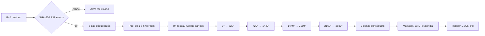

# F40 — convergence numérique du réseau 1D motored

## Résultat attendu

F40 ne crée pas un nouveau modèle physique. Il met le cas F39 sous contrainte
numérique avec six calculs dédupliqués et quatre cycles consécutifs de 720° par
calcul. Le résultat est un rapport falsifiable sur :

- la stabilisation d'un cycle au suivant ;
- la sensibilité au nombre de cellules ;
- la sensibilité au CFL ;
- la sensibilité à la pression initiale interne.

Une gate numérique vraie ne valide ni les dimensions hypothétiques, ni les
coefficients de décharge, ni le calage absolu, ni une puissance moteur.

## Provenance verrouillée

Le contrat
`twins/reference-917-engine/unsteady-convergence-campaign-f40.json` lie par
SHA-256 :

- le contrat F39 : `c62d1dff...1743432` ;
- le runner F39 : `4a2f7b90...8d174` ;
- l'image Aeolus1D 0.3.3 :
  `sha256:742569a4...e096a3`.

Le commit `ddc7703d4ad949b2712bdf178a28dbaaf0ae3cda` est une référence documentaire,
pas une exigence sur le `HEAD` courant. Le runner vérifie les deux fichiers F39,
mais ne prétend pas vérifier lui-même le digest du moteur Docker.

## Matrice minimale

| Cas | Échelle cellules | CFL | Facteur de pression initiale | Rôle |
|---|---:|---:|---:|---|
| `mesh_0p5_cfl_0p2_init_1p00` | 0,5 | 0,2 | 1,00 | maillage grossier |
| `mesh_1p0_cfl_0p2_init_1p00` | 1,0 | 0,2 | 1,00 | maillage F39 |
| `mesh_2p0_cfl_0p2_init_1p00` | 2,0 | 0,2 | 1,00 | référence commune |
| `mesh_2p0_cfl_0p4_init_1p00` | 2,0 | 0,4 | 1,00 | sensibilité temporelle |
| `mesh_2p0_cfl_0p2_init_0p95` | 2,0 | 0,2 | 0,95 | sensibilité à l'état initial |
| `mesh_2p0_cfl_0p2_init_1p05` | 2,0 | 0,2 | 1,05 | sensibilité à l'état initial |

Le cas `2,0 / 0,2 / 1,00` n'est exécuté qu'une fois et sert aux trois familles
de comparaison. Le nombre de cellules est `floor(N_F39 × échelle + 0,5)`, avec
un minimum de quatre cellules par conduit.

Le facteur initial ne modifie que les pressions initiales des 27 conduits, des
trois plénums/collecteurs et des douze cylindres. Les pressions des conditions
aux limites et les températures restent inchangées.

## Exécution persistante



`build_network` est appelé une fois par cas. Les quatre appels à
`dispatch_advance` reçoivent le même dictionnaire de conduits, les mêmes
composants 0D et un `t_start` cumulatif. Une reconstruction entre cycles
annulerait la convergence recherchée et est explicitement falsifiée par les
tests.

Les cas peuvent être parallélisés ; les cycles d'un même cas restent
séquentiels. `--workers` est obligatoire en mode `--execute` et limité au
nombre de cas. Le JSON final est trié et ne contient ni horodatage ni durée
murale afin de rester déterministe à entrées identiques.

## Métriques aux frontières de cycle

À la fin de chacun des quatre cycles, F40 réutilise les diagnostics stricts F39
sur les 27 conduits et les 15 composants 0D. Tous les champs doivent être finis
et les densités, pressions, températures, volumes, masses et énergies internes
doivent être strictement positifs.

Les sept observables de convergence sont :

- masse totale des conduits ;
- masse totale des composants 0D ;
- masse gazeuse totale ;
- pression moyenne volumique des conduits ;
- température moyenne massique des conduits ;
- pression moyenne volumique des composants 0D ;
- température moyenne massique des composants 0D.

Pour chaque métrique `q`, le delta relatif est :

```text
delta(q) = abs(q_courant - q_reference) / max(abs(q_reference), 1e-12)
```

Quatre frontières donnent exactement trois deltas consécutifs. L'évaluation
est impossible si une frontière ou une métrique manque.

## Tolérances `f40-v1`

| Test | Tolérance maximale sur toutes les métriques |
|---|---:|
| Cycle n contre cycle n-1 | 0,001 |
| Maillage contre échelle 2 | 0,02 |
| CFL 0,4 contre CFL 0,2 | 0,01 |
| Pression initiale 0,95/1,05 contre 1,00 | 0,01 |

Ces seuils sont verrouillés par le validateur `f40-v1` pour rendre la décision
reproductible. Ils ne sont
pas calibrés sur un banc réel. Un dépassement produit quand même le rapport et
laisse simplement la gate concernée à `false`.

Une sensibilité à la frontière du quatrième cycle n'est déclarée évaluée que si
le cas de référence et chaque cas comparé ont eux-mêmes satisfait la convergence
cyclique. Cela empêche une dérive transitoire commune de produire une fausse gate
de sensibilité verte.

Le runner retourne néanmoins une erreur si un cas n'achève pas ses quatre
cycles, si un état devient non fini/non positif ou si les trois deltas ne sont
pas disponibles. Un simple dépassement des tolérances de convergence ou de
sensibilité n'empêche pas l'écriture du rapport et n'est pas transformé en
succès artificiel.

## Gates

Les `numerical_gates` couvrent séparément provenance, matrice, exécution de 24
cycles, finitude, positivité, disponibilité des trois deltas, convergence des
sept métriques agrégées aux frontières de cycle et trois sensibilités. Seules
les observations effectivement produites peuvent devenir vraies dans le
rapport. Cette gate n'est pas une convergence complète du réseau : elle ne voit
ni les formes d'onde locales, ni les débits instantanés aux soupapes, ni les
écarts cylindre par cylindre. Une phase suivante devra ajouter des normes
phase-résolues L2/L∞ par conduit, banque et cylindre.

Toutes les `physical_release_gates` restent fausses, notamment mesures de
géométrie/CdA/calage, corrélation physique, bilans masse/énergie validés au sens
ingénierie, banc moteur, puissance, démarrage et fabrication.

## Commandes

Manifeste sans Aeolus ni exécution :

```bash
make 917-unsteady-convergence-f40-manifest
```

Smoke des six constructions dans l'image immuable :

```bash
make 917-unsteady-convergence-f40-image-smoke
```

Campagne complète, par exemple six cas en parallèle :

```bash
make 917-unsteady-convergence-f40 F40_WORKERS=6
```

Le rapport est écrit dans
`work/917-unsteady-convergence-f40/unsteady-convergence-f40-report.json`.

## Limites

F40 reste un modèle 1D/0D `motored` basé sur les hypothèses F39. Il ne contient
ni injection, ni combustion, ni turbos, ni transfert thermique validé, ni
mesures du moteur. Même un rapport entièrement vert ne prédit donc ni couple,
ni puissance, et ne prouve pas 1 600 ch. Il ne peut autoriser ni démarrage ni
fabrication.
