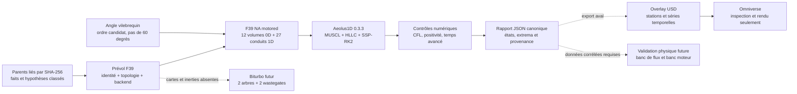

# F39 — réseau 0D/1D instationnaire du moteur 917

## Résultat attendu

F39 introduit un solveur de réseau instationnaire pour préparer deux topologies
du flat-12 : une branche atmosphérique et une branche biturbo. Son premier rôle
est de rendre explicites le transport compressible, les temps de propagation,
le phasage des douze cylindres et les stockages de masse et d'énergie. Il ne
doit pas transformer les états stationnaires F38 ou les hypothèses F33 en
mesures physiques.

Le contrat est
[`unsteady-network-f39.json`](../twins/reference-917-engine/unsteady-network-f39.json)
et son runner
[`run_unsteady_network_f39.py`](../twins/reference-917-engine/source/run_unsteady_network_f39.py).
Les sorties d'exécution restent ignorées par Git sous
`work/917-unsteady-network-f39/`.

Deux niveaux doivent rester distincts dans le rapport :

- `screening_proxy` vérifie l'algorithme avec des longueurs, volumes, lois de
  soupapes ou rendements déclarés comme hypothèses ;
- `physical_candidate` reste bloqué tant que les géométries internes, profils
  de came, tables `CdA`, cartes turbo et traces de banc ne sont pas acquis,
  hashés et liés à la variante exacte.

Une exécution réussie au premier niveau prouve un calcul numérique
reproductible. Elle ne prouve ni la puissance, ni le fonctionnement d'un
moteur, ni la fabricabilité d'une pièce.

L'incrément exécutable F39 est volontairement plus étroit : un cas
atmosphérique **motored**, sans injection et sans combustion, avancé sur un
cycle complet de 720°. Il ne calcule ni couple ni puissance. La branche biturbo
est une topologie future et reste bloquée par l'absence de cartes, d'inerties et
de loi wastegate.

## Architecture de calcul



Le backend retenu pour F39 est Aeolus1D 0.3.3, sous licence MIT. Cette version
est récente et déclarée alpha par son propre projet : elle reste un solveur
expérimental de comparaison, pas une autorité industrielle. Le schéma employé
est MUSCL avec limiteur `minmod`, solveur de Riemann HLLC interne et intégration
SSP-RK2. Le CFL demandé est 0,4 et le contrat refuse une valeur supérieure ou
égale à 0,8.

Le découpage logique cible est le suivant :

1. les cylindres, plénums, collecteurs et volumes frontières sont des capacités
   0D avec masse et énergie propres ;
2. les admissions et échappements sont des conduits 1D discrétisés, avec
   propagation compressible, frottement et transfert pariétal seulement si
   leurs paramètres sont présents ;
3. les soupapes sont des jonctions dépendantes de l'angle vilebrequin via une
   loi de levée et une table `CdA` ;
4. les jonctions de banc répartissent les débits sans fusionner les douze
   cylindres en une source stationnaire unique ;
5. la future branche turbo ajoute compresseur, turbine, arbre avec inertie,
   wastegate et échangeur. Sans cartes ni inertie, ces éléments ne sont pas
   exécutés comme un modèle de montée en régime ;
6. l'intégrateur avance le temps et l'angle ensemble. Les conditions initiales
   F38 peuvent amorcer le calcul, mais ne constituent pas sa solution.

F39 ne remplace pas la CFD 3D des conduits, la combustion réactive à maillage
mobile, le calcul thermique conjugué ou la dynamique multi-corps du train
mobile. Ces solveurs servent à identifier ou valider les fermetures du réseau.

## Topologies séparées

### Atmosphérique

F39 construit exactement 27 `PipeSpec` 1D : un tronc d'admission, douze
runners, douze primaires d'échappement et deux sorties. Il comporte quinze
nœuds topologiques, soit un plénum, douze cylindres et deux collecteurs. Cela se
traduit côté Aeolus1D par trois `JunctionSpec`, douze `CylinderSpec` et
vingt-quatre ports équivalents. Chaque port agrège deux soupapes physiques de
la culasse clean-sheet F29 4V : le moteur contient donc quarante-huit soupapes.
Le maillage de départ compte environ 572 cellules ; ce nombre reste une
hypothèse numérique à raffiner.

Deux identités NA existent dans les parents et ne doivent pas être mélangées :

- le F35 `type_912_4_5_na`, 85 × 66 mm et 4 494,2 cm³, est lié au moteur
  historique ; son rapport volumétrique reste inconnu ;
- le F33 `917_2026_flat12_na_candidate`, 90 × 70,4 mm et rapport 11,5, est une
  hypothèse moderne 5,374 L de screening.

Le premier pourrait recevoir les faits FIA de distribution F20 dans un cas
historique distinct. F39 ne les hérite pas : il utilise la culasse clean-sheet
F29 4V avec le candidat F33 à 90 × 70,4 mm,
rapport 11,5 et 9 000 tr/min, avec une bielle de 138 mm reprise comme hypothèse
de géométrie, et non comme cote historique de ce moteur. À ce régime, 720°
correspondent à 0,013333333 s. Le run doit publier cette identité et conserver
toutes les géométries de conduits, volumes, profils et `CdA` sous la classe
`design_hypothesis`.

### Biturbo

La topologie cible ajoute deux compresseurs, un volume de charge, un plénum,
deux turbines, deux arbres, deux wastegates et les frontières de sortie. Le
réseau devra conserver séparément les deux bancs et publier les bilans de chaque
turbo avant le bilan global. Elle n'est pas exécutée dans F39.

Les deux identités suivantes sont également distinctes :

- le 917/30 historique 5 374 cm³ est documenté à 90 × 70,4 mm et rapport 6,5 ;
- le candidat F33 2026 conserve 90 × 70,4 mm mais emploie un rapport 9,5, une
  paire de Garrett G42-1325 non sélectionnée et des rendements supposés.

Le compte de deux turbocompresseurs et la valeur historique de 1 600 hp viennent
d'une source Porsche, mais aucune carte, vitesse, durée, condition ambiante ou
courbe de banc ne l'accompagne. Les 1 600 hp restent donc une exigence de
conception et non une donnée de calibration.

## Registre des données utilisables

| Donnée | Valeur disponible | Classe et portée | Conséquence F39 |
| --- | --- | --- | --- |
| 4,5 L NA | 12 cylindres, 85 × 66 mm, 4 494,2 cm³ | FIA/AMS ; identité historique | cinématique piston possible, volume mort bloqué sans compression |
| 5,0 L NA | 86,8 × 70,4 mm, 4 999 cm³, rapport 10,5 | AMS secondaire | branche documentaire distincte, non liée au F35 NA |
| 917/30 | 90 × 70,4 mm, 5 374 cm³, rapport 6,5 | cylindrée Porsche ; dimensions AMS | volume cylindre historique candidat, pas de géométrie de réseau |
| F33 NA | 90 × 70,4 mm, rapport 11,5, 9 000 tr/min | hypothèse 2026 | entrée de screening seulement |
| F33 turbo | 90 × 70,4 mm, rapport 9,5, 9 000 tr/min | hypothèse 2026 | entrée de screening seulement |
| ordre d'allumage | `1-9-5-12-3-8-6-10-2-7-4-11` | candidat AMS ; numérotation non confirmée | phasage hypothétique à 60 degrés, preuve physique bloquée |
| distribution 4,5 L | levées 12,1/10,5 mm ; IVO 104° BTDC, IVC 104° ABDC, EVO 105° BBDC, EVC 75° ATDC | FIA, uniquement Type 912 4,5 L | événements utilisables ; profil complet absent |
| conduit admission 4,5 L | diamètre 41,0 ± 0,8 mm | tolérance d'homologation FIA, pas de fabrication | section candidate locale ; longueur, siège et profil absents |
| culasse F29 4V | 2 admissions Ø32,4 mm et 2 échappements Ø27 mm par cylindre | clean-sheet 2026, non mesuré | 48 soupapes physiques agrégées en 24 ports équivalents |
| réseaux F8 | topologie de 106 instances | sémantique seulement ; tous les champs `measurements` sont vides | aucune longueur, aire, rugosité ou volume physique |
| états F38 | pressions, températures et débits stationnaires | calcul 0D non corrélé | conditions initiales ou test de régression, jamais mesure |
| turbo F33/F38 | rendements supposés et fraction wastegate inverse | hypothèse/proxy ; maps absentes | pas de surge, choke, vitesse ni spool prédictif |
| injection/allumage | architecture séquentielle et double allumage | exigence F34a ; matériel et tables absents | source de chaleur/masse prescrite seulement |
| inerties | masses FIA du vilebrequin, d'une bielle et du groupe piston 4,5 L | masse sourcée, tenseurs absents | pas d'inertie turbo, came ou ensemble moteur validée |

F39 lie par empreinte SHA-256 les contrats F33 cycle
`6bbd5a5373660641c50e85dce6b45ac23222751d77f9f86783d82bd72530e73b`,
F35 train mobile
`b749e68c52829caae5b21d613ca1f0f1f2b6ad205d1ee69728595a1ccd518954`,
F38 réseau stationnaire
`e52c7e7910f0263578e4197276a2abbafc36e83460f9bd55346af4a497c51c1d`
et F2 cinématique
`380760fb7747ec818dd5637ae571c2ec545cc39a03bfd92e449b2959c58296a8`,
ainsi que le contrat F29 culasse clean-sheet
`5240581507befd5d627d6b830cbd943ce87d9c250b6d4653005b9a6f951bfee3`
et son étude de conception
`135f9a9c692a2e4253fa33ce8c433c79423eb72154d88db999c3942ac2bb970e`.
La présence de ces valeurs attendues ne suffit pas : le runner doit relire les
six fichiers avant que `source_integrity_complete` puisse passer à `true`.

Les valeurs suivantes définissent uniquement le cas numérique F39 :

| Élément proxy | Longueur | Aire ou volume | Cellules / loi |
| --- | ---: | ---: | ---: |
| tronc admission | 0,35 m | 0,0064 m² | 20 |
| chacun des 12 runners | 0,30 m | 0,0016 m² | 18 |
| chacun des 12 primaires | 0,45 m | 0,001257 m² | 24 |
| chacune des 2 sorties | 0,60 m | 0,0032 m² | 24 |
| plénum admission | sans objet | 0,006 m³ | volume 0D |
| chacun des 2 collecteurs | sans objet | 0,0015 m³ | volume 0D |
| groupe admission | 690° → 250° via 0°, centre 110°, loi sin², levée 10,368 mm par soupape | 2 × Ø32,4 mm ; aire totale 0,00121957 m² | `Cd=0.72` |
| groupe échappement | 470° → 30° via 720°, centre 610°, loi sin², levée 8,64 mm par soupape | 2 × Ø27 mm ; aire totale 0,00084692 m² | `Cd=0.68` |

Ces nombres sont des `design_hypotheses`. La topologie et les dimensions de
soupapes viennent de la tête clean-sheet F29 ; les lois sin² de 280°, les
coefficients de débit et les phases ne sont pas mesurés. Les événements et
levées FIA F20 du 4,5 L ne sont pas transférés au candidat F33 de F39.

Les CAO F29, F34 et F36 contiennent des conduits analytiques utiles pour tester
le pipeline. Le scan 935 fournit des graines morphologiques dont l'échelle et
l'identité 917 ne sont pas confirmées. Ces actifs doivent garder la classe
`proxy` ou `scan_measurement_unconfirmed_identity`; ils ne remplissent pas les
champs de géométrie physique de F39.

## Critères numériques

Les critères suivants sont des gates de développement. Ils ne sont pas des
critères de corrélation moteur :

| Contrôle | Critère minimal F39 |
| --- | ---: |
| valeurs finies | aucun `NaN` ou infini dans les états et bilans publiés |
| positivité | densité, pression absolue et température strictement positives |
| backend | paquet et version Aeolus1D 0.3.3 vérifiés avant le calcul |
| topologie F39 | 27 conduits, 12 cylindres 0D, 3 jonctions, 48 soupapes physiques et 24 ports équivalents construits |
| pas explicite | CFL demandé 0,4 et valeur contractuelle strictement `< 0.8` |
| horizon F39 | 720° avancés à 9 000 tr/min, soit 0,013333333 s dans la tolérance publiée |
| répétabilité | rapport canonique identique octet par octet à entrée et runtime identiques |
| régime périodique futur | au moins 3 cycles et 3 écarts consécutifs `<= 1e-3` pour masse, pression et température |
| phasage candidat | douze événements espacés de 60° sur 720°, sous la convention déclarée |
| tube à choc conteneur | 64 cellules, état fini et positif, erreurs L1 densité/pression/vitesse `< 0.25` |

F39 peut vérifier le chargement du backend, la construction du cas, le temps
avancé, les champs finis et les extrema de pression, densité et vitesse. Il ne
vérifie pas encore la convergence cyclique, la fermeture physique des bilans de
masse et d'énergie, la convergence de maillage ou la dynamique d'arbre. Ces
gates doivent rester `false`. Toute valeur simplement copiée depuis le contrat
doit être publiée comme seuil, pas comme résultat.

La validation physique exige en plus des mesures réservées au holdout : traces
de pression cylindre et collecteur résolues en angle, débit d'air et carburant,
lambda, températures, vitesse turbo, boost, couple et puissance corrigée avec
incertitude. Aucun seuil numérique interne ne remplace cette corrélation.

## Exécution CPU et image dédiée

L'interface prévue est :

```bash
make 917-unsteady-network-f39-test
make 917-unsteady-network-f39
make 917-wave-action-f39-image
```

Le calcul de référence est CPU. Le nœud Intel sans GPU NVIDIA convient aux
tests, à Aeolus1D, à Cantera et aux petits DOE. PhysicsNeMo, CUDA et RTX ne sont
pas des prérequis F39. Aucune clé API NVIDIA n'est nécessaire pour le solveur,
le conteneur ou l'export USD local.

L'image prévue est :

```text
ghcr.io/cluster2600/3dprinting993-wave-action-f39@sha256:742569a45becdd00b9f8d32b057156e68d0bb0489cef1fa97d2e6543fce096a3
```

Ce digest OCI `linux/amd64` a été construit par GitHub Actions le 2 septembre
2026 depuis le commit `88836a26b4102b1dd689d0b030b0726f83534c43`. Le workflow
a vérifié le SBOM, la provenance, le runtime non-root et le smoke hors réseau ;
un accès anonyme au manifeste par digest a également été relu avant son emploi
sur Intel ou Vast. Ces preuves concernent uniquement l'environnement de calcul.

Avant une exécution distante, elle doit être construite en `linux/amd64`,
testée hors réseau, non-root et publiée avec provenance, SBOM et digest
immuable. Le runtime doit accepter un système de fichiers en lecture seule,
écrire uniquement dans le volume de sortie et n'embarquer ni scan privé, ni
secret, ni client API inutile.

Vast n'est utile que pour une campagne CPU parallèle ou, plus tard, pour
entraîner un surrogate sur des résultats classiques validés. La location exige
un digest GHCR vérifié, le wrapper OpenBao/Vast et la clé SSH approuvée. Une
offre GPU ne doit pas être louée pour le seul solveur F39. L'instance doit être
arrêtée après récupération et vérification des artefacts.

Le smoke de l'image exécute les dépendances natives puis le tube à choc de Sod.
Il prouve que le runtime Aeolus1D 0.3.3 fonctionne sur CPU `amd64` ; il ne
construit aucun flat-12, aucun turbo et aucune performance moteur. OpenWAM n'est
pas intégré : son dépôt est dormant depuis 2017 et sa licence n'est pas assez
claire pour cette image. Cantera reste réservé à la thermochimie 0D, OpenFOAM
aux domaines 3D locaux et OpenModelica/FMI au banc, aux contrôles et aux
auxiliaires.

## Export USD et Omniverse

Le JSON F39 reste l'autorité numérique. Un exporteur aval peut écrire des
overlays sous `work/917-unsteady-network-f39/omniverse/` et sublayer le banc
F37 ou l'overlay F38 exact lié par SHA-256. Il doit ajouter uniquement :

- stations et connectivité de la variante choisie ;
- pression, température, débit, fraction massique et résidus avec unités ;
- `timeSamples` ou références vers des séries temporelles externes ;
- identité de variante, classes de provenance et hash du rapport F39.

L'overlay ne doit ajouter ni solide, ni collision, ni masse, ni joint PhysX et
ne doit pas modifier la CAO. Omniverse sert à inspecter le phasage, les ondes et
les déséquilibres entre bancs, puis à produire images ou vidéos. L'ouverture du
stage et la présence de courbes animées prouvent seulement la composition USD,
pas la fidélité du solveur.

PhysicsNeMo pourra ultérieurement consommer un dataset issu de campagnes F39
et de solveurs de référence. Il faudra séparer entraînement, validation et
holdout physique, publier l'incertitude et refuser les prédictions hors domaine.
Il ne doit pas être utilisé pour combler silencieusement une géométrie, une
carte turbo ou une calibration manquante.

## Limites de preuve

F39 ne peut pas autoriser :

- la revendication de 1 600 hp/ch ou d'une courbe de couple ;
- un démarrage virtuel présenté comme un démarrage moteur validé ;
- le dimensionnement final d'un turbo, d'une wastegate ou d'un échangeur ;
- l'impression 3D, métal ou titane, d'un piston, d'une bielle ou d'une culasse ;
- le montage du moteur dans une Porsche 993 ;
- la publication d'un surrogate PhysicsNeMo comme remplacement des essais.

Ces gates restent fermés jusqu'à acquisition des dimensions et matériaux,
calculs classiques convergés, corrélation indépendante, validation
tribologique/fatigue, CND, qualification du procédé et essais instrumentés.
