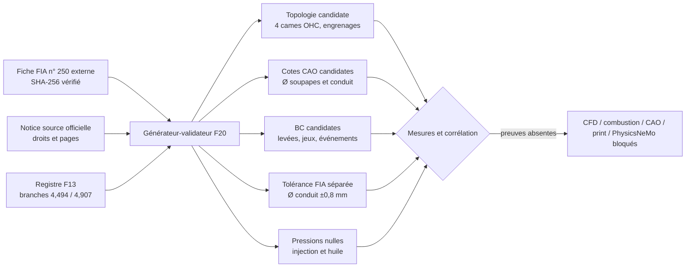

# F20 - Entrées FIA soupapes, cames et conduit du moteur 917

## Résultat et frontière d'autorité

F20 enregistre uniquement les valeurs lisibles de la fiche d'homologation FIA
n° 250 et les rattache aux deux branches déjà présentes dans le registre F13.
Le PDF reste externe au dépôt : seul son SHA-256, sa taille, son nombre de pages
et les pages relues sont conservés.
Comme il s'agit d'un document numérisé, les valeurs ont été vérifiées
visuellement sur les pages rendues ; aucun OCR n'est utilisé comme autorité.

Ce registre ne constitue ni une loi de levée complète, ni une CAO, ni une
condition limite validée. Les gates CAO, CFD, combustion, fabrication,
impression 3D et PhysicsNeMo restent tous fermés.



## Faits directement lisibles

| Domaine | Valeur FIA | Page PDF | Position |
|---|---:|---:|---:|
| Nombre d'arbres à cames | 4 | 9 | 170 |
| Disposition / entraînement / commande | OHC / engrenages / poussoirs à godet | 9 | 171-173 |
| Diamètre extérieur soupape admission | 47,5 mm | 9 | 181 |
| Levée maximale admission | 12,1 mm | 9 | 182 |
| Jeu admission, moteur froid | 0,1 mm | 9 | 186 |
| Admission ouvre / ferme | 104° avant PMH / 104° après PMB | 9 | 187-188 |
| Diamètre extérieur soupape échappement | 40,5 mm | 9 | 196 |
| Levée maximale échappement | 10,5 mm | 9 | 197 |
| Jeu échappement, moteur froid | 0,1 mm | 9 | 201 |
| Échappement ouvre / ferme | 105° avant PMB / 75° après PMH | 9 | 202-203 |
| Diamètre du conduit d'admission | 41 ± 0,8 mm | 10 | 225 |

Les angles sont conservés dans la convention imprimée de la fiche, en degrés
vilebrequin. Aucune durée de came, courbe de levée ou interpolation n'est
inventée. Le `± 0,8 mm` est enregistré séparément comme tolérance déclarée
d'homologation ; il n'est pas requalifié en tolérance de fabrication.

## Liaison des variantes

La page PDF 8 identifie directement la version initiale par `85 × 66 mm` et
`4 494,2 cm³`. Les faits des pages 9 et 10 lui sont donc liés directement sous
`type_912_4_5_na`.

L'extension 1/1E, page PDF 14, identifie `86 × 70,4 mm` et `4 907,28 cm³`. Elle
énumère les positions modifiées 25, 133-136 et 147, mais ne réimprime pas les
positions 170-225 relatives aux soupapes, cames et conduit. F20 conserve donc
ces dernières uniquement comme héritage candidat de la fiche de base : aucune
adoption comme CAO ou condition limite de la branche 4,907 n'est autorisée sans
mesure indépendante.

## Pressions et géométries encore manquantes

- la page 10 décrit la pompe et les injecteurs, mais ne donne pas de pression
  d'injection ; la valeur reste `null` sans défaut implicite ;
- la page 8 décrit le carter sec, le volume d'huile et le refroidisseur, mais ne
  donne pas de pression d'huile ; la valeur reste `null` ;
- la fiche ne donne pas le profil complet des cames ou la loi levée-angle ;
- les sièges, cols, guides et surfaces internes des conduits ne sont pas cotés.

Ces absences bloquent respectivement les modèles d'injection/combustion, de
lubrification, de dynamique de distribution et de CFD interne.

## Vérification et régénération

Validation reproductible sans redistribuer le PDF :

```bash
python3 twins/reference-917-engine/source/build_valvetrain_flow_inputs_f20.py
```

Contrôle supplémentaire du fichier officiel local :

```bash
python3 twins/reference-917-engine/source/build_valvetrain_flow_inputs_f20.py \
  --source-pdf /chemin/prive/homologation_form_number_250_group_4.pdf
```

La régénération exige volontairement le PDF externe exact et doit viser un
fichier temporaire avant comparaison :

```bash
python3 twins/reference-917-engine/source/build_valvetrain_flow_inputs_f20.py \
  --generate \
  --source-pdf /chemin/prive/homologation_form_number_250_group_4.pdf \
  --output /tmp/917-valvetrain-flow-inputs-f20.json

cmp /tmp/917-valvetrain-flow-inputs-f20.json \
  twins/reference-917-engine/valvetrain-flow-inputs-f20.json
```

Le générateur vérifie les empreintes du registre F13, de la notice source et du
PDF. Il refuse aussi une copie du PDF sous `catalog/sources/` et rejette toute
mutation des valeurs, pages, branches, catégories ou gates.

Le résumé de source F13 disait encore « aucune tolérance ». F20 conserve cette
divergence dans `upstream_reconciliation` : le `± 0,8 mm` lisible page 10 est
accepté uniquement comme tolérance déclarée d'homologation, jamais comme
tolérance de fabrication, et la divergence continue de bloquer toute release.
