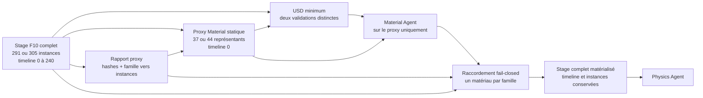

# Exécution native F1, F2, F3, F10 et SimReady sur Vast

Ce runbook exécute **une phase à la fois** dans le conteneur Vast. Il n'utilise
ni Docker-in-Docker, ni runner monolithique. Chaque phase écrit un rapport JSON
atomique et consomme la sortie concrète validée de la phase précédente.

L'ordre NVIDIA strict est : readiness hôte/GPU, prévol du workflow,
identification du contexte de l'asset F10, USD minimal, Material, Physics,
conformance, validations Asset/Geometry/Physics/SimReady, boucle de réparation
bornée, puis rendu de l'USD final et rapport consolidé. Les attestations
NVIDIA restent des rapports enfants des 25 rapports de phase top-level.

La chaîne reste exploratoire. La preuve CUDA de la readiness signifie seulement que
le runtime GPU fonctionne ; elle ne constitue ni une simulation moteur, ni une
validation de fabrication, de puissance ou de sécurité.

## Préconditions bloquantes

- image `linux/amd64` verte et épinglée sous la forme
  `ghcr.io/...@sha256:<64 hex>` ; un tag est refusé ;
- skill `omniverse-cad-to-simready` transféré explicitement et
  `SIMREADY_SKILL_ROOT` renseigné ; l'image ne l'embarque pas ;
- F2 généré nativement à partir de l'exact stage F1 du job ; un USDA F2 isolé
  n'est pas accepté, car ses `subLayers` F1 seraient manquantes ;
- prompts courts, sourcés et relus pour Material et Physics, sans secret ni
  propriété présentée comme mesurée sans preuve ; les deux sont obligatoires ;
- marqueur `/workspace/READY` créé par le script `onstart` seulement après
  démarrage et contrôle de santé des services natifs SimReady ;
- clé SSH Vast approuvée chargée et wrapper OpenBao utilisé ;
- `MAX_ACTUAL_DPH=2.50`, ou un plafond explicite plus restrictif.

Le plafond est comparé au `dph_total` renvoyé par `show` **après création de
l'instance**, donc après ajout du disque contractuel de 500 Go. Le prix de
l'offre ne suffit pas. Une RTX PRO 6000 WS peut être préférée à une Max-Q à
caractéristiques comparables, mais aucun identifiant d'offre temporaire n'est
codé ici.

## 1. Créer puis contrôler exactement une instance

```bash
set -euo pipefail
export OPENBAO_GHCR_BIN=/Users/maxime/.local/bin/openbao-ghcr
export OPENBAO_VASTAI_BIN=/Users/maxime/.local/bin/openbao-vastai
export MAX_ACTUAL_DPH=2.50
EXPECTED_IMAGE='ghcr.io/cluster2600/3dprinting993-simready-local-ai@sha256:REMPLACER_PAR_DIGEST_VERT_64_HEX'
OFFER_ID='REMPLACER_PAR_OFFRE_VERIFIEE'
JOB_ID="917-simready-$(date -u +%Y%m%dT%H%M%SZ)"
CONTROL_ROOT="work/vast-simready/controller/${JOB_ID}"
mkdir -p "${CONTROL_ROOT}"

cmp -s deploy/openbao/openbao-ghcr "${OPENBAO_GHCR_BIN}"
cmp -s deploy/openbao/openbao-vastai "${OPENBAO_VASTAI_BIN}"
"${OPENBAO_GHCR_BIN}" --check
"${OPENBAO_VASTAI_BIN}" --check
"${OPENBAO_GHCR_BIN}" --auth-check
"${OPENBAO_VASTAI_BIN}" --auth-check
"${OPENBAO_VASTAI_BIN}" ensure-local-ssh
"${OPENBAO_VASTAI_BIN}" instances | tee "${CONTROL_ROOT}/instances-before-launch.json"
"${OPENBAO_VASTAI_BIN}" heavy-offers | tee "${CONTROL_ROOT}/eligible-offers.json"
python3 - \
  "${CONTROL_ROOT}/instances-before-launch.json" \
  "${CONTROL_ROOT}/eligible-offers.json" \
  "${OFFER_ID}" <<'PY'
import json
from pathlib import Path
import sys

instances = json.loads(Path(sys.argv[1]).read_text(encoding="utf-8"))
offers = json.loads(Path(sys.argv[2]).read_text(encoding="utf-8"))
offer_id = int(sys.argv[3])
if any(item.get("label") == "3dprinting993-simready-local-ai" for item in instances):
    raise SystemExit("une instance SimReady existe déjà")
matching = [item for item in offers if item.get("id") == offer_id]
if len(matching) != 1:
    raise SystemExit("offre absente de la liste éligible relue")
offer = matching[0]
if not (
    offer.get("gpu") == "RTX PRO 6000 WS"
    and offer.get("num_gpus") == 1
    and offer.get("gpu_fraction") == 1
    and offer.get("gpu_ram_mb", 0) >= 80000
    and offer.get("cpu_cores_effective", 0) >= 24
    and offer.get("cpu_ram_mb", 0) >= 128000
    and offer.get("disk_space_gb", 0) >= 500
    and offer.get("verified") in (True, 1, "verified")
    and offer.get("rentable") in (True, 1)
    and offer.get("rented") in (False, 0)
    and 0 <= offer.get("dph_total", 999) <= 2.50
):
    raise SystemExit("offre hors contrat matériel ou coût")
PY

INSTANCE_ID=""
CLEANUP_ARMED=1
cleanup_instance_on_exit() {
  rc=$?
  trap - EXIT INT TERM
  set +e
  if [ "${CLEANUP_ARMED}" -ne 1 ]; then
    return "${rc}"
  fi
  if [ -z "${INSTANCE_ID}" ] && [ -f "${CONTROL_ROOT}/launch.json" ]; then
    INSTANCE_ID="$(python3 - "${CONTROL_ROOT}/launch.json" <<'PY' 2>/dev/null || true
import json
from pathlib import Path
import sys
payload = json.loads(Path(sys.argv[1]).read_text(encoding="utf-8"))
instance_id = payload.get("instance_id")
if isinstance(instance_id, int) and instance_id > 0:
    print(instance_id)
PY
)"
  fi
  if [ -z "${INSTANCE_ID}" ]; then
    return "${rc}"
  fi

  # Si le job a été transféré, tenter d'abord une récupération. Toute erreur
  # conserve le code initial et bascule vers la dérogation explicite ci-dessous.
  if [ -f "${CONTROL_ROOT}/transfer-report.json" ]; then
    deploy/vast/simready/collect-artifacts.sh \
      --instance-id "${INSTANCE_ID}" \
      --expected-image "${EXPECTED_IMAGE}" \
      --job-id "${JOB_ID}" \
      --max-actual-dph "${MAX_ACTUAL_DPH}" \
      --control-root "${CONTROL_ROOT}" || true
  fi

  retrieval="${CONTROL_ROOT}/retrieval-report.json"
  destroy_common=(
    --instance-id "${INSTANCE_ID}"
    --expected-image "${EXPECTED_IMAGE}"
    --job-id "${JOB_ID}"
    --confirm-job-id "${JOB_ID}"
    --confirm-instance-id "${INSTANCE_ID}"
    --confirm-digest "${EXPECTED_IMAGE}"
    --control-root "${CONTROL_ROOT}"
  )
  if [ -f "${retrieval}" ] && jq -e \
    '.artifact_archive_verified == true and .retrieval_complete == true' \
    "${retrieval}" >/dev/null 2>&1; then
    deploy/vast/simready/destroy-instance.sh \
      "${destroy_common[@]}" --retrieval-report "${retrieval}" || true
  else
    deploy/vast/simready/destroy-instance.sh \
      "${destroy_common[@]}" \
      --confirm-no-retrieval "NO-RETRIEVAL:${JOB_ID}:${INSTANCE_ID}:${EXPECTED_IMAGE}" || true
  fi
  return "${rc}"
}
trap cleanup_instance_on_exit EXIT
trap 'exit 130' INT
trap 'exit 143' TERM

"${OPENBAO_GHCR_BIN}" launch-vast-simready-heavy "${OFFER_ID}" | tee "${CONTROL_ROOT}/launch.json"
INSTANCE_ID="$(python3 - "${CONTROL_ROOT}/launch.json" <<'PY'
import json
from pathlib import Path
import sys
payload = json.loads(Path(sys.argv[1]).read_text(encoding="utf-8"))
instance_id = payload.get("instance_id")
if not isinstance(instance_id, int) or instance_id <= 0:
    raise SystemExit("identifiant de lancement absent")
print(instance_id)
PY
)"

python3 - "${CONTROL_ROOT}/launch.json" "${EXPECTED_IMAGE}" <<'PY'
import json
from pathlib import Path
import sys
payload = json.loads(Path(sys.argv[1]).read_text(encoding="utf-8"))
if (
    payload.get("singleton_verified") is not True
    or payload.get("contract_verified") is not True
    or payload.get("image") != sys.argv[2]
    or payload.get("label") != "3dprinting993-simready-local-ai"
    or payload.get("instance_id") <= 0
):
    raise SystemExit("postconditions de lancement absentes")
PY

deploy/vast/simready/check-instance.sh \
  --instance-id "${INSTANCE_ID}" \
  --expected-image "${EXPECTED_IMAGE}" \
  --max-actual-dph "${MAX_ACTUAL_DPH}" \
  --ready-timeout-seconds 1200 \
  --known-hosts "${CONTROL_ROOT}/known_hosts" \
  --report "${CONTROL_ROOT}/instance-ready.json"
```

Le wrapper GHCR vérifie d'abord l'accès en lecture au manifeste et son digest,
puis délègue la location au wrapper Vast approuvé. Ne pas appeler directement
`launch-simready-heavy`. Si le contrôle post-création échoue, ne lancer aucune
phase. La garde compare l'identifiant, le label, l'unique GPU, l'état, le digest
complet et le coût contractuel réel. Le contrôle ouvre ensuite une session SSH
en mode batch et attend le marqueur `/workspace/READY`; des métadonnées SSH
valides ne suffisent donc pas à franchir cette étape. Ce marqueur atteste que
le `onstart` a démarré les services et vérifié leur santé ; la phase readiness
ne les démarre pas elle-même.
Le trap `EXIT` reste armé pendant le transfert, toutes les phases, le rendu et
la récupération. Sur erreur ou interruption, il tente la collecte si le bundle
a été transféré, puis détruit avec le rapport complet ou, à défaut, avec la
dérogation `NO-RETRIEVAL` exacte. Il n'est désarmé qu'après la destruction
finale vérifiée. Le wrapper ne confirme le cleanup qu'après absence de
l'identifiant dans toutes les pages de la liste d'instances. Le plafond
`2.50` est un débit maximal en dollars par heure, pas un budget global : une
fenêtre de 180 minutes peut donc atteindre 7,50 USD, hors trafic réseau éventuel.
Après une erreur de création ou un timeout, ne jamais relancer aveuglément :
exécuter d'abord `openbao-vastai instances`, puis contrôler l'unique entrée au
label exact avec `show` ou la détruire. Le wrapper effectue cette relecture sur
les résultats incertains et un second lancement est bloqué dès que le contrat
devient visible.

## 2. Transférer uniquement le bundle autorisé

Le transfert contient seulement les scripts source F1/F2/F3 nécessaires, leurs
contrats JSON, les phases et le skill NVIDIA explicite. Il n'envoie ni dépôt
complet, ni fichier non suivi arbitraire, ni scan brut, ni secret.
Chaque fichier de l'allowlist doit être suivi et identique à `HEAD` dans
l'index comme dans l'arbre de travail. Le manifeste atteste le commit, le blob
Git et le SHA-256 exacts ; tant que les nouveaux scripts ne sont pas intégrés à
un commit, le transfert échoue volontairement.
Le contrat et le rapport de transfert attestent aussi le SHA-256 et la taille
des deux prompts. Le skill est refusé s'il contient un lien symbolique ou un
fichier spécial ; son manifeste déterministe atteste chaque chemin, taille et
SHA-256, puis l'arbre distant est revérifié avant le renommage atomique du job.

```bash
SKILL_ROOT=/chemin/explicite/vers/omniverse-cad-to-simready
MATERIAL_PROMPT=/chemin/vers/material-prompt.txt
PHYSICS_PROMPT=/chemin/vers/physics-prompt.txt

deploy/vast/simready/transfer-job.sh \
  --instance-id "${INSTANCE_ID}" \
  --expected-image "${EXPECTED_IMAGE}" \
  --job-id "${JOB_ID}" \
  --skill-root "${SKILL_ROOT}" \
  --material-prompt "${MATERIAL_PROMPT}" \
  --physics-prompt "${PHYSICS_PROMPT}" \
  --max-actual-dph "${MAX_ACTUAL_DPH}" \
  --max-runtime-minutes 180
```

Le contrat transféré bloque toute nouvelle phase moins de 60 secondes avant la
deadline. Ce garde-fou n'arrête et ne détruit pas automatiquement l'instance.

## 3. Préparer la connexion bornée

```bash
CONTROL_ROOT="work/vast-simready/controller/${JOB_ID}"
SSH_HOST="$(jq -r '.instance.ssh_host' "${CONTROL_ROOT}/instance-guard.json")"
SSH_PORT="$(jq -r '.instance.ssh_port' "${CONTROL_ROOT}/instance-guard.json")"
SSH=(ssh -p "${SSH_PORT}" -i "${HOME}/.ssh/id_vastai" \
  -o BatchMode=yes -o IdentitiesOnly=yes -o ConnectTimeout=20 \
  -o ServerAliveInterval=15 -o ServerAliveCountMax=4 \
  -o StrictHostKeyChecking=accept-new \
  -o "UserKnownHostsFile=${CONTROL_ROOT}/known_hosts" "root@${SSH_HOST}")

PROJECT_ROOT="/workspace/jobs/${JOB_ID}/project"
SKILL_REMOTE="/workspace/jobs/${JOB_ID}/vendor/omniverse-cad-to-simready"
CONTROL_REMOTE="/workspace/jobs/${JOB_ID}/control/job-control.json"
OUTPUT_ROOT="/workspace/results/${JOB_ID}"
COMMON="--project-root ${PROJECT_ROOT} --output-root ${OUTPUT_ROOT} --run-id ${JOB_ID} --control ${CONTROL_REMOTE}"
PHASES="${PROJECT_ROOT}/twins/reference-917-engine/remote-simready"
```

La première connexion applique un TOFU dans un fichier dédié au job. Conserver
ce fichier et examiner tout changement de clé hôte. Chaque commande ci-dessous
appelle un seul script de phase. Les appels réseau sont bornés par les options
SSH ci-dessus et les commandes lourdes par la deadline du contrat et
`PHASE_TIMEOUT_SECONDS` dans la phase ; relancer avec le même `run-id` est
refusé si son répertoire de sortie existe déjà.

## 4. Readiness, prévol, F1, F2, F3 et contexte F10

La readiness est strictement un contrôle hôte/GPU : marqueur READY,
`nvidia-smi`, PhysicsNeMo 2.2.0, CUDA, nom et mémoire GPU, puis petit tenseur
CUDA. Elle ne démarre aucun service et ne contacte aucun endpoint du workflow.
Le prévol NVIDIA est le **premier contact workflow**. Il contrôle les cibles
`validation,content-agents` avec `--skip-deploy` et ne convertit aucun asset.
Chaque phase NVIDIA aval relit le rapport, le manifeste et le fichier `.env`
exacts de ce prévol. Le fichier d'environnement est analysé par liste blanche,
jamais exécuté avec `source` ou `eval`, puis
`PHYSICAL_AI_REQUIRE_PREFLIGHT=1` et le chemin exact du manifeste sont imposés
avant chaque appel de référence NVIDIA.

```bash
"${SSH[@]}" "export SIMREADY_SKILL_ROOT='${SKILL_REMOTE}'; '${PHASES}/phase-readiness.sh' ${COMMON}"

READINESS_REPORT="${OUTPUT_ROOT}/readiness/${JOB_ID}/phase-readiness.json"
"${SSH[@]}" "export SIMREADY_SKILL_ROOT='${SKILL_REMOTE}'; '${PHASES}/phase-preflight.sh' ${COMMON} --readiness-report '${READINESS_REPORT}'"

PREFLIGHT_REPORT="${OUTPUT_ROOT}/preflight/${JOB_ID}/phase-preflight.json"
"${SSH[@]}" "export SIMREADY_SKILL_ROOT='${SKILL_REMOTE}'; '${PHASES}/phase-f1.sh' ${COMMON} --preflight-report '${PREFLIGHT_REPORT}'"

F1_STAGE="${OUTPUT_ROOT}/f1/${JOB_ID}/stages/917-complete-engine-f1.usda"
F1_REPORT="${OUTPUT_ROOT}/f1/${JOB_ID}/phase-f1.json"
"${SSH[@]}" "export SIMREADY_SKILL_ROOT='${SKILL_REMOTE}'; '${PHASES}/phase-f2.sh' ${COMMON} --input-f1 '${F1_STAGE}' --input-f1-report '${F1_REPORT}'"

F2_STAGE="${OUTPUT_ROOT}/f2/${JOB_ID}/stages/917-engine-kinematic-f2.usda"
F2_REPORT="${OUTPUT_ROOT}/f2/${JOB_ID}/phase-f2.json"
"${SSH[@]}" "export SIMREADY_SKILL_ROOT='${SKILL_REMOTE}'; '${PHASES}/phase-f3.sh' ${COMMON} --input-f2 '${F2_STAGE}' --input-f2-report '${F2_REPORT}' --preflight-report '${PREFLIGHT_REPORT}'"
```

Pour produire F10, exécuter une seule variante par `run-id`. Les deux appels
ci-dessous restent deux phases distinctes et produisent deux stages sans
`engineVariant` partagé :

```bash
RUN_ID_NA="${JOB_ID}-na"
COMMON_NA="--project-root ${PROJECT_ROOT} --output-root ${OUTPUT_ROOT} --run-id ${RUN_ID_NA} --control ${CONTROL_REMOTE}"
"${SSH[@]}" "export SIMREADY_SKILL_ROOT='${SKILL_REMOTE}'; '${PHASES}/phase-f10.sh' ${COMMON_NA} --preflight-report '${PREFLIGHT_REPORT}' --variant type_912_4_5_na"

RUN_ID_TURBO="${JOB_ID}-turbo"
COMMON_TURBO="--project-root ${PROJECT_ROOT} --output-root ${OUTPUT_ROOT} --run-id ${RUN_ID_TURBO} --control ${CONTROL_REMOTE}"
"${SSH[@]}" "export SIMREADY_SKILL_ROOT='${SKILL_REMOTE}'; '${PHASES}/phase-f10.sh' ${COMMON_TURBO} --preflight-report '${PREFLIGHT_REPORT}' --variant 917_30_turbo_5374"
```

Chaque phase F10 exécute ensuite `identify-asset-context` sur son stage USD et
produit une synthèse sourcée propre à la variante :

```bash
ASSET_CONTEXT_NA="${OUTPUT_ROOT}/f10/${RUN_ID_NA}/generated/type-912-4-5-na/reports/asset-context.json"
ASSET_CONTEXT_NA_MD="${OUTPUT_ROOT}/f10/${RUN_ID_NA}/generated/type-912-4-5-na/reports/asset-context.md"
ASSET_CONTEXT_TURBO="${OUTPUT_ROOT}/f10/${RUN_ID_TURBO}/generated/917-30-turbo-5374/reports/asset-context.json"
ASSET_CONTEXT_TURBO_MD="${OUTPUT_ROOT}/f10/${RUN_ID_TURBO}/generated/917-30-turbo-5374/reports/asset-context.md"
```

Ces rapports documentent provenance, droits, dimensions documentées,
incertitudes et limites de revendication. Ils sont obligatoires pour Material
et Physics ; une variante ne peut jamais consommer le contexte de l'autre.

Le JSON F9 transféré est uniquement un contrat dimensionnel amont lu par F10 ;
aucune phase F8 ou F9 n'est exécutée ni modifiée ici.

### Proxy statique pour le Material Agent

Le stage F10 complet reste l'actif de référence, l'entrée du contexte sourcé et
la base de la chaîne Physics. Il contient cependant 291 instances pour la
branche atmosphérique et 305 pour la branche turbo. Afin de borner le travail
visuel du Material Agent, `phase-f10.sh` construit aussi un proxy interne avec
un représentant non instancié par famille : 37 pour l'atmosphérique et 44 pour
le turbo. Ce proxy référence les mêmes fichiers `.usdc`, n'a aucun échantillon
temporel et porte explicitement `materialProxyMustNotEnterPhysics=true`.

La commande de l'opérateur ne change pas. `phase-minimum-usd.sh` découvre le
rapport enfant `material-proxy-f10.json` et valide séparément le stage complet
et le proxy. `phase-material.sh` appelle ensuite le Material Agent uniquement
sur le proxy, puis crée une couche de bindings sur le stage complet. Chaque
famille doit produire exactement un matériau effectif ; une famille absente,
ambiguë, un checksum différent ou un mapping incomplet bloque la phase.



Les rapports `material-agent.json` et
`family-material-propagation.json` sont tous deux conservés. Le premier atteste
la sortie du service NVIDIA sur le proxy ; le second atteste les matériaux
sources, les bindings par famille, les instances complètes couvertes, les
checksums et la timeline de l'assemblage recomposé. Aucun de ces rapports ne
vaut preuve de matériau historique, de comportement physique ou de fabrication.

## 5. Deux chaînes aval complètes et séparées

L'ordre est obligatoire pour **chaque** variante : USD minimal du stage complet
et de son proxy, Material sur le proxy puis propagation vers le stage complet,
Physics sur l'exact `output_usd_path` complet de Material, conformance, puis Asset,
Geometry, Physics, SimReady validation, boucle de réparation bornée et rendu.
L'entrée de ce workflow est déjà le stage USD F10 : la conformance atteste
`material-agent-client` puis `physics-agent-client`, mais ne liste pas
`usd-convert-cad`. Les conversions STEP vers USD sont internes à la
construction F10 en amont, pas une étape de conformance SimReady. Les deux
chaînes utilisent des `run-id` distincts et ne partagent aucun rapport de
producteur.

```bash
F10_NA_STAGE="${OUTPUT_ROOT}/f10/${RUN_ID_NA}/generated/type-912-4-5-na/stages/type-912-4-5-na-detail-f10.usda"
F10_NA_REPORT="${OUTPUT_ROOT}/f10/${RUN_ID_NA}/phase-f10.json"
"${SSH[@]}" "export SIMREADY_SKILL_ROOT='${SKILL_REMOTE}'; '${PHASES}/phase-minimum-usd.sh' ${COMMON_NA} --asset '${F10_NA_STAGE}' --producer-report '${F10_NA_REPORT}'"
MINIMUM_NA="${OUTPUT_ROOT}/minimum-usd/${RUN_ID_NA}/phase-minimum-usd.json"
"${SSH[@]}" "export SIMREADY_SKILL_ROOT='${SKILL_REMOTE}'; '${PHASES}/phase-material.sh' ${COMMON_NA} --asset '${F10_NA_STAGE}' --minimum-report '${MINIMUM_NA}' --asset-context-report '${ASSET_CONTEXT_NA}' --prompt-file '/workspace/jobs/${JOB_ID}/inputs/material-prompt.txt'"
MATERIAL_NA="${OUTPUT_ROOT}/material/${RUN_ID_NA}/phase-material.json"
"${SSH[@]}" "export SIMREADY_SKILL_ROOT='${SKILL_REMOTE}'; '${PHASES}/phase-physics.sh' ${COMMON_NA} --material-report '${MATERIAL_NA}' --asset-context-report '${ASSET_CONTEXT_NA}' --prompt-file '/workspace/jobs/${JOB_ID}/inputs/physics-prompt.txt'"
PHYSICS_NA="${OUTPUT_ROOT}/physics/${RUN_ID_NA}/phase-physics.json"
"${SSH[@]}" "export SIMREADY_SKILL_ROOT='${SKILL_REMOTE}'; '${PHASES}/phase-conform.sh' ${COMMON_NA} --physics-report '${PHYSICS_NA}'"
CONFORM_NA="${OUTPUT_ROOT}/conform/${RUN_ID_NA}/phase-conform.json"
"${SSH[@]}" "export SIMREADY_SKILL_ROOT='${SKILL_REMOTE}'; '${PHASES}/phase-validate-asset.sh' ${COMMON_NA} --conform-report '${CONFORM_NA}'" || { rc=$?; [ "${rc}" -eq 3 ] || exit "${rc}"; }
ASSET_NA="${OUTPUT_ROOT}/validate-asset/${RUN_ID_NA}/phase-validate-asset.json"
"${SSH[@]}" "export SIMREADY_SKILL_ROOT='${SKILL_REMOTE}'; '${PHASES}/phase-validate-geometry.sh' ${COMMON_NA} --conform-report '${CONFORM_NA}' --previous-validation-report '${ASSET_NA}'" || { rc=$?; [ "${rc}" -eq 3 ] || exit "${rc}"; }
GEOMETRY_NA="${OUTPUT_ROOT}/validate-geometry/${RUN_ID_NA}/phase-validate-geometry.json"
"${SSH[@]}" "export SIMREADY_SKILL_ROOT='${SKILL_REMOTE}'; '${PHASES}/phase-validate-physics.sh' ${COMMON_NA} --conform-report '${CONFORM_NA}' --previous-validation-report '${GEOMETRY_NA}'" || { rc=$?; [ "${rc}" -eq 3 ] || exit "${rc}"; }
VALIDATE_PHYSICS_NA="${OUTPUT_ROOT}/validate-physics/${RUN_ID_NA}/phase-validate-physics.json"
"${SSH[@]}" "export SIMREADY_SKILL_ROOT='${SKILL_REMOTE}'; '${PHASES}/phase-validate-simready.sh' ${COMMON_NA} --conform-report '${CONFORM_NA}' --previous-validation-report '${VALIDATE_PHYSICS_NA}'" || { rc=$?; [ "${rc}" -eq 3 ] || exit "${rc}"; }
SIMREADY_NA="${OUTPUT_ROOT}/validate-simready/${RUN_ID_NA}/phase-validate-simready.json"
"${SSH[@]}" "export SIMREADY_SKILL_ROOT='${SKILL_REMOTE}'; '${PHASES}/phase-render-preview.sh' ${COMMON_NA} --conform-report '${CONFORM_NA}' --previous-validation-report '${SIMREADY_NA}'"

F10_TURBO_STAGE="${OUTPUT_ROOT}/f10/${RUN_ID_TURBO}/generated/917-30-turbo-5374/stages/917-30-turbo-5374-detail-f10.usda"
F10_TURBO_REPORT="${OUTPUT_ROOT}/f10/${RUN_ID_TURBO}/phase-f10.json"
"${SSH[@]}" "export SIMREADY_SKILL_ROOT='${SKILL_REMOTE}'; '${PHASES}/phase-minimum-usd.sh' ${COMMON_TURBO} --asset '${F10_TURBO_STAGE}' --producer-report '${F10_TURBO_REPORT}'"
MINIMUM_TURBO="${OUTPUT_ROOT}/minimum-usd/${RUN_ID_TURBO}/phase-minimum-usd.json"
"${SSH[@]}" "export SIMREADY_SKILL_ROOT='${SKILL_REMOTE}'; '${PHASES}/phase-material.sh' ${COMMON_TURBO} --asset '${F10_TURBO_STAGE}' --minimum-report '${MINIMUM_TURBO}' --asset-context-report '${ASSET_CONTEXT_TURBO}' --prompt-file '/workspace/jobs/${JOB_ID}/inputs/material-prompt.txt'"
MATERIAL_TURBO="${OUTPUT_ROOT}/material/${RUN_ID_TURBO}/phase-material.json"
"${SSH[@]}" "export SIMREADY_SKILL_ROOT='${SKILL_REMOTE}'; '${PHASES}/phase-physics.sh' ${COMMON_TURBO} --material-report '${MATERIAL_TURBO}' --asset-context-report '${ASSET_CONTEXT_TURBO}' --prompt-file '/workspace/jobs/${JOB_ID}/inputs/physics-prompt.txt'"
PHYSICS_TURBO="${OUTPUT_ROOT}/physics/${RUN_ID_TURBO}/phase-physics.json"
"${SSH[@]}" "export SIMREADY_SKILL_ROOT='${SKILL_REMOTE}'; '${PHASES}/phase-conform.sh' ${COMMON_TURBO} --physics-report '${PHYSICS_TURBO}'"
CONFORM_TURBO="${OUTPUT_ROOT}/conform/${RUN_ID_TURBO}/phase-conform.json"
"${SSH[@]}" "export SIMREADY_SKILL_ROOT='${SKILL_REMOTE}'; '${PHASES}/phase-validate-asset.sh' ${COMMON_TURBO} --conform-report '${CONFORM_TURBO}'" || { rc=$?; [ "${rc}" -eq 3 ] || exit "${rc}"; }
ASSET_TURBO="${OUTPUT_ROOT}/validate-asset/${RUN_ID_TURBO}/phase-validate-asset.json"
"${SSH[@]}" "export SIMREADY_SKILL_ROOT='${SKILL_REMOTE}'; '${PHASES}/phase-validate-geometry.sh' ${COMMON_TURBO} --conform-report '${CONFORM_TURBO}' --previous-validation-report '${ASSET_TURBO}'" || { rc=$?; [ "${rc}" -eq 3 ] || exit "${rc}"; }
GEOMETRY_TURBO="${OUTPUT_ROOT}/validate-geometry/${RUN_ID_TURBO}/phase-validate-geometry.json"
"${SSH[@]}" "export SIMREADY_SKILL_ROOT='${SKILL_REMOTE}'; '${PHASES}/phase-validate-physics.sh' ${COMMON_TURBO} --conform-report '${CONFORM_TURBO}' --previous-validation-report '${GEOMETRY_TURBO}'" || { rc=$?; [ "${rc}" -eq 3 ] || exit "${rc}"; }
VALIDATE_PHYSICS_TURBO="${OUTPUT_ROOT}/validate-physics/${RUN_ID_TURBO}/phase-validate-physics.json"
"${SSH[@]}" "export SIMREADY_SKILL_ROOT='${SKILL_REMOTE}'; '${PHASES}/phase-validate-simready.sh' ${COMMON_TURBO} --conform-report '${CONFORM_TURBO}' --previous-validation-report '${VALIDATE_PHYSICS_TURBO}'" || { rc=$?; [ "${rc}" -eq 3 ] || exit "${rc}"; }
SIMREADY_TURBO="${OUTPUT_ROOT}/validate-simready/${RUN_ID_TURBO}/phase-validate-simready.json"
"${SSH[@]}" "export SIMREADY_SKILL_ROOT='${SKILL_REMOTE}'; '${PHASES}/phase-render-preview.sh' ${COMMON_TURBO} --conform-report '${CONFORM_TURBO}' --previous-validation-report '${SIMREADY_TURBO}'"
```

`phase-validate-simready.sh` agrège les quatre validations de la première
tentative. Si les identifiants d'exigence sont réparables, elle relance une
seule conformance ciblée avec le rapport de validation, puis les quatre
validateurs sur le nouvel USD. La limite est donc de **deux tentatives au
total**. Une exigence `GSP.001` sans points de préhension ni preuve visuelle
reste `needs_rerun` : aucune géométrie n'est inventée. La phase produit :

```text
${OUTPUT_ROOT}/validate-simready/<run-id>/repair-loop.json
${OUTPUT_ROOT}/validate-simready/<run-id>/repair-loop.md
${OUTPUT_ROOT}/validate-simready/<run-id>/phase-validate-simready.json
```

Le rapport de phase expose exactement un USD final, identique au
`final_usd_path` de `repair-loop.json`. `phase-render-preview.sh` résout cet USD
depuis le rapport `validate-simready` ; le rapport de conformance fourni à la
commande ne sert qu'à vérifier la lignée. Après le rendu, elle produit aussi le
rapport consolidé du workflow pour la variante :

```text
${OUTPUT_ROOT}/render-preview/<run-id>/omniverse-cad-to-simready-report.json
${OUTPUT_ROOT}/render-preview/<run-id>/omniverse-cad-to-simready-report.md
${OUTPUT_ROOT}/render-preview/<run-id>/917-engine-simready-preview.png
${OUTPUT_ROOT}/render-preview/<run-id>/photos/917-engine-{front,right,rear,left}.png
${OUTPUT_ROOT}/render-preview/<run-id>/917-engine-simready-turntable.mp4
${OUTPUT_ROOT}/render-preview/<run-id>/render-media.sha256
```

Le code `3` indique un rapport diagnostique `needs_rerun`. Il conserve l'USD,
mais n'autorise aucune revendication de validation. Le rendu reste un aperçu
OVRTX diagnostique ; son rapport, ses quatre vues, ses 24 frames et leurs
checksums n'en font pas une preuve de simulation. `ffmpeg` assemble ces frames
en MP4 H.264 720p avec une mention incrustée indiquant qu'aucune combustion,
charge, pression ou puissance n'est simulée. Il s'agit d'une rotation de caméra
autour de l'USD final. La vidéo cinématique F7 montrant les organes mobiles reste
une étape distincte, explicitement `blocked_not_part_of_this_simready_run`.

La collecte attend exactement les cinq rapports baseline et les dix rapports
de chacune des deux branches, soit 25 rapports top-level. Les attestations
enfants sont obligatoires mais ne changent pas ce total. Elle indexe par couple
`run-id/phase`, refuse tout doublon et vérifie sur chacun le job, l'instance,
le digest, le schéma, la cohérence statut/code de sortie, l'emplacement du
rapport et l'existence de chaque sortie dans l'archive. Elle vérifie aussi la
continuité exacte F10 et son contexte, USD minimal, Material, Physics,
conformance, quatre validateurs, boucle de réparation, USD final, rendu OVRTX,
photos, film, checksums et rapport consolidé à quinze étapes pour chaque branche,
avec les prompts attestés
correspondants. Un
rapport inattendu rend aussi la récupération partielle. Un `needs_rerun`
conserve une récupération complète, sans validation SimReady de la branche.
Même si les deux branches sont `simready_validated: true`, cela atteste seulement
la conformance et les validations USD/SimReady. Cela ne constitue jamais une
simulation physique, une mesure de banc, une validation de fabrication, ni une
preuve des 1 600 ch documentaires du 917/30.
Les générateurs F10 et leurs preuves de provenance requises sont dans l'allowlist
suivie. Comme le reste du bundle, ils doivent être propres et identiques au
commit attesté avant tout transfert.

## 6. Récupérer avant de détruire

La récupération accepte uniquement `/workspace/results/${JOB_ID}`, refuse les
liens et traversées de chemin et calcule le SHA-256 de l'archive. Son rapport
distingue `retrieval_complete`, `simready_validated` et toute future preuve de
simulation physique : un `needs_rerun` peut autoriser la destruction après
récupération complète, sans valider le jumeau.

```bash
deploy/vast/simready/collect-artifacts.sh \
  --instance-id "${INSTANCE_ID}" \
  --expected-image "${EXPECTED_IMAGE}" \
  --job-id "${JOB_ID}" \
  --max-actual-dph "${MAX_ACTUAL_DPH}"

RETRIEVAL_REPORT="work/vast-simready/controller/${JOB_ID}/retrieval-report.json"
jq '{retrieval_complete, simready_validated, simulation_validated, needs_rerun_phases}' "${RETRIEVAL_REPORT}"
jq -e '.artifact_archive_verified == true and .retrieval_complete == true' \
  "${RETRIEVAL_REPORT}" >/dev/null

deploy/vast/simready/destroy-instance.sh \
  --instance-id "${INSTANCE_ID}" \
  --expected-image "${EXPECTED_IMAGE}" \
  --job-id "${JOB_ID}" \
  --confirm-job-id "${JOB_ID}" \
  --confirm-instance-id "${INSTANCE_ID}" \
  --confirm-digest "${EXPECTED_IMAGE}" \
  --retrieval-report "${RETRIEVAL_REPORT}" \
  --max-actual-dph "${MAX_ACTUAL_DPH}"
CLEANUP_ARMED=0
trap - EXIT INT TERM
```

La destruction normale ouvre l'archive locale sans suivre de lien, en vérifie
le SHA-256, refuse les membres dangereux, puis la réextrait dans un répertoire
temporaire. Elle recalcule le rapport uniquement depuis cette extraction exacte
et exige `retrieval_complete: true`. Elle est refusée si la récupération n'est pas
complète ou si le checksum de l'archive locale, le job, l'instance ou le digest
ne correspondent pas exactement. Un booléen modifié manuellement dans le
rapport ne franchit donc pas la garde. Le cleanup ignore le plafond de coût et
les seuils matériels qui peuvent s'être dégradés ; l'identifiant, le label, le
digest et l'unique contrat GPU restent contrôlés.

Si la récupération est partielle ou techniquement impossible, ne pas laisser
une instance chère louée. Après cette tentative explicite, la destruction n'est
possible qu'avec la dérogation exacte, visible et spécifique au job :

```bash
NO_RETRIEVAL="NO-RETRIEVAL:${JOB_ID}:${INSTANCE_ID}:${EXPECTED_IMAGE}"
deploy/vast/simready/destroy-instance.sh \
  --instance-id "${INSTANCE_ID}" \
  --expected-image "${EXPECTED_IMAGE}" \
  --job-id "${JOB_ID}" \
  --confirm-job-id "${JOB_ID}" \
  --confirm-instance-id "${INSTANCE_ID}" \
  --confirm-digest "${EXPECTED_IMAGE}" \
  --confirm-no-retrieval "${NO_RETRIEVAL}"
```

Cette dérogation écrit `retrieval_waived: true`,
`retrieval_complete: false` et `simulation_validated: false` dans le rapport de
destruction. Elle ne masque jamais la perte d'artefacts.
