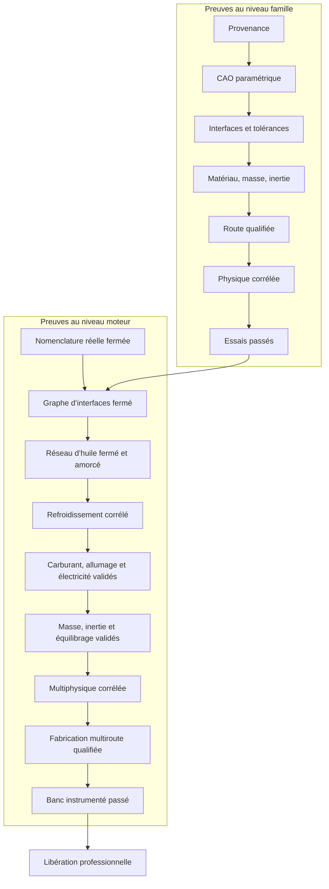
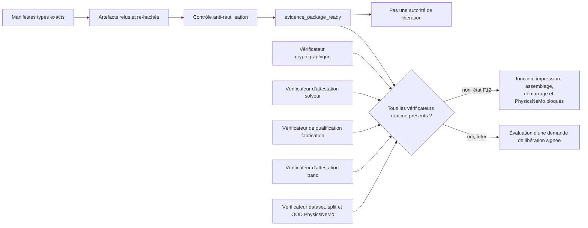

# Réingénierie F12 du moteur 917 complet

## But et limite actuelle

F12 transforme l’assemblage visuel F1 en registre d’écarts d’ingénierie. Il ne
transforme pas le scan en moteur fonctionnel. La source
`complete-engine-f1.json` contient 31 familles et additionne 271 occurrences
visuelles pour la variante atmosphérique, plus 4 occurrences spécifiques à la
variante biturbo. Ces nombres servent à détecter une régression du modèle
visuel; ils ne constituent pas une nomenclature de fabrication.

La nomenclature réelle reste inconnue. Le registre conserve donc un backlog
sans quantité ni cote pour la visserie, les joints, les circlips, les conduites,
les passages internes, les roulements et bagues non représentés, les capteurs,
les faisceaux, les petites pièces de distribution et les organes de commande.

## Boucle de preuve

```mermaid
flowchart LR
    A[Scan et proxies F1<br/>référence visuelle seulement] --> B[Provenance et métrologie<br/>identité, variante, échelle, incertitude]
    B --> C[CAO paramétrique<br/>masters éditables]
    C --> D[Interfaces et tolérances<br/>datums, jeux, états de surface]
    D --> E[Matériaux, masses et inerties<br/>état procédé mesuré]
    E --> F[Route de fabrication<br/>LPBF, usiné, forgé, acheté]
    F --> G[Solveurs de référence<br/>0D/1D, CFD, CHT, FEA, MBD, rotordynamique]
    G --> H[Essais physiques corrélés<br/>métrologie, débit, pression, thermique, fatigue]
    H --> I{Données convergées<br/>et corrélées ?}
    I -- non --> C
    I -- oui --> J[PhysicsNeMo optionnel<br/>surrogate + incertitude + OOD]
    J --> K[Prototype qualifié<br/>CT/NDT, usinage, équilibrage, étanchéité]
    K --> L[Banc instrumenté<br/>huile, rotation, allumage, charge, endurance]
    L --> M[Revue professionnelle signée]
```



PhysicsNeMo n’est pas le solveur de référence. Son entraînement reste bloqué
tant que les calculs classiques ne sont pas convergés, que les données ne sont
pas versionnées et que des essais physiques indépendants ne les ont pas
corrélés. Une scène USD, un rendu Omniverse ou un surrogate ne libère aucune
pièce.

## Workstreams par famille

Chaque famille du registre F12 possède sept workstreams fail-closed :

1. `provenance` : identité, variante, droits et preuve hachée ;
2. `parametric_geometry` : master éditable, datums mesurés et écart scan/CAO ;
3. `interfaces_tolerances` : assemblages, jeux, ajustements et chaîne de cotes ;
4. `material_mass` : nuance, état procédé, propriétés à chaud, masse et inertie ;
5. `manufacturing` : route sélectionnée, plan procédé et qualification ;
6. `physics` : modèle, conditions aux limites, convergence et corrélation ;
7. `verification_test` : plan approuvé, instrumentation étalonnée et résultat signé.

Chaque référence de preuve pointe vers un manifeste JSON typé. Le script relit
le manifeste et exige l’identité exacte de l’asset, de la famille, du
workstream, du type de preuve, du claim et des variantes. Il re-hache ensuite
chaque artefact déclaré. Un `evidence_id`, un manifeste ou un artefact ne peut
pas satisfaire deux claims incompatibles, que la réutilisation porte sur son
chemin ou sur son digest.

Même lorsque les sept workstreams sont prêts, le résultat s’appelle
`evidence_package_ready`, pas « pièce libérée ». Une famille n’est fonctionnelle
qu’après contrôle par des vérificateurs runtime indépendants et une autorité de
libération cryptographique. Elle n’est imprimable que si, en plus, sa route est
`lpbf` et que le vérificateur de qualification additive accepte son attestation.
Les composants `purchased` restent dans le jumeau numérique mais ne sont jamais
présentés comme des pièces imprimées.

Les routes F12 sont des dispositions candidates, jamais des sélections
validées. Le carter est classé `cast` conformément à la construction historique
documentée, mais sa nuance reste inconnue. Les primaires et collecteurs sont
`fabricated`. Les pistons, arbres à cames et arbre de sortie restent
`route_not_selected` faute de source suffisante. Seules les bielles conservent
la disposition `forged`, liée aux bielles titane documentées.

## Graphe d’intégration du moteur



La fermeture des 31 familles ne suffit donc pas : le moteur reste bloqué tant
que le backlog non dénombré n’a pas été remplacé par une vraie nomenclature et
que les réseaux transversaux ne sont pas fermés.

## Frontière entre preuves et libération



Les cinq vérificateurs runtime sont `not_implemented` dans F12. Cette limite est
codée dans l’auditeur et ne peut pas être modifiée par un booléen du contrat.
Même un registre rempli de manifestes conformes, tous les statuts à `true` et
tous les `whole_engine_gates` à `true` conserve donc les autorisations de
fonction, impression, assemblage, démarrage et entraînement PhysicsNeMo à
`false`.

## Exécuter le rapport d’écarts

Depuis la racine du dépôt :

```bash
python3 twins/reference-917-engine/source/build_whole_engine_readiness_f12.py \
  --project-root . \
  --output work/917-engine/f12/whole-engine-gap-report.json

python3 tests/test_917_whole_engine_f12.py -v
```

Le script retourne un code nul lorsque le contrat et le registre sont cohérents,
même si l’ingénierie est bloquée. Il retourne un code non nul si une famille a
disparu, si le snapshot F1 a changé, si une quantité du backlog a été inventée
si l’ancrage SHA-256 ne correspond plus ou si la configuration prétend activer
un vérificateur runtime absent. Les décisions de fonction,
d’impression, de démarrage et d’entraînement PhysicsNeMo se lisent dans les
champs `release` et `physicsnemo` du rapport, pas dans le code de sortie seul.

## Prochaine collecte minimale

Le prochain gain utile n’est pas d’ajouter des proxies. Il faut :

- identifier précisément la variante du scan et confirmer son échelle par au
  moins trois contrôles métrologiques indépendants ;
- créer une nomenclature réelle issue d’un moteur documenté ou démonté, sans
  compléter les absences par estimation ;
- reconstruire en priorité le carter, le vilebrequin, les cylindres, les
  culasses et leurs interfaces dans des masters CAO éditables ;
- fermer le circuit d’huile, le trajet de refroidissement et la distribution ;
- mesurer les matériaux, masses, inerties, jeux, précharges et états de surface ;
- produire des jeux de référence CFD/CHT/FEA/MBD convergés, puis les corréler à
  des essais avant toute utilisation de PhysicsNeMo.
